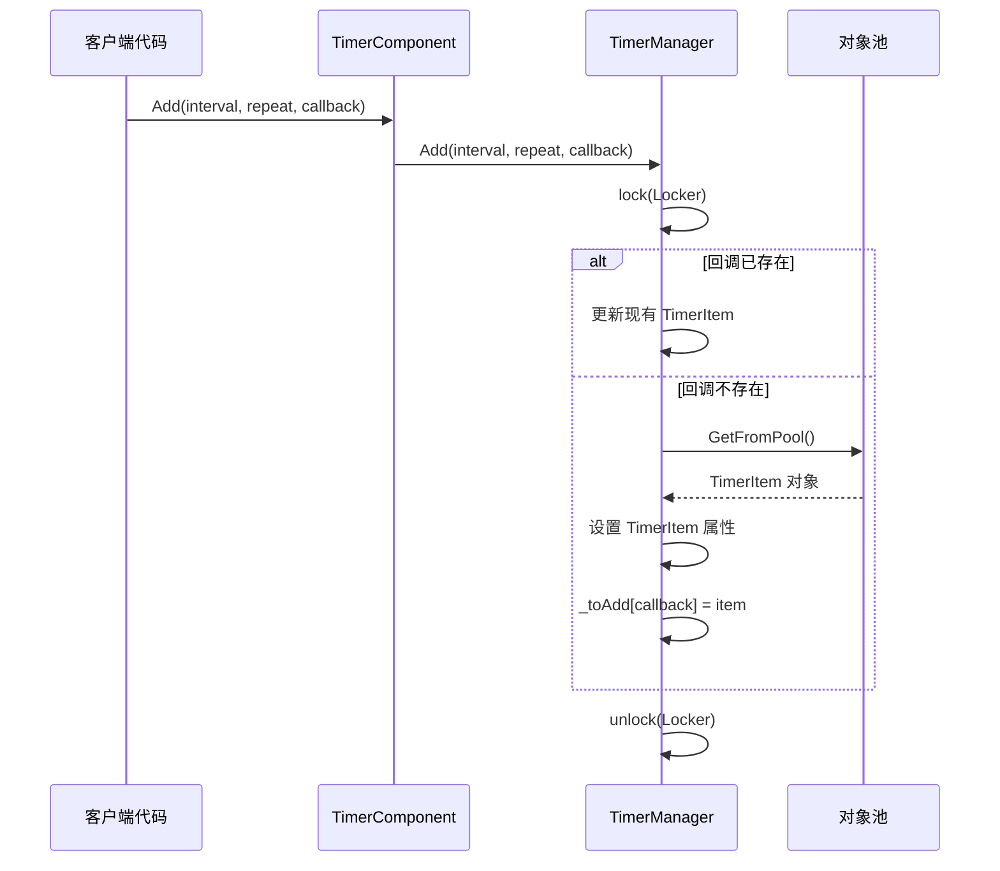
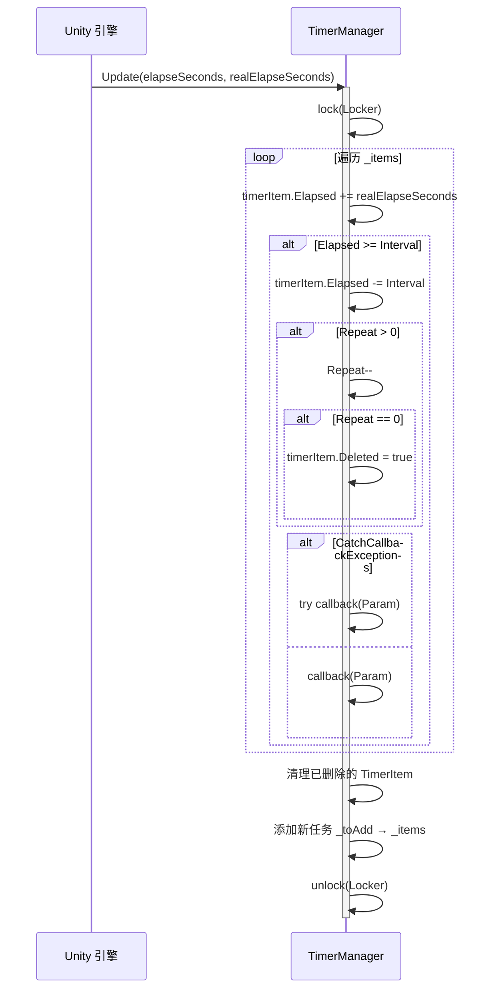

# Timer 组件介绍

Timer 组件是 GameFrameX 框架为 Unity 游戏开发提供的计时器管理模块。该组件提供了在游戏中添加、管理和执行定时任务的能力，支持单次执行、重复执行和帧更新等多种定时模式。

## 概述

Timer 组件是 GameFrameX 架构中专注于时间调度的基础组件。在游戏开发过程中，开发者经常需要处理各种与时间相关的逻辑，例如：

- 延迟执行某些操作
- 周期性触发游戏事件
- 倒计时功能
- 每帧执行特定逻辑

Timer 组件通过简洁的 API 设计，让开发者可以轻松实现这些需求，同时提供了线程安全的实现和性能优化。

## 组件架构

Timer 组件采用经典的三层架构设计，包括组件层、接口层和实现层：

```mermaid
flowchart TD
    subgraph Unity["Unity 组件层"]
        TC[TimerComponent]
    end

    subgraph Interface["接口层"]
        ITM[ITimerManager]
    end

    subgraph Implementation["实现层"]
        TM[TimerManager]
        Pool[对象池 _pool]
    end

    subgraph Data["数据层"]
        Items["_items 字典"]
        ToAdd["_toAdd 字典"]
        ToRemove["_toRemove 列表"]
    end

    TC -->|"调用方法"| ITM
    ITM <|..|"实现"| TM
    TM -->|"对象复用"| Pool
    TM -->|"管理"| Items
    TM -->|"管理"| ToAdd
    TM -->|"管理"| ToRemove
```

### 架构说明

| 层次 | 类名 | 职责 |
|------|------|------|
| 组件层 | TimerComponent | 作为 Unity 组件暴露给场景，提供面向用户的 API |
| 接口层 | ITimerManager | 定义计时器管理器的抽象接口 |
| 实现层 | TimerManager | 实现具体的计时器逻辑 |

## 核心设计

### 接口-实现模式

Timer 组件使用接口-实现分离的设计，便于单元测试和扩展：

```csharp
> Source: [ITimerManager.cs](https://github.com/GameFrameX/com.gameframex.unity.timer/blob/main/Runtime/Timer/ITimerManager.cs#L1-L54)

public interface ITimerManager
{
    void Add(float interval, int repeat, Action<object> callback, object callbackParam = null);
    void AddOnce(float interval, Action<object> callback, object callbackParam = null);
    void AddUpdate(Action<object> callback);
    void AddUpdate(Action<object> callback, object callbackParam);
    bool Exists(Action<object> callback);
    void Remove(Action<object> callback);
}
```

这种设计允许在不同的模块中通过接口引用计时器功能，而不依赖具体实现。

### 对象池模式

TimerManager 内部使用对象池来复用 TimerItem 对象，减少垃圾回收压力：

```csharp
> Source: [TimerManager.cs](https://github.com/GameFrameX/com.gameframex.unity.timer/blob/main/Runtime/Timer/TimerManager.cs#L266-L289)

private TimerItem GetFromPool()
{
    TimerItem t;
    int cnt = _pool.Count;
    if (cnt > 0)
    {
        t = _pool[cnt - 1];
        _pool.RemoveAt(cnt - 1);
        t.Deleted = false;
        t.Elapsed = 0;
    }
    else
    {
        t = new TimerItem();
    }
    return t;
}
```

### 线程安全设计

TimerManager 使用 `lock` 锁机制确保多线程环境下的数据安全：

```csharp
> Source: [TimerManager.cs](https://github.com/GameFrameX/com.gameframex.unity.timer/blob/main/Runtime/Timer/TimerManager.cs#L38-L38)

private static readonly object Locker = new object();
```

所有对 `_items`、`_toAdd`、`_toRemove` 等共享数据的操作都在锁的保护下进行。

### 异常处理策略

通过静态属性 `CatchCallbackExceptions` 可以控制是否捕获回调中的异常：

```csharp
> Source: [TimerManager.cs](https://github.com/GameFrameX/com.gameframex.unity.timer/blob/main/Runtime/Timer/TimerManager.cs#L40-L43)

/// <summary>
/// 是否触发回调异常
/// </summary>
public static bool CatchCallbackExceptions = false;
```

当设置为 `true` 时，回调中的异常会被捕获并记录警告日志，不会中断计时器的主循环。

## 核心流程

### 任务添加流程



### 任务执行流程



## 核心功能

Timer 组件提供以下核心功能：

| 方法 | 功能描述 |
|------|----------|
| Add | 添加定时重复执行的任务 |
| AddOnce | 添加只执行一次的任务 |
| AddUpdate | 添加每帧更新执行的任务 |
| Exists | 检查指定任务是否存在 |
| Remove | 移除指定的任务 |

### 添加定时任务 (Add)

添加一个定时重复执行的任务，支持指定间隔时间和重复次数：

```csharp
> Source: [README.md](https://github.com/GameFrameX/com.gameframex.unity.timer/blob/main/README.md#L30-L32)

Add(1000, 5, MyMethod);
```

参数说明：
- `interval`：间隔时间（单位为毫秒）
- `repeat`：重复次数，0 表示无限重复
- `callback`：回调函数
- `callbackParam`：回调参数（可选）

### 添加单次任务 (AddOnce)

添加一个延迟执行一次的任务：

```csharp
> Source: [README.md](https://github.com/GameFrameX/com.gameframex.unity.timer/blob/main/README.md#L46-L48)

AddOnce(5000, MyMethod);
```

### 添加帧更新任务 (AddUpdate)

添加每帧执行的任务，适用于需要持续监测或更新的场景：

```csharp
> Source: [README.md](https://github.com/GameFrameX/com.gameframex.unity.timer/blob/main/README.md#L60-L63)

AddUpdate(MyMethod);
```

### 检查和移除任务

检查任务是否存在并根据需要移除：

```csharp
> Source: [README.md](https://github.com/GameFrameX/com.gameframex.unity.timer/blob/main/README.md#L78-L95)

bool exists = GetComponent<TimerComponent>().Exists(MyMethod);
GetComponent<TimerComponent>().Remove(MyMethod);
```

## 使用示例

以下是一个完整的使用示例：

```csharp
// 假设这是您要触发的方法
void MyMethod(object param)
{
    Debug.Log("方法被触发");
}

// 创建定时任务，每隔1秒执行MyMethod方法，共执行5次
GetComponent<TimerComponent>().Add(1000, 5, MyMethod);

// 创建定时任务，5秒后执行一次MyMethod方法
GetComponent<TimerComponent>().AddOnce(5000, MyMethod);

// 检查是否存在某个任务
bool exists = GetComponent<TimerComponent>().Exists(MyMethod);

// 移除特定的任务
GetComponent<TimerComponent>().Remove(MyMethod);
```

> Source: [README.md](https://github.com/GameFrameX/com.gameframex.unity.timer/blob/main/README.md#L101-L119)

## 配置选项

Timer 组件提供以下可配置项：

| 选项 | 类型 | 默认值 | 描述 |
|------|------|--------|------|
| CatchCallbackExceptions | static bool | false | 是否捕获回调中的异常，防止计时器主循环被中断 |

### 配置示例

```csharp
// 开启异常捕获，防止回调异常中断计时器
TimerManager.CatchCallbackExceptions = true;
```

## 注意事项

1. **初始化要求**：在使用计时器前，请确保 `TimerManager` 已正确初始化并已注册到 `GameFrameworkEntry` 模块中。

2. **性能考虑**：尽量避免使用过小的间隔时间（例如小于帧时间），这可能会导致性能问题。建议最小间隔不低于 100 毫秒。

3. **回调签名**：所有回调函数必须符合 `Action<object>` 签名，即接受一个 object 参数并返回 void。

4. **线程安全**：虽然 TimerManager 内部实现了线程安全机制，但在多线程环境下仍需注意回调函数的线程安全性。

## 相关链接

- [功能特性](./1-overview.features) - 了解更多 Timer 组件的功能细节
- [安装指南](./2-installation) - 如何安装和配置 Timer 组件
- [快速开始](./3-getting-started) - 快速上手 Timer 组件
- [添加定时任务](./4-core-functions.add-timer) - 定时任务详细用法
- [添加单次任务](./4-core-functions.add-once) - 单次任务详细用法
- [添加帧更新任务](./4-core-functions.add-update) - 帧更新任务详细用法
- [检查和移除任务](./4-core-functions.exists-remove) - 任务管理详细用法
- [API 参考](./5-api-reference.timer-component) - TimerComponent 完整 API
