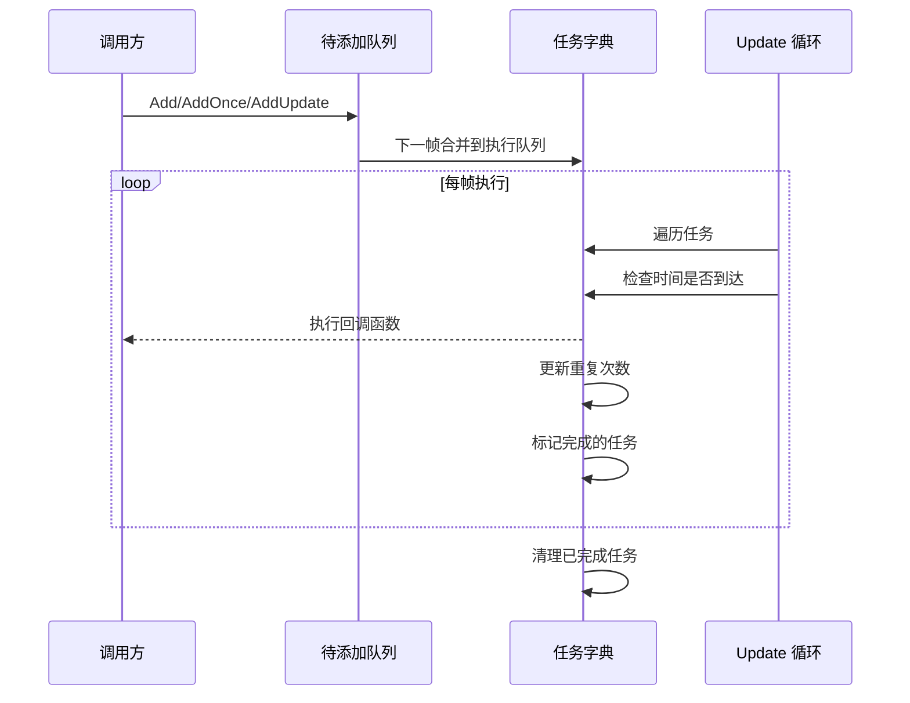

# 功能特性

Timer 组件是 GameFrameX 框架中的计时器模块，提供了一套完整的时间调度解决方案，支持定时重复任务、单次延迟任务和帧更新任务的管理。

## 概述

Timer 组件专为 Unity 游戏开发设计，提供高精度、可控的定时任务调度能力。该组件采用分层架构设计，上层通过 TimerComponent 组件供 Unity 场景使用，下层通过 TimerManager 实现核心逻辑，ITimerManager 接口定义标准化的定时器服务。

## 核心功能

### 1. 定时重复任务

定时重复任务（Add 方法）允许开发者设置一个间隔时间和重复次数，任务将按指定间隔重复执行。

**功能特点：**
- 支持指定重复次数（0 表示无限重复）
- 精确的时间间隔控制（以秒为单位）
- 任务执行时传递自定义参数

**典型应用场景：**
- 周期性血量恢复
- 定时刷新游戏道具
- 周期性保存游戏数据

### 2. 单次延迟任务

单次任务（AddOnce 方法）在指定延迟时间后执行一次，适合需要延迟执行的场景。

**功能特点：**
- 延迟时间精确可控
- 执行完成后自动移除，无需手动管理
- 与 Add(interval, 1, callback) 等效

**典型应用场景：**
- 延迟几秒后显示对话框
- 倒计时结束后结束游戏
- 技能冷却完成提示

### 3. 帧更新任务

帧更新任务（AddUpdate 方法）每帧都会执行，适合需要高频更新的场景。

**功能特点：**
- 最小间隔约为 0.001 秒（1 毫秒）
- 无限重复执行
- 常用于实时监控或持续性检查

**典型应用场景：**
- 实时进度条更新
- 动画状态机更新
- 持续检测条件是否满足

### 4. 任务存在性检查

Exists 方法用于检查指定的回调函数是否已经存在于任务队列中。

**功能特点：**
- 同时检查待添加队列和执行队列
- 返回布尔值表示是否存在

**典型应用场景：**
- 防止重复添加相同任务
- 在添加前验证任务状态

### 5. 任务移除

Remove 方法用于移除指定的任务，停止其执行。

**功能特点：**
- 支持移除正在等待的任务
- 支持移除正在执行的任务（标记为删除）
- 自动回收资源到对象池

**典型应用场景：**
- 玩家死亡时停止所有战斗相关的定时任务
- 关闭界面时清理相关的定时刷新
- 取消倒计时

## 架构设计

```mermaid
graph TD
    subgraph Unity 层
        TC[TimerComponent<br/>Unity 组件]
    end

    subgraph 接口层
        ITM[ITimerManager<br/>定时器接口]
    end

    subgraph 实现层
        TM[TimerManager<br/>定时器管理器]
        GFM[GameFrameworkModule<br/>框架模块基类]
    end

    subgraph 内部实现
        Pool[对象池]
        Dict[任务字典]
    end

    TC --> ITM
    ITM <|.. TM
    TM --> GFM
    TM --> Pool
    TM --> Dict
```

**组件说明：**

| 组件 | 职责 | 层级 |
|------|------|------|
| TimerComponent | Unity 组件封装，提供场景中的定时器功能 | Unity 层 |
| ITimerManager | 定义定时器的标准接口，包含所有核心方法 | 接口层 |
| TimerManager | 实现定时器核心逻辑，包括任务调度和执行 | 实现层 |
| 对象池 | 复用 TimerItem 对象，减少内存分配 | 内部实现 |

## 任务执行流程



## 技术特性

### 线程安全

TimerManager 内部使用 `lock` 关键字保护所有操作，确保在多线程环境下安全运行。

### 性能优化

- **对象池模式**：使用 `_pool` 列表复用 TimerItem 对象，避免频繁 GC
- **延迟添加**：新任务添加到 `_toAdd` 队列，在下一帧 Update 时合并到主队列
- **增量时间处理**：处理时间漂移，任务完成后重置计时器

### 异常处理

通过 `TimerManager.CatchCallbackExceptions` 静态属性控制是否捕获回调中的异常：
- `false`（默认）：异常直接抛出，可能中断游戏循环
- `true`：捕获异常并输出警告日志，任务标记为删除

## 使用方式

### 通过组件使用

在 Unity 场景中，将 TimerComponent 添加到游戏对象上即可使用：

```csharp
// 添加定时任务，每隔1秒执行一次，共执行10次
GetComponent<TimerComponent>().Add(1f, 10, OnTimerTick);

// 添加单次任务，5秒后执行
GetComponent<TimerComponent>().AddOnce(5f, OnDelayedExecute);

// 添加帧更新任务
GetComponent<TimerComponent>().AddUpdate(OnFrameUpdate);

// 检查任务是否存在
bool exists = GetComponent<TimerComponent>().Exists(OnTimerTick);

// 移除任务
GetComponent<TimerComponent>().Remove(OnTimerTick);
```

> Source: [TimerComponent.cs](https://github.com/GameFrameX/com.gameframex.unity.timer/blob/main/Runtime/Timer/TimerComponent.cs#L30-L89)

### 通过模块使用

在框架内部，可以通过 GameFrameworkEntry 获取 ITimerManager 模块：

```csharp
var timerManager = GameFrameworkEntry.GetModule<ITimerManager>();
timerManager.Add(1f, 5, OnTick);
```

> Source: [TimerManager.cs](https://github.com/GameFrameX/com.gameframex.unity.timer/blob/main/Runtime/Timer/TimerManager.cs#L156-L188)

## 回调函数定义

所有定时任务使用统一的回调函数签名：

```csharp
void CallbackName(object param)
{
    // param 是传入的参数，可以是任意对象
    // 如果不需要参数，可以传入 null
}
```

> Source: [ITimerManager.cs](https://github.com/GameFrameX/com.gameframex.unity.timer/blob/main/Runtime/Timer/ITimerManager.cs#L18)

## 参数说明

| 方法 | 参数 | 类型 | 说明 |
|------|------|------|------|
| Add | interval | float | 间隔时间（秒） |
| Add | repeat | int | 重复次数（0=无限） |
| Add | callback | Action\<object\> | 回调函数 |
| Add | callbackParam | object | 回调参数 |
| AddOnce | interval | float | 延迟时间（秒） |
| AddOnce | callback | Action\<object\> | 回调函数 |
| AddOnce | callbackParam | object | 回调参数 |
| AddUpdate | callback | Action\<object\> | 回调函数 |
| AddUpdate | callbackParam | object | 回调参数 |
| Exists | callback | Action\<object\> | 要检查的回调 |
| Remove | callback | Action\<object\> | 要移除的回调 |

## 相关链接

- [Timer 组件介绍](./1-overview.introduction)
- [安装指南](./2-installation)
- [快速开始](./3-getting-started)
- [核心功能 - 添加定时任务](./4-core-functions.add-timer)
- [核心功能 - 添加单次任务](./4-core-functions.add-once)
- [核心功能 - 添加帧更新任务](./4-core-functions.add-update)
- [核心功能 - 检查和移除任务](./4-core-functions.exists-remove)
- [API 参考 - TimerComponent](./5-api-reference.timer-component)
- [API 参考 - ITimerManager](./5-api-reference.itimer-manager)
- [API 参考 - TimerManager](./5-api-reference.timer-manager)
