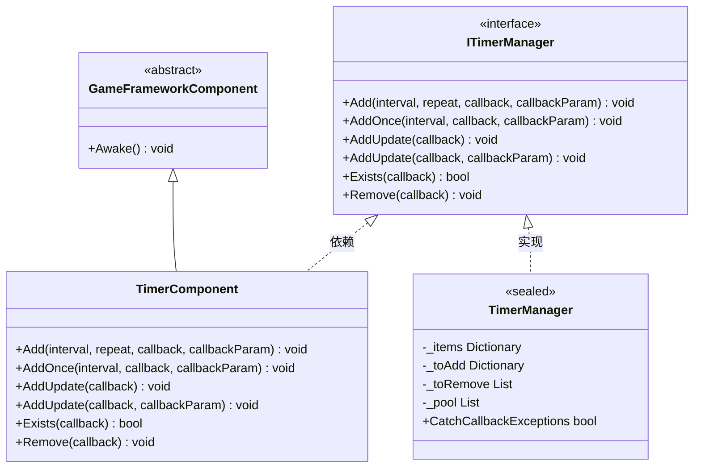
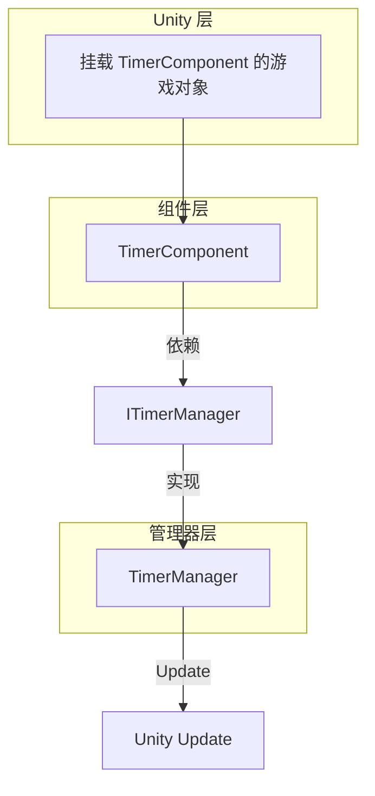
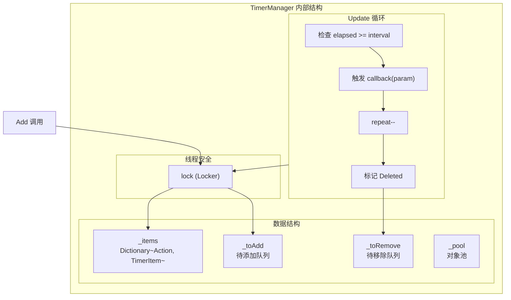

# TimerComponent

TimerComponent 是 Timer 模块的 Unity 组件封装，提供定时任务管理功能。作为 GameFrameX 框架的核心组件之一，它允许开发者添加各种定时执行的任务，包括重复执行、单次执行和每帧更新执行的任务。

## 概述

TimerComponent 继承自 GameFrameworkComponent，是一个 Unity 组件（[DisallowMultipleComponent]），需要挂载到 Unity 游戏对象上使用。该组件内部委托 ITimerManager（TimerManager 实现）来处理实际的定时任务逻辑，自身仅提供简洁的 Unity API 接口。

**继承层次：**



## 架构说明

TimerComponent 在架构中位于 **API 层**，为 Unity 开发者提供便捷的调用接口：



**工作流程：**
1. 开发者在 Unity 编辑器中将 TimerComponent 挂载到游戏对象
2. 调用 TimerComponent 的公开方法添加定时任务
3. TimerComponent 将请求转发给 TimerManager
4. TimerManager 在 Update 循环中检测并触发定时任务回调

## API 参考

### `Add(interval, repeat, callback, callbackParam)`

添加一个定时重复执行的任务。

```csharp
public void Add(float interval, int repeat, Action<object> callback, object callbackParam = null)
```
> Source: [TimerComponent.cs](https://github.com/GameFrameX/com.gameframex.unity.timer/blob/main/Runtime/Timer/TimerComponent.cs#L37-L40)

**参数：**
| 参数名 | 类型 | 必填 | 描述 |
|--------|------|------|------|
| interval | float | 是 | 间隔时间（以秒为单位） |
| repeat | int | 是 | 重复次数，0 表示无限重复 |
| callback | Action\<object\> | 是 | 定时触发时执行的回调函数 |
| callbackParam | object | 否 | 传递给回调函数的参数 |

**返回值：** 无

**使用示例：**

```csharp
// 每隔1秒执行一次，共执行10次
timerComponent.Add(1f, 10, OnTimerTick, "tick data");

// 无限重复执行（每秒一次）
timerComponent.Add(1f, 0, OnTimerTick);
```

---

### `AddOnce(interval, callback, callbackParam)`

添加一个只执行一次的定时任务。

```csharp
public void AddOnce(float interval, Action<object> callback, object callbackParam = null)
```
> Source: [TimerComponent.cs](https://github.com/GameFrameX/com.gameframex.unity.timer/blob/main/Runtime/Timer/TimerComponent.cs#L48-L51)

**参数：**
| 参数名 | 类型 | 必填 | 描述 |
|--------|------|------|------|
| interval | float | 是 | 延迟时间（以秒为单位），延迟后执行一次 |
| callback | Action\<object\> | 是 | 延迟到达时执行的回调函数 |
| callbackParam | object | 否 | 传递给回调函数的参数 |

**返回值：** 无

**使用示例：**

```csharp
// 5秒后执行一次
timerComponent.AddOnce(5f, OnDelayedAction, "delayed");

// 1秒后执行一次
timerComponent.AddOnce(1f, OnGameStart);
```

---

### `AddUpdate(callback)`

添加一个每帧更新执行的任务（无参数版本）。

```csharp
public void AddUpdate(Action<object> callback)
```
> Source: [TimerComponent.cs](https://github.com/GameFrameX/com.gameframex.unity.timer/blob/main/Runtime/Timer/TimerComponent.cs#L57-L60)

**参数：**
| 参数名 | 类型 | 必填 | 描述 |
|--------|------|------|------|
| callback | Action\<object\> | 是 | 每帧执行的回调函数 |

**返回值：** 无

**备注：** 内部实现为间隔 0.001 秒的无限重复任务，实际执行频率受 Unity Update 帧率影响。

**使用示例：**

```csharp
// 每帧执行
timerComponent.AddUpdate(OnFrameUpdate);
```

---

### `AddUpdate(callback, callbackParam)`

添加一个每帧更新执行的任务（带参数版本）。

```csharp
public void AddUpdate(Action<object> callback, object callbackParam)
```
> Source: [TimerComponent.cs](https://github.com/GameFrameX/com.gameframex.unity.timer/blob/main/Runtime/Timer/TimerComponent.cs#L67-L70)

**参数：**
| 参数名 | 类型 | 必填 | 描述 |
|--------|------|------|------|
| callback | Action\<object\> | 是 | 每帧执行的回调函数 |
| callbackParam | object | 是 | 传递给回调函数的参数 |

**返回值：** 无

**使用示例：**

```csharp
// 每帧执行并传递参数
timerComponent.AddUpdate(OnFrameUpdate, frameCounter);
```

---

### `Exists(callback)`

检查指定的任务是否存在。

```csharp
public bool Exists(Action<object> callback)
```
> Source: [TimerComponent.cs](https://github.com/GameFrameX/com.gameframex.unity.timer/blob/main/Runtime/Timer/TimerComponent.cs#L77-L80)

**参数：**
| 参数名 | 类型 | 必填 | 描述 |
|--------|------|------|------|
| callback | Action\<object\> | 是 | 要检查的回调函数 |

**返回值：** bool - 任务存在返回 true，不存在返回 false

**使用示例：**

```csharp
if (timerComponent.Exists(OnTimerTick))
{
    Debug.Log("任务正在运行");
}
```

---

### `Remove(callback)`

移除指定的定时任务。

```csharp
public void Remove(Action<object> callback)
```
> Source: [TimerComponent.cs](https://github.com/GameFrameX/com.gameframex.unity.timer/blob/main/Runtime/Timer/TimerComponent.cs#L86-L89)

**参数：**
| 参数名 | 类型 | 必填 | 描述 |
|--------|------|------|------|
| callback | Action\<object\> | 是 | 要移除的回调函数 |

**返回值：** 无

**使用示例：**

```csharp
// 移除指定任务
timerComponent.Remove(OnTimerTick);

// 移除所有帧更新任务
timerComponent.Remove(OnFrameUpdate);
```

---

## 内部实现机制

### TimerManager 核心逻辑

TimerComponent 背后的实际处理由 TimerManager 完成。TimerManager 使用以下机制确保高效和线程安全：



### 关键设计特点

1. **延迟添加/移除队列**：使用 `_toAdd` 和 `_toRemove` 队列避免在 Update 遍历过程中修改集合导致的问题
2. **对象池模式**：`_pool` 列表复用 TimerItem 对象，减少 GC 开销
3. **线程安全**：所有操作都通过 `lock (Locker)` 保护
4. **异常处理选项**：通过 `TimerManager.CatchCallbackExceptions` 静态属性控制是否捕获回调异常

## 常见使用模式

### 基础模式

```csharp
// 获取组件引用
var timer = GetComponent<TimerComponent>();

// 添加重复任务
timer.Add(1f, 5, OnTick, "data");

// 定义回调
void OnTick(object param)
{
    Debug.Log($"Timer tick: {param}");
}
```

### 游戏开发常见场景

```csharp
// 延迟执行（单次）
timerComponent.AddOnce(3f, OnLevelStart);

// 持续效果（如中毒扣血）
timerComponent.Add(1f, 0, OnPoisonDamage, 10);

// 每帧检测
timerComponent.AddUpdate(OnCheckInput);

// 条件移除
if (timerComponent.Exists(myCallback))
{
    timerComponent.Remove(myCallback);
}
```

## 相关链接

- [ITimerManager 接口参考](./5-api-reference.itimer-manager)
- [TimerManager 实现参考](./5-api-reference.timer-manager)
- [核心功能 - 添加定时任务](./4-core-functions.add-timer)
- [核心功能 - 添加单次任务](./4-core-functions.add-once)
- [核心功能 - 添加帧更新任务](./4-core-functions.add-update)
- [核心功能 - 检查和移除任务](./4-core-functions.exists-remove)
- [快速开始](./3-getting-started)
