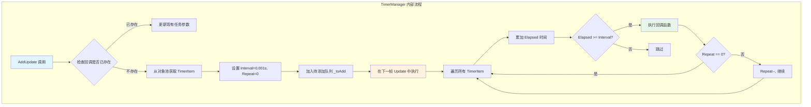
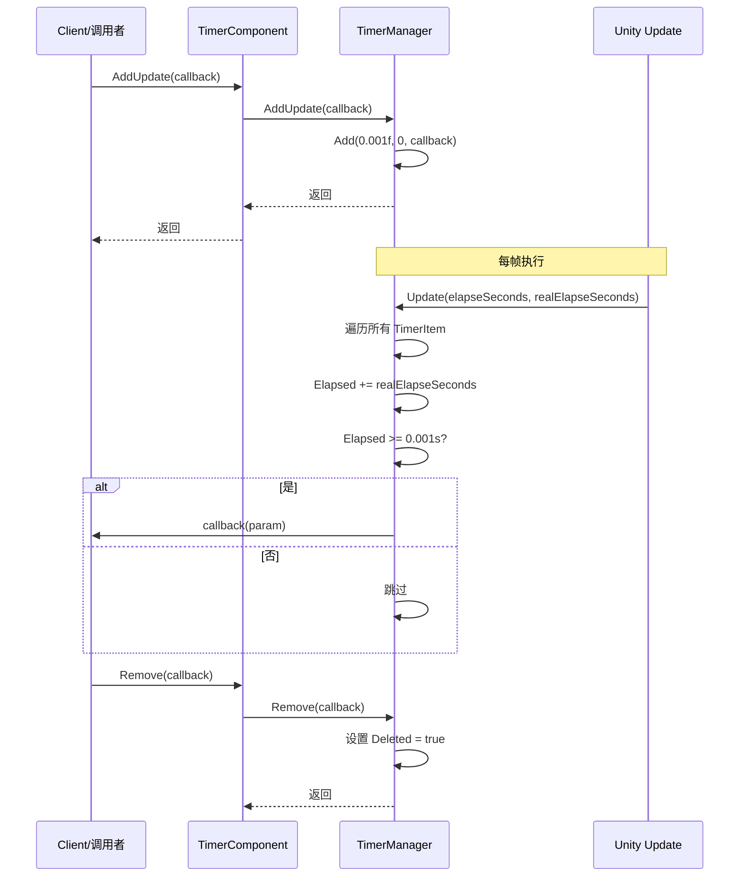

# 添加帧更新任务

添加帧更新任务是 Timer 组件的核心功能之一，用于注册一个在每一帧都会执行的回调函数。与定时任务和单次任务不同，帧更新任务适合需要持续高频执行的操作，例如游戏中的输入检测、动画更新、或需要每帧都执行的逻辑。

## 概述

帧更新任务（AddUpdate）是一种特殊的定时任务，其内部实现是将间隔时间设置为极小值（0.001秒），重复次数设置为无限（0表示无限重复）。这意味着注册的回调函数将在 Unity 的每一帧更新中被调用。



### 核心特性

- **无限执行**：repeat 参数为 0，表示任务会持续执行直到手动移除
- **高频调用**：每帧执行（约每 16ms 一次，取决于帧率）
- **参数支持**：支持传递自定义参数到回调函数
- **重复注册检测**：如果相同的回调已存在，会自动更新参数而不是创建新任务

## 工作原理

### 内部实现

帧更新任务本质上是一个特殊的定时任务，通过以下方式实现每帧执行：

> Source: [TimerManager.cs#L206-L219](https://github.com/GameFrameX/com.gameframex.unity.timer/blob/main/Runtime/Timer/TimerManager.cs#L206-L219)

```csharp
/// <summary>
/// 添加一个每帧更新执行的任务
/// </summary>
/// <param name="callback">要执行的回调函数</param>
public void AddUpdate(Action<object> callback)
{
    Add(0.001f, 0, callback);
}

/// <summary>
/// 添加一个每帧更新执行的任务
/// </summary>
/// <param name="callback">要执行的回调函数</param>
/// <param name="callbackParam">回调函数的参数</param>
public void AddUpdate(Action<object> callback, object callbackParam)
{
    Add(0.001f, 0, callback, callbackParam);
}
```

核心逻辑解析：
1. **Interval = 0.001f**：设置极短的间隔时间（约1毫秒），确保每帧都能触发
2. **Repeat = 0**：设置为0表示无限重复，任务不会自动移除
3. **Add 方法**：复用现有的定时任务添加逻辑，统一管理

### 执行流程



## 使用示例

### 基本用法

以下示例展示如何在游戏循环中每帧执行一个方法：

```csharp
using GameFrameX.Timer.Runtime;
using UnityEngine;

public class PlayerController : MonoBehaviour
{
    private TimerComponent _timerComponent;
    
    private void Start()
    {
        // 获取 TimerComponent 组件
        _timerComponent = GetComponent<TimerComponent>();
        
        // 注册每帧执行的任务
        _timerComponent.AddUpdate(OnEveryFrame);
    }
    
    private void OnEveryFrame(object param)
    {
        // 每帧执行的逻辑
        // 例如：处理输入、更新动画状态等
        Debug.Log("每帧执行");
    }
    
    private void OnDestroy()
    {
        // 移除帧更新任务，避免内存泄漏
        if (_timerComponent != null)
        {
            _timerComponent.Remove(OnEveryFrame);
        }
    }
}
```

### 传递参数的用法

如果需要在回调中传递自定义参数，可以使用带参数的重载：

```csharp
public class GameManager : MonoBehaviour
{
    private TimerComponent _timerComponent;
    private int _frameCount = 0;
    
    private void Start()
    {
        _timerComponent = GetComponent<TimerComponent>();
        
        // 传递当前对象作为参数
        _timerComponent.AddUpdate(OnUpdateWithParam, this);
    }
    
    private void OnUpdateWithParam(object param)
    {
        // 将参数转换回原始类型
        var gameManager = param as GameManager;
        if (gameManager != null)
        {
            gameManager._frameCount++;
            if (gameManager._frameCount % 60 == 0)
            {
                Debug.Log($"已运行 {gameManager._frameCount} 帧");
            }
        }
    }
}
```

### 使用 Lambda 表达式

对于简单的逻辑，可以使用 Lambda 表达式简化代码：

```csharp
private TimerComponent _timerComponent;

private void Start()
{
    _timerComponent = GetComponent<TimerComponent>();
    
    // 使用 Lambda 表达式
    _timerComponent.AddUpdate(param => 
    {
        var deltaTime = (float)param;
        // 执行基于帧的逻辑
    }, Time.deltaTime);
}
```

### 检查任务是否存在

在添加帧更新任务前，可以先检查是否已存在相同的回调：

```csharp
private void Start()
{
    _timerComponent = GetComponent<TimerComponent>();
    
    // 检查任务是否存在
    if (!_timerComponent.Exists(OnEveryFrame))
    {
        _timerComponent.AddUpdate(OnEveryFrame);
    }
}

private void OnEveryFrame(object param)
{
    // 业务逻辑
}
```

## API 参考

### `TimerComponent.AddUpdate`

> See [TimerComponent API Reference](./5-api-reference.timer-component) for full details

### `ITimerManager.AddUpdate`

> See [ITimerManager API Reference](./5-api-reference.itimer-manager) for full details

### `TimerManager.AddUpdate`

> See [TimerManager API Reference](./5-api-reference.timer-manager) for full details

## 注意事项

1. **性能考虑**：每帧执行的回调应当保持简洁，避免执行耗时操作
2. **及时移除**：当不再需要帧更新任务时，必须调用 `Remove()` 方法手动移除，否则会导致内存泄漏和持续的性能消耗
3. **重复注册**：系统会自动处理重复注册（更新现有任务参数），但建议在添加前使用 `Exists()` 检查
4. **帧率依赖**：任务的执行频率依赖于游戏的帧率，在低帧率情况下执行频率会降低

## 最佳实践

| 场景 | 推荐做法 |
|------|----------|
| 输入检测 | 使用 AddUpdate，每帧检查输入状态 |
| 动画状态机 | 使用 AddUpdate，更新动画参数 |
| 长时间运行的任务 | 定期检查并适时调用 Remove() |
| 条件触发 | 结合 Exists() 方法管理任务生命周期 |

## 相关链接

- [添加定时任务](./4-core-functions.add-timer)
- [添加单次任务](./4-core-functions.add-once)
- [检查和移除任务](./4-core-functions.exists-remove)
- [TimerComponent API 参考](./5-api-reference.timer-component)
- [ITimerManager API 参考](./5-api-reference.itimer-manager)
- [TimerManager API 参考](./5-api-reference.timer-manager)
