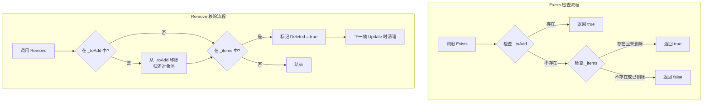

# 检查和移除任务

在 Timer 计时器组件中，除了添加定时任务外，还提供了检查任务是否存在以及移除任务的功能。这些功能对于动态管理定时任务、避免重复添加或在特定条件下取消任务非常有用。

## 概述

TimerComponent 提供了两个核心方法用于检查和移除任务：

- **Exists** - 检查指定回调函数对应的任务是否存在
- **Remove** - 移除（取消）指定回调函数对应的任务

这两个方法都通过回调函数的引用（`Action<object>`）来标识和操作任务，因此需要确保传入的是同一个委托实例。

## 核心功能

### 检查任务是否存在

`Exists` 方法用于检查指定的回调函数是否对应一个有效的定时任务。

```csharp
public bool Exists(Action<object> callback)
```

**实现原理：**

> Source: [TimerManager.cs](https://github.com/GameFrameX/com.gameframex.unity.timer/blob/main/Runtime/Timer/TimerManager.cs#L226-L243)

```csharp
public bool Exists(Action<object> callback)
{
    lock (Locker)
    {
        // 第一步：检查待添加列表
        if (_toAdd.ContainsKey(callback))
        {
            return true;
        }

        // 第二步：检查活跃任务列表
        if (_items.TryGetValue(callback, out var at))
        {
            // 只有未被标记为删除的任务才视为存在
            return !at.Deleted;
        }

        return false;
    }
}
```

**检查逻辑说明：**

1. **待添加列表（`_toAdd`）**：检查任务是否在等待添加队列中刚创建但尚未生效
2. **活跃任务列表（`_items`）**：检查任务是否在当前活跃的任务列表中
3. **删除标记（`Deleted`）**：只有未被标记为删除的任务才返回 true

### 移除指定任务

`Remove` 方法用于移除（取消）指定的定时任务。该方法采用延迟删除机制，不会立即从字典中移除，而是在下一帧 Update 时清理。

```csharp
public void Remove(Action<object> callback)
```

**实现原理：**

> Source: [TimerManager.cs](https://github.com/GameFrameX/com.gameframex.unity.timer/blob/main/Runtime/Timer/TimerManager.cs#L249-L264)

```csharp
public void Remove(Action<object> callback)
{
    lock (Locker)
    {
        // 如果任务还在待添加队列中，直接取消并归还到对象池
        if (_toAdd.TryGetValue(callback, out var t))
        {
            _toAdd.Remove(callback);
            ReturnToPool(t);
        }

        // 如果任务已在活跃列表中，标记为删除
        if (_items.TryGetValue(callback, out t))
        {
            t.Deleted = true;
        }
    }
}
```

**移除逻辑说明：**

1. **待添加队列**：如果任务尚未开始执行（还在 `_toAdd` 中），直接从队列中移除并归还对象池
2. **活跃列表**：如果任务正在活跃列表中执行，将其标记为 `Deleted = true`
3. **延迟清理**：在下一帧 `Update()` 循环中，会自动清理所有被标记为 Deleted 的任务

## 工作流程图



## 使用示例

### 基本用法

```csharp
using GameFrameX.Timer.Runtime;
using UnityEngine;

public class TimerExample : MonoBehaviour
{
    private TimerComponent _timer;

    private void Start()
    {
        _timer = GetComponent<TimerComponent>();

        // 定义一个回调方法
        void OnTick(object param)
        {
            Debug.Log($"Tick at {Time.time}");
        }

        // 添加一个定时任务，每秒执行一次
        _timer.Add(1.0f, 0, OnTick);

        // 检查任务是否存在
        bool exists = _timer.Exists(OnTick);
        Debug.Log($"任务是否存在: {exists}"); // 输出: True

        // 移除任务
        _timer.Remove(OnTick);

        // 再次检查
        exists = _timer.Exists(OnTick);
        Debug.Log($"任务是否存在: {exists}"); // 输出: False
    }
}
```

> Source: [TimerComponent.cs](https://github.com/GameFrameX/com.gameframex.unity.timer/blob/main/Runtime/Timer/TimerComponent.cs#L72-L89)

### 动态管理任务

在实际应用中，可能需要根据游戏状态动态添加和移除任务：

```csharp
public class GameTimerManager : MonoBehaviour
{
    private TimerComponent _timer;
    private Action<object> _gameLoopTask;

    private void Start()
    {
        _timer = GetComponent<TimerComponent>();
        _gameLoopTask = OnGameLoop;
    }

    // 暂停游戏时停止循环任务
    public void PauseGame()
    {
        if (_timer.Exists(_gameLoopTask))
        {
            _timer.Remove(_gameLoopTask);
            Debug.Log("游戏循环任务已暂停");
        }
    }

    // 恢复游戏时重新开始循环任务
    public void ResumeGame()
    {
        if (!_timer.Exists(_gameLoopTask))
        {
            _timer.AddUpdate(_gameLoopTask);
            Debug.Log("游戏循环任务已恢复");
        }
    }

    private void OnGameLoop(object param)
    {
        // 游戏循环逻辑
    }
}
```

### Lambda 表达式的注意事项

使用 Lambda 表达式时需要特别注意，每次 Lambda 表达式都会创建新的委托实例，导致无法正确匹配和移除任务：

```csharp
// ❌ 错误示例：Lambda 表达式每次创建新实例
_timer.Add(1.0f, 5, (param) => Debug.Log("Tick"));
_timer.Exists((param) => Debug.Log("Tick")); // 返回 False，因为是不同的委托实例
_timer.Remove((param) => Debug.Log("Tick"));  // 无法移除，因为是不同的委托实例

// ✅ 正确示例：使用具名方法或保存委托引用
Action<object> myTick = (param) => Debug.Log("Tick");
_timer.Add(1.0f, 5, myTick);
_timer.Exists(myTick);  // 返回 True
_timer.Remove(myTick);   // 正确移除
```

## 线程安全性

`Exists` 和 `Remove` 方法都使用 `lock (Locker)` 来保证线程安全。由于 TimerManager 的 Update 方法也在锁内执行操作，这些方法可以安全地在任何线程上调用。

> Source: [TimerManager.cs](https://github.com/GameFrameX/com.gameframex.unity.timer/blob/main/Runtime/Timer/TimerManager.cs#L38)

```csharp
private static readonly object Locker = new object();
```

## API 参考

### TimerComponent

#### `Exists(callback: Action<object>): bool`

检查指定的任务是否存在。

**参数：**
- `callback` (`Action<object>`): 要检查的回调函数

**返回：** 
- `bool`: 任务存在且未标记为删除时返回 true，否则返回 false

#### `Remove(callback: Action<object>): void`

移除指定的任务。

**参数：**
- `callback` (`Action<object>`): 要移除的回调函数

**说明：**
- 如果任务在待添加队列中，会被立即移除
- 如果任务在活跃列表中，会被标记为删除，在下一帧清理

### ITimerManager

> Source: [ITimerManager.cs](https://github.com/GameFrameX/com.gameframex.unity.timer/blob/main/Runtime/Timer/ITimerManager.cs#L41-L52)

接口定义完全相同：

```csharp
bool Exists(Action<object> callback);
void Remove(Action<object> callback);
```

## 常见问题

### 为什么 Remove 后 Exists 仍返回 true？

如果在 Remove 调用后立即调用 Exists，可能仍返回 true，因为：
1. 任务被标记为 Deleted，但尚未在下一帧 Update 中清理
2. 解决方案：在 Remove 后等待一帧，或使用其他机制确认

### Lambda 表达式无法匹配任务怎么办？

如前所述，每次 Lambda 表达式会创建新的委托实例。解决方案是：
1. 使用具名方法代替 Lambda
2. 保存委托引用并复用

### 多次调用 Remove 会出问题吗？

不会。Remove 方法设计为幂等操作，多次调用不会产生错误。如果任务不存在，方法会静默返回。

## 相关链接

- [Timer 组件介绍](../1-overview.introduction)
- [功能特性](../1-overview.features)
- [添加定时任务](./4-core-functions.add-timer)
- [添加单次任务](./4-core-functions.add-once)
- [添加帧更新任务](./4-core-functions.add-update)
- [API 参考 - TimerComponent](./5-api-reference.timer-component)
- [API 参考 - ITimerManager](./5-api-reference.itimer-manager)
