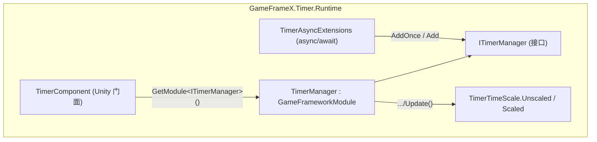

# 概述:GameFrameX Timer 能做什么

GameFrameX Timer 是 Unity 的轻量级定时器/任务调度模块:一行代码即可注册延时调用、循环调用、每帧更新与 async/await 等待,支持按 ID/回调/标签管理生命周期,并提供暂停/恢复、剩余时间查询与 timeScale 兼容模式。运行时核心由 `TimerManager`(模块实现)、`TimerComponent`(Unity 组件门面)与 `TimerAsyncExtensions`(async 扩展)组成。

## 快速开始

1. 确认工程已安装本包(`com.gameframex.unity.timer`),程序集为 `GameFrameX.Timer.Runtime`。
2. 场景中已有 GameFrameX 基础组件时,`TimerComponent` 会通过 `GameFrameworkEntry.GetModule<ITimerManager>()` 自动获取管理器;也可在菜单 `GameFrameX/Timer` 手动挂载(标记了 `[DisallowMultipleComponent]`,场景中仅允许一个)。

   ```csharp
   // TimerComponent.Awake 的装配逻辑
   [DisallowMultipleComponent]
   [AddComponentMenu("GameFrameX/Timer")]
   [GameFrameXAutoComponent(-5000)]
   public class TimerComponent : GameFrameworkComponent
   {
       ITimerManager _timerManager;

       protected override void Awake()
       {
           ImplementationComponentType = Utility.Assembly.GetType(componentType);
           InterfaceComponentType = typeof(ITimerManager);
           base.Awake();
           _timerManager = GameFrameworkEntry.GetModule<ITimerManager>();
           if (_timerManager == null)
           {
               Log.Fatal("Timer manager is invalid.");
               return;
           }
       }
   }
   ```

   Source: [Runtime/Timer/TimerComponent.cs](https://github.com/GameFrameX/com.gameframex.unity.timer/blob/main/Runtime/Timer/TimerComponent.cs#L12-L31)

3. 在业务脚本中拿到 `TimerComponent`,注册第一个定时器:

   ```csharp
   // 3 秒后执行一次,并携带一个参数
   int id = timerComponent.AddOnce(3f, param => Debug.Log($"done: {param}"), "hello");

   // 每 1 秒重复 5 次,带标签便于批量管理;Unscaled 表示不受 Time.timeScale 影响
   timerComponent.Add(1f, 5, _ => Debug.Log("tick"), null, "battle", TimerTimeScale.Unscaled, onComplete: () => Debug.Log("finished"));
   ```

4. 按需管理定时器:

   ```csharp
   timerComponent.Pause(id);      // 暂停(期间不累积时间)
   timerComponent.Resume(id);     // 恢复
   float left = timerComponent.GetRemaining(id); // 剩余秒数,不存在返回 -1
   timerComponent.Remove(id);     // 按 ID 移除
   timerComponent.RemoveByTag("battle"); // 按标签批量移除
   ```

   以上 API 均为 `TimerComponent` 上的真实签名,如 `public int Add(float interval, int repeat, Action<object> callback, object callbackParam = null, string tag = null, TimerTimeScale timeScale = TimerTimeScale.Unscaled, Action onComplete = null)`,见 [Runtime/Timer/TimerComponent.cs](https://github.com/GameFrameX/com.gameframex.unity.timer/blob/main/Runtime/Timer/TimerComponent.cs#L44-L69)。

## 能力速查

| 能力 | 入口 API | 说明 |
|------|----------|------|
| 延时一次 | `AddOnce(interval, callback, callbackParam)` | 到点执行一次后自动移除 |
| 循环调用 | `Add(interval, repeat, callback, ...)` | `repeat = 0` 表示无限重复 |
| 每帧更新 | `AddUpdate(callback)` / `AddUpdate(callback, callbackParam)` | interval 视为 0,每帧触发 |
| async 等待 | `WaitForSecondsAsync` / `WaitForNextFrameAsync` / `WaitForFramesAsync` | 主线程完成,支持 `CancellationToken` |
| 暂停/恢复 | `Pause(id)` / `Resume(id)` / `IsPaused(id)` | 也可按标签:`PauseByTag` / `ResumeByTag` |
| 查询状态 | `Exists(id|callback)` / `HasTag(tag)` / `GetRemaining` / `GetElapsed` / `GetRepeatLeft` | 定时器不存在时数值返回 `-1` |
| 批量移除 | `Remove(id|callback)` / `RemoveByTag(tag)` | 完成时触发 `onComplete` |
| 时间缩放 | `TimerTimeScale.Unscaled` / `Scaled` | 默认 `Unscaled`(不受 `Time.timeScale` 影响) |

## 工作原理速览



每帧 `TimerManager.Update(elapseSeconds, realElapseSeconds)` 在锁内遍历定时器项:按 `TimeScaleMode` 选择 `elapseSeconds`(Scaled)或 `realElapseSeconds`(Unscaled)累加;`interval <= 0` 的项视为每帧触发;到期项的回调先收集到 `_pendingCallbacks` 列表再统一派发,避免在遍历字典时修改集合。数据结构上用 `Dictionary<Action<object>, TimerItem>` 存活动项、`Dictionary<int, Action<object>>` 做 ID 映射、`Dictionary<string, List<int>>` 做标签索引,并用 `Stack<TimerItem>` 池化复用项,见 [Runtime/Timer/TimerManager.cs](https://github.com/GameFrameX/com.gameframex.unity.timer/blob/main/Runtime/Timer/TimerManager.cs#L42-L49)。

`TimerTimeScale` 是一个两值枚举,`Unscaled = 0` 为默认值,与既有行为兼容;`Scaled = 1` 才受 `UnityEngine.Time.timeScale` 影响,见 [Runtime/Timer/TimerTimeScale.cs](https://github.com/GameFrameX/com.gameframex.unity.timer/blob/main/Runtime/Timer/TimerTimeScale.cs#L6-L13)。

## 接下来

- 创建/移除/暂停定时器的完整参数说明与常见变体,见任务页《如何使用定时器》。
- async/await 用法(`WaitForSecondsAsync` 等三个扩展的实现见 [Runtime/Timer/TimerAsyncExtensions.cs](https://github.com/GameFrameX/com.gameframex.unity.timer/blob/main/Runtime/Timer/TimerAsyncExtensions.cs#L20-L37))。
- 定时器不触发、回调参数丢失等问题的排查,见排查页《定时器不工作怎么办》。
- 编辑器扩展(Inspector 调试视图)见 [Editor/Inspector/TimerComponentInspector.cs](https://github.com/GameFrameX/com.gameframex.unity.timer/blob/main/Editor/Inspector/TimerComponentInspector.cs)。
- 版本历史见 [CHANGELOG.md](https://github.com/GameFrameX/com.gameframex.unity.timer/blob/main/CHANGELOG.md)。
