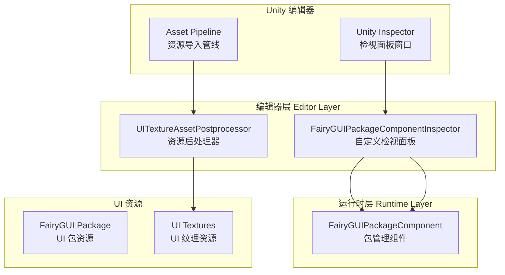
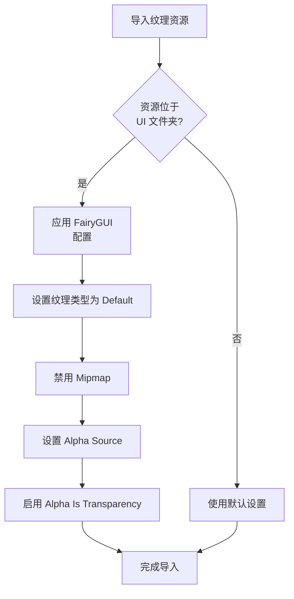

# 编辑器配置

编辑器配置文档介绍 GameFrameX UI FairyGUI 插件在 Unity 编辑器中的配置功能，包括自定义检视面板和资源后处理器。

## 概述

GameFrameX UI FairyGUI 插件提供了一套完整的编辑器配置机制，用于简化在 Unity 编辑器中的 UI 开发工作流程。这些编辑器功能主要包含以下两个核心组件：

1. **自定义检视面板 (Custom Inspector)** - 为 FairyGUIPackageComponent 提供可视化配置界面
2. **资源后处理器 (Asset Postprocessor)** - 自动配置 UI 纹理资源的导入设置

这些编辑器配置功能可以显著提升开发效率，减少手动配置工作，并确保 UI 资源使用最佳实践。

## 架构



## 自定义检视面板

### FairyGUIPackageComponentInspector

自定义检视面板继承自 GameFrameX 基础编辑器框架，提供了 FairyGUIPackageComponent 组件的可视化配置界面。

```csharp
// Source: Editor/Inspector/FairyGUIPackageComponentInspector.cs
using GameFrameX.Editor;
using GameFrameX.UI.FairyGUI.Runtime;
using UnityEditor;

namespace GameFrameX.UI.FairyGUI.Editor
{
    [CustomEditor(typeof(FairyGUIPackageComponent))]
    internal sealed class UIFairyGUIPackageComponentInspector : GameFrameworkInspector
    {
        public override void OnInspectorGUI()
        {
            base.OnInspectorGUI();
            Repaint();
        }
    }
}
```

> Source: [FairyGUIPackageComponentInspector.cs](https://github.com/GameFrameX/com.gameframex.unity.ui.fairygui/blob/main/Editor/Inspector/FairyGUIPackageComponentInspector.cs#L38-L46)

**功能特点：**
- 自动集成到 Unity Inspector 面板
- 继承自 GameFrameworkInspector 基类，提供统一的编辑器界面风格
- 支持组件的运行时配置查看
- 添加了 `GameFrameX/FairyGUIPackage` 菜单项，方便快速创建组件

**使用方式：**
1. 在 Unity 场景中创建空物体
2. 添加 `FairyGUIPackageComponent` 组件（可通过菜单 `GameFrameX/FairyGUIPackage` 快速添加）
3. 在 Inspector 面板中查看和配置组件属性

## 资源后处理器

### UITextureAssetPostprocessor

资源后处理器是编辑器配置的核心组件，它会在 UI 纹理资源导入时自动应用正确的设置，确保 UI 资源符合 FairyGUI 的要求。

```csharp
// Source: Editor/UITextureAssetPostprocessor.cs
#if ENABLE_UI_FAIRYGUI
using GameFrameX.Runtime;
using UnityEditor;

namespace GameFrameX.UI.FairyGUI.Editor
{
    internal sealed class UITextureAssetPostprocessor : AssetPostprocessor
    {
        void OnPreprocessTexture()
        {
            if (assetPath.Contains(PathHelper.Combine(Utility.Asset.Path.BundlesPath, "UI")))
            {
                TextureImporter textureImporter = (TextureImporter)assetImporter;
                if (textureImporter.textureType != TextureImporterType.Default)
                {
                    textureImporter.textureType = TextureImporterType.Default;
                }

                if (textureImporter.mipmapEnabled)
                {
                    textureImporter.mipmapEnabled = false;
                }

                textureImporter.alphaSource = TextureImporterAlphaSource.FromInput;
                textureImporter.alphaIsTransparency = true;
            }
        }
    }
}
#endif
```

> Source: [UITextureAssetPostprocessor.cs](https://github.com/GameFrameX/com.gameframex.unity.ui.fairygui/blob/main/Editor/UITextureAssetPostprocessor.cs#L41-L59)

### 自动配置属性说明

| 配置项 | 设置值 | 说明 |
|--------|--------|------|
| Texture Type | Default | 使用默认纹理类型，确保 FairyGUI 能正确识别 |
| Mipmap | 禁用 | UI 纹理通常不需要 Mipmap，禁用可节省内存 |
| Alpha Source | FromInput | 从纹理通道读取 Alpha 信息 |
| Alpha Is Transparency | 启用 | 将 Alpha 通道视为透明度，优化渲染 |

### 处理范围

资源后处理器仅处理位于 UI 文件夹中的纹理资源。UI 文件夹路径由 `PathHelper.Combine(Utility.Asset.Path.BundlesPath, "UI")` 决定，通常为 `Assets/Bundles/UI`。

### 工作流程



## 配置选项汇总

### 编辑器程序集定义

编辑器代码位于独立的程序集中，与运行时代码分离：

```json
// Source: Editor/GameFrameX.UI.FairyGUI.Editor.asmdef
{
  "name": "GameFrameX.UI.FairyGUI.Editor",
  "references": [
    "GameFrameX.UI.FairyGUI.Runtime",
    "GameFrameX.Editor",
    "GameFrameX.Runtime",
    "FairyGUI.Editor",
    "FairyGUI.Runtime"
  ],
  "includePlatforms": [
    "Editor"
  ]
}
```

> Source: [GameFrameX.UI.FairyGUI.Editor.asmdef](https://github.com/GameFrameX/com.gameframex.unity.ui.fairygui/blob/main/Editor/GameFrameX.UI.FairyGUI.Editor.asmdef#L1-L21)

### 编译条件

编辑器代码受 `ENABLE_UI_FAIRYGUI` 编译符号控制，确保只有在启用 FairyGUI 模块时才会编译相关代码。

## 常见配置问题

### 纹理导入问题

如果 UI 纹理未自动应用正确配置，请检查：

1. **确认 UI 资源路径**：纹理必须位于 UI 文件夹中（如 `Assets/Bundles/UI/`）
2. **检查编译符号**：确认 `ENABLE_UI_FAIRYGUI` 已定义
3. **刷新资源数据库**：在 Unity 中选择 `Assets > Refresh` 或按 `Ctrl+R` 强制刷新

### Inspector 不显示自定义面板

如果自定义检视面板未正常显示：

1. 确认已安装 GameFrameX.Editor 依赖包
2. 检查 FairyGUIPackageComponentInspector 类是否正确继承
3. 确保程序集定义正确包含 Editor 平台

## 相关链接

- [FUI 界面基类](../4-core-concepts.1-fui-base-class) - 了解 FUI 基类的使用方法
- [FairyGUIPackageComponent 类](../5-api-reference.2-package-component) - 包管理组件的详细 API 文档
- [界面管理器](../4-core-concepts.2-ui-manager) - 了解界面管理器的配置和使用
- [安装指南](../2-installation.1-install-methods) - 插件安装说明
- [依赖配置](../2-installation.2-dependencies) - 依赖项配置说明
