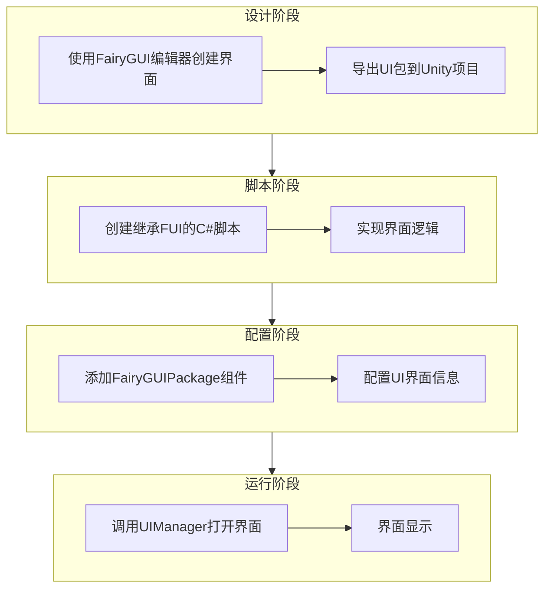
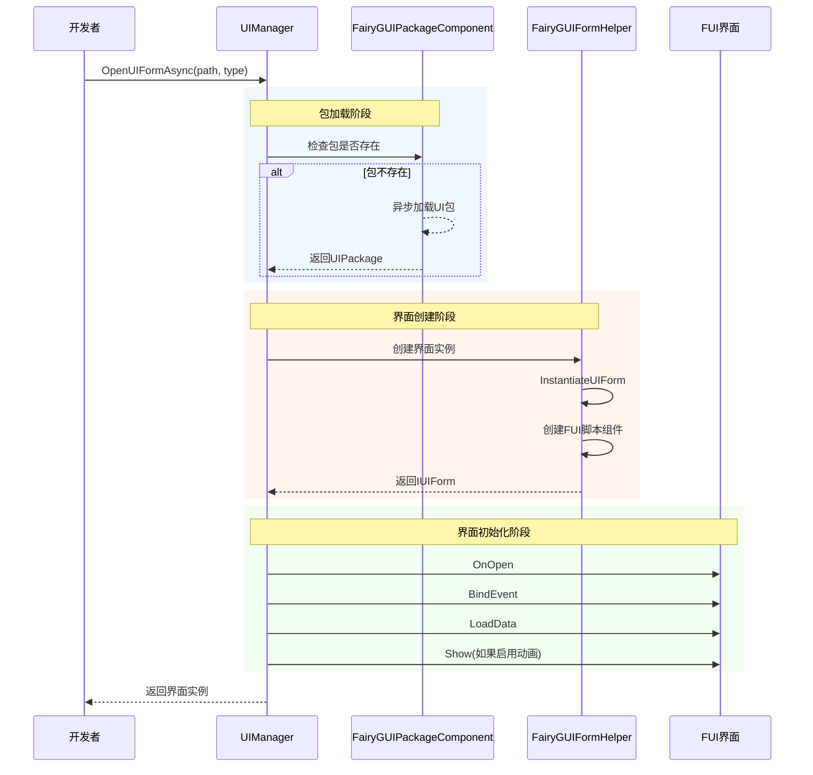
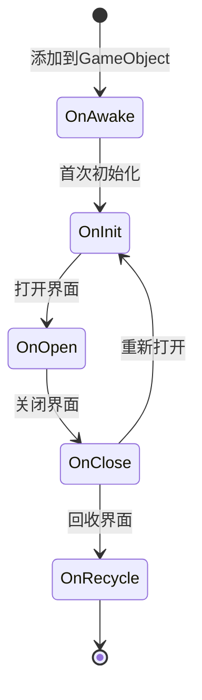

# 创建第一个界面

本指南将帮助你使用 GameFrameX 的 FairyGUI 插件创建第一个 UI 界面。通过本指南，你将了解从 FairyGUI 编辑器设计界面到在代码中打开界面的完整流程。

## 概述

在使用 FairyGUI 插件创建 UI 界面之前，需要理解整个 UI 系统的架构。GameFrameX 的 FairyGUI 插件基于以下核心组件构建：

- **FUI**：FairyGUI 界面的基类，继承自 UIForm，提供界面显示/隐藏、GObject 管理等功能
- **FairyGUIPackageComponent**：UI 包管理器，负责加载、缓存和卸载 UI 资源包
- **UIManager**：界面管理器，负责界面的打开、关闭和生命周期管理
- **FairyGUIFormHelper**：界面辅助器，负责创建、实例化和释放界面实例

整个 UI 系统的设计遵循了依赖注入和组件化的设计模式，使得界面创建和管理变得简单可控。

## 创建流程

创建第一个 FairyGUI 界面的完整流程如下：



## 步骤一：使用 FairyGUI 编辑器创建界面

首先需要使用 FairyGUI 编辑器设计和创建 UI 界面。FairyGUI 提供了一个强大的可视化编辑器，可以帮助你快速构建 UI。

### 1.1 安装 FairyGUI 编辑器

从 [FairyGUI 官网](https://www.fairygui.com/) 下载并安装 FairyGUI 编辑器。

### 1.2 创建新项目

在 FairyGUI 编辑器中创建新项目，选择合适的分辨率和设置。

### 1.3 设计界面

使用编辑器提供的各种组件（按钮、文本、图片、列表等）设计你的界面。完成设计后，保存项目。

### 1.4 导出 UI 包

将设计好的界面导出为 Unity 可用的资源包：

1. 点击菜单「发布」→「发布设置」
2. 选择发布平台为 Unity
3. 设置输出路径（通常设置为 Unity 项目的 `Assets/Res/FairyGUI` 目录）
4. 点击发布按钮

导出后，会在输出目录生成 `.bytes` 描述文件和相关的图片资源。

## 步骤二：创建 FUI 界面脚本

在 Unity 项目中创建继承自 `FUI` 的 C# 脚本。FUI 是 FairyGUI 界面的基类，提供了与 FairyGUI GObject 交互的核心功能。

### 2.1 创建界面类

```csharp
using GameFrameX.UI.FairyGUI.Runtime;
using FairyGUI;
using GameFrameX.UI.Runtime;

/// <summary>
/// 主菜单界面
/// </summary>
public class MainMenuForm : FUI
{
    /// <summary>
    /// 初始化界面
    /// </summary>
    protected override void OnInit()
    {
        base.OnInit();
        
        // 获取界面中的按钮并添加点击事件
        var startButton = GObject.asCom.GetChild("btn_start");
        startButton.onClick.Add(OnStartButtonClick);
    }

    /// <summary>
    /// 开始按钮点击事件
    /// </summary>
    private void OnStartButtonClick()
    {
        // 处理点击逻辑
    }

    /// <summary>
    /// 界面打开时的回调，可以在这里接收传入的数据
    /// </summary>
    /// <param name="userData">打开界面时传入的数据</param>
    protected override void OnOpen(object userData)
    {
        base.OnOpen(userData);
        // 界面打开时的初始化逻辑
    }

    /// <summary>
    /// 界面关闭时的回调
    /// </summary>
    protected override void OnClose(bool isShutdown, bool isVisible)
    {
        // 界面关闭时的清理逻辑
        base.OnClose(isShutdown, isVisible);
    }
}
```
> Source: [FUI.cs](https://github.com/GameFrameX/com.gameframex.unity.ui.fairygui/blob/main/Runtime/FUI.cs#L43-L197)

### 2.2 FUI 类提供的核心功能

FUI 类继承自 UIForm，是所有 FairyGUI 界面的基类。它提供了以下核心功能：

| 功能 | 说明 |
|------|------|
| GObject | 获取关联的 FairyGUI GObject 对象 |
| Visible | 获取或设置界面可见性 |
| Show | 显示界面，支持动画 |
| Hide | 隐藏界面，支持动画 |
| OnVisibleChanged | 可见性变更回调 |

## 步骤三：配置 FairyGUIPackageComponent

FairyGUIPackageComponent 是 UI 包管理器组件，需要添加到场景中才能加载 UI 包。

### 3.1 添加包管理组件

在 Unity 编辑器中，按照以下步骤操作：

1. 创建一个空 GameObject，命名为 `FairyGUIPackage`
2. 点击 Add Component 按钮
3. 搜索并添加 `FairyGUIPackage` 组件（实际上是 FairyGUIPackageComponent）
4. 确保该组件作为 GameFrameworkComponent 的子类被正确初始化

### 3.2 包管理器的核心方法

```csharp
// 异步加载 UI 包
public Task<UIPackage> AddPackageAsync(string descFilePath, bool isLoadAsset = true)

// 同步加载 UI 包
public void AddPackageSync(string descFilePath, bool isLoadAsset = true)

// 移除指定名称的 UI 包
public void RemovePackage(string packageName)

// 检查 UI 包是否存在
public bool Has(string uiPackageName)
```
> Source: [FairyGUIPackageComponent.cs](https://github.com/GameFrameX/com.gameframex.unity.ui.fairygui/blob/main/Runtime/FairyGUIPackageComponent.cs#L138-L290)

## 步骤四：打开界面

使用 UIManager 打开界面是最后一步。UIManager 会自动处理包的加载、界面的创建和显示。

### 4.1 打开界面的基本方法

```csharp
// 异步打开界面
await GameEntry.UI.OpenUIFormAsync("UI/MainMenu", typeof(MainMenuForm));

// 带用户数据打开界面
var userData = new StartGameData { LevelId = 1 };
await GameEntry.UI.OpenUIFormAsync("UI/MainMenu", typeof(MainMenuForm), userData);
```

### 4.2 打开界面的完整流程



### 4.3 界面参数说明

| 参数 | 说明 |
|------|------|
| uiFormAssetPath | 界面资源路径，如 "UI/MainMenu" |
| uiFormType | 界面类型，传入界面类的 Type |
| pauseCoveredUIForm | 是否暂停被覆盖的界面 |
| userData | 用户自定义数据，会传递给界面的 OnOpen 方法 |
| isFullScreen | 是否全屏显示 |

## 界面生命周期

理解界面的生命周期对于正确管理 UI 非常重要。FUI 界面有以下生命周期方法：



| 生命周期方法 | 调用时机 | 用途 |
|-------------|----------|------|
| OnAwake | 脚本添加到 GameObject 时 | 一次性初始化 |
| OnInit | 界面首次创建时 | 初始化界面组件和事件 |
| OnOpen | 每次打开界面时 | 接收数据、刷新界面 |
| OnClose | 界面关闭时 | 清理资源、保存状态 |
| OnRecycle | 界面回收时 | 彻底清理内存 |

## 界面关闭

使用 UIManager 关闭界面：

```csharp
// 关闭指定界面
GameEntry.UI.CloseUIForm(mainMenuForm);

// 关闭所有界面
GameEntry.UI.CloseAllUIForms();
```
> Source: [UIManager.Close.cs](https://github.com/GameFrameX/com.gameframex.unity.ui.fairygui/blob/main/Runtime/UIManager.Close.cs)

## 常见问题

### Q1: 界面打开后显示空白

请检查以下事项：
1. UI 包是否正确导出并放置在 Unity 项目的正确目录
2. FairyGUIPackageComponent 是否已添加到场景
3. 界面资源路径是否正确

### Q2: 点击事件没有响应

确保在 OnInit 方法中正确绑定了事件，并且 GObject 名称与 FairyGUI 编辑器中的名称完全一致。

### Q3: 界面无法关闭

检查是否在 OnClose 方法中正确调用了基类的 OnClose 方法，确保资源被正确释放。

## 相关链接

- [FUI 界面基类](./4-core-concepts.1-fui-base-class) - 详细了解 FUI 基类的所有功能
- [界面管理器](./4-core-concepts.2-ui-manager) - 深入了解 UIManager 的功能
- [包管理器](./4-core-concepts.3-package-manager) - 了解 UI 包的管理机制
- [界面辅助器](./4-core-concepts.4-form-helper) - 了解界面创建和释放的机制
- [打开和关闭界面](./3-getting-started.2-open-close-ui) - 继续学习界面的打开和关闭操作
