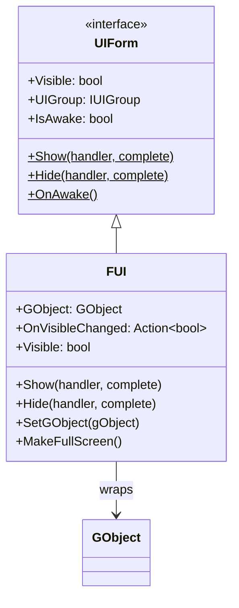
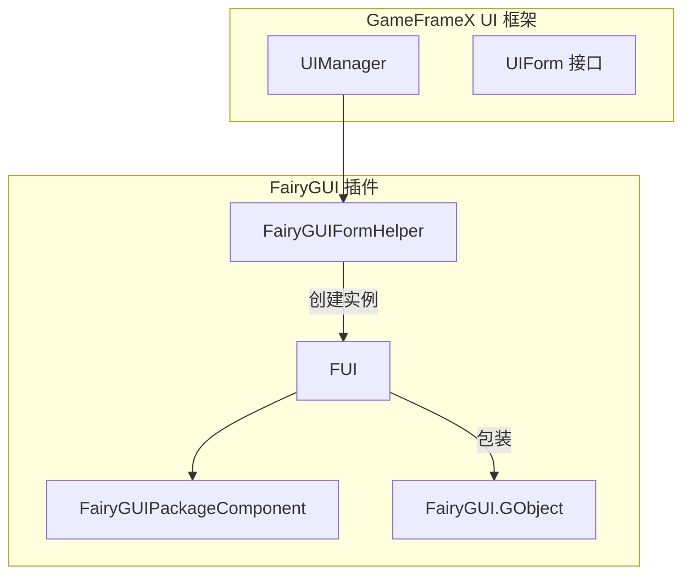
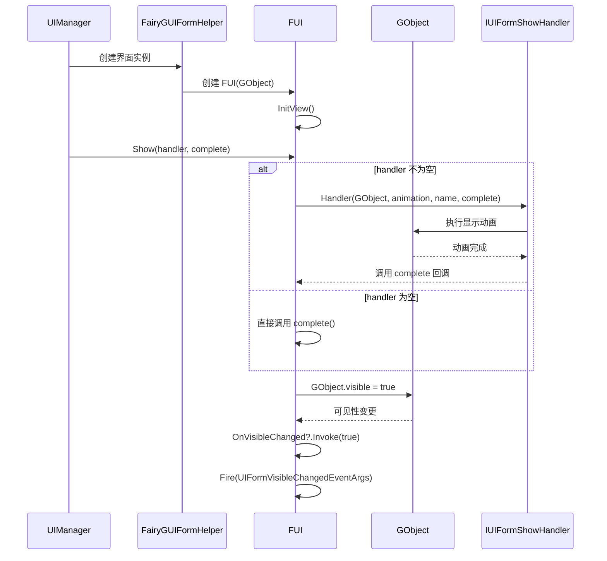

# FUI 类

FUI 是 GameFrameX UI 框架中 FairyGUI 插件的界面基类，继承自 UIForm，提供 FairyGUI 特定的界面功能实现。

## 概述

FUI 类作为 FairyGUI 界面与 GameFrameX UI 框架之间的桥梁，主要负责：

- **界面生命周期管理**：继承自 UIForm 的显示/隐藏逻辑
- **FairyGUI 集成**：封装 GObject 操作，提供类型安全的界面访问
- **事件回调**：提供可见性变化的事件通知机制
- **动画支持**：支持显示和隐藏动画

### 类层次结构



### FUI 在系统中的角色



FUI 由 `FairyGUIFormHelper` 在创建界面时实例化，并与对应的 FairyGUI `GObject` 关联。

## 核心属性

### `GObject`

获取关联的 FairyGUI GObject 对象。

```csharp
public GObject GObject { get; private set; }
```

> Source: [FUI.cs](https://github.com/GameFrameX/com.gameframex.unity.ui.fairygui/blob/main/Runtime/FUI.cs#L52-L53)

**说明**：此属性提供对底层 FairyGUI GObject 的直接访问，允许开发者使用 FairyGUI 的原生 API 操作界面元素。

### `OnVisibleChanged`

获取或设置界面可见性改变事件的回调。

```csharp
public Action<bool> OnVisibleChanged { get; set; }
```

> Source: [FUI.cs](https://github.com/GameFrameX/com.gameframex.unity.ui.fairygui/blob/main/Runtime/FUI.cs#L62-L63)

**参数**：
- `bool`: 当前可见状态，`true` 表示显示，`false` 表示隐藏

### `Visible`

获取或设置界面是否可见。

```csharp
public override bool Visible {
    get {
        if (GObject == null) {
            return false;
        }
        return GObject.visible;
    }
    protected set {
        if (GObject == null) {
            return;
        }
        InternalSetVisible(value);
    }
}
```

> Source: [FUI.cs](https://github.com/GameFrameX/com.gameframex.unity.ui.fairygui/blob/main/Runtime/FUI.cs#L135-L155)

**说明**：此属性内部调用 `InternalSetVisible` 方法设置可见性，会触发 `OnVisibleChanged` 回调和 `UIFormVisibleChangedEventArgs` 事件。

## 核心方法

### `Show(handler, complete)`

显示界面。

```csharp
public override void Show(IUIFormShowHandler handler, Action complete)
{
    if (handler != null) {
        handler.Handler(GObject, EnableShowAnimation, ShowAnimationName, complete);
    } else {
        complete?.Invoke();
    }
}
```

> Source: [FUI.cs](https://github.com/GameFrameX/com.gameframex.unity.ui.fairygui/blob/main/Runtime/FUI.cs#L74-L84)

**参数**：
- `handler` (IUIFormShowHandler): 界面显示处理器接口，负责执行显示逻辑和动画
- `complete` (Action): 显示完成后的回调函数

**说明**：此方法将显示操作委托给 `IUIFormShowHandler`，支持显示动画。如果 handler 为 null，则直接调用 complete 回调。

### `Hide(handler, complete)`

隐藏界面。

```csharp
public override void Hide(IUIFormHideHandler handler, Action complete)
{
    if (handler != null) {
        handler.Handler(GObject, EnableHideAnimation, HideAnimationName, complete);
    } else {
        complete?.Invoke();
    }
}
```

> Source: [FUI.cs](https://github.com/GameFrameX/com.gameframex.unity.ui.fairygui/blob/main/Runtime/FUI.cs#L95-L105)

**参数**：
- `handler` (IUIFormHideHandler): 界面隐藏处理器接口，负责执行隐藏逻辑和动画
- `complete` (Action): 隐藏完成后的回调函数

**说明**：此方法将隐藏操作委托给 `IUIFormHideHandler`，支持隐藏动画。

### `InternalSetVisible(value)`

内部设置界面的显示状态，不发出事件。

```csharp
protected override void InternalSetVisible(bool value)
{
    if (GObject.visible == value) {
        return;
    }

    GObject.visible = value;
    OnVisibleChanged?.Invoke(value);
    EventSubscriber?.Fire(UIFormVisibleChangedEventArgs.EventId, UIFormVisibleChangedEventArgs.Create(this, value));
}
```

> Source: [FUI.cs](https://github.com/GameFrameX/com.gameframex.unity.ui.fairygui/blob/main/Runtime/FUI.cs#L115-L125)

**参数**：
- `value` (bool): 要设置的可见性状态

**说明**：
- 如果当前可见性与目标值相同，则直接返回，避免重复操作
- 设置 GObject.visible 属性
- 触发 OnVisibleChanged 回调
- 发送 UIFormVisibleChangedEventArgs 事件到事件系统

### `MakeFullScreen()`

将当前 UI 对象设置为全屏显示。

```csharp
protected override void MakeFullScreen()
{
    GObject?.asCom?.MakeFullScreen();
}
```

> Source: [FUI.cs](https://github.com/GameFrameX/com.gameframex.unity.ui.fairygui/blob/main/Runtime/FUI.cs#L165-L168)

**说明**：此方法将界面设置为全屏显示，使用 FairyGUI 的 `MakeFullScreen` 方法。如果 GObject 无法转换为 GComponent，则静默忽略。

### `SetGObject(gObject)`

设置关联的 GObject 对象。

```csharp
public void SetGObject(GObject gObject)
{
    GObject = gObject;
}
```

> Source: [FUI.cs](https://github.com/GameFrameX/com.gameframex.unity.ui.fairygui/blob/main/Runtime/FUI.cs#L193-L196)

**参数**：
- `gObject` (GObject): 要设置的 FairyGUI GObject 对象

**说明**：此方法允许在界面创建后动态设置关联的 GObject 对象。

### 构造函数

```csharp
public FUI(GObject gObject, bool isRoot = false)
{
    GObject = gObject;
    InitView();
}
```

> Source: [FUI.cs](https://github.com/GameFrameX/com.gameframex.unity.ui.fairygui/blob/main/Runtime/FUI.cs#L179-L183)

**参数**：
- `gObject` (GObject): 关联的 FairyGUI GObject 对象
- `isRoot` (bool): 是否为根界面，默认为 false

**说明**：初始化 FUI 实例时，会自动调用 `InitView()` 方法进行视图初始化。

## 界面显示/隐藏流程



## 使用示例

### 创建自定义 FUI 界面

```csharp
using FairyGUI;
using GameFrameX.UI.FairyGUI.Runtime;

public class TestForm : FUI
{
    private GButton m_CloseButton;
    
    public TestForm(GObject gObject, bool isRoot = false) : base(gObject, isRoot)
    {
    }
    
    protected override void InitView()
    {
        base.InitView();
        
        // 获取关闭按钮
        m_CloseButton = GObject.asCom.GetChild("btn_close") as GButton;
        if (m_CloseButton != null)
        {
            m_CloseButton.onClick.Add(OnCloseButtonClick);
        }
    }
    
    private void OnCloseButtonClick()
    {
        // 处理关闭按钮点击
        GameEntry.UI.CloseUIForm(this);
    }
}
```

> Source: [FUI.cs](https://github.com/GameFrameX/com.gameframex.unity.ui.fairygui/blob/main/Runtime/FUI.cs#L179-L196)

### 使用 GObjectHelper 获取 FUI 实例

```csharp
using FairyGUI;
using GameFrameX.UI.FairyGUI.Runtime;

// 假设有一个 GObject 实例
GObject gObject = UIPackage.CreateObject("Package", "TestForm");

// 将 FUI 添加到缓存
TestForm fui = new TestForm(gObject);
gObject.Add(fui);

// 后续可以通过 GObject 获取 FUI
TestForm retrievedFui = gObject.Get<TestForm>();
```

> Source: [GObjectHelper.cs](https://github.com/GameFrameX/com.gameframex.unity.ui.fairygui/blob/main/Runtime/GObjectHelper.cs#L69-L94)

### 监听可见性变化

```csharp
public class TestForm : FUI
{
    public TestForm(GObject gObject, bool isRoot = false) : base(gObject, isRoot)
    {
        // 订阅可见性变化事件
        OnVisibleChanged = OnVisibilityChanged;
    }
    
    private void OnVisibilityChanged(bool isVisible)
    {
        if (isVisible)
        {
            Debug.Log("界面已显示");
        }
        else
        {
            Debug.Log("界面已隐藏");
        }
    }
}
```

> Source: [FUI.cs](https://github.com/GameFrameX/com.gameframex.unity.ui.fairygui/blob/main/Runtime/FUI.cs#L62-L63)

## 与 UIForm 基类的关系

FUI 继承自 UIForm，UIForm 是 GameFrameX UI 框架的通用界面接口。以下是 FUI 从 UIForm 继承的关键属性和方法：

| 成员 | 来源 | 说明 |
|------|------|------|
| `EnableShowAnimation` | UIForm | 是否启用显示动画 |
| `ShowAnimationName` | UIForm | 显示动画名称 |
| `EnableHideAnimation` | UIForm | 是否启用隐藏动画 |
| `HideAnimationName` | UIForm | 隐藏动画名称 |
| `UIGroup` | UIForm | 所属界面组 |
| `OnAwake()` | UIForm | 唤醒时调用 |
| `InitView()` | UIForm | 初始化视图 |

> 完整的 UIForm 接口定义请参考 [GameFrameX.UI.Runtime](https://github.com/GameFrameX/com.gameframex.unity.ui.runtime) 包。

## 相关链接

- [FairyGUIPackageComponent 类](./5-api-reference.2-package-component) - FairyGUI 包管理组件
- [FairyGUIFormHelper 类](./5-api-reference.3-form-helper) - 界面辅助器
- [GObjectHelper 工具类](./5-api-reference.4-gobject-helper) - GObject 辅助工具
- [核心概念 - FUI 界面基类](../4-core-concepts.1-fui-base-class) - FUI 界面基类概念详解
- [核心概念 - 界面管理器](../4-core-concepts.2-ui-manager) - 界面管理器概念详解
