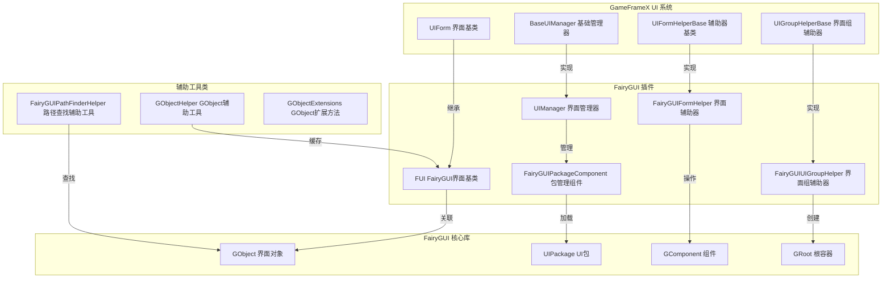

# 插件介绍

GameFrameX 的 UI FairyGUI 组件是 GameFrameX 框架的官方 UI 扩展插件，专门为 Unity 项目提供 FairyGUI 界面系统的集成支持。该插件封装了 FairyGUI 的核心功能，使其能够无缝接入 GameFrameX 的 UI 管理子系统，实现界面的加载、显示、隐藏、层级管理等完整生命周期管理。

## 概述

FairyGUI 是一款功能强大的 Unity 跨平台 UI 编辑器，相比传统的代码编写 UI 方式，FairyGUI 提供了可视化的 UI 编辑器，支持多平台导出（iOS、Android、Windows、Web 等），并且具有高性能的渲染效率。GameFrameX UI FairyGUI 组件在此基础上，提供了与 GameFrameX 框架其他模块（如资源管理、事件系统、对象池等）的深度集成，使开发者能够更高效地开发基于 FairyGUI 的游戏界面。

该插件的核心设计理念是将 FairyGUI 的界面对象（GObject）与 GameFrameX 的界面抽象（IUIForm）进行桥接，既保留了 FairyGUI 强大的 UI 编辑能力，又充分利用了 GameFrameX 框架提供的统一界面管理机制。通过本插件，开发者可以实现界面的异步加载、对象池复用、自动资源释放、界面组层级管理等功能。

## 架构设计



如上图所示，插件的架构设计遵循了清晰的层次划分。最上层是 GameFrameX 框架定义的 UI 系统接口层，包括界面基类、界面管理器基类、界面辅助器基类和界面组辅助器基类。这些抽象接口定义了 UI 系统的标准行为和扩展点。

中间层是 FairyGUI 插件的具体实现层。`FUI` 类继承自 GameFrameX 的 `UIForm` 基类，实现了 FairyGUI 特定的界面功能；`UIManager` 继承自 `BaseUIManager`，实现了界面的打开和关闭逻辑；`FairyGUIFormHelper` 继承自 `UIFormHelperBase`，负责界面的实例化、创建和释放；`FairyGUIUIGroupHelper` 继承自 `UIGroupHelperBase`，负责界面组的创建和深度管理。

最底层是 FairyGUI 的核心库，包括 GObject、UIPackage、GComponent 和 GRoot 等类，这些是 FairyGUI 提供的底层 UI 对象和容器。插件通过与这些底层类的交互，实现了完整的 UI 功能。

此外，插件还提供了多个辅助工具类，包括 `GObjectHelper`（用于 FUI 对象的缓存和管理）、`FairyGUIPathFinderHelper`（用于 UI 对象路径的查找和解析）和 `GObjectExtensions`（GObject 的扩展方法）。

## 核心组件

### FUI 界面基类

`FUI` 是所有 FairyGUI 界面的基类，继承自 GameFrameX 的 `UIForm` 基类。它封装了 FairyGUI 的 GObject，提供了界面显示、隐藏、可见性状态管理等核心功能。

```csharp
public class FUI : UIForm
{
    public GObject GObject { get; private set; }
    public Action<bool> OnVisibleChanged { get; set; }
    
    public override void Show(IUIFormShowHandler handler, Action complete);
    public override void Hide(IUIFormHideHandler handler, Action complete);
    protected override void InternalSetVisible(bool value);
    public override bool Visible { get; protected set; }
    protected override void MakeFullScreen();
    
    public FUI(GObject gObject, bool isRoot = false);
    public void SetGObject(GObject gObject);
}
```

> Source: [FUI.cs](https://github.com/GameFrameX/com.gameframex.unity.ui.fairygui/blob/main/Runtime/FUI.cs#L42-L197)

### UIManager 界面管理器

`UIManager` 负责管理所有界面的生命周期，包括界面的打开、关闭、加载、卸载等操作。它继承自 `BaseUIManager`，实现了 GameFrameX 定义的 UI 管理接口。

```csharp
internal sealed partial class UIManager : BaseUIManager
{
    private FairyGUIPackageComponent FairyGuiPackage { get; set; }
    
    public override void SetResourceManager(IAssetManager assetManager);
}
```

> Source: [UIManager.cs](https://github.com/GameFrameX/com.gameframex.unity.ui.fairygui/blob/main/Runtime/UIManager.cs#L43-L93)

### FairyGUIPackageComponent 包管理组件

`FairyGUIPackageComponent` 是 FairyGUI 包管理组件，负责管理所有 UI 包的加载、缓存和卸载。它是一个 Unity 组件，可以挂载到游戏对象上。

```csharp
public sealed class FairyGUIPackageComponent : GameFrameworkComponent
{
    private readonly Dictionary<string, UIPackageData> m_UILoadedPackages = new Dictionary<string, UIPackageData>(32);
    private readonly Dictionary<string, TaskCompletionSource<UIPackage>> m_UIPackageLoading = new Dictionary<string, TaskCompletionSource<UIPackage>>(32);
    
    public Task<UIPackage> AddPackageAsync(string descFilePath, bool isLoadAsset = true);
    public void AddPackageSync(string descFilePath, bool isLoadAsset = true);
    public void RemovePackage(string packageName);
    public void RemoveAllPackages();
    public bool Has(string uiPackageName);
    public UIPackage Get(string uiPackageName);
}
```

> Source: [FairyGUIPackageComponent.cs](https://github.com/GameFrameX/com.gameframex.unity.ui.fairygui/blob/main/Runtime/FairyGUIPackageComponent.cs#L48-L307)

### FairyGUIFormHelper 界面辅助器

`FairyGUIFormHelper` 继承自 `UIFormHelperBase`，负责界面的实例化、创建和释放。它是连接 GameFrameX UI 系统和 FairyGUI 核心库的桥梁。

```csharp
public class FairyGUIFormHelper : UIFormHelperBase
{
    public override object InstantiateUIForm(object uiFormAsset);
    public override IUIForm CreateUIForm(object uiFormInstance, Type uiFormType, object userData);
    public override void ReleaseUIForm(object uiFormAsset, object uiFormInstance, object assetHandle, string uiFormAssetPath, string uiFormAssetName);
}
```

> Source: [FairyGUIFormHelper.cs](https://github.com/GameFrameX/com.gameframex.unity.ui.fairygui/blob/main/Runtime/FairyGUIFormHelper.cs#L47-L232)

### FairyGUIUIGroupHelper 界面组辅助器

`FairyGUIUIGroupHelper` 继承自 `UIGroupHelperBase`，负责界面组的创建和深度管理。它使用 FairyGUI 的 GComponent 来实现界面组的容器功能。

```csharp
public sealed class FairyGUIUIGroupHelper : UIGroupHelperBase
{
    public override int Depth { get; protected set; }
    public override void SetDepth(int depth);
    public override IUIGroupHelper Handler(Transform root, string groupName, string uiGroupHelperTypeName, IUIGroupHelper customUIGroupHelper, int depth = 0);
}
```

> Source: [FairyGUIUIGroupHelper.cs](https://github.com/GameFrameX/com.gameframex.unity.ui.fairygui/blob/main/Runtime/FairyGUIUIGroupHelper.cs#L43-L97)

### GObjectHelper 辅助工具类

`GObjectHelper` 是一个静态辅助类，提供 FUI 对象的缓存和管理功能。通过它可以实现 GObject 到 FUI 的映射和查找。

```csharp
public static class GObjectHelper
{
    private static readonly Dictionary<GObject, FUI> s_GObjectToFuiMap = new Dictionary<GObject, FUI>();
    
    public static void ClearAll();
    public static T Get<T>(this GObject self) where T : FUI;
    public static void Add(this GObject self, FUI fui);
    public static FUI Remove(this GObject self);
}
```

> Source: [GObjectHelper.cs](https://github.com/GameFrameX/com.gameframex.unity.ui.fairygui/blob/main/Runtime/GObjectHelper.cs#L42-L115)

### FairyGUIPathFinderHelper 路径查找辅助工具

`FairyGUIPathFinderHelper` 提供 UI 对象路径的查找和解析功能，支持通过路径字符串快速定位 UI 元素。

```csharp
public static class FairyGUIPathFinderHelper
{
    public static string GetUIPath(GObject o);
    public static GObject GetUIFromPath(string path);
    public static bool SearchPathInclude(string path, GObject gObject);
}

public static class GObjectExtensions
{
    public static string GetUIPath(this GObject self);
}
```

> Source: [FairyGUIPathFinderHelper.cs](https://github.com/GameFrameX/com.gameframex.unity.ui.fairygui/blob/main/Runtime/FairyGUIPathFinderHelper.cs#L43-L278)

## 界面打开流程

```mermaid
sequenceDiagram
    participant Client as 客户端代码
    participant UIMgr as UIManager
    party Package as FairyGUIPackageComponent
    party FormHelper as FairyGUIFormHelper
    party FUI as FUI界面
    party GComp as GComponent

    Client->>UIMgr: OpenUIFormAsync()
    UIMgr->>UIMgr: InnerOpenUIFormAsync()
    
    alt 对象池存在
        UIMgr->>UIMgr: 从对象池获取
    else 对象池不存在
        UIMgr->>Package: 检查UI包是否已加载
        alt 包未加载
            alt 同步加载
                Package->>Package: AddPackageSync()
            else 异步加载
                Package->>Package: AddPackageAsync()
            end
        end
        
        UIMgr->>FormHelper: InstantiateUIForm()
        FormHelper->>GComp: UIPackage.CreateObject()
        GComp-->>FormHelper: 返回GComponent实例
    end
    
    FormHelper->>FUI: CreateUIForm()
    
    alt 界面类型标记
        FUI->>FUI: 应用ShowAnimation属性
        FUI->>FUI: 应用HideAnimation属性
    end
    
    FUI->>GComp: AddChild()
    FUI->>FUI: OnOpen()
    FUI->>FUI: BindEvent()
    FUI->>FUI: LoadData()
    
    alt 启用显示动画
        FUI->>FUI: Show()
    end
    
    UIMgr-->>Client: 返回IUIForm实例
```

如上图所示，界面的打开流程涉及多个组件的协作。当客户端调用 `OpenUIFormAsync` 方法打开界面时，UIManager 首先检查对象池中是否存在可复用的界面实例。如果存在，直接从对象池获取；如果不存在，则进入加载流程。

在加载流程中，UIManager 会先检查 FairyGUI 包是否已经加载。如果没有加载，根据配置选择同步或异步方式加载 UI 包。包加载完成后，通过 FairyGUIFormHelper 创建界面实例。

界面实例创建完成后，会进行一系列初始化操作，包括应用界面组、应用动画属性、绑定事件、加载数据等。最后，如果启用了显示动画，会执行动画效果。

## 资源管理策略

插件采用多种资源管理策略来优化内存使用和加载性能：

1. **包缓存机制**：FairyGUIPackageComponent 维护已加载包的缓存，避免重复加载相同的 UI 包。

2. **对象池复用**：UIManager 使用对象池管理界面实例，关闭的界面不会立即销毁，而是回收到对象池中供下次打开时复用。

3. **异步资源加载**：支持异步加载 UI 包和界面资源，避免阻塞主线程。

4. **自动资源释放**：当界面关闭且不再需要时，辅助器会自动释放相关的资源句柄。

## 与 GameFrameX 框架的集成

插件深度集成了 GameFrameX 框架的多个核心模块：

- **资源管理**：通过 IAssetManager 接口加载界面资源，支持 YooAsset 资源系统
- **事件系统**：通过 EventSubscriber 发布界面可见性变化事件
- **引用池**：使用 ReferencePool 管理临时对象，减少 GC 压力
- **路径助手**：使用 PathHelper 处理资源路径

## 相关链接

- [功能特性](./1-overview.2-features)
- [系统要求](./1-overview.3-requirements)
- [安装指南](../2-installation.1-install-methods)
- [依赖配置](../2-installation.2-dependencies)
- [FUI 界面基类](../4-core-concepts.1-fui-base-class)
- [界面管理器](../4-core-concepts.2-ui-manager)
- [包管理器](../4-core-concepts.3-package-manager)
- [界面辅助器](../4-core-concepts.4-form-helper)
- [界面组辅助器](../4-core-concepts.5-ui-group-helper)
