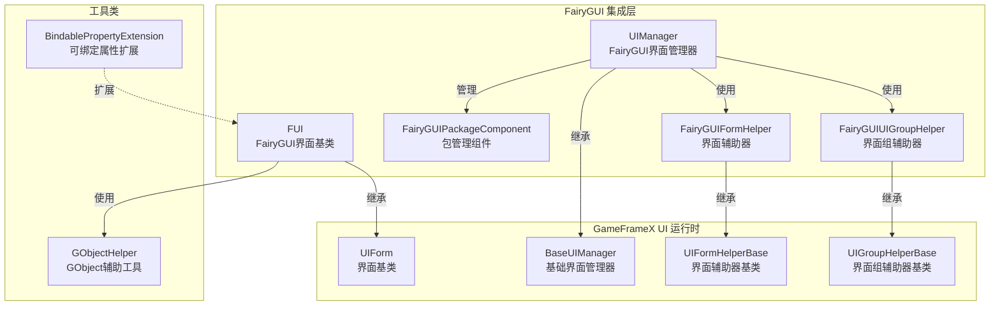
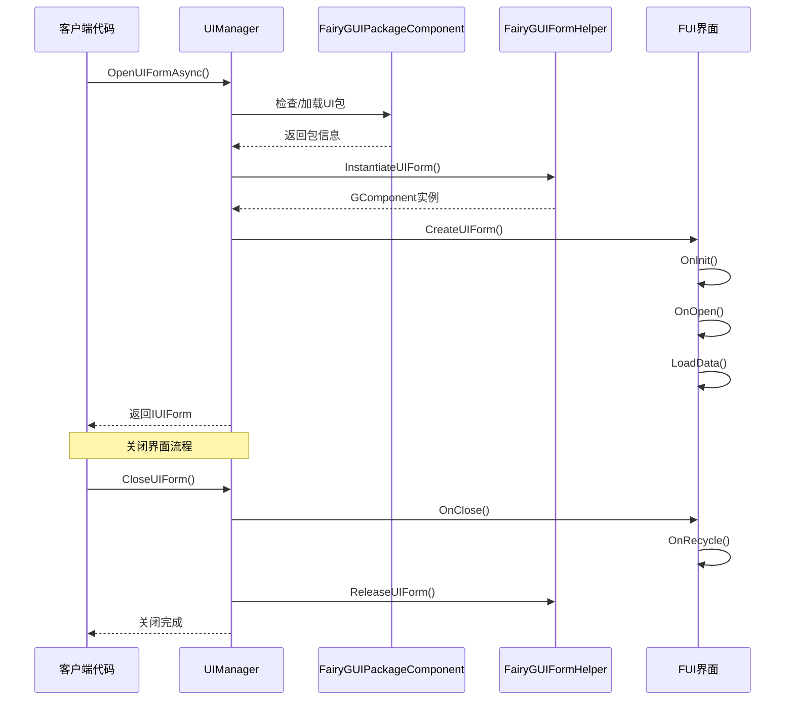

# 功能特性

GameFrameX UI FairyGUI 插件是一款专为 Unity 游戏引擎设计的 FairyGUI UI 组件集成方案，提供完整的界面管理、界面生命周期控制、包资源管理等功能。

## 概述

本插件将 GameFrameX 核心框架的 UI 系统与 FairyGUI 完美整合，提供以下核心能力：

- **界面生命周期管理**：完整的界面打开、关闭、显示、隐藏机制
- **资源包管理**：支持 UI 包的异步/同步加载、缓存和卸载
- **界面组系统**：支持多层级的界面分组和深度控制
- **对象池**：支持界面实例的复用，减少内存开销
- **动画系统**：支持显示/隐藏动画的灵活配置
- **扩展支持**：提供 FairyGUI 特定的数据绑定扩展

## 核心架构



### 架构说明

| 组件 | 职责 | 继承/实现 |
|------|------|----------|
| **FUI** | FairyGUI 界面基类，处理 GObject 关联和可见性 | 继承 UIForm |
| **UIManager** | 界面管理器，处理界面打开/关闭/生命周期 | 继承 BaseUIManager |
| **FairyGUIPackageComponent** | 包管理组件，异步/同步加载 UI 包 | 继承 GameFrameworkComponent |
| **FairyGUIFormHelper** | 界面辅助器，实例化/创建/释放界面 | 实现 UIFormHelperBase |
| **FairyGUIUIGroupHelper** | 界面组辅助器，管理界面层级深度 | 继承 UIGroupHelperBase |
| **GObjectHelper** | GObject 工具类，FUI 对象缓存管理 | 静态类 |

## 核心功能特性

### 1. 界面基类 (FUI)

FUI 是 FairyGUI 特定的界面基类，提供以下功能：

- **GObject 关联**：与 FairyGUI 的 GObject 无缝关联
- **可见性管理**：通过 `Visible` 属性控制界面显示/隐藏
- **动画支持**：支持显示/隐藏动画配置
- **全屏显示**：支持全屏模式设置
- **事件系统**：提供可见性改变事件回调

```csharp
// FUI 使用示例
public class MainMenuForm : FUI
{
    protected override void OnInit(object userData)
    {
        base.OnInit(userData);
        // 设置 GObject 关联
        GObject.onClick.Add(() => { /* 点击处理 */ });
    }
}
```
> Source: [FUI.cs](https://github.com/GameFrameX/com.gameframex.unity.ui.fairygui/blob/main/Runtime/FUI.cs#L36-L197)

### 2. 包管理系统

FairyGUIPackageComponent 负责管理 FairyGUI UI 资源包：

- **异步加载**：`AddPackageAsync()` 支持异步加载 UI 包
- **同步加载**：`AddPackageSync()` 支持同步加载 UI 包
- **包缓存**：已加载的包会被缓存，避免重复加载
- **资源预加载**：支持 `LoadAllAssets()` 预加载所有资源
- **包移除**：`RemovePackage()` / `RemoveAllPackages()` 支持包的卸载

```csharp
// 包管理示例
var package = await FairyGuiPackage.AddPackageAsync("UI/MainMenu");
var package = FairyGuiPackage.AddPackageSync("UI/Settings");
```
> Source: [FairyGUIPackageComponent.cs](https://github.com/GameFrameX/com.gameframex.unity.ui.fairygui/blob/main/Runtime/FairyGUIPackageComponent.cs#L138-L254)

### 3. 界面生命周期

UIManager 提供完整的界面生命周期管理：



### 4. 界面辅助器

FairyGUIFormHelper 负责界面的实例化和释放：

- **实例化**：通过 `InstantiateUIForm()` 创建 GComponent 实例
- **创建界面**：通过 `CreateUIForm()` 将实例包装为 IUIForm
- **释放资源**：通过 `ReleaseUIForm()` 释放界面和关联资源
- **动画配置**：自动读取界面类型的特性配置动画

> Source: [FairyGUIFormHelper.cs](https://github.com/GameFrameX/com.gameframex.unity.ui.fairygui/blob/main/Runtime/FairyGUIFormHelper.cs#L46-L232)

### 5. 界面组系统

FairyGUIUIGroupHelper 提供界面层级管理：

- **深度控制**：通过 `SetDepth()` 设置界面显示层级
- **全屏适配**：自动设置全屏大小适配
- **关系绑定**：与 GRoot 自动建立宽高关系

```csharp
// 界面组深度管理
public override void SetDepth(int depth)
{
    Depth = depth;
    transform.localPosition = new Vector3(0, 0, depth * 100);
}
```
> Source: [FairyGUIUIGroupHelper.cs](https://github.com/GameFrameX/com.gameframex.unity.ui.fairygui/blob/main/Runtime/FairyGUIUIGroupHelper.cs#L62-L96)

### 6. GObject 辅助工具

GObjectHelper 提供 FUI 对象的缓存和管理：

- **获取关联 FUI**：`Get<T>()` 从 GObject 获取关联的 FUI
- **添加映射**：`Add()` 将 GObject 与 FUI 关联
- **移除映射**：`Remove()` 移除 GObject 与 FUI 的关联
- **清理缓存**：`ClearAll()` 清理所有缓存

```csharp
// GObject 与 FUI 映射示例
GObject obj = package.CreateObject("MainMenu", "MainMenuForm");
MainMenuForm fui = new MainMenuForm(obj);
obj.Add(fui);  // 建立映射

// 后续获取
MainMenuForm cached = obj.Get<MainMenuForm>();
```
> Source: [GObjectHelper.cs](https://github.com/GameFrameX/com.gameframex.unity.ui.fairygui/blob/main/Runtime/GObjectHelper.cs#L42-L114)

### 7. 数据绑定扩展

BindablePropertyExtension 提供 FairyGUI 环境下的属性绑定：

- **自动注销**：GObject 销毁时自动清除绑定事件
- **生命周期联动**：将属性变化与界面生命周期关联

```csharp
// 可绑定属性在 FairyGUI 中的使用
BindableProperty<int> score = new BindableProperty<int>(0);
score.Register(newValue => { textField.text = newValue.ToString(); });
score.ClearWithGObjectDestroyed(textField);
```
> Source: [BindablePropertyExtension.cs](https://github.com/GameFrameX/com.gameframex.unity.ui.fairygui/blob/main/Runtime/BindablePropertyExtension.cs#L41-L57)

## 功能特性对比

| 功能 | 说明 | 相关组件 |
|------|------|----------|
| 界面基类 | FairyGUI 特定的界面基类 | FUI |
| 界面管理 | 打开/关闭/生命周期管理 | UIManager |
| 包管理 | UI资源包异步/同步加载 | FairyGUIPackageComponent |
| 界面实例化 | 界面创建/实例化/释放 | FairyGUIFormHelper |
| 界面组管理 | 界面层级/深度控制 | FairyGUIUIGroupHelper |
| 对象缓存 | GObject与FUI映射管理 | GObjectHelper |
| 属性绑定 | 可绑定属性扩展支持 | BindablePropertyExtension |

## 设计优势

1. **分层设计**：清晰的分层架构，易于扩展和维护
2. **面向接口**：大量使用接口，便于替换实现
3. **对象池复用**：界面实例复用，减少内存分配
4. **异步支持**：完整的异步加载支持，提高性能
5. **特性配置**：使用特性配置动画和界面组，简化代码
6. **事件驱动**：基于事件系统，解耦组件间依赖

## 相关链接

- [插件介绍](./1-overview.1-introduction) - 了解插件概述和设计理念
- [系统要求](./1-overview.3-requirements) - 查看运行环境要求
- [安装指南](./2-installation.1-install-methods) - 快速安装插件
- [FUI 类详解](./5-api-reference.1-fui-class) - FUI 完整 API 参考
- [界面管理器](./4-core-concepts.2-ui-manager) - 界面管理核心概念
- [包管理器](./4-core-concepts.3-package-manager) - 包管理核心概念
