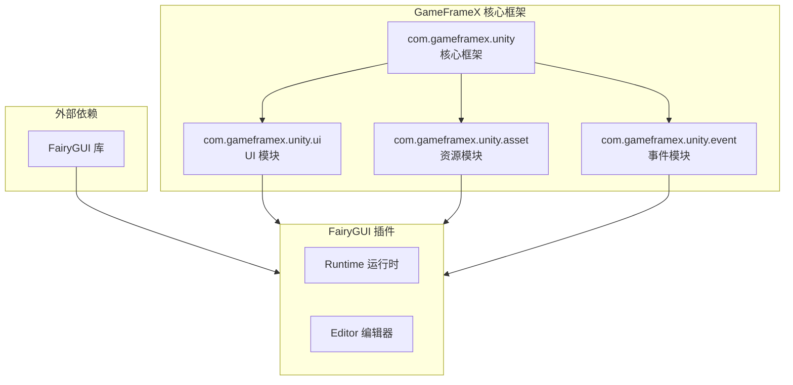
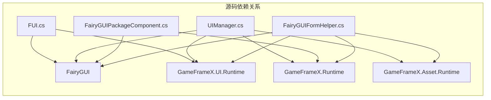

# 依赖配置

本文档介绍 GameFrameX UI FairyGUI 组件的依赖配置要求，包括必需的核心框架依赖和外部库依赖。

## 概述

GameFrameX UI FairyGUI 组件是一个基于 FairyGUI 的 Unity UI 功能包，它依赖于 GameFrameX 核心框架和 FairyGUI 第三方库。正确配置这些依赖是确保插件正常工作的前提条件。

## 依赖架构



## 核心依赖

### GameFrameX 框架依赖

| 依赖包 | 最低版本 | 说明 |
|--------|----------|------|
| com.gameframex.unity | 1.1.1 | GameFrameX 核心框架，提供基础架构和组件系统 |
| com.gameframex.unity.ui | 1.0.0 | UI 基础模块，定义 UIForm、UIComponent 等核心类 |
| com.gameframex.unity.asset | 1.0.6 | 资源管理模块，负责资源加载和卸载 |
| com.gameframex.unity.event | 1.0.0 | 事件系统模块，提供事件订阅和发布功能 |

### package.json 中的依赖配置

```json
{
  "dependencies": {
    "com.gameframex.unity": "1.1.1",
    "com.gameframex.unity.ui": "1.0.0",
    "com.gameframex.unity.asset": "1.0.6",
    "com.gameframex.unity.event": "1.0.0"
  }
}
```
> Source: [package.json](https://github.com/GameFrameX/com.gameframex.unity.ui.fairygui/blob/main/package.json#L21-L26)

## 外部依赖

### FairyGUI 库

FairyGUI 是插件的核心依赖，提供了完整的 UI 框架功能。

| 组件 | 说明 |
|------|------|
| FairyGUI.Runtime | FairyGUI 运行时库，提供 GObject、GComponent、UIPackage 等核心类 |
| FairyGUI.Editor | FairyGUI 编辑器扩展，用于在 Unity Editor 中编辑 UI |

**获取方式：**
- 从 [FairyGUI 官网](https://www.fairygui.com/) 下载官方 Unity 集成包
- 通过 Unity Package Manager 导入 FairyGUI

### FairyGUI 与 GameFrameX 的集成

FairyGUI 插件通过以下命名空间集成到 GameFrameX 框架中：

```csharp
using FairyGUI;                           // FairyGUI 核心库
using GameFrameX.Runtime;                 // GameFrameX 核心运行时
using GameFrameX.Asset.Runtime;           // 资源管理
using GameFrameX.UI.Runtime;              // UI 基础模块
using GameFrameX.UI.FairyGUI.Runtime;     // FairyGUI 插件运行时
```
> Source: [FairyGUIPackageComponent.cs](https://github.com/GameFrameX/com.gameframex.unity.ui.fairygui/blob/main/Runtime/FairyGUIPackageComponent.cs#L30-L35)

## 系统要求

### Unity 版本要求

| 要求 | 规格 |
|------|------|
| 最低版本 | Unity 2019.4 |
| 推荐版本 | Unity 2021.3 LTS 或更高 |

### 依赖关系详解



### 核心类依赖对照表

| 插件类 | 依赖的 GameFrameX 类 | 依赖的 FairyGUI 类 |
|--------|---------------------|-------------------|
| FUI | UIForm | GObject |
| UIManager | BaseUIManager | UIPackage |
| FairyGUIPackageComponent | GameFrameworkComponent | UIPackage |
| FairyGUIFormHelper | UIFormHelperBase | GComponent |
| GObjectHelper | - | GObject, FUI |

## Unity 项目配置

### 1. 安装 GameFrameX 核心框架

在 Unity 项目中安装 GameFrameX 核心框架及其依赖：

```json
// manifest.json 示例
{
  "dependencies": {
    "com.gameframex.unity": "1.1.1",
    "com.gameframex.unity.ui": "1.0.0",
    "com.gameframex.unity.asset": "1.0.6",
    "com.gameframex.unity.event": "1.0.0"
  }
}
```

### 2. 安装 FairyGUI

从 FairyGUI 官网下载并导入 Unity 包，确保包含：
- Runtime 目录（核心运行时）
- Editor 目录（编辑器扩展）

### 3. 安装 FairyGUI 插件

将 GameFrameX UI FairyGUI 组件添加到项目中：

```json
{
  "dependencies": {
    "com.gameframex.unity.ui.fairygui": "https://github.com/gameframex/com.gameframex.unity.ui.fairygui.git"
  }
}
```

> 详细安装步骤请参阅 [安装方式](./2-installation.1-install-methods) 文档。

## 依赖验证

安装完成后，以下类应该可以正常访问：

```csharp
// GameFrameX 核心类
using GameFrameX.Runtime;
using GameFrameX.Asset.Runtime;
using GameFrameX.UI.Runtime;

// FairyGUI 类
using FairyGUI;

// FairyGUI 插件类
using GameFrameX.UI.FairyGUI.Runtime;
```

## 版本兼容性

| 插件版本 | Unity 版本 | GameFrameX 版本 | FairyGUI 版本 |
|----------|-----------|-----------------|---------------|
| 3.2.x | 2019.4+ | 1.1.x | 官方最新版本 |
| 3.1.x | 2019.4+ | 1.0.x | 官方最新版本 |

## 常见问题

### Q1: 安装后出现命名空间找不到错误

**解决方案：** 确保已正确安装所有 GameFrameX 依赖包。检查 manifest.json 中是否包含所有必需的依赖。

### Q2: FairyGUI 类提示找不到

**解决方案：** 确保已安装 FairyGUI 官方包，并且 FairyGUI.dll 已正确放置在项目中。

### Q3: 版本不兼容警告

**解决方案：** 检查 Unity 版本是否满足最低要求（2019.4），并确保所有 GameFrameX 依赖包版本符合要求。

## 相关链接

- [安装方式](./2-installation.1-install-methods) - 详细安装步骤
- [插件介绍](./1-overview.1-introduction) - 插件功能概述
- [系统要求](./1-overview.3-requirements) - 系统要求详情
- [GitHub 仓库](https://github.com/GameFrameX/com.gameframex.unity.ui.fairygui.git) - 官方仓库
- [官方文档](https://gameframex.doc.alianblank.com/) - GameFrameX 文档中心
