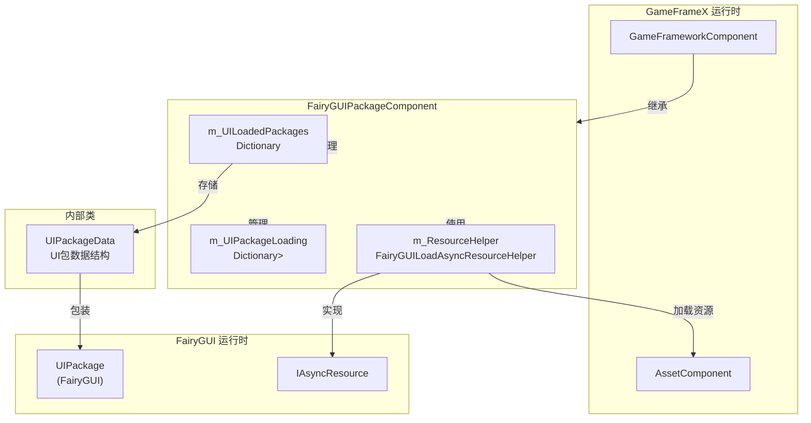

# FairyGUIPackageComponent 类

FairyGUIPackageComponent 是 FairyGUI 插件的核心组件之一，负责管理所有 UI 包的加载、缓存和卸载。该组件继承自 GameFrameworkComponent，作为 Unity 组件挂载到场景中，提供同步和异步两种方式加载 UI 资源包。

## 概述

FairyGUIPackageComponent 是 GameFrameX 插件中 FairyGUI UI 系统的包管理器组件。在 FairyGUI 框架中，UI 资源以包（Package）的形式组织和管理，每个包包含界面所需的描述文件（.bytes）和资源文件（图片、字体、动画等）。该组件提供了一套完整的包管理机制，包括：

- **包的加载**：支持同步和异步两种加载方式
- **包的缓存**：已加载的包会被缓存，避免重复加载
- **包的卸载**：支持单个包或所有包的卸载
- **资源管理**：通过 FairyGUILoadAsyncResourceHelper 实现与 YooAsset 资源系统的集成

> 注意：FairyGUIPackageComponent 需要与 UIManager 配合使用，通常由 UIManager 自动调用包管理功能。在大多数情况下，开发者不需要直接操作此组件。

## 架构



### 组件关系说明

- **GameFrameworkComponent**：基类，提供组件注册和生命周期管理
- **AssetComponent**：GameFrameX 资源管理组件，用于异步加载资源
- **FairyGUILoadAsyncResourceHelper**：实现 FairyGUI 的 IAsyncResource 接口，负责实际的资源加载
- **UIPackageData**：内部数据结构，存储包的描述文件路径、资源加载标志和包实例

## 核心功能

### 包的加载机制

FairyGUIPackageComponent 提供了两种加载 UI 包的方式：

1. **异步加载 (AddPackageAsync)**：适用于运行时动态加载，不会阻塞主线程
2. **同步加载 (AddPackageSync)**：适用于关卡开始时预加载已知需要的包

组件内部维护了两个字典来管理包的状态：
- `m_UILoadedPackages`：已成功加载的包，键为描述文件路径
- `m_UIPackageLoading`：正在加载中的包，用于防止重复请求

### 防重复加载机制

当多个界面需要加载同一个包时，组件会自动处理并发请求：

```csharp
// 如果包正在加载中，返回已有的 Task，避免重复加载
if (m_UIPackageLoading.TryGetValue(descFilePath, out var tcsLoading))
{
    return tcsLoading.Task;
}

// 如果包已加载，直接返回已加载的实例
if (!m_UILoadedPackages.TryGetValue(descFilePath, out var packageData))
{
    // ... 执行加载
}

return Task.FromResult(packageData.Package);
```

### 资源生命周期管理

组件在 Awake 时初始化异步资源加载辅助器，并将其注册到 FairyGUI 系统：

```csharp
protected override void Awake()
{
    IsAutoRegister = false;
    base.Awake();
    m_ResourceHelper = new FairyGUILoadAsyncResourceHelper();
    UIPackage.SetAsyncLoadResource(m_ResourceHelper);
}
```

## 公共 API

### AddPackageAsync

```csharp
public Task<UIPackage> AddPackageAsync(string descFilePath, bool isLoadAsset = true)
```

异步添加 UI 包。

**参数：**
- `descFilePath` (string)：UI 包描述文件路径（.bytes 文件的路径）
- `isLoadAsset` (bool)：是否同时加载资源，默认为 true。如果为 false，则只加载包定义，不加载图片等资源

**返回：**
- `Task<UIPackage>`：返回加载完成的 UIPackage 实例的异步任务

**使用示例：**
```csharp
var packageComponent = GameEntry.GetComponent<FairyGUIPackageComponent>();
var package = await packageComponent.AddPackageAsync("UI/Packages/MainMenu");
```
> Source: [FairyGUIPackageComponent.cs](https://github.com/GameFrameX/com.gameframex.unity.ui.fairygui/blob/main/Runtime/FairyGUIPackageComponent.cs#L148-L179)

---

### AddPackageSync

```csharp
public void AddPackageSync(string descFilePath, bool isLoadAsset = true)
```

同步添加 UI 包。

**参数：**
- `descFilePath` (string)：UI 包描述文件路径
- `isLoadAsset` (bool)：是否同时加载资源，默认为 true

**使用示例：**
```csharp
var packageComponent = GameEntry.GetComponent<FairyGUIPackageComponent>();
packageComponent.AddPackageSync("UI/Packages/MainMenu");
```
> Source: [FairyGUIPackageComponent.cs](https://github.com/GameFrameX/com.gameframex.unity.ui.fairygui/blob/main/Runtime/FairyGUIPackageComponent.cs#L190-L203)

---

### RemovePackage

```csharp
public void RemovePackage(string packageName)
```

移除指定名称的 UI 包，释放其占用的资源。

**参数：**
- `packageName` (string)：要移除的 UI 包名称（非路径）

**使用示例：**
```csharp
var packageComponent = GameEntry.GetComponent<FairyGUIPackageComponent>();
packageComponent.RemovePackage("MainMenu");
```
> Source: [FairyGUIPackageComponent.cs](https://github.com/GameFrameX/com.gameframex.unity.ui.fairygui/blob/main/Runtime/FairyGUIPackageComponent.cs#L213-L234)

---

### RemoveAllPackages

```csharp
public void RemoveAllPackages()
```

移除所有已加载的 UI 包，释放所有 FairyGUI 相关资源。

**使用示例：**
```csharp
var packageComponent = GameEntry.GetComponent<FairyGUIPackageComponent>();
packageComponent.RemoveAllPackages();
```
> Source: [FairyGUIPackageComponent.cs](https://github.com/GameFrameX/com.gameframex.unity.ui.fairygui/blob/main/Runtime/FairyGUIPackageComponent.cs#L243-L254)

---

### Has

```csharp
public bool Has(string uiPackageName)
```

检查指定名称的 UI 包是否已加载。

**参数：**
- `uiPackageName` (string)：UI 包名称

**返回：**
- `bool`：如果包已加载则返回 true，否则返回 false

**使用示例：**
```csharp
var packageComponent = GameEntry.GetComponent<FairyGUIPackageComponent>();
if (packageComponent.Has("MainMenu"))
{
    // 包已加载，可以直接使用
}
```
> Source: [FairyGUIPackageComponent.cs](https://github.com/GameFrameX/com.gameframex.unity.ui.fairygui/blob/main/Runtime/FairyGUIPackageComponent.cs#L265-L268)

---

### Get

```csharp
public UIPackage Get(string uiPackageName)
```

获取指定名称的 UI 包实例。

**参数：**
- `uiPackageName` (string)：UI 包名称

**返回：**
- `UIPackage`：如果找到则返回 UIPackage 实例，否则返回 default(null)

**使用示例：**
```csharp
var packageComponent = GameEntry.GetComponent<FairyGUIPackageComponent>();
var package = packageComponent.Get("MainMenu");
if (package != null)
{
    var window = package.CreateWindow<MainMenuWindow>();
}
```
> Source: [FairyGUIPackageComponent.cs](https://github.com/GameFrameX/com.gameframex.unity.ui.fairygui/blob/main/Runtime/FairyGUIPackageComponent.cs#L279-L290)

---

## UIPackageData 内部类

表示 UI 包的数据结构，包含包的元信息和实例。

### 属性

| 属性 | 类型 | 描述 |
|------|------|------|
| DescFilePath | string | 获取描述文件路径 |
| IsLoadAsset | bool | 获取是否加载资源 |
| Package | UIPackage | 获取 UI 包实例 |
| Name | string | 获取 UI 包的名称 |

### 构造函数

```csharp
public UIPackageData(string descFilePath, string name, bool isLoadAsset)
```

**参数：**
- `descFilePath` (string)：描述文件路径
- `name` (string)：UI 包名称
- `isLoadAsset` (bool)：是否加载资源

> Source: [FairyGUIPackageComponent.cs](https://github.com/GameFrameX/com.gameframex.unity.ui.fairygui/blob/main/Runtime/FairyGUIPackageComponent.cs#L64-L136)

## 配置指南

### 组件添加

在 Unity 场景中添加 FairyGUIPackageComponent 组件：

1. 在 Hierarchy 面板中选择需要添加组件的 GameObject
2. 点击 Inspector 面板中的 "Add Component" 按钮
3. 搜索 "GameFrameX/FairyGUIPackage" 并选择
4. 组件将自动添加到 GameObject 上

### 组件检查器

FairyGUIPackageComponent 组件在 Inspector 中的显示较为简洁，因为它主要通过代码进行包管理。编辑器检查器由 `UIFairyGUIPackageComponentInspector` 类定义，继承自 `GameFrameworkInspector`。

> 注意：确保场景中存在 FairyGUIPackageComponent 组件，否则 UIManager 将无法正常工作。

### 依赖配置

FairyGUIPackageComponent 依赖以下组件和系统：

- **GameFrameworkComponent**：基类组件
- **AssetComponent**：资源管理组件（来自 GameFrameX.Core）
- **YooAsset**：资源加载后端
- **FairyGUI**：UI 框架

确保这些依赖已正确配置后再使用本组件。

## 常见问题

### Q1: 为什么要使用 AddPackageAsync 而不是 AddPackageSync？

AddPackageAsync 是异步加载，不会阻塞主线程，适合在游戏运行时动态加载界面资源。AddPackageSync 是同步加载，会阻塞主线程，适合在游戏启动或关卡加载时预加载资源。根据场景需求选择合适的加载方式。

### Q2: 包加载失败怎么办？

首先检查描述文件路径是否正确，确保 .bytes 文件已正确放置在 Resources 或 YooAsset 资源系统中。其次检查 FairyGUILoadAsyncResourceHelper 是否正确初始化。

### Q3: 如何知道包是否加载成功？

可以通过 Has 方法检查包是否存在，或在 AddPackageAsync 中使用 try-catch 捕获异常。

## 相关链接

- [FUI 类](./5-api-reference.1-fui-class)
- [FairyGUIFormHelper 类](./5-api-reference.3-form-helper)
- [GObjectHelper 工具类](./5-api-reference.4-gobject-helper)
- [界面管理器](./4-core-concepts.2-ui-manager)
- [包管理器](./4-core-concepts.3-package-manager)
- [安装指南](./2-installation.1-install-methods)
