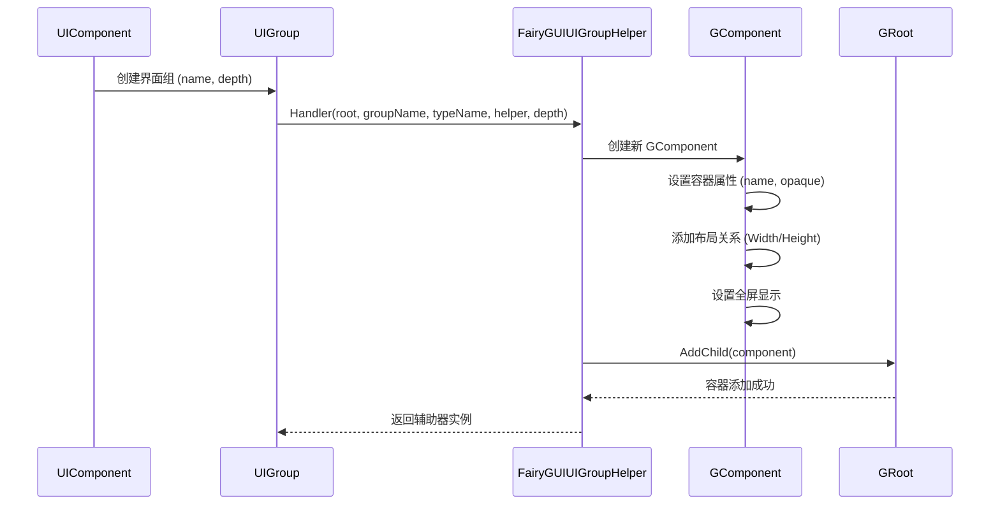
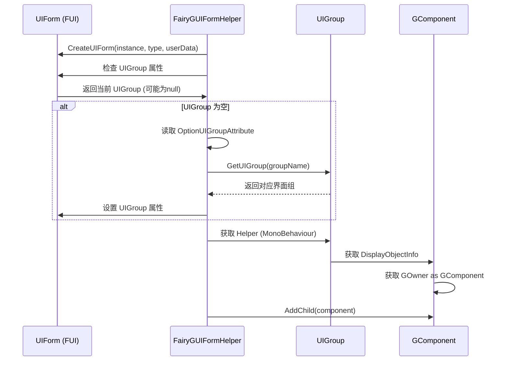

# 界面组配置

界面组（UI Group）是 GameFrameX 框架中用于管理 UI 界面层级和显示顺序的核心机制。FairyGUI 插件提供了 `FairyGUIUIGroupHelper` 类来实现符合 FairyGUI 渲染特性的界面组功能。

## 概述

界面组配置主要用于：

- **层级管理**：控制不同类型界面的显示层级（如弹窗、对话框、主界面等）
- **深度控制**：通过设置 Z 轴位置来决定界面的前后顺序
- **容器组织**：将相关界面组织在同一个容器中，便于管理和控制

在 FairyGUI 集成中，界面组通过 GComponent 容器实现，每个组对应一个独立的容器，界面作为子元素添加到对应的组容器中。

## 架构

```mermaid
flowchart TD
    subgraph GameFrameX_UI["GameFrameX UI 系统"]
        UIComponent[UIComponent<br/>UI组件]
        UIGroup[UIGroup<br/>界面组]
        UIForm[UIForm<br/>界面]
    end

    subgraph FairyGUI_Integration["FairyGUI 集成"]
        FairyGUIUIGroupHelper["FairyGUIUIGroupHelper<br/>界面组辅助器"]
        FairyGUIFormHelper["FairyGUIFormHelper<br/>界面辅助器"]
        FairyGUIPackageComponent["FairyGUIPackageComponent<br/>包管理组件"]
    end

    subgraph FairyGUI_Runtime["FairyGUI 运行时"]
        GRoot[GRoot<br/>根容器"]
        GComponent["GComponent<br/>容器组件"]
    end

    UIComponent -->|创建/获取| UIGroup
    UIGroup -->|使用| FairyGUIUIGroupHelper
    FairyGUIUIGroupHelper -->|创建容器| GComponent
    GComponent -->|添加到| GRoot
    FairyGUIFormHelper -->|添加界面到组| UIGroup
    UIForm -->|属于| UIGroup
```

**架构说明：**

1. **UIComponent**：GameFrameX 核心组件，负责管理所有界面组和界面实例
2. **UIGroup**：界面组抽象，持有对 `IUIGroupHelper` 的引用
3. **FairyGUIUIGroupHelper**： FairyGUI 特定的界面组辅助器实现，负责创建 GComponent 容器并管理深度
4. **FairyGUIFormHelper**：界面辅助器，负责将界面实例添加到对应的界面组容器中
5. **GRoot**： FairyGUI 的根容器，所有界面组容器都添加到此处

## 核心机制

### 界面组创建流程



### 界面分配到组



## 配置选项

### FairyGUIUIGroupHelper 属性

| 属性 | 类型 | 描述 |
|------|------|------|
| `Depth` | int | 获取或设置界面组深度，用于控制 Z 轴顺序 |

### FairyGUIUIGroupHelper 方法

#### `SetDepth(int depth)`

设置界面组深度。该方法通过修改 transform.localPosition 的 Z 坐标来实现深度控制。

```csharp
csharp
public override void SetDepth(int depth)
{
    Depth = depth;
    transform.localPosition = new Vector3(0, 0, depth * 100);
}
```

> Source: [FairyGUIUIGroupHelper.cs](https://github.com/GameFrameX/com.gameframex.unity.ui.fairygui/blob/main/Runtime/FairyGUIUIGroupHelper.cs#L63-L67)

**参数：**
- `depth` (int): 界面组深度值，数值越大越靠前显示

#### `Handler(Transform root, string groupName, string uiGroupHelperTypeName, IUIGroupHelper customUIGroupHelper, int depth = 0)`

创建界面组处理器。

```csharp
csharp
public override IUIGroupHelper Handler(Transform root, string groupName, string uiGroupHelperTypeName, IUIGroupHelper customUIGroupHelper, int depth = 0)
{
    SetDepth(depth);
    GComponent component = new GComponent();
    GRoot.inst.AddChild(component);
    var comName = groupName;
    component.displayObject.name = comName;
    component.gameObjectName = comName;
    component.name = comName;
    component.opaque = false;
    component.AddRelation(GRoot.inst, RelationType.Width);
    component.AddRelation(GRoot.inst, RelationType.Height);
    component.MakeFullScreen();
    return GameFrameX.Runtime.Helper.CreateHelper(component.displayObject.gameObject, uiGroupHelperTypeName, (UIGroupHelperBase)customUIGroupHelper, 0);
}
```

> Source: [FairyGUIUIGroupHelper.cs](https://github.com/GameFrameX/com.gameframex.unity.ui.fairygui/blob/main/Runtime/FairyGUIUIGroupHelper.cs#L82-L96)

**参数：**
- `root` (Transform): 根节点
- `groupName` (string): 界面组名称
- `uiGroupHelperTypeName` (string): 界面组辅助器类型名称
- `customUIGroupHelper` (IUIGroupHelper): 自定义的界面组辅助器
- `depth` (int): 界面组深度，默认为 0

**返回值：** 创建的界面组辅助器实例

## 使用方式

### 声明界面所属组

通过 `OptionUIGroupAttribute` 属性标记，将界面分配到指定的界面组：

```csharp
csharp
using GameFrameX.UI.Runtime;

[OptionUIGroup("Dialog")]
public class MyDialogForm : FUI
{
    // 界面实现
}
```

> Source: [FairyGUIFormHelper.cs](https://github.com/GameFrameX/com.gameframex.unity.ui.fairygui/blob/main/Runtime/FairyGUIFormHelper.cs#L108-L114)

**说明：**
- 界面组名称在 GameFrameX 核心框架的 UIComponent 中配置
- FairyGUIUIGroupHelper 会自动创建对应名称的 GComponent 容器
- 深度值决定了界面的显示顺序，数值越大越靠前

### 配置界面组深度

界面组的深度通常在游戏框架初始化时配置：

```csharp
csharp
// 在 UIComponent 配置中设置界面组深度
// 不同界面组可以使用不同的深度值来实现层级分离
// 例如: Background=0, Normal=10, Dialog=20, Toast=30
```

## 常见场景

### 场景 1：弹窗界面组

将所有弹窗类界面放在独立的界面组中，确保弹窗始终显示在普通界面之上：

```csharp
csharp
[OptionUIGroup("Dialog")]
public class ConfirmDialog : FUI { }

[OptionUIGroup("Dialog")]
public class AlertDialog : FUI { }
```

### 场景 2：Toast 提示组

将临时提示信息放在最高层级：

```csharp
csharp
[OptionUIGroup("Toast")]
public class ToastForm : FUI { }
```

### 场景 3：背景界面组

将背景界面放在最低层级：

```csharp
csharp
[OptionUIGroup("Background")]
public class MainBackground : FUI { }
```

## 相关链接

- [FUI 界面基类](../4-core-concepts.1-fui-base-class)
- [界面管理器](../4-core-concepts.2-ui-manager)
- [界面辅助器](../4-core-concepts.4-form-helper)
- [包管理器](../4-core-concepts.3-package-manager)
- [编辑器配置](./6-configuration.1-editor-config)
- [API 参考 - FairyGUIUIGroupHelper 类](./5-api-reference.3-form-helper)
