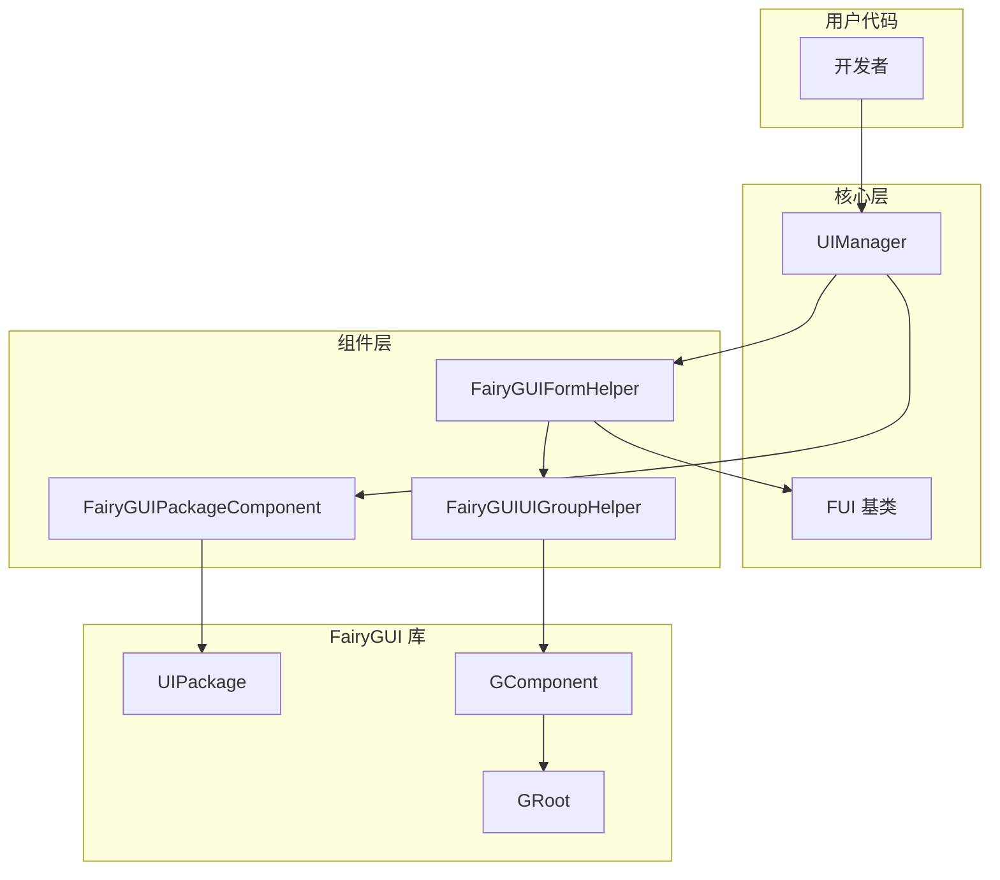

# 常见问题解答

本文档收集了使用 GameFrameX Unity UI FairyGUI 插件过程中常见的问题及其解决方案。

## 概述

GameFrameX Unity UI FairyGUI 插件为 Unity 游戏提供了 FairyGUI UI 组件的集成封装。在使用过程中，开发者可能会遇到界面加载失败、组件未找到、资源路径错误等问题。本文档旨在帮助开发者快速定位和解决这些常见问题。

## 安装与配置问题

### Q1: 如何正确安装 FairyGUI 插件？

**问题描述**：在 Unity 项目中安装插件后，出现编译错误或功能异常。

**解决方案**：
1. 确保已安装所有依赖项：
   - `com.gameframex.unity` (1.1.1+)
   - `com.gameframex.unity.ui` (1.0.0+)
   - `com.gameframex.unity.asset` (1.0.6+)
   - `com.gameframex.unity.event` (1.0.0+)

2. 安装方式（任选其一）：
   - 在 `manifest.json` 中添加：
     ```json
     {"com.gameframex.unity.ui.fairygui": "https://github.com/GameFrameX/com.gameframex.unity.ui.fairygui.git"}
     ```
   - 在 Unity 的 Package Manager 中使用 Git URL 添加：`https://github.com/gameframex/com.gameframex.unity.ui.fairygui.git`
   - 直接下载仓库放置到 Unity 项目的 `Packages` 目录下

3. Unity 版本要求：2019.4 或更高版本

> 详细信息请参阅 [安装方式](./2-installation.1-install-methods)

---

### Q2: FairyGUIPackageComponent 组件未找到？

**问题描述**：运行时提示 `FairyGuiPackage is invalid` 或类似错误。

**解决方案**：
1. 确保场景中存在 FairyGUIPackageComponent 组件
2. 该组件必须挂载在 GameObject 上
3. 检查组件是否正确初始化

> 详细信息请参阅 [包管理器](./4-core-concepts.3-package-manager)

---

## 界面加载问题

### Q3: 界面打开失败，提示 "Load UI form failure"？

**问题描述**：调用界面打开方法时失败，错误信息包含 "Load UI form failure"。

**可能原因**：
1. 资源路径不正确
2. FairyGUI 包未正确加载
3. 资源文件不存在

**解决方案**：
1. 确认资源路径格式正确
2. 确保 FairyGUI 包（.bin 文件）已放置在正确目录
3. 检查 UI 资源是否已打包

> 详细信息请参阅 [打开和关闭界面](./3-getting-started.2-open-close-ui)

---

### Q4: UI 包加载失败？

**问题描述**：提示 UI 包加载失败或包名为空。

**可能原因**：
1. 包路径格式不正确
2. 包名与资源名不一致

**解决方案**：
1. 资源路径格式：`{包名}/{资源名}` 或 `{包名}`
2. 确保包名与 FairyGUI 编辑器中发布的包名一致
3. 检查资源是否在正确的目录下（Resources 或 Bundles）

---

### Q5: 异步加载界面时界面空白？

**问题描述**：使用异步方式打开界面，界面显示但内容为空。

**可能原因**：
1. 包加载时机过早
2. 资源尚未完全加载完成

**解决方案**：
1. 确保使用 `await` 等待包加载完成
2. 检查 `isLoadAsset` 参数是否正确设置

```csharp
// 正确示例
var package = await FairyGuiPackage.AddPackageAsync("uipackage");
var ui = UIPackage.CreateObject("uipackage", "MainForm");
```

> 详细信息请参阅 [FairyGUIPackageComponent](./5-api-reference.2-package-component)

---

## 界面组件问题

### Q6: 提示 "UI form instance is invalid"？

**问题描述**：界面实例化失败，提示 "UI form instance is invalid"。

**可能原因**：
1. 界面类型未继承 FUI 基类
2. FairyGUIFormHelper 未正确配置

**解决方案**：
1. 确保界面类继承自 FUI：
   ```csharp
   public class MainForm : FUI
   {
       // 界面逻辑
   }
   ```
2. 确保 FairyGUIFormHelper 已添加到场景

> 详细信息请参阅 [FUI 界面基类](./4-core-concepts.1-fui-base-class)

---

### Q7: 提示 "UI group is invalid"？

**问题描述**：界面无法添加到界面组，提示 "UI group is invalid"。

**可能原因**：
1. 界面组未正确创建
2. 界面组名称不匹配

**解决方案**：
1. 在 UI 配置中正确配置界面组
2. 使用 `[OptionUIGroup]` 属性指定界面组：
   ```csharp
   [OptionUIGroup("MainUI")]
   public class MainForm : FUI
   {
   }
   ```

> 详细信息请参阅 [界面组配置](./6-configuration.2-ui-group-config)

---

### Q8: 提示 "Display object info is invalid"？

**问题描述**：界面显示对象信息无效。

**可能原因**：
1. 界面组辅助器未正确初始化
2. GComponent 未正确添加到 GRoot

**解决方案**：
1. 确保 FairyGUIUIGroupHelper 正确创建
2. 检查 GRoot 是否已初始化

> 详细信息请参阅 [界面组辅助器](./4-core-concepts.5-ui-group-helper)

---

## 资源加载问题

### Q9: 资源加载失败，提示 "Unknown file type"？

**问题描述**：加载资源时提示未知文件类型。

**可能原因**：
1. 资源类型不在支持列表中
2. 文件扩展名不正确

**解决方案**：
FairyGUIPackageComponent 支持以下资源类型：
- `.bytes` - 二进制资源
- `.atlas` - 图集资源
- `.png` / `.jpg` - 图片资源
- Spine 动画资源
- DragonBones 动画资源

请确保资源文件扩展名正确，且已添加到 FairyGUI 包中。

> 详细信息请参阅 [FairyGUIPackageComponent](./5-api-reference.2-package-component)

---

### Q10: YooAsset 资源卸载失败？

**问题描述**：界面关闭后资源未正确释放。

**可能原因**：
1. EnableAutoReleaseUIForm 未启用
2. 资源句柄未正确传递

**解决方案**：
1. 确保 UIComponent 的 EnableAutoReleaseUIForm 设置为 true
2. 检查资源路径是否包含 "Bundles" 目录标识

```csharp
// 资源路径格式示例
string uiFormAssetPath = "Bundles/UI/MainForm";  // YooAsset 资源
// 或
string uiFormAssetPath = "Resources/UI/MainForm";  // Resources 资源
```

---

## 路径查找问题

### Q11: 提示 "Invalid UI path"？

**问题描述**：使用路径查找界面组件时失败。

**可能原因**：
1. 路径格式不正确
2. 组件名称不存在
3. 索引超出范围

**解决方案**：
1. 使用正确的路径格式：`"父组件/子组件"` 或 `"组件名[index]"`
2. 确保组件名称存在
3. 检查索引值是否在有效范围内

```csharp
// 正确示例
var button = UIForm.GObject.GetChild("Btn_Confirm");
var dialog = UIForm.GObject.asCom.GetChildAt(0);

// 路径查找
var deepChild = FairyGUIPathFinderHelper.GetChild(UIForm.GObject, "Panel/Content/Button");
```

> 详细信息请参阅 [GObjectHelper 工具类](./5-api-reference.4-gobject-helper)

---

## 组件初始化问题

### Q12: Asset Component 或 UI Component 未找到？

**问题描述**：运行时提示 "Asset component is invalid" 或 "UI component is invalid"。

**解决方案**：
1. 确保 GameEntry 已正确初始化
2. 确保以下组件已添加到 GameEntry：
   - AssetComponent
   - UIComponent
   - FairyGUIPackageComponent

> 详细信息请参阅 [编辑器配置](./6-configuration.1-editor-config)

---

## 架构图



## 常见错误码表

| 错误信息 | 可能原因 | 解决方案 |
|---------|---------|---------|
| UI form instance is invalid | 界面类型未继承 FUI | 确保界面类继承自 FUI |
| UI group is invalid | 界面组未配置 | 配置界面组或使用属性 |
| Display object info is invalid | 界面组辅助器未初始化 | 检查 FairyGUIUIGroupHelper |
| Asset component is invalid | AssetComponent 未注册 | 确保 GameEntry 初始化 |
| UI component is invalid | UIComponent 未注册 | 确保 GameEntry 初始化 |
| Load UI form failure | 资源路径错误 | 检查资源路径和包名 |
| Invalid UI path | 路径格式错误 | 使用正确的路径格式 |

## 相关链接

- [插件介绍](./1-overview.1-introduction)
- [功能特性](./1-overview.2-features)
- [系统要求](./1-overview.3-requirements)
- [安装方式](./2-installation.1-install-methods)
- [依赖配置](./2-installation.2-dependencies)
- [创建第一个界面](./3-getting-started.1-first-ui-form)
- [打开和关闭界面](./3-getting-started.2-open-close-ui)
- [FUI 界面基类](./4-core-concepts.1-fui-base-class)
- [界面管理器](./4-core-concepts.2-ui-manager)
- [包管理器](./4-core-concepts.3-package-manager)
- [界面辅助器](./4-core-concepts.4-form-helper)
- [界面组辅助器](./4-core-concepts.5-ui-group-helper)
- [FUI 类 API](./5-api-reference.1-fui-class)
- [FairyGUIPackageComponent API](./5-api-reference.2-package-component)
- [FairyGUIFormHelper API](./5-api-reference.3-form-helper)
- [GObjectHelper API](./5-api-reference.4-gobject-helper)
- [编辑器配置](./6-configuration.1-editor-config)
- [界面组配置](./6-configuration.2-ui-group-config)
