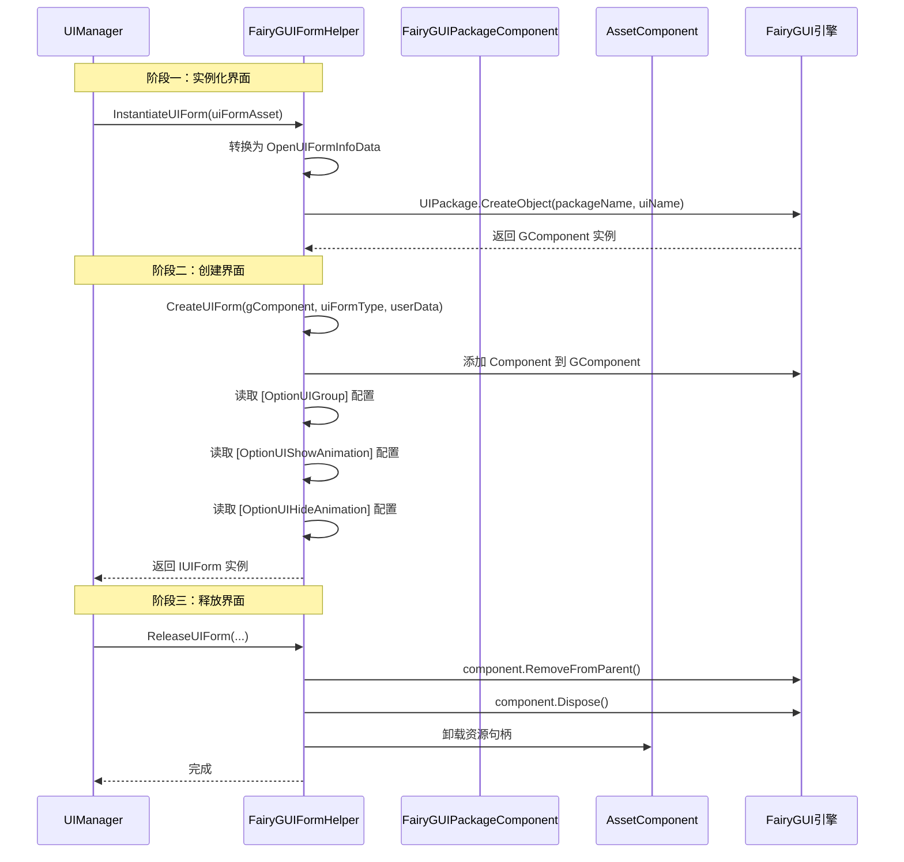

# FairyGUIFormHelper 类

FairyGUIFormHelper 是 GameFrameX 插件中负责 FairyGUI 界面实例化、创建和释放的核心辅助类，继承自 `UIFormHelperBase`，是 UI 系统与 FairyGUI 渲染引擎之间的桥梁。

## 概述

FairyGUIFormHelper 实现了 UI 界面的完整生命周期管理，包括：

- **实例化 (Instantiate)**: 通过 FairyGUI 的 UIPackage.CreateObject 方法创建界面对象
- **创建 (Create)**: 将界面对象与逻辑类绑定，并处理界面组、动画等配置
- **释放 (Release)**: 正确销毁界面对象并释放相关资源

该类在 UI 管理系统中扮演着关键角色，负责将抽象的界面资源转换为可交互的界面实例。

> 注意：UIFormHelperBase 是 GameFrameX.Runtime 程序集中的抽象基类，定义了界面辅助器的标准接口。

## 架构

FairyGUIFormHelper 在整个 UI 系统中的位置和依赖关系如下：

```mermaid
flowchart TD
    subgraph GameFrameX_Runtime["GameFrameX.Runtime 程序集"]
        UIFormHelperBase["UIFormHelperBase<br/>(抽象基类)"]
        AssetComponent["AssetComponent<br/>(资源组件)"]
        UIComponent["UIComponent<br/>(UI组件)"]
        IUIForm["IUIForm<br/>(界面接口)"]
    end

    subgraph FairyGUI_Plugin["FairyGUI 插件"]
        FairyGUIFormHelper["FairyGUIFormHelper<br/>(当前类)"]
        FairyGUIPackageComponent["FairyGUIPackageComponent<br/>(包管理)"]
        FairyGUIUIGroupHelper["FairyGUIUIGroupHelper<br/>(界面组辅助器)"]
        GObjectHelper["GObjectHelper<br/>(对象辅助器)"]
    end

    subgraph FairyGUI_Engine["FairyGUI 引擎"]
        UIPackage["UIPackage"]
        GComponent["GComponent"]
        GRoot["GRoot"]
    end

    UIFormHelperBase <|-- FairyGUIFormHelper
    AssetComponent <-.-> FairyGUIFormHelper
    UIComponent <-.-> FairyGUIFormHelper
    IUIForm <-- FairyGUIFormHelper
    
    FairyGUIPackageComponent --> UIPackage
    FairyGUIUIGroupHelper --> GComponent
    GObjectHelper -.-> GComponent
    
    FairyGUIFormHelper --> FairyGUIPackageComponent
    FairyGUIFormHelper --> FairyGUIUIGroupHelper
```

### 组件职责

| 组件 | 职责 |
|------|------|
| `UIFormHelperBase` | 定义界面辅助器的抽象接口，声明实例化、创建、释放方法 |
| `AssetComponent` | 管理资源加载和卸载，处理 YooAsset 资源句柄 |
| `UIComponent` | 核心 UI 组件，提供界面组管理、动画配置等全局设置 |
| `FairyGUIPackageComponent` | 管理 FairyGUI 包加载，维护已加载包的缓存 |
| `FairyGUIUIGroupHelper` | 处理界面组的深度管理和显示层级 |

## 核心流程

### 界面创建到释放的完整流程：



### CreateUIForm 详细流程

```mermaid
flowchart TD
    Start([开始创建]) --> Check{GComponent 有效?}
    Check -->|否| Error1[记录错误日志]
    Check -->|是| AddComponent[添加逻辑组件]
    
    AddComponent --> GetType[获取界面类型]
    GetType --> CallOnAwake{需要唤醒?}
    CallOnAwake -->|是| OnAwake[调用 OnAwake()]
    CallOnAwake -->|否| CheckGroup{有 UIGroup?}
    
    OnAwake --> CheckGroup
    CheckGroup -->|否| CheckAttr{有 OptionUIGroup 特性?}
    CheckGroup -->|是| AddToGroup[添加到界面组]
    
    CheckAttr -->|是| GetGroup[获取界面组]
    CheckAttr -->|否| UseDefault[使用默认配置]
    
    GetGroup --> AddToGroup
    UseDefault --> AddToGroup
    
    AddToGroup --> CheckShowAnim{显示动画配置?}
    CheckShowAnim -->|特性| SetShowAnim1[从特性读取]
    CheckShowAnim -->|默认| SetShowAnim2[使用全局配置]
    CheckShowAnim -->|无| SkipShowAnim[跳过]
    
    SetShowAnim1 --> CheckHideAnim{隐藏动画配置?}
    SetShowAnim2 --> CheckHideAnim
    SkipShowAnim --> CheckHideAnim
    
    CheckHideAnim -->|特性| SetHideAnim1[从特性读取]
    CheckHideAnim -->|默认| SetHideAnim2[使用全局配置]
    CheckHideAnim -->|无| SkipHideAnim[跳过]
    
    SetHideAnim1 --> ValidateGroup{界面组有效?}
    SetHideAnim2 --> ValidateGroup
    SkipHideAnim --> ValidateGroup
    
    ValidateGroup -->|否| Error2[记录错误日志]
    ValidateGroup -->|是| Return[返回 IUIForm 实例]
    
    Error1 --> End([结束])
    Error2 --> End
    Return --> End
```

## 使用示例

### 基本用法

FairyGUIFormHelper 通常由 GameFrameX 框架自动使用，开发者无需直接调用。以下展示框架内部如何调用：

```csharp
// 框架内部调用示例（非开发者代码）
// 1. 实例化界面
var uiFormAsset = OpenUIFormInfoData.Create(serialId, packageName, uiName, uiFormType, pauseCoveredUIForm, userData);
var gComponent = fairyGUIFormHelper.InstantiateUIForm(uiFormAsset);

// 2. 创建界面（绑定逻辑）
var uiForm = fairyGUIFormHelper.CreateUIForm(gComponent, typeof(TestForm), userData);

// 3. 释放界面
fairyGUIFormHelper.ReleaseUIForm(uiFormAsset, gComponent, assetHandle, assetPath, assetName);
```

> Source: [FairyGUIFormHelper.cs](https://github.com/GameFrameX/com.gameframex.unity.ui.fairygui/blob/main/Runtime/FairyGUIFormHelper.cs#L63-L207)

### 配置界面属性

通过特性可以在界面类上配置界面组和动画：

```csharp
using GameFrameX.UI.Runtime;

// 配置界面所属组和显示/隐藏动画
[OptionUIGroup("MainUI")]
[OptionUIShowAnimation(true, "FadeIn")]
[OptionUIHideAnimation(true, "FadeOut")]
public class MainMenuForm : FUI
{
    protected override void OnAwake()
    {
        // 界面唤醒逻辑
    }
    
    protected override void OnOpen(object userData)
    {
        // 界面打开逻辑
    }
    
    protected override void OnClose()
    {
        // 界面关闭逻辑
    }
}
```

> Source: [FairyGUIFormHelper.cs](https://github.com/GameFrameX/com.gameframex.unity.ui.fairygui/blob/main/Runtime/FairyGUIFormHelper.cs#L106-L143)

## API 参考

### `InstantiateUIForm(object uiFormAsset): object`

实例化 UI 界面对象。

**描述:**
通过 FairyGUI 的 UIPackage.CreateObject 方法根据包名和界面名称创建界面实例。此方法只负责创建视觉对象，不处理逻辑绑定。

**参数:**
- `uiFormAsset` (object): 界面资源数据，必须是 OpenUIFormInfoData 类型

**返回:**
- (object): 实例化后的 GComponent 对象

**实现:**
```csharp
public override object InstantiateUIForm(object uiFormAsset)
{
    var openUIFormInfoData = (OpenUIFormInfoData)uiFormAsset;
    GameFrameworkGuard.NotNull(openUIFormInfoData, nameof(uiFormAsset));
    return UIPackage.CreateObject(openUIFormInfoData.PackageName, openUIFormInfoData.UIName);
}
```

> Source: [FairyGUIFormHelper.cs#L63-L69](https://github.com/GameFrameX/com.gameframex.unity.ui.fairygui/blob/main/Runtime/FairyGUIFormHelper.cs#L63-L69)

---

### `CreateUIForm(object uiFormInstance, Type uiFormType, object userData): IUIForm`

创建 UI 界面实例，将视觉对象与逻辑类型绑定。

**描述:**
1. 将 uiFormInstance (GComponent) 转换为 GComponent
2. 添加 uiFormType 类型的 Component 到 GameObject
3. 调用 IUIForm.OnAwake() 初始化界面
4. 处理界面组分配（支持 OptionUIGroupAttribute）
5. 处理显示动画配置（支持 OptionUIShowAnimationAttribute）
6. 处理隐藏动画配置（支持 OptionUIHideAnimationAttribute）
7. 将界面添加到对应的界面组容器中

**参数:**
- `uiFormInstance` (object): 界面实例对象，必须是 GComponent 类型
- `uiFormType` (Type): 界面逻辑类型
- `userData` (object): 用户自定义数据

**返回:**
- (IUIForm): 创建的界面实例，失败返回 null

**抛出:**
- Log.Error: 当 uiFormInstance 无效、uiFormType 未实现 IUIForm、或 uiGroup 无效时

> Source: [FairyGUIFormHelper.cs#L82-L161](https://github.com/GameFrameX/com.gameframex.unity.ui.fairygui/blob/main/Runtime/FairyGUIFormHelper.cs#L82-L161)

---

### `ReleaseUIForm(object uiFormAsset, object uiFormInstance, object assetHandle, string uiFormAssetPath, string uiFormAssetName): void`

释放 UI 界面及其资源。

**描述:**
当 EnableAutoReleaseUIForm 为 true 时执行释放操作：
1. 从父容器移除 GComponent
2. 调用 component.Remove() 和 component.Dispose() 销毁对象
3. 如果是 Bundles 资源，释放 YooAsset 资源句柄并卸载资源
4. 如果是 Resources 资源，销毁 Unity 对象并卸载资源

**参数:**
- `uiFormAsset` (object): 界面资源数据
- `uiFormInstance` (object): 界面实例对象
- `assetHandle` (object): 资源句柄
- `uiFormAssetPath` (string): 界面资源路径
- `uiFormAssetName` (string): 界面资源名称

**实现:**
```csharp
public override void ReleaseUIForm(object uiFormAsset, object uiFormInstance, object assetHandle, string uiFormAssetPath, string uiFormAssetName)
{
    if (!m_UIComponent.EnableAutoReleaseUIForm)
    {
        return;
    }

    if (uiFormInstance is GComponent component)
    {
        component.RemoveFromParent();
        component.Remove();
        component.Dispose();
    }

    if (uiFormAssetPath.IndexOf(Utility.Asset.Path.BundlesDirectoryName, StringComparison.OrdinalIgnoreCase) >= 0)
    {
        if (assetHandle is YooAsset.AssetHandle handle)
        {
            handle.Release();
        }
        m_AssetComponent.UnloadAsset(uiFormAssetPath);
    }
    else
    {
        if (!(uiFormInstance is GComponent) && uiFormInstance is UnityEngine.Object unityObject)
        {
            Destroy(unityObject);
            UnityEngine.Resources.UnloadAsset(unityObject);
        }
    }
}
```

> Source: [FairyGUIFormHelper.cs#L175-L207](https://github.com/GameFrameX/com.gameframex.unity.ui.fairygui/blob/main/Runtime/FairyGUIFormHelper.cs#L175-L207)

---

### `Awake(): void`

组件唤醒时初始化资源组件和 UI 组件引用。

**描述:**
在 Unity 组件 Awake 时被调用，初始化对 AssetComponent 和 UIComponent 的引用。这两个组件是 FairyGUIFormHelper 正常工作的必要依赖。

> Source: [FairyGUIFormHelper.cs#L216-L231](https://github.com/GameFrameX/com.gameframex.unity.ui.fairygui/blob/main/Runtime/FairyGUIFormHelper.cs#L216-L231)

## 相关链接

- [FUI 类](./5-api-reference.1-fui-class) — FairyGUI 界面基类
- [FairyGUIPackageComponent 类](./5-api-reference.2-package-component) — FairyGUI 包管理组件
- [FairyGUIUIGroupHelper 类](./5-api-reference.5-ui-group-helper) — 界面组辅助器
- [GObjectHelper 工具类](./5-api-reference.4-gobject-helper) — GObject 辅助工具
- [界面管理器](./4-core-concepts.2-ui-manager) — UI 系统管理器
- [界面辅助器](./4-core-concepts.4-form-helper) — 界面辅助器概念说明
