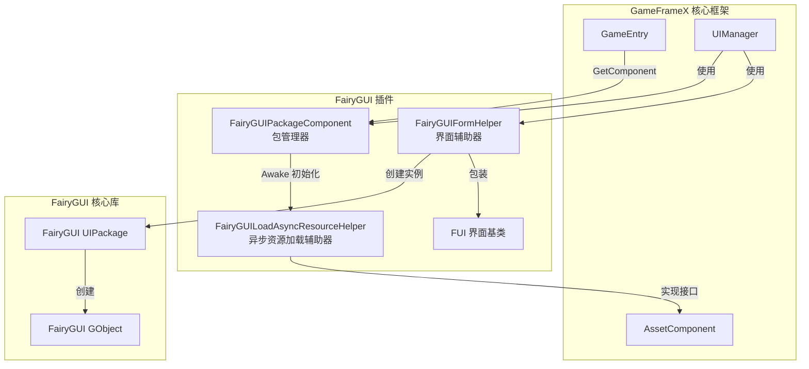
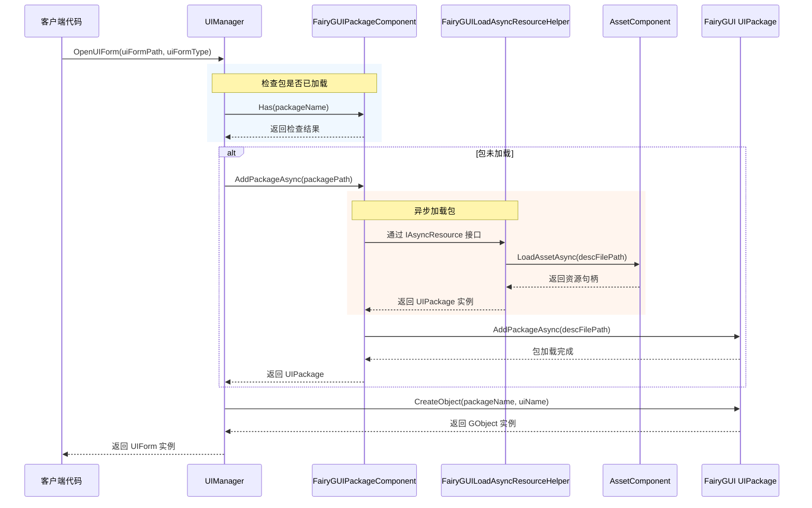

# 包管理器

包管理器是 FairyGUI 插件的核心组件，负责管理所有 UI 包的加载、缓存和卸载操作。它提供了同步和异步两种加载方式，并深度集成了 GameFrameX 的资源管理系统。

## 概述

`FairyGUIPackageComponent` 是继承自 `GameFrameworkComponent` 的 Unity 组件，充当 FairyGUI 与 GameFrameX 资源系统之间的桥梁。它的主要职责包括：

- **包加载管理**：支持同步和异步加载 UI 包
- **包缓存机制**：已加载的包会被缓存，避免重复加载
- **资源清理**：提供包的卸载功能，释放内存资源
- **异步资源加载**：通过实现 `IAsyncResource` 接口，支持 FairyGUI 的异步资源加载需求

### 核心职责

包管理器的设计目标是简化 UI 包的管理流程，让开发者专注于界面逻辑而不是资源加载细节。当需要显示一个 UI 界面时，包管理器会自动检查目标包是否已加载：

- 如果包已加载 → 直接使用缓存的包创建界面实例
- 如果包未加载 → 自动加载包后再创建界面实例

这种设计大大简化了 UI 开发流程，提升了开发效率。

## 架构设计

包管理器在系统中的位置和交互关系如下：



### 核心类说明

| 类名 | 职责 | 访问级别 |
|------|------|----------|
| `FairyGUIPackageComponent` | UI 包管理核心组件 | `public` |
| `FairyGUILoadAsyncResourceHelper` | 实现 IAsyncResource 接口，处理异步资源加载 | `internal` |
| `UIPackageData` | 存储已加载包的信息 | `public` (嵌套类) |

## 核心功能

### 包加载机制

包管理器采用双重加载策略，同时支持同步和异步加载方式：

#### 异步加载 (推荐)

```csharp
/// <summary>
/// 异步添加 UI 包。
/// </summary>
/// <param name="descFilePath">描述文件路径</param>
/// <param name="isLoadAsset">是否加载资源</param>
/// <returns>表示 UI 包的异步任务</returns>
public Task<UIPackage> AddPackageAsync(string descFilePath, bool isLoadAsset = true)
```

异步加载是推荐使用的方式，特别适用于需要动态加载大量 UI 资源的场景。加载过程中不会阻塞主线程，能够保持流畅的用户体验。

> Source: [FairyGUIPackageComponent.cs#L148-L179](https://github.com/GameFrameX/com.gameframex.unity.ui.fairygui/blob/main/Runtime/FairyGUIPackageComponent.cs#L148-L179)

#### 同步加载

```csharp
/// <summary>
/// 同步添加 UI 包。
/// </summary>
/// <param name="descFilePath">描述文件路径</param>
/// <param name="isLoadAsset">是否加载资源</param>
public void AddPackageSync(string descFilePath, bool isLoadAsset = true)
```

同步加载适用于编辑器环境或游戏启动时的预加载场景。

> Source: [FairyGUIPackageComponent.cs#L190-L203](https://github.com/GameFrameX/com.gameframex.unity.ui.fairygui/blob/main/Runtime/FairyGUIPackageComponent.cs#L190-L203)

### 包查询操作

```csharp
/// <summary>
/// 检查是否存在指定名称的 UI 包。
/// </summary>
public bool Has(string uiPackageName)

/// <summary>
/// 获取指定名称的 UI 包。
/// </summary>
public UIPackage Get(string uiPackageName)
```

> Source: [FairyGUIPackageComponent.cs#L265-L290](https://github.com/GameFrameX/com.gameframex.unity.ui.fairygui/blob/main/Runtime/FairyGUIPackageComponent.cs#L265-L290)

### 包卸载机制

包管理器提供了精细的卸载控制：

```csharp
/// <summary>
/// 移除指定名称的 UI 包。
/// </summary>
public void RemovePackage(string packageName)

/// <summary>
/// 移除所有 UI 包。
/// </summary>
public void RemoveAllPackages()
```

卸载操作会执行以下步骤：
1. 调用 `Package.UnloadAssets()` 卸载资源
2. 从 FairyGUI 移除包
3. 通过资源辅助器释放底层资源
4. 从缓存字典中移除记录

> Source: [FairyGUIPackageComponent.cs#L213-L254](https://github.com/GameFrameX/com.gameframex.unity.ui.fairygui/blob/main/Runtime/FairyGUIPackageComponent.cs#L213-L254)

## 加载流程

当界面管理器 (UIManager) 打开一个 UI 界面时，包管理器的调用流程如下：



### 关键设计要点

1. **自动包加载**：界面管理器会自动检查并加载所需的 UI 包，开发者无需手动管理
2. **并发加载控制**：通过 `m_UIPackageLoading` 字典防止同一包的重复加载请求
3. **资源类型区分**：根据资源类型（图片、音频、字体等）使用不同的加载策略

## 异步资源加载辅助器

`FairyGUILoadAsyncResourceHelper` 是包管理器的内部组件，实现了 FairyGUI 的 `IAsyncResource` 接口。它的主要功能是：

- 封装 GameFrameX 的 `AssetComponent` 供 FairyGUI 使用
- 管理 UI 包资源的异步加载
- 处理不同类型资源的加载逻辑（图片、图集、字体、音频等）

### 支持的资源类型

| 资源类型 | FairyGUI 类型 | 加载方式 |
|----------|---------------|----------|
| 图片 | `PackageItemType.Image` | Texture |
| 图集 | `PackageItemType.Atlas` | Texture |
| 音频 | `PackageItemType.Sound` | AudioClip |
| 字体 | `PackageItemType.Font` | Font |
| Spine 动画 | `PackageItemType.Spine` | TextAsset |
| 龙骨动画 | `PackageItemType.DragoneBones` | DragonBonesData |

> Source: [FairyGUILoadAsyncResourceHelper.cs#L124-L252](https://github.com/GameFrameX/com.gameframex.unity.ui.fairygui/blob/main/Runtime/FairyGUILoadAsyncResourceHelper.cs#L124-L252)

## 使用示例

### 获取包管理器实例

```csharp
var packageComponent = GameEntry.GetComponent<FairyGUIPackageComponent>();
```

### 检查包是否存在

```csharp
bool exists = packageComponent.Has("MyUIPackage");
```

### 手动加载包

```csharp
// 异步加载
var package = await packageComponent.AddPackageAsync("UIPackages/MyUIPackage");

// 同步加载
packageComponent.AddPackageSync("UIPackages/MyUIPackage");
```

### 获取已加载的包

```csharp
var package = packageComponent.Get("MyUIPackage");
if (package != null)
{
    // 使用包创建对象
    var obj = package.CreateObject("MainPanel");
}
```

### 卸载包

```csharp
// 卸载指定包
packageComponent.RemovePackage("MyUIPackage");

// 卸载所有包
packageComponent.RemoveAllPackages();
```

## 内部实现细节

### 包数据存储

每个加载的包都会创建 `UIPackageData` 实例进行存储：

```csharp
[Serializable]
public sealed class UIPackageData
{
    public string DescFilePath { get; }      // 描述文件路径
    public bool IsLoadAsset { get; }          // 是否加载资源
    public UIPackage Package { get; }         // 包实例
    public string Name { get; }               // 包名称
}
```

> Source: [FairyGUIPackageComponent.cs#L64-L136](https://github.com/GameFrameX/com.gameframex.unity.ui.fairygui/blob/main/Runtime/FairyGUIPackageComponent.cs#L64-L136)

### 组件初始化

包管理器在 `Awake` 阶段进行初始化：

```csharp
protected override void Awake()
{
    IsAutoRegister = false;
    base.Awake();
    m_ResourceHelper = new FairyGUILoadAsyncResourceHelper();
    UIPackage.SetAsyncLoadResource(m_ResourceHelper);
}
```

这里设置了 `IsAutoRegister = false`，表示不会自动注册到 GameEntry，这是为了手动控制初始化顺序。

> Source: [FairyGUIPackageComponent.cs#L300-L306](https://github.com/GameFrameX/com.gameframex.unity.ui.fairygui/blob/main/Runtime/FairyGUIPackageComponent.cs#L300-L306)

## API 参考

### `FairyGUIPackageComponent` 类

#### 方法

| 方法 | 返回类型 | 描述 |
|------|----------|------|
| `AddPackageAsync(string, bool)` | `Task<UIPackage>` | 异步添加 UI 包 |
| `AddPackageSync(string, bool)` | `void` | 同步添加 UI 包 |
| `RemovePackage(string)` | `void` | 移除指定名称的 UI 包 |
| `RemoveAllPackages()` | `void` | 移除所有 UI 包 |
| `Has(string)` | `bool` | 检查是否存在指定名称的 UI 包 |
| `Get(string)` | `UIPackage` | 获取指定名称的 UI 包 |

#### 属性

| 属性 | 类型 | 描述 |
|------|------|------|
| `m_UILoadedPackages` | `Dictionary<string, UIPackageData>` | 已加载包的缓存字典 |
| `m_UIPackageLoading` | `Dictionary<string, TaskCompletionSource<UIPackage>>` | 正在加载的包字典 |

### `UIPackageData` 嵌套类

| 属性 | 类型 | 描述 |
|------|------|------|
| `DescFilePath` | `string` | 获取描述文件路径 |
| `IsLoadAsset` | `bool` | 获取是否加载资源 |
| `Package` | `UIPackage` | 获取 UI 包实例 |
| `Name` | `string` | 获取 UI 包名称 |

## 常见问题

### 包加载失败

如果包加载失败，请检查：
1. 描述文件路径是否正确
2. 包资源是否存在于指定路径
3. 资源系统是否正确初始化

### 内存泄漏

确保在不需要使用 UI 包时调用 `RemovePackage` 或 `RemoveAllPackages` 进行释放，避免内存泄漏。

### 资源类型不支持

当前版本支持图片、图集、音频、字体、Spine 和龙骨动画。如需支持其他类型，请参考 `FairyGUILoadAsyncResourceHelper` 中的加载逻辑进行扩展。

## 相关链接

- [FUI 界面基类](./4-core-concepts.1-fui-base-class) - 了解如何创建 FairyGUI 界面
- [界面管理器](./4-core-concepts.2-ui-manager) - 了解界面打开和关闭的流程
- [界面辅助器](./4-core-concepts.4-form-helper) - 了解界面实例化和释放机制
- [FairyGUIPackageComponent API 参考](./5-api-reference.2-package-component) - 完整的 API 文档
