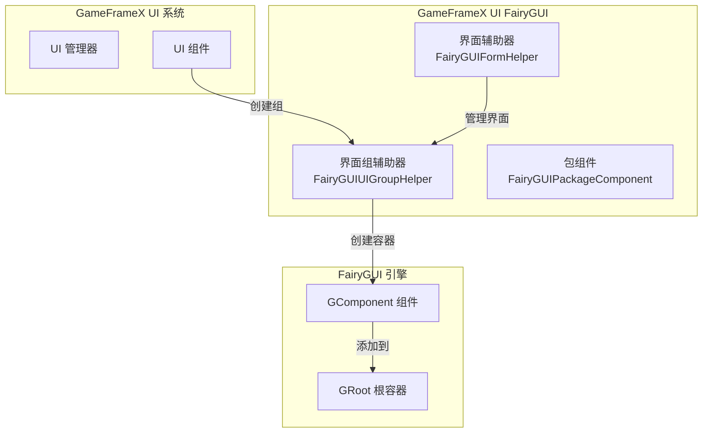
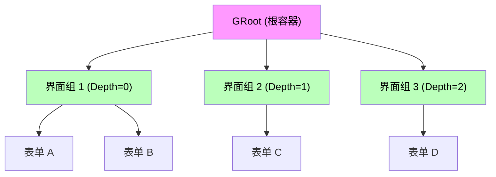
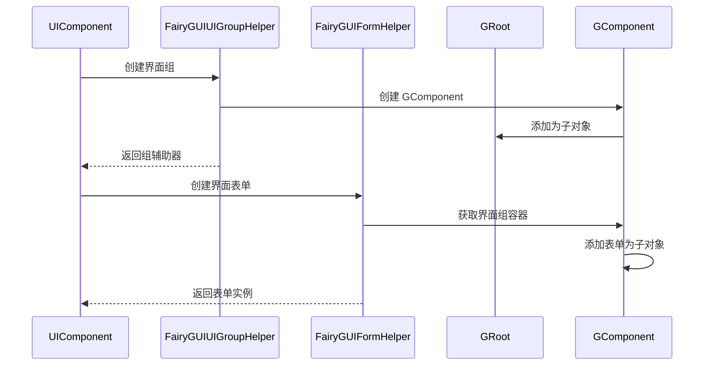

# 界面组辅助器

`FairyGUIUIGroupHelper` 是 GameFrameX UI FairyGUI 插件的核心组件之一，负责在 FairyGUI 渲染引擎中创建和管理 UI 界面组。界面组是组织和管理多个界面表单（窗口）的容器，通过深度（Depth）控制界面的显示层级。

## 概述

界面组辅助器是 GameFrameX UI 系统与 FairyGUI 渲染引擎之间的桥梁组件。它继承自 `UIGroupHelperBase` 抽象类，提供了 FairyGUI 特定的界面组实现。在 UI 系统中，界面组用于将相关的界面表单组织在一起，并通过深度值控制界面的遮挡关系和显示顺序。

**核心职责：**
- 创建 FairyGUI 界面组容器（GComponent）
- 管理界面组的深度（Z 顺序）
- 设置界面组全屏显示
- 与 GameFrameX 核心系统集成

> Source: [FairyGUIUIGroupHelper.cs](https://github.com/GameFrameX/com.gameframex.unity.ui.fairygui/blob/main/Runtime/FairyGUIUIGroupHelper.cs#L36-L97)

## 架构设计

### 类图结构

```mermaid
classDiagram
    class UIGroupHelperBase {
        <<abstract>>
        +Depth: int { get; protected set; }
        +Handler(root, groupName, helperTypeName, customHelper, depth) IUIGroupHelper
        +SetDepth(depth) void
    }
    
    class FairyGUIUIGroupHelper {
        +Depth: int { get; protected set; }
        +Handler(root, groupName, helperTypeName, customHelper, depth) IUIGroupHelper
        +SetDepth(depth) void
    }
    
    class GComponent {
        +name: string
        +opaque: bool
        +displayObject: DisplayObject
        +AddRelation(target, type) void
        +MakeFullScreen() void
    }
    
    class GRoot {
        +inst: GRoot
    }
    
    UIGroupHelperBase <|-- FairyGUIUIGroupHelper
    FairyGUIUIGroupHelper --> GComponent : creates
    GComponent --> GRoot : added as child
```

### 系统集成架构



### 界面组层级关系



## 核心功能

### 创建界面组

`Handler` 方法是界面组辅助器的核心方法，负责创建并初始化一个新的 FairyGUI 界面组。

```csharp
public override IUIGroupHelper Handler(Transform root, string groupName, string uiGroupHelperTypeName, IUIGroupHelper customUIGroupHelper, int depth = 0)
{
    SetDepth(depth);
    GComponent component = new GComponent();
    GRoot.inst.AddChild(component);
    var comName = groupName;
    component.displayObject.name = comName;
    component.gameObjectName = comName;
    component.name = comName;
    component.opaque = false;
    component.AddRelation(GRoot.inst, RelationType.Width);
    component.AddRelation(GRoot.inst, RelationType.Height);
    component.MakeFullScreen();
    return GameFrameX.Runtime.Helper.CreateHelper(component.displayObject.gameObject, uiGroupHelperTypeName, (UIGroupHelperBase)customUIGroupHelper, 0);
}
```

> Source: [FairyGUIUIGroupHelper.cs](https://github.com/GameFrameX/com.gameframex.unity.ui.fairygui/blob/main/Runtime/FairyGUIUIGroupHelper.cs#L82-L96)

**创建流程说明：**

1. **设置深度**：调用 `SetDepth(depth)` 设置界面组的 Z 顺序
2. **创建组件**：使用 `new GComponent()` 创建 FairyGUI 容器组件
3. **添加到根容器**：将组件添加到 `GRoot.inst`（FairyGUI 全局根容器）
4. **设置名称**：设置组件的 `name`、`gameObjectName` 和 `displayObject.name`
5. **设置透明**：设置 `opaque = false` 使界面组容器本身透明
6. **全屏设置**：添加宽度和高度关联，使用 `MakeFullScreen()` 使组件占满全屏
7. **创建辅助器**：使用 `GameFrameX.Runtime.Helper.CreateHelper` 创建实际的辅助器实例

### 设置界面深度

`SetDepth` 方法用于设置界面组的深度值，该值决定了界面的显示层级。

```csharp
public override void SetDepth(int depth)
{
    Depth = depth;
    transform.localPosition = new Vector3(0, 0, depth * 100);
}
```

> Source: [FairyGUIUIGroupHelper.cs](https://github.com/GameFrameX/com.gameframex.unity.ui.fairygui/blob/main/Runtime/FairyGUIUIGroupHelper.cs#L63-L67)

**深度设置原理：**
- FairyGUI 使用 Z 轴坐标控制显示层级
- 每个深度等级对应 100 单位的 Z 轴距离
- 深度值越大，界面显示越靠前（覆盖深度值较小的界面）

## 界面组与表单的关系

界面组与界面表单（Form）之间是一对多的包含关系：



### 界面组分配

在 FairyGUI 系统中，界面表单通过 `OptionUIGroupAttribute` 特性分配到指定的界面组：

```csharp
[OptionUIGroup("MainUI")]
public class MainMenuForm : FUI
{
    // 界面表单逻辑
}
```

> Source: [FairyGUIFormHelper.cs](https://github.com/GameFrameX/com.gameframex.unity.ui.fairygui/blob/main/Runtime/FairyGUIFormHelper.cs#L108-L115)

系统会根据 `OptionUIGroup` 特性中指定的组名称获取对应的界面组实例，并将界面表单添加到该界面组的 GComponent 容器中。

## 使用示例

### 基本配置

在使用界面组辅助器之前，需要在 GameFrameX 启动配置中注册 FairyGUI 相关的组件：

```csharp
// 在 GameFrameworkComponent 中配置
// 使用 FairyGUIUIGroupHelper 作为界面组辅助器实现
```

### 界面组定义示例

```csharp
// 界面组通过 UIManager 在运行时自动创建
// 以下是系统内部的创建逻辑

// 1. 当需要创建新界面时，检查是否存在对应的界面组
// 2. 如果不存在，使用 FairyGUIUIGroupHelper 创建新的界面组
// 3. 界面组的深度由系统根据配置或自动递增分配
```

## API 参考

### `FairyGUIUIGroupHelper` 类

**命名空间：** `GameFrameX.UI.FairyGUI.Runtime`

**继承：** `UIGroupHelperBase`

---

### 属性

#### `Depth`

```csharp
public override int Depth { get; protected set; }
```

获取界面组的深度值。

- **类型：** `int`
- **说明：** 表示界面组的 Z 轴深度，用于控制界面的显示层级

---

### 方法

#### `Handler`

```csharp
public override IUIGroupHelper Handler(
    Transform root,
    string groupName,
    string uiGroupHelperTypeName,
    IUIGroupHelper customUIGroupHelper,
    int depth = 0
)
```

创建并初始化一个 FairyGUI 界面组。

**参数：**
- `root` (Transform): 根节点（当前实现未使用）
- `groupName` (string): 界面组的名称
- `uiGroupHelperTypeName` (string): 界面组辅助器类型名称
- `customUIGroupHelper` (IUIGroupHelper): 自定义的界面组辅助器实例
- `depth` (int): 界面组的深度值，默认为 0

**返回值：** 
- `IUIGroupHelper`: 创建的界面组辅助器实例

**实现说明：**
1. 设置界面组深度
2. 创建 `GComponent` 作为界面组容器
3. 将容器添加到 `GRoot.inst`
4. 配置全屏显示属性
5. 创建并返回辅助器实例

---

#### `SetDepth`

```csharp
public override void SetDepth(int depth)
```

设置界面组的深度。

**参数：**
- `depth` (int): 界面组的深度值

**实现说明：**
通过修改 `transform.localPosition` 的 Z 坐标来实现深度设置，Z 坐标计算公式为：`depth * 100`。这种设计确保不同深度的界面之间有足够的 Z 轴间隔，避免渲染冲突。

---

## 相关链接

- [FUI 界面基类](./4-core-concepts.1-fui-base-class) - FairyGUI 界面表单的基类实现
- [界面管理器](./4-core-concepts.2-ui-manager) - 界面系统的核心管理器
- [包管理器](./4-core-concepts.3-package-manager) - FairyGUI 资源包管理
- [界面辅助器](./4-core-concepts.4-form-helper) - 界面表单的创建和释放管理
- [界面组配置](./6-configuration.2-ui-group-config) - 界面组的配置选项
- [GitHub 仓库](https://github.com/GameFrameX/com.gameframex.unity.ui.fairygui.git) - 插件源代码
