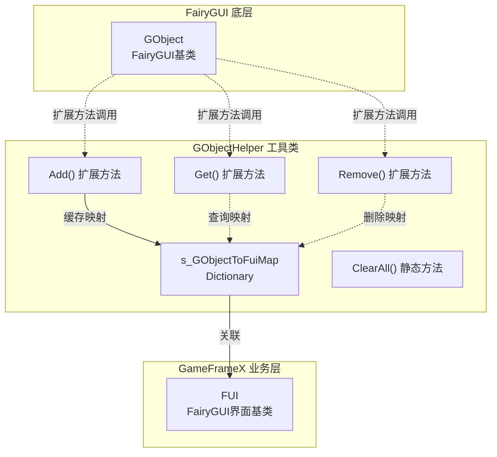
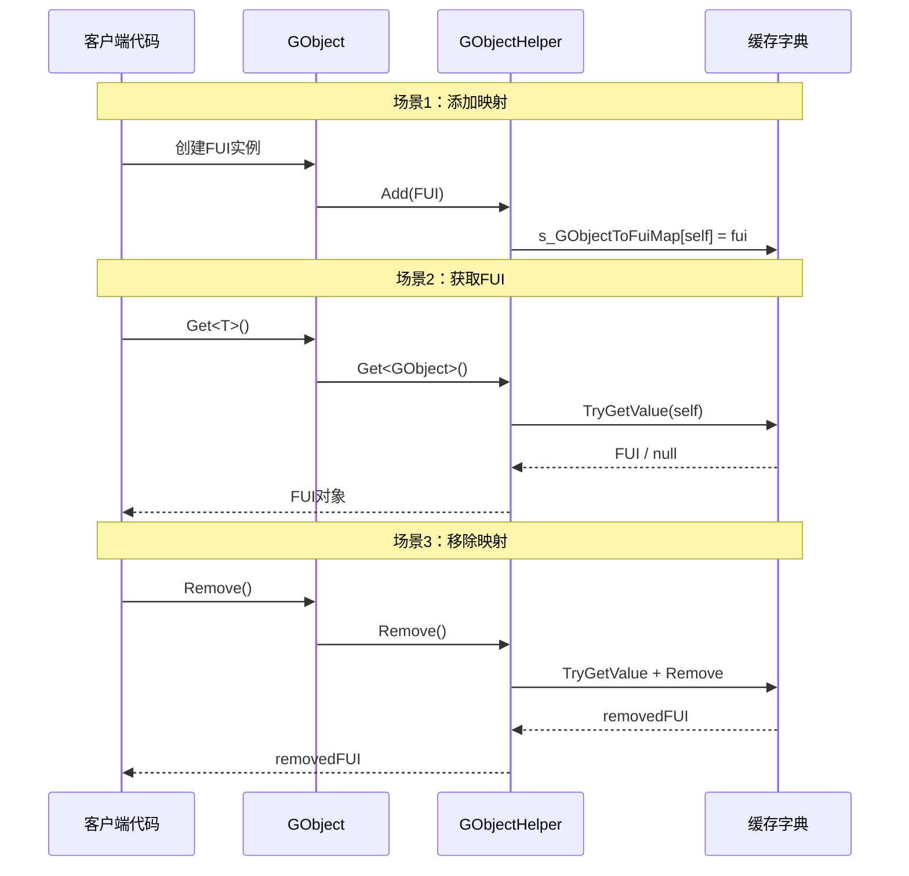

# GObjectHelper 工具类

GObjectHelper 是一个静态工具类，用于管理 FairyGUI 的 GObject 对象与 FUI 界面对象之间的映射关系，提供缓存和查找功能。

## 概述

GObjectHelper 是 GameFrameX 插件中用于连接 FairyGUI 底层对象（FUI 的 GObject）与业务逻辑层（FUI 界面类）的桥梁。在 FairyGUI 界面系统中，每个界面都由一个 GObject 实例表示，而 GObjectHelper 提供了在运行时根据 GObject 快速获取对应 FUI 对象的能力。

**设计意图：**
- 解决 FairyGUI 的 GObject 与业务层 FUI 对象之间的关联问题
- 提供高效的查找机制，避免在复杂界面树中逐层遍历
- 支持界面的动态创建和销毁时的资源管理

**使用场景：**
- 在事件回调中需要获取触发事件的界面对象
- 在组件级别操作时需要快速关联到对应的 FUI
- 界面卸载时清理相关资源

## 架构



**架构说明：**
- GObjectHelper 维护一个私有的静态字典 `s_GObjectToFuiMap`，用于存储 GObject 到 FUI 的映射关系
- 通过 C# 扩展方法的形式为 GObject 添加 Get、Add、Remove 方法
- 所有操作都是线程安全的（内部使用 Dictionary）

## 核心功能

### 1. 获取关联的 FUI 对象

通过 GObject 扩展方法，可以快速获取与之关联的 FUI 对象：

```csharp
// 假设有一个 GObject 实例
GObject gObject = someComponent.GetChild("Button");

// 获取关联的 FUI 对象（需要类型转换）
MyFUI fui = gObject.Get<MyFUI>();
```
> Source: [GObjectHelper.cs](https://github.com/GameFrameX/com.gameframex.unity.ui.fairygui/blob/main/Runtime/GObjectHelper.cs#L69-L77)

**方法签名：**
```csharp
public static T Get<T>(this GObject self) where T : FUI
```

### 2. 添加 FUI 映射

将 FUI 对象添加到缓存池中，建立 GObject 与 FUI 的关联：

```csharp
// 创建 FUI 实例
FUI fui = new MyFUI(gObject);

// 添加到缓存
gObject.Add(fui);
```
> Source: [GObjectHelper.cs](https://github.com/GameFrameX/com.gameframex.unity.ui.fairygui/blob/main/Runtime/GObjectHelper.cs#L88-L94)

### 3. 移除 FUI 映射

从缓存中移除指定的 FUI 映射，并返回被移除的 FUI 对象：

```csharp
// 移除映射并获取被删除的 FUI
FUI removedFui = gObject.Remove();
```
> Source: [GObjectHelper.cs](https://github.com/GameFrameX/com.gameframex.unity.ui.fairygui/blob/main/Runtime/GObjectHelper.cs#L105-L114)

### 4. 清理所有缓存

在界面系统关闭或重新初始化时，清空所有缓存的映射关系：

```csharp
// 清理所有缓存
GObjectHelper.ClearAll();
```
> Source: [GObjectHelper.cs](https://github.com/GameFrameX/com.gameframex.unity.ui.fairygui/blob/main/Runtime/GObjectHelper.cs#L54-L57)

## 使用流程



## 使用示例

### 基础用法

```csharp
using FairyGUI;
using GameFrameX.UI.FairyGUI.Runtime;

// 假设有一个按钮组件
GObject buttonObj = container.GetChild("SubmitButton");

// 获取关联的 FUI
MainPanelFUI fui = buttonObj.Get<MainPanelFUI>();

if (fui != null)
{
    // 可以对 FUI 进行操作
    fui.Visible = true;
}
```

### 界面创建时的映射

```csharp
// 在 FairyGUIFormHelper 创建界面时
public override IUIForm CreateUIForm(object uiFormInstance, Type uiFormType, object userData)
{
    GComponent component = uiFormInstance as GComponent;
    var componentType = component.displayObject.gameObject.GetOrAddComponent(uiFormType);
    var uiForm = componentType as IUIForm;
    
    // 建立映射关系
    component.Add(uiForm as FUI);
    
    return uiForm;
}
```

### 清理资源

```csharp
// 在游戏退出或重新加载场景时
private void OnDestroy()
{
    // 清理所有 FUI 映射
    GObjectHelper.ClearAll();
}
```

## API 参考

### `Get<T>(this GObject self): T`

从缓存中获取与当前 GObject 关联的 FUI 对象。

**泛型参数：**
- `T`: FUI 的派生类型

**参数：**
- `self` (GObject): 调用扩展方法的 GObject 实例

**返回：**
- 关联的 FUI 对象；如果不存在则返回类型默认值（reference type 为 null）

**示例：**
```csharp
MyPanelFUI fui = gObject.Get<MyPanelFUI>();
```

---

### `Add(this GObject self, FUI fui): void`

将 FUI 对象添加到缓存，建立 GObject 与 FUI 的映射关系。

**参数：**
- `self` (GObject): 调用扩展方法的 GObject 实例
- `fui` (FUI): 要添加的 FUI 对象

**示例：**
```csharp
gObject.Add(new MyPanelFUI(gObject));
```

---

### `Remove(this GObject self): FUI`

从缓存中移除指定 GObject 的 FUI 映射，并返回被移除的 FUI 对象。

**参数：**
- `self` (GObject): 调用扩展方法的 GObject 实例

**返回：**
- 被移除的 FUI 对象；如果不存在则返回默认值

**示例：**
```csharp
FUI removed = gObject.Remove();
```

---

### `ClearAll(): void`

清空所有缓存的 FUI 映射关系。

**注意：** 此操作不可逆，调用后所有 GObject 与 FUI 的关联将被清除。

**示例：**
```csharp
GObjectHelper.ClearAll();
```

## 相关链接

- [FUI 类](./5-api-reference.1-fui-class) - FairyGUI 界面基类
- [FairyGUIFormHelper 类](./5-api-reference.3-form-helper) - 界面辅助器
- [FairyGUIPackageComponent 类](./5-api-reference.2-package-component) - 包管理器组件
- [界面管理器](./4-core-concepts.2-ui-manager) - 界面管理核心概念
- [快速开始：打开和关闭界面](./3-getting-started.2-open-close-ui)
