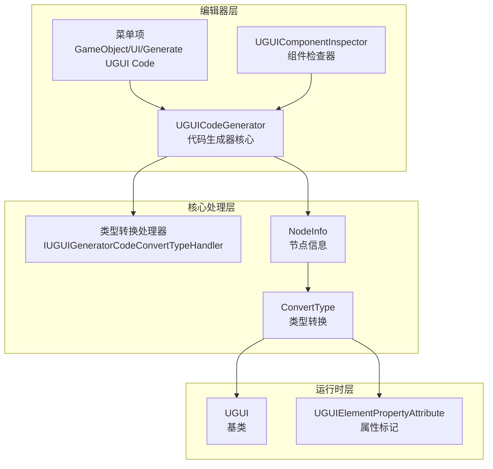
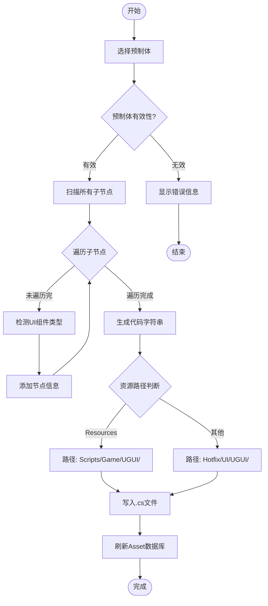

# 代码生成器

代码生成器是 GameFrameX UGUI 插件的核心编辑器工具，能够自动从 Unity UGUI 预制体生成对应的 C# 代码，大幅提升 UI 开发效率。

## 概述

代码生成器（UGUICodeGenerator）是一个 Unity 编辑器工具，用于自动将 UGUI 预制体转换为可用的 C# 代码。它能够：

- **自动遍历 UI 层级**：递归扫描预制体中的所有子对象
- **智能类型识别**：自动识别 Button、Text、Image、Toggle 等 UI 组件类型
- **可扩展的转换机制**：通过接口支持自定义 UI 组件类型识别
- **一键代码生成**：从菜单或检查器触发代码生成

### 使用场景

当需要创建新的 UI 界面时，无需手动编写大量重复的 UI 引用代码，只需：
1. 在 Unity 编辑器中创建或选择 UGUI 预制体
2. 右键选择生成代码菜单
3. 系统自动生成包含所有 UI 引用的代码文件

## 架构

代码生成器采用模块化设计，主要包含以下组件：



### 组件说明

| 组件 | 文件路径 | 职责 |
|------|----------|------|
| UGUICodeGenerator | `Editor/UGUICodeGenerator.cs` | 主代码生成器，处理预制体遍历和代码生成 |
| IUGUIGeneratorCodeConvertTypeHandler | `Editor/IUGUIGeneratorCodeConvertTypeHandler.cs` | 类型转换处理器接口，支持扩展 |
| UGUIComponentInspector | `Editor/UGUIComponentInspector.cs` | Unity 检查器，提供重新生成和绑定功能 |
| UGUIElementPropertyAttribute | `Runtime/UGUIElementPropertyAttribute.cs` | 属性标记，标识 UI 元素路径 |

## 核心功能

### 菜单触发方式

代码生成器通过 Unity 菜单项提供两种触发方式：

```csharp
/// <summary>
/// 生成UI代码的菜单项
/// </summary>
[MenuItem("GameObject/UI/Generate UGUI Code(生成UGUI代码)", false, 1)]
static void Code()
```

> Source: [UGUICodeGenerator.cs](https://github.com/GameFrameX/com.gameframex.unity.ui.ugui/blob/main/Editor/UGUICodeGenerator.cs#L56-L73)

### 代码生成流程



### UI 组件类型识别

代码生成器按照优先级依次检测以下 UI 组件类型：

```csharp
// 依次检查是否包含各种UI组件
UIBehaviour component = transform.GetComponent<Button>();
if (component != null) { return typeof(Button).FullName; }

component = transform.GetComponent<Text>();
if (component != null) { return typeof(Text).FullName; }

component = transform.GetComponent<Toggle>();
if (component != null) { return typeof(Toggle).FullName; }

// ... 更多组件类型
```

> Source: [UGUICodeGenerator.cs](https://github.com/GameFrameX/com.gameframex.unity.ui.ugui/blob/main/Editor/UGUICodeGenerator.cs#L400-L497)

**支持的 UI 组件类型包括：**

- UnityEngine.UI.Button
- UnityEngine.UI.Text
- UnityEngine.UI.Image
- UnityEngine.UI.RawImage
- UnityEngine.UI.Toggle
- UnityEngine.UI.ToggleGroup
- UnityEngine.UI.InputField
- UnityEngine.UI.ScrollRect
- UnityEngine.UI.Dropdown
- UnityEngine.UI.Scrollbar
- UnityEngine.UI.Slider
- UnityEngine.UI.RectTransform
- UnityEngine.Transform
- GameFrameX.UI.UGUI.Runtime.UIImage（扩展组件）
- TMPro.TextMeshProUGUI（条件编译）

### 类型转换处理器扩展

通过实现 `IUGUIGeneratorCodeConvertTypeHandler` 接口，可以添加自定义的 UI 组件类型识别逻辑：

```csharp
/// <summary>
/// UI控件类型转换接口
/// </summary>
public interface IUGUIGeneratorCodeConvertTypeHandler
{
    /// <summary>
    /// 处理器优先级,数值越小优先级越高
    /// </summary>
    int Priority { get; }

    /// <summary>
    /// 执行类型转换
    /// </summary>
    /// <param name="transform">要转换的Transform</param>
    /// <returns>转换后的类型名称</returns>
    string Run(Transform transform);
}
```

> Source: [IUGUIGeneratorCodeConvertTypeHandler.cs](https://github.com/GameFrameX/com.gameframex.unity.ui.ugui/blob/main/Editor/IUGUIGeneratorCodeConvertTypeHandler.cs#L39-L52)

处理器按优先级排序后依次执行，一旦某个处理器返回非空类型，即采用该类型：

```csharp
// 首先使用自定义处理器进行处理
if (_handler != null)
{
    foreach (var handler in _handler)
    {
        var type = handler.Run(transform);
        if (type != null)
        {
            return type;
        }
    }
}
```

> Source: [UGUICodeGenerator.cs](https://github.com/GameFrameX/com.gameframex.unity.ui.ugui/blob/main/Editor/UGUICodeGenerator.cs#L387-L398)

## 使用示例

### 基本使用流程

1. **选择 UGUI 预制体**：在 Unity 编辑器 Hierarchy 或 Project 窗口中选择需要生成代码的 UGUI 预制体

2. **触发代码生成**：
   - 方式一：右键点击预制体 → `GameObject/UI/Generate UGUI Code(生成UGUI代码)`
   - 方式二：在预制体的 Inspector 中点击"重新生成代码"按钮

3. **查看生成的代码**：代码会自动生成到指定目录

### 生成的代码示例

生成的代码结构如下：

```csharp
/** This is an automatically generated class by UGUI. Please do not modify it. **/

#if ENABLE_UI_UGUI
using Cysharp.Threading.Tasks;
using GameFrameX.Entity.Runtime;
using GameFrameX.UI.Runtime;
using GameFrameX.Runtime;
using GameFrameX.UI.UGUI.Runtime;
using UnityEngine;

namespace Hotfix.UI
{
    /// <summary>
    /// 代码生成的UI代码MainMenu
    /// </summary>
    [DisallowMultipleComponent]
    [OptionUIConfig(null, "UI/Forms/MainMenu")]
    public sealed partial class MainMenu : UGUI
    {
        public GameObject self { get; private set; }

        #region Properties

        [SerializeField] [UGUIElementProperty("Background")]
        private UnityEngine.UI.Image m_Background;

        public UnityEngine.UI.Image m_Background
        {
            get { return m_Background;}
        }

        [SerializeField] [UGUIElementProperty("Title")]
        private UnityEngine.UI.Text m_Title;

        public UnityEngine.UI.Text m_Title
        {
            get { return m_Title;}
        }

        [SerializeField] [UGUIElementProperty("StartButton")]
        private UnityEngine.UI.Button m_StartButton;

        public UnityEngine.UI.Button m_StartButton
        {
            get { return m_StartButton;}
        }

        #endregion

        private bool _isInitView = false;

        protected override void InitView()
        {
            if (_isInitView)
            {
                return;
            }

            _isInitView = true;
            this.self = this.gameObject;
            m_Background = gameObject.transform.FindChildName("Background").GetComponent<UnityEngine.UI.Image>();
            m_Title = gameObject.transform.FindChildName("Title").GetComponent<UnityEngine.UI.Text>();
            m_StartButton = gameObject.transform.FindChildName("StartButton").GetComponent<UnityEngine.UI.Button>();
        }
    }
}
#endif
```

> Source: [UGUICodeGenerator.cs](https://github.com/GameFrameX/com.gameframex.unity.ui.ugui/blob/main/Editor/UGUICodeGenerator.cs#L147-L230)

### 重新绑定功能

在预制体的 Inspector 面板中，可以点击"重新绑定列表"按钮来重新绑定所有 UI 引用：

```csharp
bool buttonClicked = EditorGUILayout.DropdownButton(_reBind, FocusType.Passive, CustomButtonStyle);
if (buttonClicked && !EditorApplication.isPlaying)
{
    // 重新绑定
    Dictionary<string, string> fieldMap = new Dictionary<string, string>();
    foreach (var fieldInfo in fieldInfos)
    {
        var serializeFieldAttributes = fieldInfo.GetCustomAttribute(typeof(SerializeField));
        if (serializeFieldAttributes == null) { continue; }

        var uguiElementPropertyAttribute = fieldInfo.GetCustomAttribute(typeof(UGUIElementPropertyAttribute));
        if (uguiElementPropertyAttribute == null) { continue; }

        var elementPropertyAttribute = (UGUIElementPropertyAttribute)uguiElementPropertyAttribute;
        fieldMap[fieldInfo.Name] = elementPropertyAttribute.Path;
    }
    // ... 绑定逻辑
}
```

> Source: [UGUIComponentInspector.cs](https://github.com/GameFrameX/com.gameframex.unity.ui.ugui/blob/main/Editor/UGUIComponentInspector.cs#L96-L132)

## 配置说明

### 代码生成路径规则

代码生成器根据预制体位置自动选择生成路径：

| 预制体位置 | 生成路径 |
|------------|----------|
| 包含 "Resources" 目录 | `Assets/Scripts/Game/UGUI/{预制体名称}/` |
| 其他位置 | `Assets/Hotfix/UI/UGUI/{预制体名称}/` |

```csharp
if (assetPath.Contains(nameof(Resources)))
{
    savePath = System.IO.Path.Combine(Application.dataPath, "Scripts", "Game", "UGUI", className);
}
else
{
    savePath = System.IO.Path.Combine(Application.dataPath, "Hotfix", "UI", "UGUI", className);
}
```

> Source: [UGUICodeGenerator.cs](https://github.com/GameFrameX/com.gameframex.unity.ui.ugui/blob/main/Editor/UGUICodeGenerator.cs#L117-L127)

### 命名空间规则

生成的代码根据路径自动设置命名空间：

- Resources 目录下的预制体：`namespace Unity.Startup`
- 其他位置：`namespace Hotfix.UI`

> Source: [UGUICodeGenerator.cs](https://github.com/GameFrameX/com.gameframex.unity.ui.ugui/blob/main/Editor/UGUICodeGenerator.cs#L169-L177)

## 扩展开发

### 创建自定义类型转换处理器

可以通过实现 `IUGUIGeneratorCodeConvertTypeHandler` 接口来添加自定义的 UI 组件识别逻辑：

```csharp
using UnityEngine;
using GameFrameX.UI.UGUI.Editor;

public class CustomTypeHandler : IUGUIGeneratorCodeConvertTypeHandler
{
    public int Priority => 0; // 优先级，数值越小越先执行

    public string Run(Transform transform)
    {
        // 自定义类型检测逻辑
        var customComponent = transform.GetComponent<CustomUIComponent>();
        if (customComponent != null)
        {
            return typeof(CustomUIComponent).FullName;
        }
        return null; // 返回 null 表示不处理，继续使用其他处理器
    }
}
```

该处理器会在内置类型检测之前执行，可以用于：
- 支持第三方 UI 组件库
- 自定义组件类型映射
- 特殊命名规则的自动识别

## 相关链接

- [UGUI 基类](./4-core-concepts.ugui-base)
- [UI 管理器](./4-core-concepts.ui-manager)
- [UIImage 组件](./5-components.uiimage)
- [组件检查器](./6-editor-tools.inspector)
- [图片替换处理器](./6-editor-tools.image-replace)
- [官方文档](https://gameframex.doc.alianblank.com)
