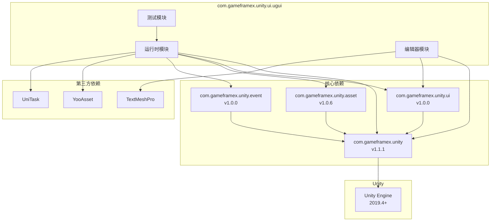

# 依赖要求

本文档详细介绍 Game Frame X UGUI 组件包的所有依赖要求，包括 Unity 版本要求、程序包依赖和程序集引用。

## 概述

Game Frame X UGUI 组件包是一个基于 Unity UGUI 的高级 UI 框架，需要依赖 Game Frame X 核心框架和其他相关组件包。了解这些依赖要求是正确安装和使用的第一步。

## Unity 版本要求

| 项目 | 要求 |
|------|------|
| 最低 Unity 版本 | 2019.4 |
| 推荐 Unity 版本 | 2020.3 LTS 或更高 |

> Source: [package.json](https://github.com/GameFrameX/com.gameframex.unity.ui.ugui/blob/main/package.json#L7)

## 程序包依赖

在安装 UGUI 组件包之前，需要确保以下依赖包已正确安装。这些依赖包通过 Unity Package Manager 进行管理。

### 核心依赖

| 包名 | 最低版本 | 说明 |
|------|---------|------|
| com.gameframex.unity | 1.1.1 | Game Frame X 核心框架，提供基础架构和通用功能 |
| com.gameframex.unity.ui | 1.0.0 | Game Frame X UI 基础包，提供 UI 抽象层和基础接口 |
| com.gameframex.unity.asset | 1.0.6 | Game Frame X 资源管理包，提供资源加载和管理功能 |
| com.gameframex.unity.event | 1.0.0 | Game Frame X 事件系统包，提供事件分发和监听功能 |

> Source: [package.json](https://github.com/GameFrameX/com.gameframex.unity.ui.ugui/blob/main/package.json#L21-L26)

### 安装依赖

在 Unity 项目的 `manifest.json` 文件中添加以下依赖：

```json
{
  "dependencies": {
    "com.gameframex.unity": "1.1.1",
    "com.gameframex.unity.ui": "1.0.0",
    "com.gameframex.unity.asset": "1.0.6",
    "com.gameframex.unity.event": "1.0.0",
    "com.gameframex.unity.ui.ugui": "2.3.6"
  }
}
```

## 程序集引用

### 运行时程序集 (Runtime)

UGUI 运行时程序集需要引用以下程序集：

| 程序集 | 说明 |
|--------|------|
| GameFrameX.Runtime | 核心运行时 |
| GameFrameX.Asset.Runtime | 资源管理运行时 |
| GameFrameX.Event.Runtime | 事件系统运行时 |
| GameFrameX.UI.Runtime | UI 基础运行时 |
| YooAsset.Runtime | YooAsset 资源引擎运行时 |
| YooAsset | YooAsset 主程序集 |
| UniTask.Runtime | UniTask 异步运行时 |

> Source: [Runtime/GameFrameX.UI.UGUI.Runtime.asmdef](https://github.com/GameFrameX/com.gameframex.unity.ui.ugui/blob/main/Runtime/GameFrameX.UI.UGUI.Runtime.asmdef#L4-L11)

### 编辑器程序集 (Editor)

UGUI 编辑器程序集需要引用以下程序集：

| 程序集 | 说明 |
|--------|------|
| GameFrameX.Editor | 核心编辑器 |
| GameFrameX.Runtime | 核心运行时 |
| GameFrameX.UI.Runtime | UI 基础运行时 |
| GameFrameX.UI.UGUI.Runtime | UGUI 运行时 |
| Unity.TextMeshPro | TextMeshPro（条件依赖） |

> Source: [Editor/GameFrameX.UI.UGUI.Editor.asmdef](https://github.com/GameFrameX/com.gameframex.unity.ui.ugui/blob/main/Editor/GameFrameX.UI.UGUI.Editor.asmdef#L4-L9)

#### TextMeshPro 条件引用

编辑器程序集使用版本定义来条件引用 TextMeshPro：

```json
{
  "name": "com.unity.textmeshpro",
  "expression": "",
  "define": "ENABLE_UI_TEXT_MESH_PRO"
}
```

这意味着 TextMeshPro 是可选依赖，当项目中有 TextMeshPro 时会自动启用相关功能。

> Source: [Editor/GameFrameX.UI.UGUI.Editor.asmdef](https://github.com/GameFrameX/com.gameframex.unity.ui.ugui/blob/main/Editor/GameFrameX.UI.UGUI.Editor.asmdef#L20-L26)

## 依赖关系图



## 安装顺序

为确保依赖正确解析，请按照以下顺序安装：

1. **第一步：安装核心依赖**
   - com.gameframex.unity (1.1.1)
   - com.gameframex.unity.ui (1.0.0)
   - com.gameframex.unity.asset (1.0.6)
   - com.gameframex.unity.event (1.0.0)

2. **第二步：安装第三方依赖**
   - YooAsset（通过 Asset 或 UI 包自动引入）
   - UniTask（如未自动引入需手动安装）

3. **第三步：安装 UGUI 组件**
   - com.gameframex.unity.ui.ugui (2.3.6)

4. **第四步（可选）：安装编辑器增强**
   - TextMeshPro（如需使用增强的文本功能）

## 版本兼容性

| UGUI 版本 | Unity 版本 | 核心框架版本 | 包状态 |
|-----------|-----------|-------------|--------|
| 2.3.6 | 2019.4+ | 1.1.1 | 当前稳定版 |
| 2.0.0 | 2019.4+ | 1.0.0 | 历史版本 |

## 常见问题

### Q1: 安装时提示缺少依赖怎么办？

请确保按照上述安装顺序依次安装所有依赖包。如果使用 Git URL 安装方式，依赖包通常会自动下载。

### Q2: YooAsset 和 UniTask 从哪里获取？

这两个包通常是作为 Game Frame X 生态的一部分自动引入。如果未自动引入：
- YooAsset：可从 GitHub 仓库 `YooAsset` 获取
- UniTask：可从 Unity Package Manager 获取 `com.cysharp.unitask`

### Q3: TextMeshPro 是必需的吗？

不是。TextMeshPro 是可选依赖，不影响核心功能使用。但推荐安装以获得完整的文本处理能力。

## 相关链接

- [安装方式](./2-installation.methods) - 详细安装步骤
- [插件介绍](./1-overview.introduction) - 插件功能概述
- [功能特性](./1-overview.features) - 完整功能列表
- [Game Frame X 官方文档](https://gameframex.doc.alianblank.com)
- [GitHub 仓库](https://github.com/gameframex/com.gameframex.unity.ui.ugui.git)
