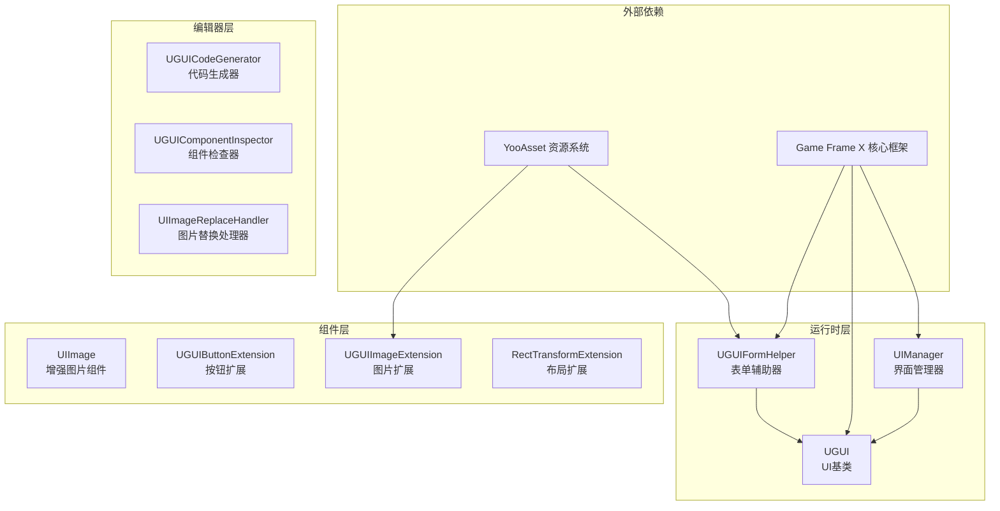
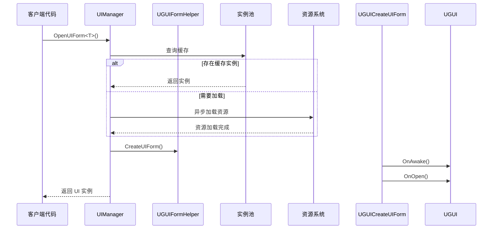

# 插件介绍

Game Frame X UGUI 组件是 Unity UI 功能包，提供 UGUI 组件的封装，使 UGUI 组件的使用更加简单高效。该插件是 Game Frame X 游戏开发框架的核心组成部分，专门针对 Unity 的 UGUI 系统进行了深度优化和功能扩展。

## 概述

Game Frame X UGUI 插件旨在为 Unity 游戏开发者提供一套完整、高效、可扩展的 UI 解决方案。该插件通过封装 Unity 原生的 UGUI 系统，提供了更加便捷的 API 调用方式，同时内置了强大的代码生成器，可以显著提升 UI 开发效率。

作为 Game Frame X 框架的一部分，本插件依赖于核心框架（`com.gameframex.unity`）、UI 基础包（`com.gameframex.unity.ui`）、资源管理包（`com.gameframex.unity.asset`）和事件系统（`com.gameframex.unity.event`）。通过模块化的设计，开发者可以根据需要选择性使用插件的各个功能模块。

本插件支持 Unity 2019.4 及以上版本，采用 MIT 许可证与 Apache License 2.0 双许可证分发。

## 核心架构



### 架构层次说明

**运行时层**包含插件的核心业务逻辑：

- **UIManager**：负责 UI 界面的打开、关闭和生命周期管理，支持界面实例池和自动回收机制
- **UGUI**：抽象 UI 基类，提供 UI 显示状态控制、界面显示/隐藏动画支持
- **UGUIFormHelper**：UI 表单辅助器，处理 UI 实例化和创建，支持通过特性配置 UI 分组和动画

**组件层**提供扩展功能：

- **UIImage**：继承自 Unity 的 Image 组件，支持通过资源路径异步加载图标
- **扩展方法**：包括按钮扩展、图片扩展和 RectTransform 扩展，简化常见操作

**编辑器层**提供开发效率工具：

- **UGUICodeGenerator**：根据 UGUI 预制体自动生成代码
- **UGUIComponentInspector**：在编辑器中可视化检查组件属性
- **UIImageReplaceHandler**：批量处理图片资源替换

## 主要特性

### UGUI 组件封装

插件对 Unity 原生 UGUI 组件进行了高级封装，提供了更加面向对象的接口设计。开发者无需直接操作 Unity 的 GameObject 和 Component，而是通过继承 `UGUI` 基类来创建自己的 UI 界面，享受统一的生命周期管理和事件回调机制。

```csharp
using GameFrameX.UI.UGUI.Runtime;
using UnityEngine;

public class MainMenuUI : UGUI
{
    protected override void OnInit(object userData)
    {
        base.OnInit(userData);
        // 初始化 UI 逻辑
    }
    
    protected override void OnOpen(object userData)
    {
        base.OnOpen(userData);
        // UI 打开时的逻辑
    }
    
    protected override void OnClose(bool isShutdown, object userData)
    {
        base.OnClose(isShutdown, userData);
        // UI 关闭时的逻辑
    }
}
```
> Source: [README.md](https://github.com/GameFrameX/com.gameframex.unity.ui.ugui/blob/main/README.md#L78-L101)

### UI 管理器

`UIManager` 是整个插件的核心管理器，负责处理 UI 界面的完整生命周期。它继承自 `BaseUIManager`，提供了界面加载、缓存、回收等完整功能。通过实例池技术，可以有效减少界面频繁创建销毁带来的性能开销。



### 代码生成器

编辑器工具 `UGUICodeGenerator` 可以大幅提升 UI 开发效率。开发者只需在 Unity 编辑器中创建一个 UGUI 预制体，选中后右键选择 `GameObject/UI/Generate UGUI Code(生成UGUI代码)` 菜单项，即可自动生成对应的 C# 代码文件。

生成的代码包含：
- 所有子组件的序列化字段引用
- 按钮点击事件绑定方法
- 组件获取完成的回调方法

### 扩展方法

插件提供了丰富的扩展方法，简化日常 UI 开发工作：

**按钮扩展** - 简化事件绑定：
```csharp
startButton.onClick.Add(OnStartButtonClick);
startButton.onClick.Clear();
startButton.onClick.Set(OnClickHandler);
```
> Source: [UGUIButtonExtension.cs](https://github.com/GameFrameX/com.gameframex.unity.ui.ugui/blob/main/Runtime/UGUIButtonExtension.cs#L52-L101)

**图片扩展** - 异步图标加载：
```csharp
iconImage.SetIconAsync("UI/Icons/StartIcon");
```
> Source: [UGUIImageExtension.cs](https://github.com/GameFrameX/com.gameframex.unity.ui.ugui/blob/main/Runtime/UGUIImageExtension.cs#L56-L74)

**布局扩展** - 全屏设置：
```csharp
panel.MakeFullScreen();
```
> Source: [RectTransformExtension.cs](https://github.com/GameFrameX/com.gameframex.unity.ui.ugui/blob/main/Runtime/RectTransformExtension.cs#L56-L62)

## 依赖关系

本插件依赖以下 Game Frame X 组件：

| 依赖包 | 最低版本 | 说明 |
|--------|----------|------|
| com.gameframex.unity | 1.1.1 | 核心框架，提供基础服务 |
| com.gameframex.unity.ui | 1.0.0 | UI 基础包，定义 UIForm 接口 |
| com.gameframex.unity.asset | 1.0.6 | 资源管理系统 |
| com.gameframex.unity.event | 1.0.0 | 事件系统 |

## 快速开始

### 基本使用流程

1. **创建 UI 界面类**：继承 `UGUI` 基类，实现生命周期方法
2. **配置 UI 预制体**：在预制体上添加继承自 `UGUI` 的组件
3. **通过管理器打开界面**：使用 `UIManager` 打开/关闭界面

```csharp
// 打开界面
var mainMenu = await UIManager.Instance.OpenUIForm<MainMenuUI>("UI/");

// 关闭界面
UIManager.Instance.CloseUIForm(mainMenu);
```

### 使用 UIImage 组件

`UIImage` 组件支持通过设置 `icon` 属性异步加载图片资源：

```csharp
public class IconDisplay : MonoBehaviour
{
    [SerializeField] private UIImage iconImage;
    
    void Start()
    {
        // 设置图标，支持异步加载
        iconImage.icon = "UI/Icons/PlayerAvatar";
    }
}
```
> Source: [README.md](https://github.com/GameFrameX/com.gameframex.unity.ui.ugui/blob/main/README.md#L143-L156)

## 相关链接

- [功能特性](./1-overview.features) - 详细功能列表
- [依赖要求](./2-installation.dependencies) - 依赖项详情
- [安装方式](./2-installation.methods) - 安装配置指南
- [创建UI界面](./3-getting-started.create-ui) - UI 创建教程
- [代码生成器](./3-getting-started.code-generator) - 代码生成器使用
- [UGUI基类](./4-core-concepts.ugui-base) - UGUI 基类详解
- [UI管理器](./4-core-concepts.ui-manager) - 管理器 API 参考
- [表单辅助器](./4-core-concepts.form-helper) - 辅助器详解
- [UIImage组件](./5-components.uiimage) - 增强图片组件
- [扩展方法](./5-components.extensions) - 扩展方法 API
- [代码生成器工具](./6-editor-tools.code-generator) - 编辑器工具
- [组件检查器](./6-editor-tools.inspector) - 检查器说明
- [图片替换处理器](./6-editor-tools.image-replace) - 资源处理工具
- [配置说明](./7-configuration) - 框架配置
- [常见问题](./8-troubleshooting) - FAQ 疑难解答
- [官方文档](https://gameframex.doc.alianblank.com)
- [GitHub 仓库](https://github.com/GameFrameX/com.gameframex.unity.ui.ugui)
