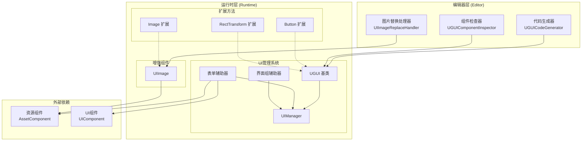
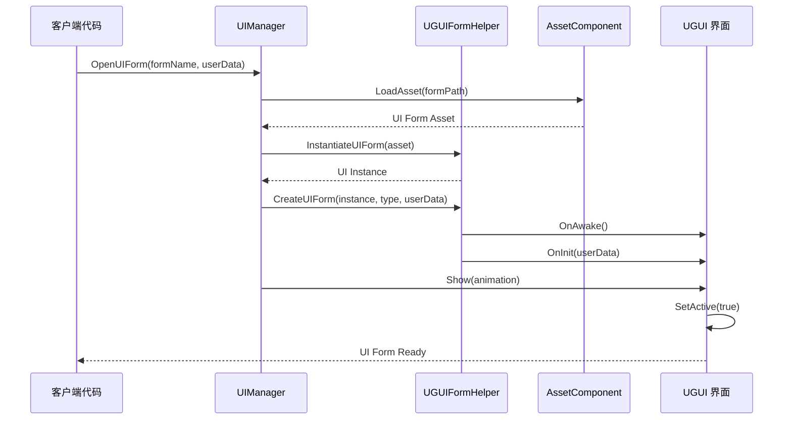
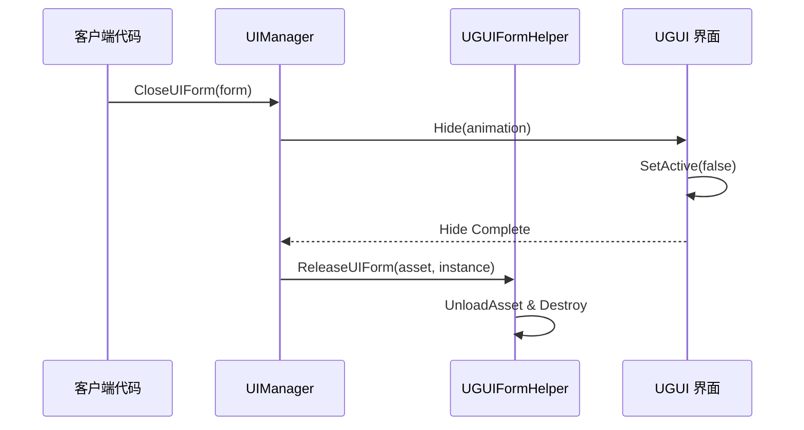

# 功能特性

GameFrameX UGUI 组件是 Unity UI 功能包，提供对 Unity UGUI 组件的高级封装，使 UGUI 组件的使用更加简单高效。该插件与 Game Frame X 框架无缝集成，提供完整的 UI 界面管理、代码生成和扩展方法功能。

## 概述

本插件为 Unity 游戏开发提供了一套完整的 UGUI 解决方案，主要包括以下几个核心功能模块：

- **UGUI组件封装**：提供对 Unity UGUI 组件的高级封装，简化 UI 开发流程
- **UI管理器**：完整的 UI 界面管理系统，处理界面的打开、关闭和生命周期管理
- **代码生成器**：自动从 UI 预制体生成代码，大幅提高开发效率
- **扩展方法**：为常用 UGUI 组件提供丰富的链式扩展方法
- **表单辅助器**：UI 表单创建和管理的辅助工具

这些功能模块相互协作，共同构成了一个完整的 UGUI 开发解决方案。插件设计遵循 Game Frame X 框架的架构规范，可以与框架的其他组件（如资源管理、事件系统）无缝集成。

## 架构

插件采用分层架构设计，主要分为运行时层和编辑器层。运行时层包含 UI 管理的核心逻辑和扩展功能，编辑器层提供可视化的开发工具。



### 架构说明

**编辑器层** 提供了三个主要的开发工具：代码生成器用于自动生成 UI 代码、组件检查器用于在 Inspector 面板中可视化操作 UI 组件、图片替换处理器用于将标准 Image 组件替换为增强的 UIImage 组件。

**运行时层** 是插件的核心，包含三个主要部分：UI 管理系统负责界面的生命周期管理，增强组件提供了功能扩展的 UI 元素，扩展方法为常用的 UGUI 组件添加了便捷的操作方法。

**外部依赖** 部分展示了插件与 Game Frame X 框架其他组件的集成关系，包括资源组件和 UI 组件。

## 核心功能详解

### UI 管理系统

UI 管理系统是插件的核心，负责管理游戏中所有 UI 界面的生命周期。该系统由四个主要类组成：UGUI 作为所有 UI 界面的基类、UIManager 作为界面管理器、UGUIFormHelper 作为表单辅助器、UGUIUIGroupHelper 作为界面组辅助器。

**UGUI 基类** 继承自 UIForm，提供了 UGUI 特定的界面功能实现。它负责处理界面的显示和隐藏操作，通过可选的动画效果增强用户体验，同时提供可见性控制功能。

```csharp
public class MainMenuUI : UGUI
{
    protected override void OnInit(object userData)
    {
        base.OnInit(userData);
        // 初始化UI逻辑
    }
    
    protected override void OnOpen(object userData)
    {
        base.OnOpen(userData);
        // UI打开时的逻辑
    }
    
    protected override void OnClose(bool isShutdown, object userData)
    {
        base.OnClose(isShutdown, userData);
        // UI关闭时的逻辑
    }
}
```
> Source: [README.md](https://github.com/GameFrameX/com.gameframex.unity.ui.ugui/blob/main/README.md#L78-L102)

**UIManager** 是界面管理器的具体实现，继承自 BaseUIManager，负责处理 UI 表单的加载、缓存和生命周期管理。它与框架的 UI 组件紧密集成，提供统一的界面访问接口。

**UGUIFormHelper** 是默认的界面辅助器，实现了 UIFormHelperBase 接口。它负责处理 UI 表单的实例化、创建和释放。在创建界面时，它会自动处理界面组分配、动画配置等细节。

**UGUIUIGroupHelper** 是界面组辅助器，管理 UI 组的层级和层次结构。它提供深度设置功能，确保不同界面组之间的正确遮挡关系。

### 增强组件

**UIImage** 是对 Unity 标准 Image 组件的扩展，增加了通过资源路径异步加载图标的功能。当设置 icon 属性时，它会自动从资源系统加载纹理并创建 Sprite。

```csharp
[DisallowMultipleComponent]
public class UIImage : UnityEngine.UI.Image
{
    public string icon
    {
        get { return m_icon; }
        set
        {
            if (m_icon != value)
            {
                m_icon = value;
                _ = this.SetIconAsync(m_icon);
            }
        }
    }
}
```
> Source: [Runtime/UIImage.cs](https://github.com/GameFrameX/com.gameframex.unity.ui.ugui/blob/main/Runtime/UIImage.cs#L40-L72)

使用 UIImage 组件可以简化图标加载的代码：

```csharp
public class IconDisplay : MonoBehaviour
{
    [SerializeField] private UIImage iconImage;
    
    void Start()
    {
        // 设置图标，支持异步加载
        iconImage.icon = "UI/Icons/PlayerAvatar";
    }
}
```
> Source: [README.md](https://github.com/GameFrameX/com.gameframex.unity.ui.ugui/blob/main/README.md#L143-L156)

### 扩展方法

插件提供了三个主要的扩展方法类，分别针对 Button、Image 和 RectTransform 组件。

**UGUIButtonExtension** 为按钮的点击事件提供了便捷的扩展方法，包括添加、移除、清除和设置点击事件。

```csharp
public static class UGUIBOttonExtension
{
    // 添加按钮点击事件
    public static void Add(this Button.ButtonClickedEvent self, UnityAction action);
    
    // 移除按钮点击事件
    public static void Remove(this Button.ButtonClickedEvent self, UnityAction action);
    
    // 清除按钮点击事件
    public static void Clear(this Button.ButtonClickedEvent self);
    
    // 设置按钮点击事件（替换现有事件）
    public static void Set(this Button.ButtonClickedEvent self, UnityAction action);
}
```
> Source: [Runtime/UGUIButtonExtension.cs](https://github.com/GameFrameX/com.gameframex.unity.ui.ugui/blob/main/Runtime/UGUIButtonExtension.cs#L42-L101)

使用扩展方法的示例：

```csharp
startButton.onClick.Add(OnStartButtonClick);
```
> Source: [README.md](https://github.com/GameFrameX/com.gameframex.unity.ui.ugui/blob/main/README.md#L119-L119)

**UGUIImageExtension** 提供了异步设置图标的功能，它通过资源系统加载纹理并创建 Sprite。

```csharp
public static class UGUIImageExtension
{
    public static async Task SetIconAsync(this UnityEngine.UI.Image self, string icon)
    {
        var assetComponent = GameEntry.GetComponent<AssetComponent>();
        using (var valueHandle = await assetComponent.LoadAssetAsync<Texture2D>(icon))
        {
            if (valueHandle.IsDone && valueHandle.Status == EOperationStatus.Succeed)
            {
                var texture2D = valueHandle.GetAssetObject<Texture2D>();
                self.sprite = Sprite.Create(texture2D, new Rect(0, 0, texture2D.width, texture2D.height), new Vector2(0.5f, 0.5f));
            }
        }
    }
}
```
> Source: [Runtime/UGUIImageExtension.cs](https://github.com/GameFrameX/com.gameframex.unity.ui.ugui/blob/main/Runtime/UGUIImageExtension.cs#L44-L74)

**RectTransformExtension** 提供了 MakeFullScreen 方法，可以将 RectTransform 设置为全屏。

```csharp
public static class RectTransformExtension
{
    public static void MakeFullScreen(this RectTransform rectTransform)
    {
        rectTransform.anchorMin = Vector2.zero;
        rectTransform.anchorMax = Vector2.one;
        rectTransform.anchoredPosition = Vector2.zero;
        rectTransform.sizeDelta = Vector2.zero;
    }
}
```
> Source: [Runtime/RectTransformExtension.cs](https://github.com/GameFrameX/com.gameframex.unity.ui.ugui/blob/main/Runtime/RectTransformExtension.cs#L56-L62)

### 编辑器工具

插件提供了三个编辑器工具来提高开发效率。

**UGUICodeGenerator** 是 UGUI 代码生成器，可以从 UI 预制体自动生成代码。它通过菜单项 `GameObject/UI/Generate UGUI Code(生成UGUI代码)` 访问，自动扫描预制体中的所有 UI 组件并生成对应的代码。

```csharp
[MenuItem("GameObject/UI/Generate UGUI Code(生成UGUI代码)", false, 1)]
static void Code()
{
    // 代码生成逻辑
}
```
> Source: [Editor/UGUICodeGenerator.cs](https://github.com/GameFrameX/com.gameframex.unity.ui.ugui/blob/main/Editor/UGUICodeGenerator.cs#L56-L73)

生成的代码包含以下特性：

- 自动识别所有 UI 子节点并生成属性声明
- 使用 `UGUIElementPropertyAttribute` 标记每个控件的路径
- 生成 `InitView()` 方法进行初始化绑定
- 支持自定义类型转换处理器

**UGUIComponentInspector** 是 UGUI 组件的自定义检查器，提供了两个主要功能按钮："重新生成代码"和"重新绑定列表"。

```csharp
[CustomEditor(typeof(Runtime.UGUI), true)]
internal sealed class UGUIComponentInspector : GameFrameworkInspector
{
    public override void OnInspectorGUI()
    {
        // 提供"重新生成代码"和"重新绑定列表"功能
    }
}
```
> Source: [Editor/UGUIComponentInspector.cs](https://github.com/GameFrameX/com.gameframex.unity.ui.ugui/blob/main/Editor/UGUIComponentInspector.cs#L43-L153)

**UIImageReplaceHandler** 提供了将标准 Image 组件替换为 UIImage 组件的功能，通过菜单项 `CONTEXT/Image/Replace To UIImage(替换为UIImage)` 访问。

```csharp
[MenuItem("CONTEXT/Image/Replace To UIImage(替换为UIImage)", false, 10)]
static void Run()
{
    // 替换逻辑，保留原Image的所有属性
}
```
> Source: [Editor/UIImageReplaceHandler.cs](https://github.com/GameFrameX/com.gameframex.unity.ui.ugui/blob/main/Editor/UIImageReplaceHandler.cs#L42-L76)

### 属性特性

**UGUIElementPropertyAttribute** 用于标记 UI 控件在预制体中的路径，配合代码生成器使用。

```csharp
public sealed class UGUIElementPropertyAttribute : Attribute
{
    public string Path { get; }
    
    public UGUIElementPropertyAttribute(string path)
    {
        Path = path;
    }
}
```
> Source: [Runtime/UGUIElementPropertyAttribute.cs](https://github.com/GameFrameX/com.gameframex.unity.ui.ugui/blob/main/Runtime/UGUIElementPropertyAttribute.cs#L40-L64)

## 界面打开与关闭流程

UI 界面在游戏中的打开和关闭遵循特定的流程，涉及到多个组件的协作。



当需要关闭界面时，流程如下：



## 使用示例

### 创建自定义 UI 界面

继承 UGUI 基类创建自定义界面，重写生命周期方法处理业务逻辑：

```csharp
using GameFrameX.UI.UGUI.Runtime;
using UnityEngine;

public class MainMenuUI : UGUI
{
    protected override void OnInit(object userData)
    {
        base.OnInit(userData);
        // 初始化UI逻辑
    }
    
    protected override void OnOpen(object userData)
    {
        base.OnOpen(userData);
        // UI打开时的逻辑
    }
    
    protected override void OnClose(bool isShutdown, object userData)
    {
        base.OnClose(isShutdown, userData);
        // UI关闭时的逻辑
    }
}
```
> Source: [README.md](https://github.com/GameFrameX/com.gameframex.unity.ui.ugui/blob/main/README.md#L78-L102)

### 使用扩展方法

在 MonoBehaviour 中使用扩展方法简化 UI 操作：

```csharp
using GameFrameX.UI.UGUI.Runtime;
using UnityEngine.UI;

public class UIController : MonoBehaviour
{
    [SerializeField] private Button startButton;
    [SerializeField] private Image iconImage;
    [SerializeField] private RectTransform panel;
    
    void Start()
    {
        // 按钮扩展方法
        startButton.onClick.Add(OnStartButtonClick);
        
        // 图片扩展方法
        iconImage.SetIcon("UI/Icons/StartIcon");
        
        // RectTransform扩展方法
        panel.MakeFullScreen();
    }
    
    private void OnStartButtonClick()
    {
        Debug.Log("Start button clicked!");
    }
}
```
> Source: [README.md](https://github.com/GameFrameX/com.gameframex.unity.ui.ugui/blob/main/README.md#L106-L133)

### 使用代码生成器

1. 在 Hierarchy 中选择一个 UGUI 预制体
2. 右键选择 `GameObject/UI/Generate UGUI Code(生成UGUI代码)`
3. 代码将自动生成到 `Assets/Hotfix/UI/UGUI/` 目录下

生成的代码结构如下：

```csharp
[DisallowMultipleComponent]
[OptionUIConfig(null, "Assets/Prefabs/UI")]
public sealed partial class MainMenuUI : UGUI
{
    public GameObject self { get; private set; }

    [SerializeField] [UGUIElementProperty("Background")]
    private UnityEngine.UI.Image m_Background;

    [SerializeField] [UGUIElementProperty("StartButton")]
    private UnityEngine.UI.Button m_StartButton;

    protected override void InitView()
    {
        if (_isInitView) return;
        _isInitView = true;
        this.self = this.gameObject;
        m_Background = gameObject.transform.FindChildName("Background").GetComponent<UnityEngine.UI.Image>();
        m_StartButton = gameObject.transform.FindChildName("StartButton").GetComponent<UnityEngine.UI.Button>();
    }
}
```
> Source: [Editor/UGUICodeGenerator.cs](https://github.com/GameFrameX/com.gameframex.unity.ui.ugui/blob/main/Editor/UGUICodeGenerator.cs#L199-L230)

## 相关链接

- [插件介绍](./1-overview.introduction) - 了解插件的概述和设计理念
- [安装方式](./2-installation.methods) - 获取插件的安装步骤
- [UGUI基类](./4-core-concepts.ugui-base) - UGUI 基类的详细文档
- [UI管理器](./4-core-concepts.ui-manager) - UI 管理器的详细文档
- [表单辅助器](./4-core-concepts.form-helper) - 表单辅助器的详细文档
- [UIImage组件](./5-components.uiimage) - UIImage 组件的详细文档
- [扩展方法](./5-components.extensions) - 扩展方法的详细文档
- [代码生成器](./6-editor-tools.code-generator) - 代码生成器的详细文档
- [组件检查器](./6-editor-tools.inspector) - 组件检查器的详细文档
- [图片替换处理器](./6-editor-tools.image-replace) - 图片替换处理器的详细文档
