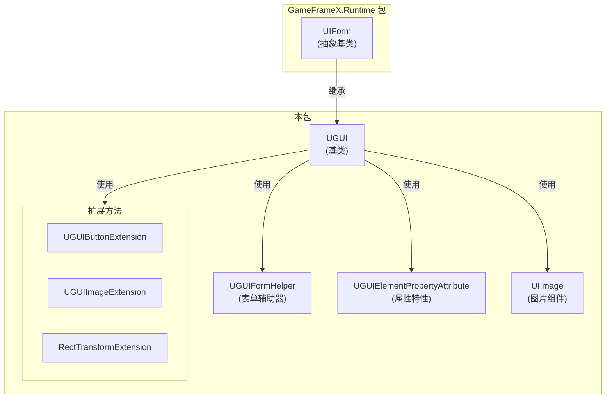
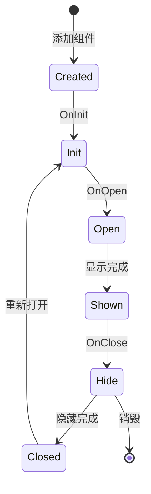

# UGUI基类

UGUI基类是GameFrameX UGUI模块的核心类，提供UGUI特定的界面功能实现。所有UGUI界面都需要继承此类来获得完整的UI生命周期管理和显示控制能力。

## 概述

`UGUI` 类是Unity UGUI界面的基类，继承自 `UIForm`。它封装了Unity UGUI的特定实现，提供了界面显示/隐藏、可见性控制、全屏布局等核心功能。通过继承此基类，开发者可以快速创建、管理和操作UGUI界面，同时与GameFrameX的UI管理系统无缝集成。

该类使用 `[DisallowMultipleComponent]` 特性确保每个GameObject只能添加一个UGUI组件，防止重复添加导致的逻辑错误。

## 核心功能

### 界面显示与隐藏

UGUI基类重写了父类的显示和隐藏方法，支持带动画的界面切换效果：

- **Show方法**: 显示界面，支持通过 `IUIFormShowHandler` 处理显示动画
- **Hide方法**: 隐藏界面，支持通过 `IUIFormHideHandler` 处理隐藏动画

### 可见性管理

提供了两种控制界面可见性的方式：

1. **受保护的InternalSetVisible方法**: 设置UI的显示状态，不发出任何事件，适用于内部状态同步
2. **公共Visible属性**: 获取或设置界面的可见性，会触发GameObject的激活/停用状态

### 全屏布局

`MakeFullScreen` 方法可以将UI元素设置为全屏模式，自动配置锚点、位置和尺寸：
- 锚点设置为 (0,0) 到 (1,1)
- 锚点位置设置为 (0,0)
- 尺寸增量设置为 Vector2.zero

## 架构设计



### 类关系说明

| 组件 | 角色 | 说明 |
|------|------|------|
| UIForm | 父类抽象基 | 提供UI界面的抽象接口和生命周期管理 |
| UGUI | 核心类 | UGUI特定的界面实现，处理Unity UGUI细节 |
| UGUIFormHelper | 辅助器 | 处理UI表单的实例化、创建和释放 |
| UGUIElementPropertyAttribute | 特性 | 标记UI控件在预制体中的路径 |
| UIImage | 组件 | 扩展的图片组件，支持异步图标加载 |
| 扩展方法 | 工具集 | 提供便捷的组件操作方法 |

## 界面生命周期



## 使用示例

### 创建自定义UGUI界面

```csharp
using GameFrameX.UI.UGUI.Runtime;
using UnityEngine;

public class MainMenuUI : UGUI
{
    protected override void OnInit(object userData)
    {
        base.OnInit(userData);
        // 初始化UI逻辑
    }
    
    protected override void OnOpen(object userData)
    {
        base.OnOpen(userData);
        // UI打开时的逻辑
    }
    
    protected override void OnClose(bool isShutdown, object userData)
    {
        base.OnClose(isShutdown, userData);
        // UI关闭时的逻辑
    }
}
```
> Source: [UGUI.cs](https://github.com/GameFrameX/com.gameframex.unity.ui.ugui/blob/main/Runtime/UGUI.cs#L46-L179)

### 使用UGUIElementPropertyAttribute绑定控件

```csharp
using GameFrameX.UI.UGUI.Runtime;
using UnityEngine;
using UnityEngine.UI;

public class GameStartUI : UGUI
{
    // 使用特性标记控件路径
    [SerializeField]
    [UGUIElementProperty("StartButton")]
    private Button m_StartButton;

    [SerializeField]
    [UGUIElementProperty("Title/Text")]
    private Text m_TitleText;

    public Button StartButton => m_StartButton;
    public Text TitleText => m_TitleText;

    protected override void OnInit(object userData)
    {
        base.OnInit(userData);
        // 绑定按钮事件
        m_StartButton.onClick.AddListener(OnStartClick);
    }

    private void OnStartClick()
    {
        Debug.Log("开始游戏按钮被点击");
    }
}
```
> Source: [UGUIElementPropertyAttribute.cs](https://github.com/GameFrameX/com.gameframex.unity.ui.ugui/blob/main/Runtime/UGUIElementPropertyAttribute.cs#L40-L64)

### 设置全屏UI

```csharp
using GameFrameX.UI.UGUI.Runtime;
using UnityEngine;

public class FullScreenPanel : MonoBehaviour
{
    private void Start()
    {
        // 获取或添加RectTransform并设置为全屏
        gameObject.GetOrAddComponent<RectTransform>().MakeFullScreen();
    }
}
```
> Source: [RectTransformExtension.cs](https://github.com/GameFrameX/com.gameframex.unity.ui.ugui/blob/main/Runtime/RectTransformExtension.cs#L56-L62)

## 代码生成器集成

UGUI基类与代码生成器紧密集成。代码生成器会自动为UGUI预制体生成继承自UGUI的代码类：

```csharp
// 代码生成器生成的代码结构示例
namespace Hotfix.UI
{
    /// <summary>
    /// 代码生成的UI代码MainMenu
    /// </summary>
    [DisallowMultipleComponent]
    [OptionUIConfig(null, "Assets/Prefabs/UI/MainMenu")]
    public sealed partial class MainMenu : UGUI
    {
        public GameObject self { get; private set; }

        [SerializeField]
        [UGUIElementProperty("Panel/StartButton")]
        private Button m_StartButton;

        public Button m_StartButton => m_StartButton;

        private bool _isInitView = false;

        protected override void InitView()
        {
            if (_isInitView)
            {
                return;
            }

            _isInitView = true;
            this.self = this.gameObject;
            m_StartButton = gameObject.transform.FindChildName("Panel/StartButton").GetComponent<Button>();
        }
    }
}
```
> Source: [UGUICodeGenerator.cs](https://github.com/GameFrameX/com.gameframex.unity.ui.ugui/blob/main/Editor/UGUICodeGenerator.cs#L195-L230)

## 相关链接

- [UI管理器](./4-core-concepts.ui-manager) - 了解UI界面的整体管理系统
- [表单辅助器](./4-core-concepts.form-helper) - 了解UI表单创建和管理辅助工具
- [UIImage组件](./5-components.uiimage) - 了解扩展的图片组件
- [扩展方法](./5-components.extensions) - 了解按钮、图片、RectTransform的扩展方法
- [代码生成器](./6-editor-tools.code-generator) - 了解如何自动生成UGUI代码
- [官方文档](https://gameframex.doc.alianblank.com) - 获取更多详细信息
