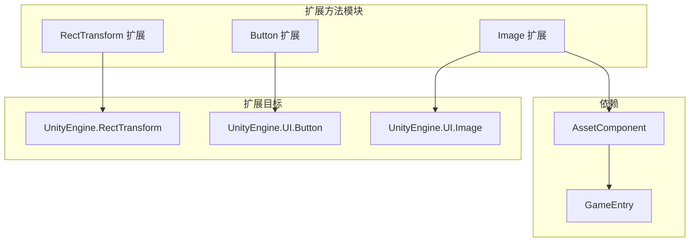

# 扩展方法

提供便捷的扩展方法，增强 UGUI 组件的功能，简化常见 UI 操作的代码编写。

## 概述

扩展方法是 GameFrameX UGUI 插件提供的一组静态扩展方法，通过 C# 扩展方法语法为 Unity 内置的 UGUI 组件添加便捷功能。这些扩展方法涵盖了 UI 布局、按钮事件处理和图片异步加载等常见场景，能够显著减少样板代码，提升开发效率。

所有扩展方法都位于 `GameFrameX.UI.UGUI.Runtime` 命名空间下，使用 `[Preserve]` 属性标记以确保在 IL2CPP 等代码裁剪环境中不会丢失。

## 架构

扩展方法按照目标组件进行分类，主要分为三类：



### 扩展方法分类

| 扩展类 | 目标组件 | 主要功能 |
|--------|----------|----------|
| `RectTransformExtension` | `RectTransform` | 快速设置全屏布局 |
| `UGUIButtonExtension` | `Button.ButtonClickedEvent` | 简化按钮事件绑定 |
| `UGUIImageExtension` | `UnityEngine.UI.Image` | 异步加载图标资源 |

## RectTransform 扩展

`RectTransformExtension` 类为 `RectTransform` 组件提供布局相关的扩展方法。

### MakeFullScreen

将当前 UI 对象设置为全屏显示。

```csharp
public static void MakeFullScreen(this RectTransform rectTransform)
```

**实现原理：**

该方法通过设置 RectTransform 的四个关键属性来实现全屏效果：

1. `anchorMin = Vector2.zero` - 设置锚点最小值为 (0,0)，即父容器左下角
2. `anchorMax = Vector2.one` - 设置锚点最大值为 (1,1)，即父容器右上角
3. `anchoredPosition = Vector2.zero` - 重置锚点位置为零
4. `sizeDelta = Vector2.zero` - 设置尺寸增量为零，使元素完全填满父容器

> Source: [RectTransformExtension.cs](https://github.com/GameFrameX/com.gameframex.unity.ui.ugui/blob/main/Runtime/RectTransformExtension.cs#L56-L62)

**使用示例：**

```csharp
using GameFrameX.UI.UGUI.Runtime;

// 假设有一个 RectTransform 引用
RectTransform fullScreenPanel = someUIObject.GetComponent<RectTransform>();

// 一行代码设置为全屏
fullScreenPanel.MakeFullScreen();
```

## Button 扩展

`UGUIButtonExtension` 类为 `Button.ButtonClickedEvent` 提供事件处理相关的扩展方法，简化按钮点击事件的绑定和管理。

### 方法列表

| 方法 | 功能描述 |
|------|----------|
| `Add` | 添加按钮点击事件监听器 |
| `Remove` | 移除按钮点击事件监听器 |
| `Clear` | 清除所有按钮点击事件监听器 |
| `Set` | 设置按钮点击事件（替换现有事件） |
| `Set(action, userData)` | 设置带用户数据的点击事件 |

### Add

添加按钮点击事件监听器。

```csharp
public static void Add(this Button.ButtonClickedEvent self, UnityAction action)
```

**参数：**
- `self`: 按钮的点击事件集合
- `action`: 点击时要执行的回调

> Source: [UGUIButtonExtension.cs](https://github.com/GameFrameX/com.gameframex.unity.ui.ugui/blob/main/Runtime/UGUIButtonExtension.cs#L52-L57)

### Remove

移除指定的按钮点击事件监听器。

```csharp
public static void Remove(this Button.ButtonClickedEvent self, UnityAction action)
```

> Source: [UGUIButtonExtension.cs](https://github.com/GameFrameX/com.gameframex.unity.ui.ugui/blob/main/Runtime/UGUIButtonExtension.cs#L67-L72)

### Clear

清除所有按钮点击事件监听器。

```csharp
public static void Clear(this Button.ButtonClickedEvent self)
```

> Source: [UGUIButtonExtension.cs](https://github.com/GameFrameX/com.gameframex.unity.ui.ugui/blob/main/Runtime/UGUIButtonExtension.cs#L81-L85)

### Set

设置按钮点击事件，将原有事件全部替换为新事件。

```csharp
public static void Set(this Button.ButtonClickedEvent self, UnityAction action)
```

> Source: [UGUIButtonExtension.cs](https://github.com/GameFrameX/com.gameframex.unity.ui.ugui/blob/main/Runtime/UGUIButtonExtension.cs#L95-L101)

### Set (带用户数据)

设置带用户数据的按钮点击事件。

```csharp
public static void Set(this Button.ButtonClickedEvent self, UnityAction<object> action, object userData)
```

**参数：**
- `self`: 按钮的点击事件集合
- `action`: 带用户数据参数的回调函数
- `userData`: 传递给回调的用户自定义数据

> Source: [UGUIButtonExtension.cs](https://github.com/GameFrameX/com.gameframex.unity.ui.ugui/blob/main/Runtime/UGUIButtonExtension.cs#L112-L124)

**使用示例：**

```csharp
using GameFrameX.UI.UGUI.Runtime;
using UnityEngine.UI;
using UnityEngine;

// 获取按钮组件
Button button = GetComponent<Button>();

// 添加点击事件
button.onClick.Add(() => {
    Debug.Log("按钮被点击");
});

// 使用带参数的事件
button.onClick.Set((userData) => {
    Debug.Log($"按钮被点击，用户数据: {userData}");
}, "自定义数据");

// 清除所有事件
button.onClick.Clear();
```

## Image 扩展

`UGUIImageExtension` 类为 `UnityEngine.UI.Image` 提供异步加载图标的功能。

### SetIconAsync

异步设置图片图标。

```csharp
public static async Task SetIconAsync(this UnityEngine.UI.Image self, string icon)
```

**参数：**
- `self`: 目标图片组件
- `icon`: 图标资源路径（相对于资源目录）

**返回值：**
- 返回 `Task` 异步任务

**实现原理：**

1. 通过 `GameEntry.GetComponent<AssetComponent>()` 获取资源组件
2. 使用 `LoadAssetAsync<Texture2D>` 异步加载纹理资源
3. 将加载的 `Texture2D` 转换为 `Sprite` 对象
4. 将生成的 Sprite 赋值给 Image 组件的 sprite 属性

> Source: [UGUIImageExtension.cs](https://github.com/GameFrameX/com.gameframex.unity.ui.ugui/blob/main/Runtime/UGUIImageExtension.cs#L55-L74)

**异常处理：**

该方法内置了 try-catch 异常处理机制，加载失败时会输出错误日志但不会抛出异常，确保 UI 不会因资源加载失败而崩溃。

**使用示例：**

```csharp
using GameFrameX.UI.UGUI.Runtime;
using UnityEngine.UI;

// 获取 Image 组件
Image iconImage = GetComponent<Image>();

// 异步加载并设置图标
await iconImage.SetIconAsync("icons/player_avatar");

// 可以配合 UIFormHelper 使用
await iconImage.SetIconAsync(formHelper.GetIconPath("item_001"));
```

## 常见使用场景

### 场景一：创建全屏弹窗

```csharp
// 创建全屏半透明背景
GameObject bgObj = new GameObject("PopupBackground");
bgObj.transform.SetParent(canvas.transform);
RectTransform bgRT = bgObj.AddComponent<RectTransform>();
Image bgImage = bgObj.AddComponent<Image>();
bgImage.color = new Color(0, 0, 0, 0.5f);

// 设置为全屏
bgRT.MakeFullScreen();
```

### 场景二：批量设置按钮事件

```csharp
// 批量绑定按钮事件
Button[] buttons = GetComponentsInChildren<Button>();
foreach (var btn in buttons)
{
    btn.onClick.Set(() => OnButtonClick(btn.name));
}
```

### 场景三：异步加载物品图标

```csharp
// 在 UIForm 的加载流程中异步设置图标
public async void LoadItemIcon(Image iconImage, string itemId)
{
    await iconImage.SetIconAsync($"icons/items/{itemId}");
}
```

## 相关链接

- [UIImage 组件](./5-components.uiimage) - UIImage 组件文档
- [UGUI 基类](./4-core-concepts.ugui-base) - UGUI 基类介绍
- [UI 管理器](./4-core-concepts.ui-manager) - UI 管理器文档
- [表单辅助器](./4-core-concepts.form-helper) - 表单辅助器文档
