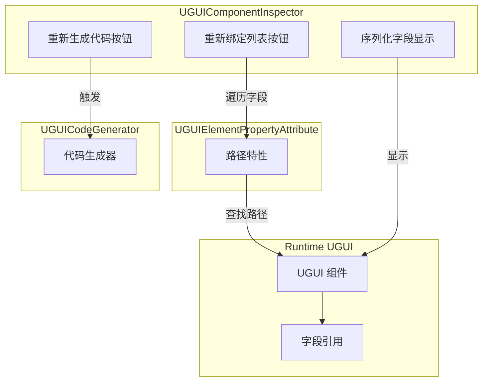
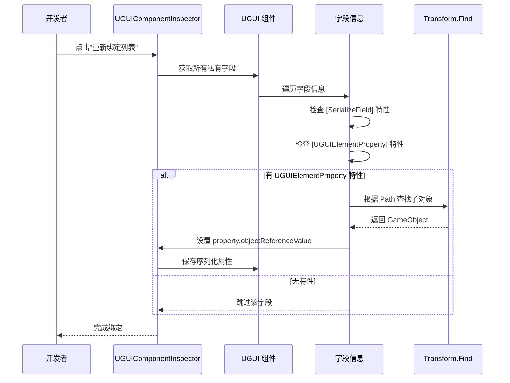

# 组件检查器

组件检查器是 UGUI 插件的核心编辑器工具之一，用于在 Unity Editor 中自定义 UGUI 组件的检视面板。该检查器为开发者提供了便捷的代码生成和引用绑定功能，大大提升了 UI 开发效率。

## 概述

组件检查器（`UGUIComponentInspector`）是专门为 `UGUI` 基类组件定制的 Unity Editor 自定义检视面板。它继承自 `GameFrameworkInspector` 基类，提供了两个核心功能按钮，用于自动化 UI 开发流程中的重复性工作。

### 设计目的

在传统的 UGUI 开发模式中，开发者需要手动创建 UI 预制体、编写代码来引用各个 UI 元素，并在 Inspector 中逐个拖拽绑定引用。这种方式不仅效率低下，而且当 UI 结构发生变化时，需要手动更新大量引用。

组件检查器通过以下设计来解决这些问题：

1. **代码自动生成**：通过代码生成器自动遍历 UI 预制体结构，生成带有 `[UGUIElementProperty]` 特性的属性代码
2. **引用自动绑定**：通过检查器按钮一键重新绑定所有 UI 元素引用，无需手动拖拽

### 核心功能

- **重新生成代码**：基于当前预制体结构重新生成 UI 代码文件
- **重新绑定列表**：根据特性中的路径信息，自动查找并绑定 UI 元素引用

> Source: [UGUIComponentInspector.cs](https://github.com/GameFrameX/com.gameframex.unity.ui.ugui/blob/main/Editor/UGUIComponentInspector.cs#L44-L153)

## 架构设计

组件检查器的架构设计遵循了 Unity Editor 扩展的开发模式，通过自定义 Inspector 来增强 Editor 的功能。



### 组件说明

| 组件 | 文件位置 | 职责 |
|------|----------|------|
| UGUIComponentInspector | Editor/UGUIComponentInspector.cs | 自定义检视面板，提供按钮交互 |
| UGUIElementPropertyAttribute | Runtime/UGUIElementPropertyAttribute.cs | 特性类，标记 UI 元素路径 |
| UGUICodeGenerator | Editor/UGUICodeGenerator.cs | 代码生成器，生成 UI 代码 |
| UGUI | Runtime/UGUI.cs | UGUI 基类，被检查器扩展 |

> Source: [UGUIElementPropertyAttribute.cs](https://github.com/GameFrameX/com.gameframex.unity.ui.ugui/blob/main/Runtime/UGUIElementPropertyAttribute.cs#L40-L64)

## 核心实现

### 检查器类定义

检查器使用 `[CustomEditor]` 特性来声明自定义编辑器，继承自 `GameFrameworkInspector` 基类：

```csharp
[CustomEditor(typeof(Runtime.UGUI), true)]
internal sealed class UGUIComponentInspector : GameFrameworkInspector
{
    private GUIStyle _customButtonStyle;

    private readonly GUIContent _reBind = new GUIContent("重新绑定列表");
    private readonly GUIContent _reGenerate = new GUIContent("重新生成代码");

    public override void OnInspectorGUI()
    {
        // 检查器 GUI 实现
    }
}
```

> Source: [UGUIComponentInspector.cs](https://github.com/GameFrameX/com.gameframex.unity.ui.ugui/blob/main/Editor/UGUIComponentInspector.cs#L43-L80)

### 自定义按钮样式

检查器提供了自定义的按钮样式，采用大号字体和彩色文字设计，方便开发者识别操作按钮：

```csharp
private GUIStyle CustomButtonStyle
{
    get
    {
        if (_customButtonStyle == null)
        {
            _customButtonStyle = new GUIStyle(GUI.skin.button)
            {
                fontSize = 32,
                normal = { textColor = Color.green },
                hover = { textColor = Color.yellow },
                active = { textColor = Color.green },
                alignment = TextAnchor.MiddleCenter,
            };
        }
        return _customButtonStyle;
    }
}
```

> Source: [UGUIComponentInspector.cs](https://github.com/github.com/GameFrameX/com.gameframex.unity.ui.ugui/blob/main/Editor/UGUIComponentInspector.cs#L48-L75)

## 核心流程

### 重新绑定流程

当开发者点击"重新绑定列表"按钮时，检查器会执行以下流程：



### 重新绑定实现代码

```csharp
bool buttonClicked = EditorGUILayout.DropdownButton(_reBind, FocusType.Passive, CustomButtonStyle);
if (buttonClicked && !EditorApplication.isPlaying)
{
    // 重新绑定
    Dictionary<string, string> fieldMap = new Dictionary<string, string>();
    foreach (var fieldInfo in fieldInfos)
    {
        var serializeFieldAttributes = fieldInfo.GetCustomAttribute(typeof(SerializeField));
        if (serializeFieldAttributes == null)
        {
            continue;
        }

        var uguiElementPropertyAttribute = fieldInfo.GetCustomAttribute(typeof(UGUIElementPropertyAttribute));
        if (uguiElementPropertyAttribute == null)
        {
            continue;
        }

        var elementPropertyAttribute = (UGUIElementPropertyAttribute)uguiElementPropertyAttribute;
        fieldMap[fieldInfo.Name] = elementPropertyAttribute.Path;
    }

    foreach (var kv in fieldMap)
    {
        var property = serializedObject.FindProperty(kv.Key);
        if (property != null)
        {
            var targetFind = targetGameObject.transform.Find(kv.Value);
            if (targetFind != null)
            {
                property.objectReferenceValue = targetFind.gameObject;
            }
        }
    }
}
```

> Source: [UGUIComponentInspector.cs](https://github.com/GameFrameX/com.gameframex.unity.ui.ugui/blob/main/Editor/UGUIComponentInspector.cs#L96-L131)

### 字段显示（只读模式）

检查器还会显示所有序列化字段，但设置为只读模式，防止在 Editor 中意外修改：

```csharp
// 编辑器下不允许修改
GUI.enabled = false;
foreach (var fieldInfo in fieldInfos)
{
    var attributes = fieldInfo.GetCustomAttributes(typeof(SerializeField));
    if (!attributes.Any())
    {
        continue;
    }

    EditorGUILayout.ObjectField(fieldInfo.Name, fieldInfo.GetValue(targetUGUI) as Object, fieldInfo.FieldType, true);
}

GUI.enabled = true;
```

> Source: [UGUIComponentInspector.cs](https://github.com/GameFrameX/com.gameframex.unity.ui.ugui/blob/main/Editor/UGUIComponentInspector.cs#L134-L147)

## UGUIElementProperty 特性

`UGUIElementPropertyAttribute` 是组件检查器工作的核心特性，用于标记 UI 控件在预制体中的路径。

### 特性定义

```csharp
/// <summary>
/// UGUI控件属性特性，用于标记UI控件在预制体中的路径。
/// </summary>
public sealed class UGUIElementPropertyAttribute : Attribute
{
    /// <summary>
    /// 获取控件路径。
    /// </summary>
    [UnityEngine.Scripting.Preserve]
    public string Path { get; }

    /// <summary>
    /// 初始化 <see cref="UGUIElementPropertyAttribute"/> 类的新实例。
    /// </summary>
    /// <param name="path">控件路径</param>
    [UnityEngine.Scripting.Preserve]
    public UGUIElementPropertyAttribute(string path)
    {
        Path = path;
    }
}
```

> Source: [UGUIElementPropertyAttribute.cs](https://github.com/GameFrameX/com.gameframex.unity.ui.ugui/blob/main/Runtime/UGUIElementPropertyAttribute.cs#L34-L64)

### 使用示例

代码生成器会自动生成带有此特性的属性代码：

```csharp
[SerializeField]
[UGUIElementProperty("Panel/Button_Start")]
private Button m_Button_Start;

public Button m_Button_Start
{
    get { return m_Button_Start; }
}
```

> Source: [UGUICodeGenerator.cs](https://github.com/GameFrameX/com.gameframex.unity.ui.ugui/blob/main/Editor/UGUICodeGenerator.cs#L259-L269)

## 使用场景

### 场景一：UI 结构变更后的重新绑定

当 UI 预制体结构发生变化（如重命名、调整层级）后，原有的引用会失效。此时只需：

1. 重新生成代码（或手动更新路径）
2. 点击"重新绑定列表"按钮
3. 检查器会自动根据新的路径查找并绑定 UI 元素

### 场景二：代码重构后的引用更新

在代码重构过程中，可能会修改字段名称或调整预制体结构。重新绑定功能可以快速恢复所有引用，而无需手动逐个拖拽。

### 场景三：多平台资源路径调整

当需要调整 UI 资源的组织结构时，通过重新生成代码和重新绑定，可以快速适应新的资源组织方式。

## 相关链接

- [代码生成器](./6-editor-tools.code-generator) - 了解代码自动生成功能
- [UGUI 基类](./4-core-concepts.ugui-base) - 了解 UGUI 基类实现
- [图片替换处理器](./6-editor-tools.image-replace) - 了解 UI 图片替换功能
- [快速开始 - 使用代码生成器](./3-getting-started.code-generator) - 快速上手指南
