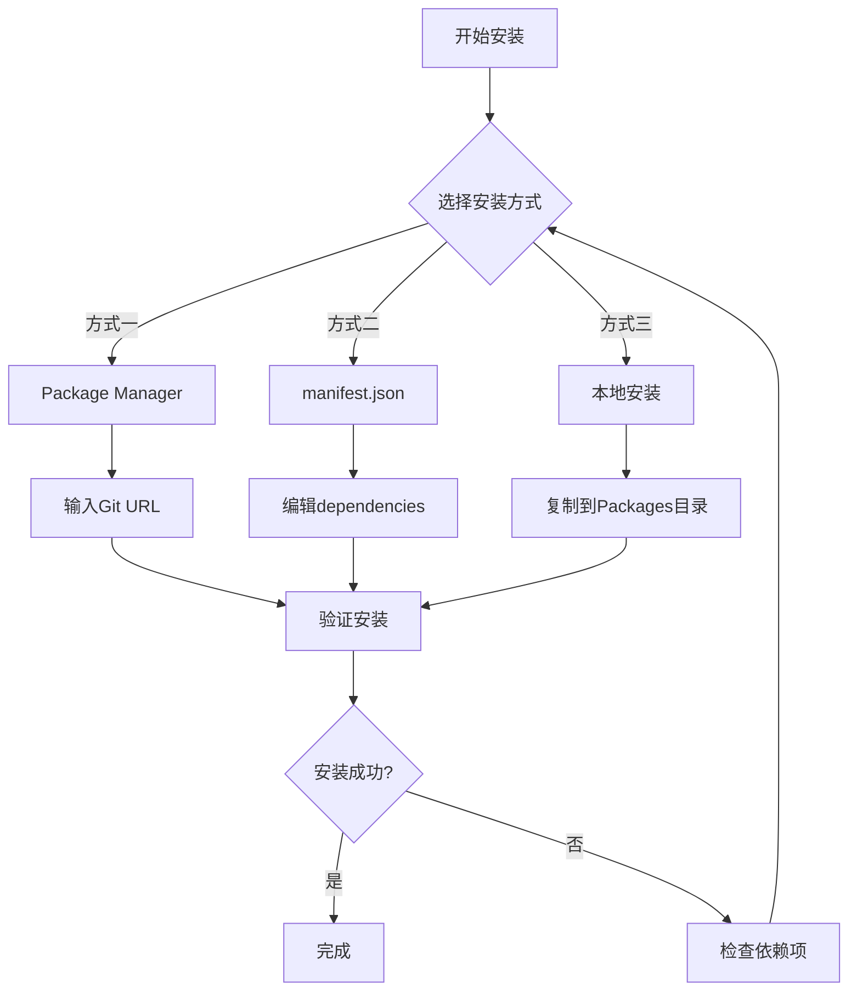
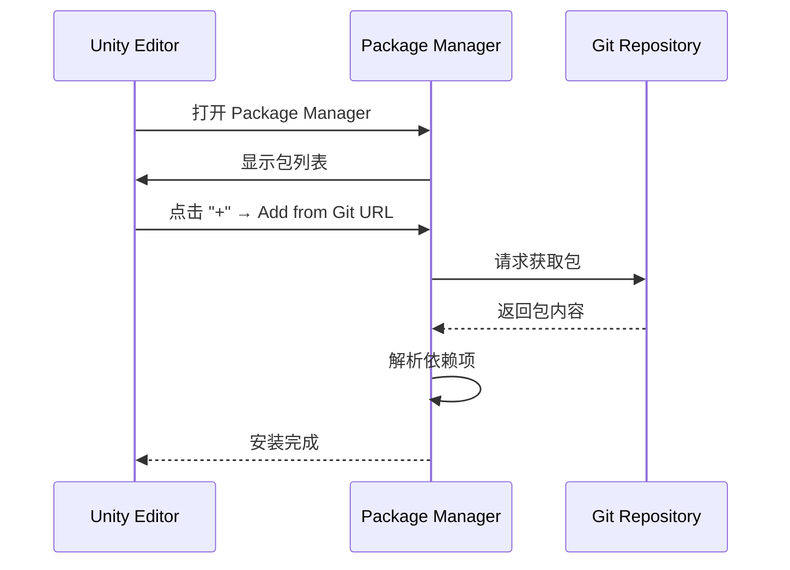

# 安装方式

本文档介绍 Game Frame X UI UGUI 包的多种安装方法，帮助开发者根据项目需求选择最适合的安装方式。

## 概述

Game Frame X UI UGUI 是 Unity UGUI 的增强组件库，提供了 UI 管理器、代码生成器、扩展方法等功能模块。该包遵循 Unity Package Manager (UPM) 标准，支持多种安装方式。

**包基本信息：**
- 包名：`com.gameframex.unity.ui.ugui`
- 当前版本：2.3.6
- Unity 版本要求：2019.4+
- Git 仓库：https://github.com/GameFrameX/com.gameframex.unity.ui.ugui.git

## 安装流程概览



## 前置依赖项

在安装本包之前，需要确保以下依赖包已正确安装：

| 依赖包 | 版本要求 | 说明 |
|--------|----------|------|
| com.gameframex.unity | 1.1.1 | 核心框架 |
| com.gameframex.unity.ui | 1.0.0 | UI基础包 |
| com.gameframex.unity.asset | 1.0.6 | 资源管理 |
| com.gameframex.unity.event | 1.0.0 | 事件系统 |

> **注意**：上述依赖包会在安装本包时自动尝试解析，如果依赖项安装失败，请参考 [依赖要求](./2-installation.dependencies) 文档进行手动处理。

## 安装方式

### 方式一：Package Manager（推荐）

使用 Unity 的 Package Manager 通过 Git URL 安装是官方推荐的方式，具有以下优点：
- 自动版本管理
- 依赖自动解析
- 便于更新到最新版本

**操作步骤：**

1. 打开 Unity 编辑器
2. 导航到 `Window` → `Package Manager`（窗口 → 包管理器）
3. 在包管理器左上角点击 **+** 按钮
4. 选择 **Add package from git URL**（从 Git URL 添加包）
5. 在输入框中粘贴以下地址：
   ```
   https://github.com/GameFrameX/com.gameframex.unity.ui.ugui.git
   ```
6. 点击 **Add**（添加）按钮等待安装完成



### 方式二：直接编辑 manifest.json

这种方式适合需要锁定特定版本或在没有网络环境的情况下进行开发。

**操作步骤：**

1. 找到项目中的 `Packages/manifest.json` 文件
2. 使用文本编辑器打开该文件
3. 在 `dependencies` 节点下添加以下内容：

```json
{
  "dependencies": {
    "com.gameframex.unity.ui.ugui": "https://github.com/GameFrameX/com.gameframex.unity.ui.ugui.git",
    "com.gameframex.unity": "1.1.1",
    "com.gameframex.unity.ui": "1.0.0",
    "com.gameframex.unity.asset": "1.0.6",
    "com.gameframex.unity.event": "1.0.0"
  }
}
```

> Source: [README.md](https://github.com/GameFrameX/com.gameframex.unity.ui.ugui/blob/main/README.md#L66-L69)

4. 保存文件并返回 Unity 编辑器
5. 等待 Unity 自动重新导入包

**版本锁定方式：**

如果需要安装特定版本，可以使用 Git 的版本标签：

```json
{
  "dependencies": {
    "com.gameframex.unity.ui.ugui": "https://github.com/GameFrameX/com.gameframex.unity.ui.ugui.git#2.3.6"
  }
}
```

### 方式三：本地安装

适用于无法访问外网或需要离线开发的场景。

**操作步骤：**

1. 克隆或下载 Git 仓库：
   ```
   https://github.com/GameFrameX/com.gameframex.unity.ui.ugui.git
   ```
2. 将仓库文件夹复制到 Unity 项目的 `Packages` 目录下
3. Unity 会自动识别并加载该包

> Source: [README.md](https://github.com/GameFrameX/com.gameframex.unity.ui.ugui/blob/main/README.md#L71-L72)

**目录结构要求：**

```
YourUnityProject/
└── Packages/
    └── com.gameframex.unity.ui.ugui/    ← 包根目录
        ├── package.json                  ← 必须
        ├── Runtime/                      ← 运行时程序集
        │   └── GameFrameX.UI.UGUI.Runtime.asmdef
        ├── Editor/                       ← 编辑器程序集
        │   └── GameFrameX.UI.UGUI.Editor.asmdef
        └── ...
```

## 安装验证

安装完成后，可以通过以下方式验证是否成功：

### 方法一：检查 Package Manager

在 Package Manager 窗口中搜索 `Game Frame X UI UGUI`，确认包已显示在列表中。

### 方法二：检查程序集

在 Unity 项目中确认以下程序集已正确加载：
- `GameFrameX.UI.UGUI.Runtime`
- `GameFrameX.UI.UGUI.Editor`

### 方法三：创建测试脚本

创建一个简单的测试脚本验证命名空间可用：

```csharp
using GameFrameX.UI.UGUI.Runtime;

public class InstallationTest : MonoBehaviour
{
    void Start()
    {
        Debug.Log("Game Frame X UI UGUI 安装成功！");
    }
}
```

> Source: [README.md](https://github.com/GameFrameX/com.gameframex.unity.ui.ugui/blob/main/README.md#L78-L102)

## 常见问题

### Q1: 安装后出现依赖项错误

**原因**：依赖的包版本不兼容或未安装

**解决方案**：
1. 打开 `Window` → `Package Manager`
2. 检查所有依赖包是否已正确安装
3. 参考 [依赖要求](./2-installation.dependencies) 手动安装缺失的依赖

### Q2: 无法从 Git URL 安装

**原因**：网络问题或 Git 凭证配置不正确

**解决方案**：
1. 确认网络可以访问 GitHub
2. 尝试使用本地安装方式
3. 配置 Git 凭证管理器

### Q3: 版本号后缀 ".git" 是什么含义

这是 Git 仓库的 URL 后缀，表示从远程仓库拉取代码。使用此格式时，Unity 会自动拉取最新版本。如果需要特定版本，请使用 `#version` 格式指定版本标签。

## 相关链接

- [依赖要求](./2-installation.dependencies) - 详细的依赖项说明
- [官方文档](https://gameframex.doc.alianblank.com)
- [GitHub 仓库](https://github.com/GameFrameX/com.gameframex.unity.ui.ugui)
- [快速开始](../3-getting-started.create-ui)
- [核心概念](../4-core-concepts.ugui-base)
