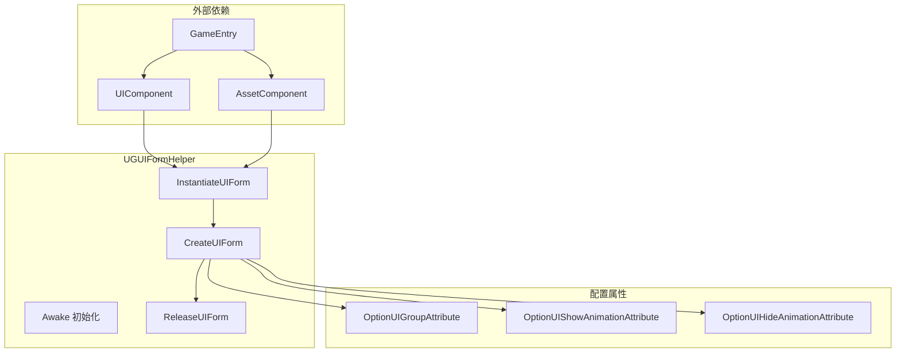
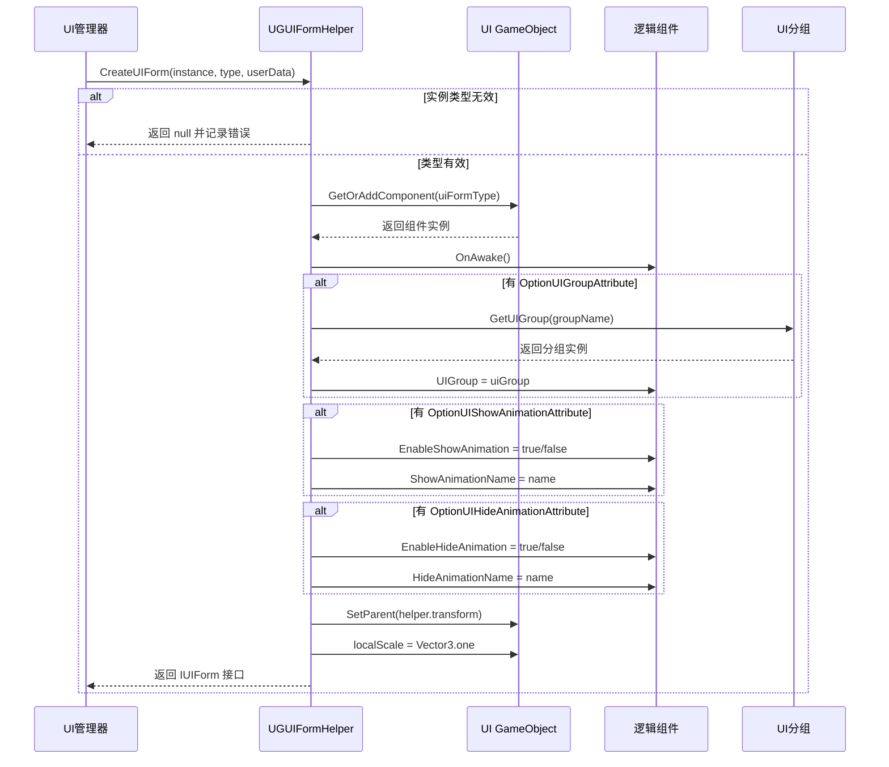

# 表单辅助器

表单辅助器（Form Helper）是 GameFrameX UGUI 系统中负责 UI 表单实例化、创建和释放的核心组件。它作为 UI 管理器与实际 UI 资源之间的桥梁，封装了界面创建的所有底层逻辑。

## 概述

`UGUIFormHelper` 是 UGUI 界面的默认表单辅助器，继承自 `UIFormHelperBase` 抽象类。它承担了三个核心职责：

1. **实例化界面**：将 UI 资源加载为可用的 GameObject 实例
2. **创建界面**：为实例添加逻辑组件、设置分组、配置动画等
3. **释放界面**：卸载资源并销毁实例

通过使用表单辅助器，UI 管理系统可以将界面资源的加载方式与业务逻辑解耦，使得系统能够支持不同的资源加载方式（如 AssetBundle、Resources 等）。

> 注意：`UIFormHelperBase` 抽象类定义在 `GameFrameX.UI.Runtime` 包中，属于框架的基础 UI 组件。本文档主要介绍 `UGUIFormHelper` 的具体实现。

## Architecture



**架构说明：**
- `UGUIFormHelper` 依赖于 `UIComponent` 和 `AssetComponent`，通过 `GameEntry` 获取组件实例
- 三个配置属性用于在代码层面指定界面的分组和动画行为
- 核心流程按照实例化 → 创建 → 释放的顺序执行

## 核心功能

### 实例化界面

```csharp
public override object InstantiateUIForm(object uiFormAsset)
{
    return (Object)uiFormAsset;
}
```

> Source: [UGUIFormHelper.cs](https://github.com/GameFrameX/com.gameframex.unity.ui.ugui/blob/main/Runtime/UGUIFormHelper.cs#L77-L80)

实例化过程相对简单，直接将加载的资源对象返回。在 UGUI 系统中，加载的资源本身就是可用的 Unity Object。

### 创建界面

创建界面是表单辅助器的核心功能，它完成了以下工作：

1. **类型验证**：确保传入的实例是有效的 GameObject
2. **组件添加**：为 GameObject 添加界面逻辑组件
3. **初始化调用**：调用界面的 `OnAwake` 方法
4. **分组设置**：根据 `OptionUIGroupAttribute` 获取并设置 UI 分组
5. **动画配置**：根据 `OptionUIShowAnimationAttribute` 和 `OptionUIHideAnimationAttribute` 配置显示/隐藏动画
6. **层级设置**：将界面设置为正确的父子关系和缩放

```csharp
public override IUIForm CreateUIForm(object uiFormInstance, Type uiFormType, object userData)
{
    var uiGameObject = uiFormInstance as GameObject;
    if (uiGameObject == null)
    {
        Log.Error($"UI form instance type {uiFormType} is invalid.");
        return null;
    }

    var componentType = uiGameObject.GetOrAddComponent(uiFormType);
    if (!(componentType is IUIForm uiForm))
    {
        Log.Error($"UI form instance type {uiFormType} is invalid.");
        return null;
    }

    if (uiForm.IsAwake == false)
    {
        uiForm.OnAwake();
    }
    // ... 分组和动画配置
}
```

> Source: [UGUIFormHelper.cs](https://github.com/GameFrameX/com.gameframex.unity.ui.ugui/blob/main/Runtime/UGUIFormHelper.cs#L93-L164)

### 释放界面

释放界面时，辅助器会根据配置决定是否自动释放资源：

```csharp
public override void ReleaseUIForm(object uiFormAsset, object uiFormInstance, object assetHandle, string uiFormAssetPath, string uiFormAssetName)
{
    if (!m_UIComponent.EnableAutoReleaseUIForm)
    {
        return;
    }

    if (uiFormAssetPath.IndexOf(Utility.Asset.Path.BundlesDirectoryName, StringComparison.OrdinalIgnoreCase) >= 0)
    {
        m_AssetComponent.UnloadAsset(uiFormAssetPath);
    }
    else
    {
        UnityEngine.Resources.UnloadAsset((Object)uiFormInstance);
    }

    Destroy((Object)uiFormInstance);
}
```

> Source: [UGUIFormHelper.cs](https://github.com/GameFrameX/com.gameframex.unity.ui.ugui/blob/main/Runtime/UGUIFormHelper.cs#L178-L195)

**释放策略：**
- 如果 `EnableAutoReleaseUIForm` 为 false，则不执行释放
- 如果资源路径包含 bundles 目录，则使用 AssetComponent 卸载
- 否则使用 Resources.UnloadAsset 卸载
- 最后销毁 GameObject 实例

## 界面创建流程



## 使用配置属性

### OptionUIGroupAttribute

用于指定界面所属的 UI 分组：

```csharp
[OptionUIGroup("MainPanel")]
public class MainMenuUI : UGUI
{
    // ...
}
```

### OptionUIShowAnimationAttribute

用于配置界面显示动画：

```csharp
[OptionUIShowAnimation(true, "FadeIn")]
public class MainMenuUI : UGUI
{
    // ...
}
```

### OptionUIHideAnimationAttribute

用于配置界面隐藏动画：

```csharp
[OptionUIHideAnimation(true, "FadeOut")]
public class MainMenuUI : UGUI
{
    // ...
}
```

## 配置选项

| 配置项 | 类型 | 默认值 | 说明 |
|--------|------|--------|------|
| EnableAutoReleaseUIForm | bool | true | 是否在界面关闭时自动释放资源 |

> 注意：UIComponent 的配置项在 `GameFrameX.UI.Runtime` 包中定义，详情请参阅 [UI管理器](./4-core-concepts.ui-manager) 文档。

## API 参考

### `InstantiateUIForm(uiFormAsset: object): object`

实例化 UI 界面资源。

**参数：**
- `uiFormAsset` (object): 要实例化的界面资源

**返回：** 实例化后的 Unity Object

---

### `CreateUIForm(uiFormInstance: object, uiFormType: Type, userData: object): IUIForm`

创建 UI 界面，完成组件添加和初始化。

**参数：**
- `uiFormInstance` (object): 界面实例（GameObject）
- `uiFormType` (Type): 界面逻辑类类型
- `userData` (object): 用户自定义数据

**返回：** IUIForm 接口实例

**可能返回 null 的情况：**
- uiFormInstance 不是有效的 GameObject
- 添加的组件不实现 IUIForm 接口
- UI 分组无效

---

### `ReleaseUIForm(uiFormAsset: object, uiFormInstance: object, assetHandle: object, uiFormAssetPath: string, uiFormAssetName: string): void`

释放 UI 界面资源。

**参数：**
- `uiFormAsset` (object): 界面资源
- `uiFormInstance` (object): 界面实例
- `assetHandle` (object): 资源句柄
- `uiFormAssetPath` (string): 界面资源路径
- `uiFormAssetName` (string): 界面资源名称

---

## 相关链接

- [UGUI 基类](./4-core-concepts.ugui-base) - UGUI 界面的基类实现
- [UI 管理器](./4-core-concepts.ui-manager) - UI 管理器的完整功能
- [代码生成器](./6-editor-tools.code-generator) - 自动生成 UI 代码
- [官方文档](https://gameframex.doc.alianblank.com)
