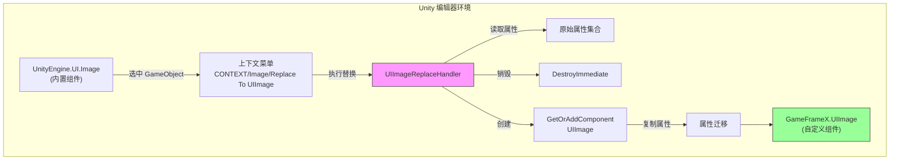
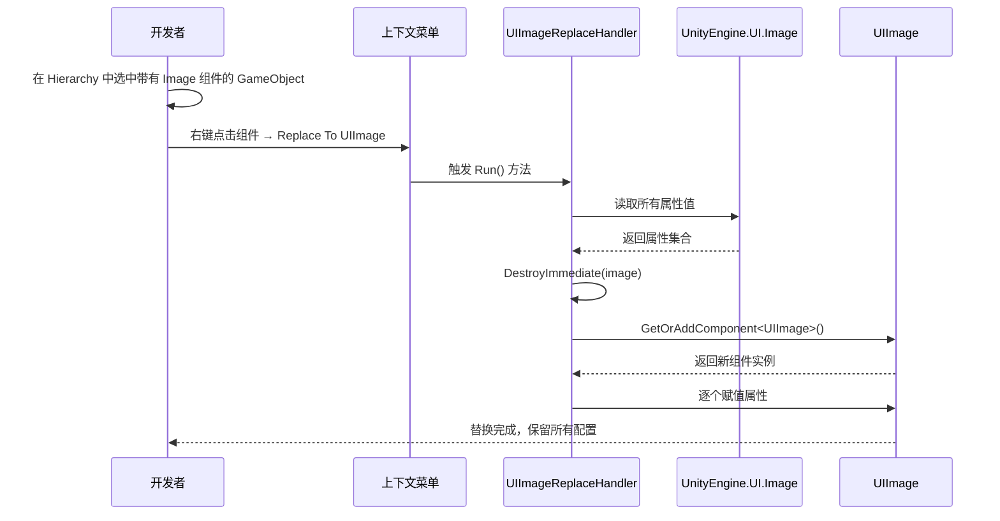

# 图片替换处理器

图片替换处理器是 GameFrameX UGUI 编辑器工具集中的核心组件，用于将 Unity 内置的 `Image` 组件一键替换为自定义的 `UIImage` 组件，同时保留所有原有属性配置。

## 概述

在开发 Unity UGUI 项目时，我们经常需要将现有的 UI 界面迁移到 GameFrameX 框架中。手动替换每个 Image 组件为 UIImage 不仅耗时，还容易遗漏属性配置。图片替换处理器通过上下文菜单的方式，提供了快速、安全的组件替换功能。

该工具会在替换过程中自动保存以下属性：
- 图片类型（Simple、Sliced、Tiled、Filled）
- 材质（Material）
- 精灵图（Sprite）
- 填充中心（fillCenter）
- 填充方法（fillMethod）
- 填充量（fillAmount）
- 透明度阈值（alphaHitTestMinimumThreshold）
- 使用精灵网格（useSpriteMesh）
- 覆盖精灵（overrideSprite）
- 颜色（color）
- 射线检测目标（raycastTarget）
- 可遮罩性（maskable）

## 工作原理

图片替换处理器基于 Unity Editor 的扩展机制实现，通过 `CustomEditor` 和 `MenuItem` 属性为内置 Image 组件添加上下文菜单入口。



### 替换流程



## 使用方法

### 触发替换

1. 在 Unity 编辑器的 Hierarchy 面板中，选中包含 `Image` 组件的 GameObject
2. 在 Inspector 面板中，右键点击 `Image` 组件标题
3. 在弹出的上下文菜单中，选择 **Replace To UIImage(替换为UIImage)**

```csharp
// 使用方式：在 Unity 编辑器中通过上下文菜单触发
// 菜单路径：CONTEXT/Image/Replace To UIImage(替换为UIImage)
```
> Source: [UIImageReplaceHandler.cs](https://github.com/GameFrameX/com.gameframex.unity.ui.ugui/blob/main/Editor/UIImageReplaceHandler.cs#L42-L43)

### 执行逻辑

当用户点击菜单项时，替换处理器执行以下步骤：

```csharp
[MenuItem("CONTEXT/Image/Replace To UIImage(替换为UIImage)", false, 10)]
static void Run()
{
    // 1. 获取选中的 Image 组件
    var image = Selection.activeGameObject.GetComponent<UnityEngine.UI.Image>();
    
    // 2. 读取所有属性值
    var imageType = image.type;
    var material = image.material;
    var sprite = image.sprite;
    var color = image.color;
    var raycastTarget = image.raycastTarget;
    // ... 其他属性
    
    // 3. 销毁原 Image 组件
    DestroyImmediate(image);
    
    // 4. 添加 UIImage 组件
    var uiImage = Selection.activeGameObject.GetOrAddComponent<UIImage>();
    
    // 5. 复制所有属性到新组件
    uiImage.type = imageType;
    uiImage.material = material;
    uiImage.sprite = sprite;
    uiImage.color = color;
    // ... 赋值所有属性
}
```
> Source: [UIImageReplaceHandler.cs](https://github.com/GameFrameX/com.gameframex.unity.ui.ugui/blob/main/Editor/UIImageReplaceHandler.cs#L43-L76)

## 核心实现

### CustomEditor 注册

工具通过 `CustomEditor` 特性注册到 Unity 编辑器，使其成为 `UnityEngine.UI.Image` 的自定义检查器：

```csharp
[CustomEditor(typeof(UnityEngine.UI.Image))]
public class UIImageReplaceHandler : UnityEditor.Editor
{
    // ...
}
```
> Source: [UIImageReplaceHandler.cs](https://github.com/GameFrameX/com.gameframex.unity.ui.ugui/blob/main/Editor/UIImageReplaceHandler.cs#L39-L40)

### MenuItem 菜单项

使用 `MenuItem` 特性在 Image 组件的上下文菜单中添加入口：

```csharp
[MenuItem("CONTEXT/Image/Replace To UIImage(替换为UIImage)", false, 10)]
static void Run()
```
> Source: [UIImageReplaceHandler.cs](https://github.com/GameFrameX/com.gameframex.unity.ui.ugui/blob/main/Editor/UIImageReplaceHandler.cs#L42-L43)

## UIImage 组件说明

替换后生成的 `UIImage` 组件继承自 `UnityEngine.UI.Image`，并额外提供了图标资源路径设置功能：

```csharp
public class UIImage : UnityEngine.UI.Image
{
    /// <summary>
    /// 获取或设置图标资源路径。
    /// 设置后自动从资源系统加载图标。
    /// </summary>
    public string icon
    {
        get { return m_icon; }
        set
        {
            if (m_icon != value)
            {
                m_icon = value;
                _ = this.SetIconAsync(m_icon);
            }
        }
    }
}
```
> Source: [UIImage.cs](https://github.com/GameFrameX/com.gameframex.unity.ui.ugui/blob/main/Runtime/UIImage.cs#L41-L72)

## 适用场景

| 场景 | 说明 |
|------|------|
| 项目初始化迁移 | 将现有 Unity UGUI 项目迁移到 GameFrameX 框架 |
| 批量替换测试 | 先替换单个组件测试 UIImage 功能，再批量迁移 |
| 组件升级 | 为现有 Image 组件添加图标路径加载功能 |

## 注意事项

1. **替换不可逆**：执行替换后会立即销毁原 Image 组件，建议在替换前备份场景
2. **依赖项保留**：确保项目中已正确配置 GameFrameX.Runtime 依赖，因为使用了 `GetOrAddComponent` 扩展方法
3. **多组件场景**：如果 GameObject 上有多个组件依赖 Image 组件（如其他脚本的引用），替换前请确保这些引用已更新

## 相关链接

- [UIImage 组件](./5-components.uiimage)
- [组件检查器](./6-editor-tools.inspector)
- [代码生成器](./6-editor-tools.code-generator)
- [UGUI 基类](./4-core-concepts.ugui-base)
