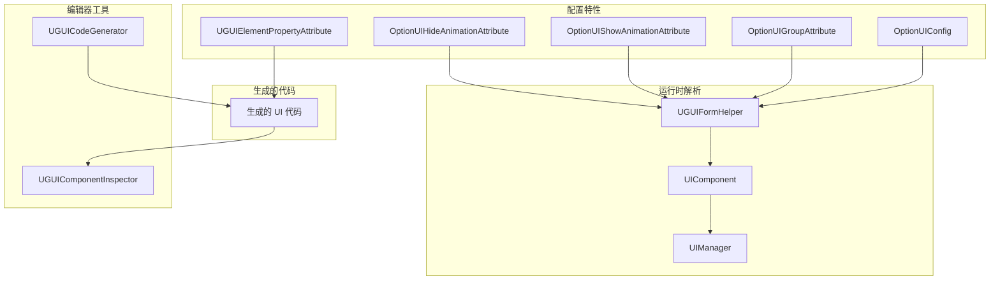
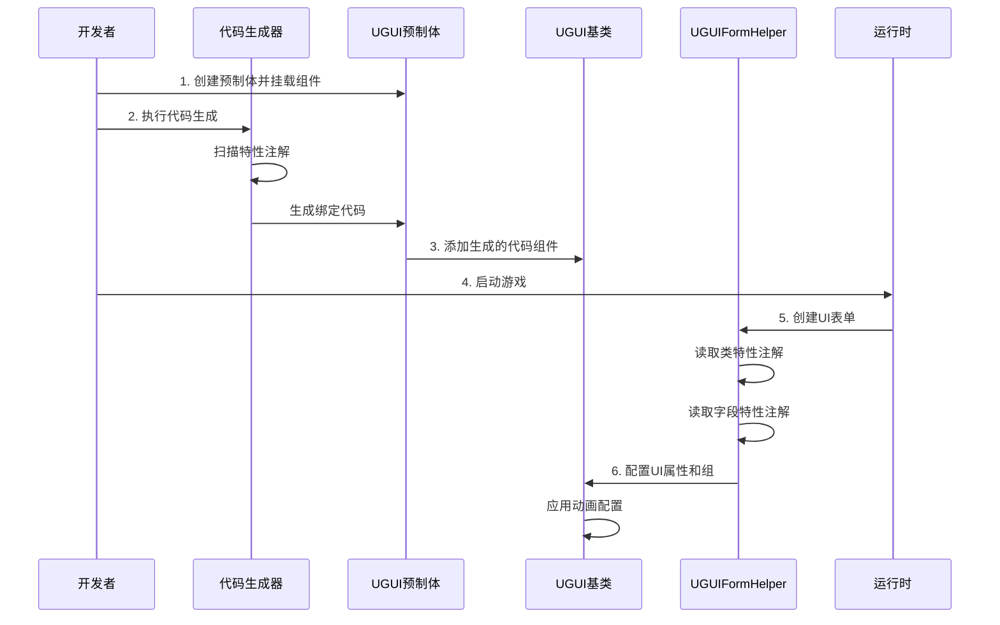

# 配置

本文档详细介绍 GameFrameX UGUI 插件的配置系统，包括特性配置、属性绑定、代码生成器设置等。

## 概述

GameFrameX UGUI 插件采用**特性驱动（Attribute-Driven）**的配置模式，通过 C# 特性（Attribute）在代码中声明式地定义 UI 界面的各种行为和属性。这种方式具有以下优势：

- **声明式配置**：通过特性标记即可配置 UI 行为，无需编写繁琐的初始化代码
- **类型安全**：配置在编译时进行检查，减少运行时错误
- **代码生成集成**：特性与代码生成器深度集成，自动生成绑定代码
- **运行时解析**：特性在 UI 界面创建时自动被解析和应用

配置系统主要包含以下几个维度：

1. **UI 表单配置**：定义界面的资源路径、所属组、动画等
2. **UI 元素绑定**：声明式绑定预制体中的控件引用
3. **代码生成器配置**：自定义代码生成行为和输出路径
4. **UI 组配置**：管理界面的层级和深度关系

## 架构



### 配置流程



## UI 表单配置

### OptionUIConfig 特性

`OptionUIConfig` 特性用于配置 UI 表单的基本信息，包括资源加载方式和资源路径。

```csharp
[OptionUIConfig(null, "Assets/Resources/UI/Prefabs")]
public partial class MainMenuUI : UGUI
{
    // UI界面逻辑
}
```

> Source: [UGUICodeGenerator.cs#L188](https://github.com/GameFrameX/com.gameframex.unity.ui.ugui/blob/main/Editor/UGUICodeGenerator.cs#L188)

**参数说明：**

| 参数 | 类型 | 默认值 | 说明 |
|------|------|--------|------|
| isResources | bool? | null | 是否从 Resources 加载，true 表示从 Resources 加载，false 表示从 AB 包加载，null 表示使用默认配置 |
| assetPath | string | null | 资源路径，当 isResources 为 false 时指定 AB 包的相对路径 |

**使用场景：**

- **从 Resources 加载**：`[OptionUIConfig(true)]` - 资源必须放在 `Resources` 目录下
- **从 AB 包加载**：`[OptionUIConfig(false, "Assets/UI/Prefabs")]` - 资源通过 AB 包管理
- **使用默认配置**：`[OptionUIConfig(null, "Assets/UI/Prefabs")]` - 使用 UIComponent 的默认设置

### OptionUIGroupAttribute 特性

`OptionUIGroupAttribute` 特性用于指定 UI 界面所属的 UI 组（UIGroup）。

```csharp
[OptionUIGroup("MainUI")]
public partial class MainMenuUI : UGUI
{
    // UI界面逻辑
}
```

> Source: [UGUIFormHelper.cs#L117-L121](https://github.com/GameFrameX/com.gameframex.unity.ui.ugui/blob/main/Runtime/UGUIFormHelper.cs#L117-L121)

**参数说明：**

| 参数 | 类型 | 说明 |
|------|------|------|
| GroupName | string | UI 组的名称，用于将界面分配到特定的组 |

**UI 组的作用：**

- 管理同组界面的显示层级（Depth）
- 控制同组界面的显示/隐藏策略
- 统一管理同组界面的资源释放

### OptionUIShowAnimationAttribute 特性

`OptionUIShowAnimationAttribute` 特性用于配置 UI 界面打开时的动画效果。

```csharp
[OptionUIShowAnimation(true, "MainMenuEnter")]
public partial class MainMenuUI : UGUI
{
    // UI界面逻辑
}
```

> Source: [UGUIFormHelper.cs#L126-L131](https://github.com/GameFrameX/com.gameframex.unity.ui.ugui/blob/main/Runtime/UGUIFormHelper.cs#L126-L131)

**参数说明：**

| 参数 | 类型 | 默认值 | 说明 |
|------|------|--------|------|
| Enable | bool | false | 是否启用显示动画 |
| AnimationName | string | "" | 动画名称，对应动画系统中的动画标识 |

### OptionUIHideAnimationAttribute 特性

`OptionUIHideAnimationAttribute` 特性用于配置 UI 界面关闭时的动画效果。

```csharp
[OptionUIHideAnimation(true, "MainMenuExit")]
public partial class MainMenuUI : UGUI
{
    // UI界面逻辑
}
```

> Source: [UGUIFormHelper.cs#L137-L142](https://github.com/GameFrameX/com.gameframex.unity.ui.ugui/blob/main/Runtime/UGUIFormHelper.cs#L137-L142)

**参数说明：**

| 参数 | 类型 | 默认值 | 说明 |
|------|------|--------|------|
| Enable | bool | false | 是否启用隐藏动画 |
| AnimationName | string | "" | 动画名称，对应动画系统中的动画标识 |

### 组合配置示例

可以同时使用多个特性进行组合配置：

```csharp
[OptionUIConfig(false, "Assets/UI/Prefabs/MainMenu")]
[OptionUIGroup("MainUI")]
[OptionUIShowAnimation(true, "MainMenuEnter")]
[OptionUIHideAnimation(true, "MainMenuExit")]
public partial class MainMenuUI : UGUI
{
    // 界面逻辑
}
```

## UI 元素绑定

### UGUIElementPropertyAttribute 特性

`UGUIElementPropertyAttribute` 特性用于标记 UI 控件在预制体中的路径，使代码生成器能够自动生成属性绑定代码。

```csharp
public partial class MainMenuUI : UGUI
{
    [SerializeField]
    [UGUIElementProperty("StartButton")]
    private Button m_StartButton;

    [SerializeField]
    [UGUIElementProperty("Panel/Title")]
    private Text m_Title;

    public Button m_StartButton => m_StartButton;
    public Text m_Title => m_Title;
}
```

> Source: [UGUIElementPropertyAttribute.cs#L40-L64](https://github.com/GameFrameX/com.gameframex.unity.ui.ugui/blob/main/Runtime/UGUIElementPropertyAttribute.cs#L40-L64)

**参数说明：**

| 参数 | 类型 | 说明 |
|------|------|------|
| Path | string | 控件在预制体中的路径，使用 "/" 分隔层级 |

**路径规则：**

- 相对于当前 UI 预制体的根节点
- 使用 "/" 表示子节点层级
- 例如：`"Panel/Content/Button"` 表示从根节点开始，依次进入 Panel -> Content -> Button

**工作原理：**

1. 代码生成器扫描带有 `[UGUIElementProperty]` 特性的字段
2. 根据 Path 路径在预制体中查找对应的 Transform
3. 自动获取对应类型的组件并赋值

### 生成的代码结构

代码生成器会为每个 UI 控件生成以下代码结构：

```csharp
[SerializeField]
[UGUIElementProperty("StartButton")]
private Button m_StartButton;

public Button m_StartButton => m_StartButton;
```

这种模式的优势：

- `[SerializeField]` 确保字段可在编辑器中序列化
- `[UGUIElementProperty]` 提供路径信息供代码生成器使用
- 属性封装（Property）提供只读访问

## 代码生成器配置

### 代码生成路径

代码生成器根据预制体的位置自动选择生成路径：

```csharp
if (assetPath.Contains(nameof(Resources)))
{
    // Resources 目录下的预制体
    savePath = System.IO.Path.Combine(Application.dataPath, "Scripts", "Game", "UGUI", className);
}
else
{
    // 其他位置的预制体（热更代码）
    savePath = System.IO.Path.Combine(Application.dataPath, "Hotfix", "UI", "UGUI", className);
}
```

> Source: [UGUICodeGenerator.cs#L120-L127](https://github.com/GameFrameX/com.gameframex.unity.ui.ugui/blob/main/Editor/UGUICodeGenerator.cs#L120-L127)

**生成路径规则：**

| 预制体位置 | 生成路径 |
|------------|----------|
| `Resources/` 目录 | `Assets/Scripts/Game/UGUI/<预制体名>/` |
| 其他目录 | `Assets/Hotfix/UI/UGUI/<预制体名>/` |

### 自定义类型转换处理器

代码生成器支持通过实现 `IUGUIGeneratorCodeConvertTypeHandler` 接口来扩展支持的 UI 控件类型。

```csharp
public interface IUGUIGeneratorCodeConvertTypeHandler
{
    /// <summary>
    /// 处理器优先级，数值越小优先级越高
    /// </summary>
    int Priority { get; }

    /// <summary>
    /// 执行类型转换
    /// </summary>
    /// <param name="transform">目标 Transform</param>
    /// <returns>转换后的类型名称，返回 null 表示不处理</returns>
    string Run(Transform transform);
}
```

> Source: [UGUICodeGenerator.cs#L78-L115](https://github.com/GameFrameX/com.gameframex.unity.ui.ugui/blob/main/Editor/UGUICodeGenerator.cs#L78-L115)

代码生成器会自动扫描所有实现了该接口的类型，并按优先级顺序执行。

### 内置类型支持

代码生成器内置支持以下 UI 控件类型：

| 组件类型 | 优先级 | 说明 |
|----------|--------|------|
| Button | 内置 | 按钮组件 |
| Text | 内置 | 文本组件 |
| Toggle | 内置 | 开关组件 |
| ToggleGroup | 内置 | 开关组组件 |
| InputField | 内置 | 输入框组件 |
| ScrollRect | 内置 | 滚动视图组件 |
| Dropdown | 内置 | 下拉框组件 |
| Scrollbar | 内置 | 滚动条组件 |
| Slider | 内置 | 滑动条组件 |
| RawImage | 内置 | 原始图片组件 |
| UIImage | 内置 | 扩展图片组件 |
| Image | 内置 | 图片组件 |
| RectTransform | 内置 | 矩形变换组件 |
| TextMeshProUGUI | 条件编译 | TMP 文本组件 |
| TMP_InputField | 条件编译 | TMP 输入框组件 |
| TMP_Dropdown | 条件编译 | TMP 下拉框组件 |

## UI 组配置

### UGUIUIGroupHelper

`UGUIUIGroupHelper` 是 UGUI 的 UI 组辅助器，负责管理 UI 组的深度和层级关系。

```csharp
public sealed class UGUIUIGroupHelper : UIGroupHelperBase
{
    /// <summary>
    /// 设置界面组深度
    /// </summary>
    public override void SetDepth(int depth)
    {
        Depth = depth;
        // 使用 Z 轴位置区分不同深度的 UI 组
        transform.localPosition = new Vector3(0, 0, depth * 1000);
    }
}
```

> Source: [UGUIUIGroupHelper.cs#L44-L68](https://github.com/GameFrameX/com.gameframex.unity.ui.ugui/blob/main/Runtime/UGUIUIGroupHelper.cs#L44-L68)

**UI 组深度机制：**

- 每个 UI 组有唯一的深度值（Depth）
- 深度值决定 UI 在 Z 轴上的位置：`z = depth * 1000`
- 深度值越大，UI 越靠前显示
- 引擎渲染时后绘制的 UI 会覆盖先绘制的 UI

### 创建 UI 组

UI 组通过 `Handler` 方法创建：

```csharp
public override IUIGroupHelper Handler(
    Transform root,           // 根节点
    string groupName,         // 组名称
    string uiGroupHelperTypeName,  // 辅助器类型名
    IUIGroupHelper customUIGroupHelper,  // 自定义辅助器
    int depth = 0             // 深度值
)
```

> Source: [UGUIUIGroupHelper.cs#L84-L105](https://github.com/GameFrameX/com.gameframex.unity.ui.ugui/blob/main/Runtime/UGUIUIGroupHelper.cs#L84-L105)

**创建流程：**

1. 创建空 GameObject，名称为组名
2. 设置父节点为 root
3. 设置 Layer 为 "UI"
4. 添加 RectTransform 并设为全屏
5. 创建辅助器组件

## 编辑器配置

### UGUIComponentInspector

`UGUIComponentInspector` 是 UGUI 基类的自定义检视面板，提供编辑器内的配置功能。

```csharp
[CustomEditor(typeof(Runtime.UGUI), true)]
internal sealed class UGUIComponentInspector : GameFrameworkInspector
{
    // 重新绑定列表按钮
    private readonly GUIContent _reBind = new GUIContent("重新绑定列表");
    
    // 重新生成代码按钮
    private readonly GUIContent _reGenerate = new GUIContent("重新生成代码");
}
```

> Source: [UGUIComponentInspector.cs#L43-L78](https://github.com/GameFrameX/com.gameframex.unity.ui.ugui/blob/main/Editor/UGUIComponentInspector.cs#L43-L78)

**功能说明：**

| 功能 | 说明 |
|------|------|
| 重新绑定列表 | 重新扫描预制体并绑定所有带 `[UGUIElementProperty]` 特性的字段 |
| 重新生成代码 | 重新生成 UI 代码文件 |
| 查看绑定字段 | 显示所有已绑定的 UI 元素（只读） |

### 图片替换处理器

`UIImageReplaceHandler` 提供将标准 Image 组件替换为 UIImage 组件的功能。

```csharp
[MenuItem("CONTEXT/Image/Replace To UIImage(替换为UIImage)", false, 10)]
static void Run()
{
    // 保留原 Image 的所有属性
    var imageType = image.type;
    var material = image.material;
    var sprite = image.sprite;
    // ... 其他属性
    
    // 销毁原 Image 组件
    DestroyImmediate(image);
    
    // 添加 UIImage 组件并恢复属性
    var uiImage = Selection.activeGameObject.GetOrAddComponent<UIImage>();
    // ... 恢复所有属性
}
```

> Source: [UIImageReplaceHandler.cs#L42-L76](https://github.com/GameFrameX/com.gameframex.unity.ui.ugui/blob/main/Editor/UIImageReplaceHandler.cs#L42-L76)

## 运行时配置解析

### UGUIFormHelper 配置解析

`UGUIFormHelper` 在创建 UI 表单时自动解析特性配置：

```csharp
public override IUIForm CreateUIForm(object uiFormInstance, Type uiFormType, object userData)
{
    // 1. 解析 UI 组配置
    var attribute = uiFormType.GetCustomAttribute(typeof(OptionUIGroupAttribute));
    if (attribute is OptionUIGroupAttribute optionUIGroup)
    {
        uiGroup = m_UIComponent.GetUIGroup(optionUIGroup.GroupName);
    }

    // 2. 解析显示动画配置
    var showAnimationAttribute = uiFormType.GetCustomAttribute(typeof(OptionUIShowAnimationAttribute));
    if (showAnimationAttribute is OptionUIShowAnimationAttribute optionShowAnimation)
    {
        uiForm.EnableShowAnimation = optionShowAnimation.Enable;
        uiForm.ShowAnimationName = optionShowAnimation.AnimationName;
    }
    else
    {
        // 使用 UIComponent 的全局默认设置
        uiForm.EnableShowAnimation = m_UIComponent.IsEnableUIShowAnimation;
    }

    // 3. 解析隐藏动画配置
    var hideAnimationAttribute = uiFormType.GetCustomAttribute(typeof(OptionUIHideAnimationAttribute));
    if (hideAnimationAttribute is OptionUIHideAnimationAttribute optionHideAnimation)
    {
        uiForm.EnableHideAnimation = optionHideAnimation.Enable;
        uiForm.HideAnimationName = optionHideAnimation.AnimationName;
    }
    else
    {
        // 使用 UIComponent 的全局默认设置
        uiForm.EnableHideAnimation = m_UIComponent.IsEnableUIHideAnimation;
    }
}
```

> Source: [UGUIFormHelper.cs#L93-L164](https://github.com/GameFrameX/com.gameframex.unity.ui.ugui/blob/main/Runtime/UGUIFormHelper.cs#L93-L164)

**解析优先级：**

1. **类级别特性** > **UIComponent 全局设置**
2. 如果类上没有配置特性，则使用 UIComponent 的全局默认值
3. 如果类上有配置特性，则使用特性指定的值

## 配置最佳实践

### 1. 合理的 UI 组划分

建议按功能或场景划分 UI 组：

```csharp
// 主界面组
[OptionUIGroup("MainUI")]
public class MainMenuUI : UGUI { }

// 弹出对话框组
[OptionUIGroup("Dialog")]
public class ConfirmDialogUI : UGUI { }

// HUD 组（最高优先级）
[OptionUIGroup("HUD")]
public class ScoreDisplayUI : UGUI { }
```

### 2. 动画配置建议

- 常用的简单界面可以使用全局默认动画配置
- 需要特殊动画效果的界面使用特性单独配置
- 确保动画名称与项目中的动画系统一致

### 3. 代码生成后维护

- 修改预制体结构后记得重新生成代码
- 手动添加的绑定字段不要删除 `[UGUIElementProperty]` 特性
- 使用"重新绑定列表"功能快速更新绑定关系

## 相关链接

- [UI管理器](./4-core-concepts.ui-manager)
- [UGUI基类](./4-core-concepts.ugui-base)
- [表单辅助器](./4-core-concepts.form-helper)
- [代码生成器](./6-editor-tools.code-generator)
- [组件检查器](./6-editor-tools.inspector)
- [快速开始 - 使用代码生成器](./3-getting-started.code-generator)
