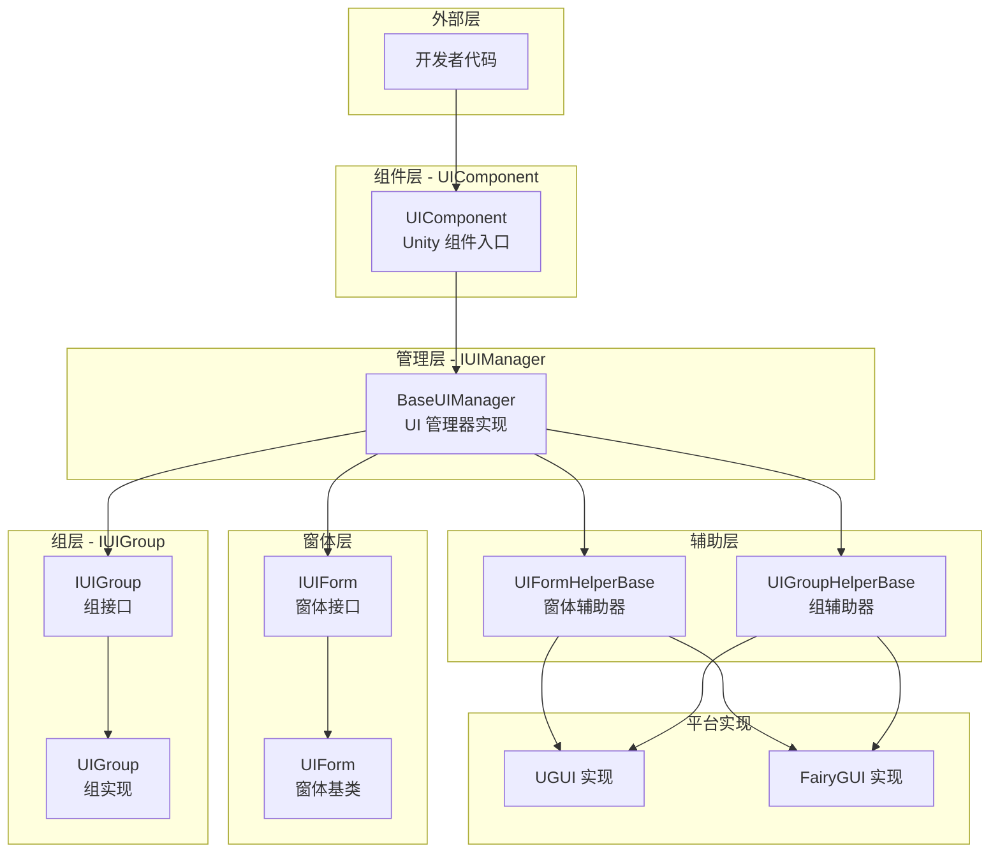
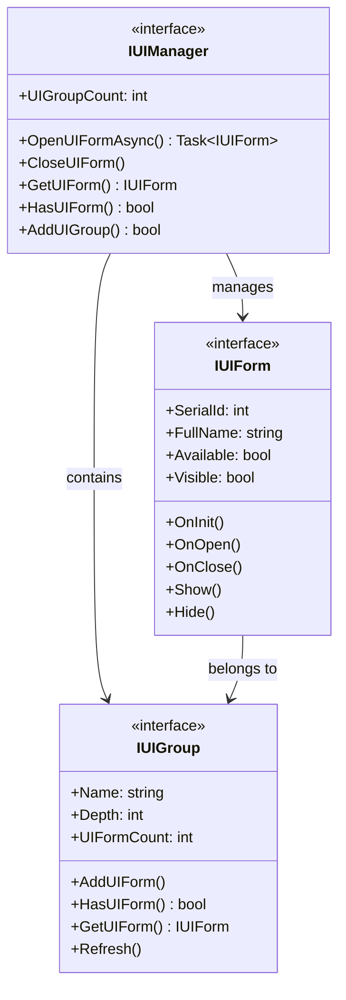
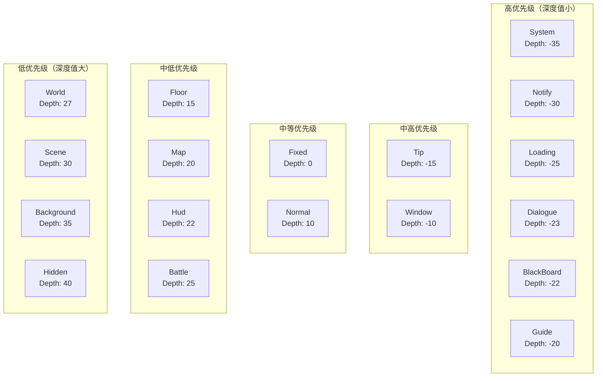
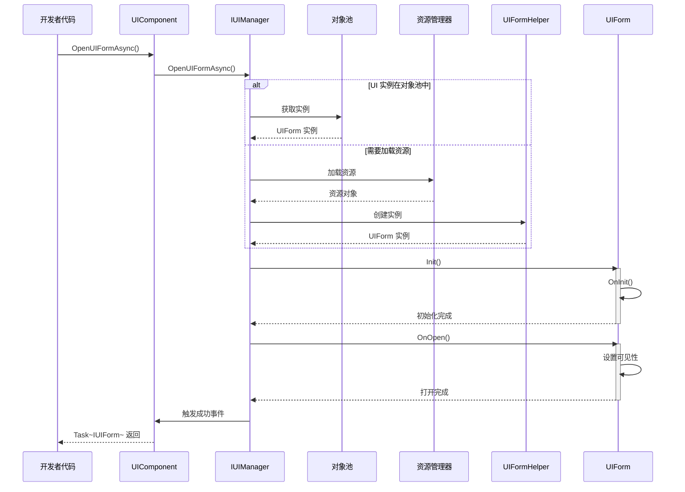
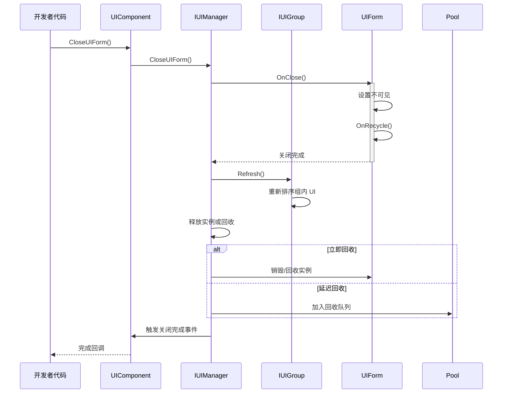

# 概述

Game Frame X UI 是 GameFrameX 框架的 UI 组件，提供了一套完整的 Unity UI 管理解决方案。该系统支持 UGUI 和 FairyGUI 两种主流 UI 系统，提供了统一的接口设计、分层管理、对象池复用和完整的事件驱动机制。

## 概述

Game Frame X UI 是 GameFrameX 游戏框架的核心 UI 管理系统，专为 Unity 游戏开发设计。该系统采用了现代化的架构设计，支持 UGUI 和 FairyGUI 两种 UI 渲染系统，开发者可以根据项目需求灵活选择。UI 系统提供了完整的生命周期管理，从界面加载、显示、隐藏到关闭回收，每个环节都有完善的事件回调机制，让开发者能够精确控制 UI 的行为。

该系统的核心设计理念是"统一接口、灵活配置"。无论底层使用哪种 UI 系统，开发者都通过统一的 `IUIManager` 接口进行 UI 的打开、关闭、查询等操作。同时，系统支持高度定制化，开发者可以配置不同的 UI 组辅助器和 UI 窗体辅助器来实现特定的功能需求。这种设计既保证了代码的简洁性，又提供了足够的灵活性来应对各种复杂的游戏 UI 场景。

Game Frame X UI 还深度集成了 GameFrameX 框架的其他核心组件，包括资源管理系统、对象池系统和事件系统。这种深度集成使得 UI 系统能够高效地管理 UI 资源的加载和回收，同时通过事件系统实现了模块间的松耦合通信。开发者可以通过订阅 UI 事件来实现跨系统的逻辑联动，而无需直接依赖具体的 UI 实现类。

## 架构设计

Game Frame X UI 采用了分层架构设计，从底层到顶层依次包括：接口层、实现层、组件层和编辑器层。每一层都有明确的职责划分，层与层之间通过接口进行通信，这种设计极大地提高了代码的可维护性和可扩展性。



**架构说明：**

- **组件层（UIComponent）**：作为 Unity 游戏对象的组件，是整个 UI 系统的入口点，负责初始化和管理 IUIManager 实现
- **管理层（IUIManager）**：核心接口，定义了 UI 窗体和 UI 组的所有操作，包括打开、关闭、查询等方法
- **窗体层（IUIForm/UIForm）**：UI 窗体的接口定义和基类实现，提供了完整的生命周期方法
- **组层（IUIGroup）**：UI 组接口，用于管理同一层级的 UI 窗体，控制显示深度和优先级
- **辅助层（Helper）**：平台特定的实现辅助类，分别处理 UGUI 和 FairyGUI 的底层差异
- **平台实现层**：具体的 UGUI 或 FairyGUI 实现，封装了各自平台的 API 调用

### 核心接口关系

UI 系统的核心接口包括 IUIManager、IUIForm 和 IUIGroup，它们共同构成了 UI 管理的基础。IUIManager 负责整体的 UI 管理，包括创建和销毁 UI 窗体、管理 UI 组、调度事件等。IUIForm 定义了单个 UI 窗体的行为规范，包括初始化、打开、关闭、显示、隐藏等生命周期方法。IUIGroup 则负责管理一组相关的 UI 窗体，控制它们的深度和显示顺序。



这种接口设计遵循了依赖倒置原则，上层模块依赖于抽象接口而不是具体实现，使得系统具有良好的可测试性和可替换性。开发者可以通过实现自定义的辅助器来替换默认的 UGUI 或 FairyGUI 实现，而无需修改上层的业务逻辑代码。

## 核心概念

### UI 窗体（UIForm）

UI 窗体是 UI 系统中最基本的操作单元，每个可见的 UI 界面都对应一个 UIForm 实例。UIForm 继承自 Unity 的 MonoBehaviour，可以直接挂载到 Prefab 上使用。作为基类，它提供了完整的生命周期钩子，开发者通过重写这些方法来处理 UI 的具体逻辑。

```csharp
using GameFrameX.UI.Runtime;
using UnityEngine;

public class MainMenuUI : UIForm
{
    protected override void OnInit(object userData)
    {
        base.OnInit(userData);
        // 初始化 UI 元素引用
        // 绑定按钮事件等
    }

    protected override void OnOpen(object userData)
    {
        base.OnOpen(userData);
        // UI 打开时的逻辑
        // 播放入场动画
        // 刷新界面数据
    }

    protected override void OnClose(bool isShutdown, object userData)
    {
        base.OnClose(isShutdown, userData);
        // UI 关闭时的清理工作
    }
}
```
> Source: [UIForm.cs](https://github.com/GameFrameX/com.gameframex.unity.ui/blob/main/Runtime/UIForm.cs#L39-L100)

UIForm 的生命周期包括以下关键方法：OnAwake 在 UI 实例创建后立即调用，适合进行事件订阅等初始化操作；OnInit 在 UI 首次初始化时调用，用于设置 UI 元素和绑定事件处理器；OnOpen 在 UI 显示时调用，可以接收和处理传入的用户数据；OnClose 在 UI 关闭时调用，用于清理资源和保存状态；OnPause 和 OnResume 分别在 UI 被遮挡和恢复时调用。

### UI 组件（UIComponent）

UIComponent 是 Unity 游戏场景中的核心组件，继承自 GameFrameworkComponent。它是开发者与 UI 系统交互的主要入口点，提供了所有 UI 操作的静态方法封装。在实际使用中，开发者通常通过 `GameEntry.GetComponent<UIComponent>()` 获取实例，然后调用其方法来管理 UI。

```csharp
// 获取 UI 组件实例
var uiComponent = GameEntry.GetComponent<UIComponent>();

// 同步打开 UI
uiComponent.OpenUIForm("MainMenuUI", "Normal");

// 异步打开 UI
var mainMenu = await uiComponent.OpenUIFormAsync("MainMenuUI", "Normal");

// 关闭 UI
uiComponent.CloseUIForm("MainMenuUI");

// 查询 UI 是否存在
if (uiComponent.HasUIForm("MainMenuUI"))
{
    // UI 已打开
}
```
> Source: [UIComponent.cs](https://github.com/GameFrameX/com.gameframex.unity.ui/blob/main/Runtime/UIComponent.cs#L48-L114)

UIComponent 封装了 IUIManager 的所有功能，并添加了一些便捷方法。它还负责管理对象池的相关配置，包括实例容量、过期时间和自动回收间隔等。通过配置这些参数，开发者可以优化内存使用和性能表现。

### UI 组系统

UI 组是用于组织和管理 UI 窗体的容器，每个 UI 组有一个名称和一个深度值。深度值决定了 UI 的显示优先级，深度值越小，UI 显示在越上层。当打开一个新的 UI 窗体时，需要指定它所属的 UI 组，系统会根据组的深度值和窗体在组内的顺序来确定最终的显示层级。

```csharp
// 添加自定义 UI 组
uiComponent.AddUIGroup("CustomGroup", -5);

// 获取 UI 组
var group = uiComponent.GetUIGroup("Window");
```
> Source: [UIComponent.cs](https://github.com/GameFrameX/com.gameframex.unity.ui/blob/main/Runtime/BaseUIManager.cs#L200-L230)

系统预定义了 18 个标准 UI 组，涵盖了游戏中常见的 UI 场景，从系统公告到战斗界面都有对应的层级。开发者可以直接使用这些预定义组，也可以根据需要创建自定义组。

## UI 组层级

Game Frame X UI 预定义了 18 个 UI 组，每个组都有特定的深度值。深度值越小，显示层级越高。这意味着深度值为 -35 的 System 组会显示在深度值为 40 的 Hidden 组之上。



### 预定义 UI 组

| 组名 | 深度值 | 典型用途 |
|------|--------|----------|
| System | -35 | 系统公告、VIP 提示等顶级界面 |
| Notify | -30 | 通知弹窗、跑马灯 |
| Loading | -25 | 加载界面 |
| Dialogue | -23 | 对话剧情界面 |
| BlackBoard | -22 | 黑板/任务面板 |
| Guide | -20 | 新手引导遮罩 |
| Tip | -15 | 提示弹窗、Toast |
| Window | -10 | 窗口类界面 |
| Fixed | 0 | 固定在底部的 UI |
| Normal | 10 | 普通界面 |
| Floor | 15 | 底板 UI |
| Map | 20 | 地图界面 |
| Hud | 22 | 头顶信息、BUFF 显示 |
| Battle | 25 | 战斗相关 UI |
| World | 27 | 世界地图 UI |
| Scene | 30 | 场景切换界面 |
| Background | 35 | 背景 UI |
| Hidden | 40 | 隐藏 UI（不可见） |

> Source: [UIGroupConstants.cs](https://github.com/GameFrameX/com.gameframex.unity.ui/blob/main/Runtime/UIGroupConstants.cs#L38-L202)

深度值的设计遵循以下原则：负深度用于显示在游戏场景之上的 UI，如对话框、提示等；零和正深度用于游戏内的 HUD 元素；较大的正深度用于背景和低优先级 UI。这种设计确保了重要的 UI 始终显示在最上层。

## 核心流程

### UI 打开流程

打开 UI 窗体是 UI 系统最常用的操作之一。整个流程涉及资源加载、实例创建、初始化和显示等多个步骤。下面是完整的异步打开流程：



### UI 关闭流程

关闭 UI 窗体同样涉及多个步骤，包括隐藏、回收和事件触发。系统支持立即回收和延迟回收两种模式。



## 事件系统

Game Frame X UI 提供了完整的事件系统，用于通知 UI 状态的变更。开发者可以通过订阅这些事件来响应 UI 的各种状态变化，实现松耦合的代码架构。

### 事件类型

| 事件类 | 事件 ID | 说明 |
|--------|---------|------|
| OpenUIFormSuccessEventArgs | 打开界面成功事件 | UI 成功打开时触发 |
| OpenUIFormFailureEventArgs | 打开界面失败事件 | UI 打开失败时触发 |
| CloseUIFormCompleteEventArgs | 关闭界面完成事件 | UI 关闭完成时触发 |
| UIFormVisibleChangedEventArgs | 界面可见性变化事件 | UI 显示状态改变时触发 |

> Source: [Runtime/EventArgs/](https://github.com/GameFrameX/com.gameframex.unity.ui/blob/main/Runtime/EventArgs/)

### 事件订阅示例

```csharp
using GameFrameX.UI.Runtime;
using GameFrameX.Event.Runtime;

// 在游戏初始化时订阅事件
var eventComponent = GameEntry.GetComponent<EventComponent>();
eventComponent.Subscribe(OpenUIFormSuccessEventArgs.EventId, OnOpenUIFormSuccess);
eventComponent.Subscribe(OpenUIFormFailureEventArgs.EventId, OnOpenUIFormFailure);
eventComponent.Subscribe(CloseUIFormCompleteEventArgs.EventId, OnCloseUIFormComplete);

private void OnOpenUIFormSuccess(object sender, GameEventArgs e)
{
    var args = (OpenUIFormSuccessEventArgs)e;
    Debug.Log($"UI 打开成功: {args.UIForm.UIFormAssetName}");
}

private void OnOpenUIFormFailure(object sender, GameEventArgs e)
{
    var args = (OpenUIFormFailureEventArgs)e;
    Debug.LogError($"UI 打开失败: {args.UIFormAssetName}, 错误: {args.ErrorMessage}");
}

private void OnCloseUIFormComplete(object sender, GameEventArgs e)
{
    var args = (CloseUIFormCompleteEventArgs)e;
    Debug.Log($"UI 关闭完成: {args.UIFormAssetName}");
}
```
> Source: [UIComponent.cs](https://github.com/GameFrameX/com.gameframex.unity.ui/blob/main/Runtime/UIComponent.cs#L436-L465)

## 平台支持

Game Frame X UI 同时支持 Unity 的 UGUI 系统和 FairyGUI 插件。这种双轨支持通过条件编译和辅助器模式实现，开发者可以根据项目需求选择合适的渲染后端，而业务代码无需任何修改。

### UGUI 支持

UGUI 是 Unity 内置的 UI 系统，兼容性好，是大多数 Unity 项目的首选。系统提供了完整的 UGUI 实现，包括 Canvas 管理、事件处理和资源加载等。

### FairyGUI 支持

FairyGUI 是功能强大的第三方 UI 编辑器，提供了可视化的 UI 编辑体验和高效的资源管理。对于需要复杂 UI 交互和高效迭代的项目，FairyGUI 是很好的选择。

切换 UI 系统非常简单，只需在 Unity 的 Scripting Define Symbols 中添加对应的编译符号（`ENABLE_UI_UGUI` 或 `ENABLE_UI_FAIRYGUI`）即可。UIComponent 会根据编译符号自动加载对应的辅助器实现。

## 依赖项

Game Frame X UI 依赖于 GameFrameX 框架的其他核心组件：

| 依赖项 | 最低版本 | 说明 |
|--------|----------|------|
| com.gameframex.unity | >= 1.1.1 | 核心框架 |
| com.gameframex.unity.asset | >= 1.0.6 | 资源管理 |
| com.gameframex.unity.event | >= 1.0.0 | 事件系统 |
| com.gameframex.unity.localization | >= 1.0.0 | 本地化支持 |

> Source: [package.json](https://github.com/GameFrameX/com.gameframex.unity.ui/blob/main/package.json)

## 相关链接

- [安装指南](./2-installation)
- [快速开始](./3-getting-started)
- [UI 组件详解](./4-core-concepts.ui-component)
- [UI 窗体详解](./4-core-concepts.ui-form)
- [UI 组系统](./4-core-concepts.ui-group)
- [对象池管理](./4-core-concepts.object-pool)
- [API 参考 - IUIManager](./5-api-reference.iuimanager)
- [API 参考 - UIComponent](./5-api-reference.ui-component)
- [API 参考 - UIForm](./5-api-reference.ui-form)
- [API 参考 - IUIGroup](./5-api-reference.iuigroup)
- [事件系统详解](./6-event-system)
- [UI 组层级详解](./7-ui-group-hierarchy)
- [编辑器配置](./8-configuration.editor)
- [UI 属性配置](./8-configuration.attributes)
- [平台支持](./9-platforms)
- [常见问题](./10-troubleshooting)
- 官方文档: https://gameframex.doc.alianblank.com/
- GitHub 仓库: https://github.com/GameFrameX/com.gameframex.unity.ui
