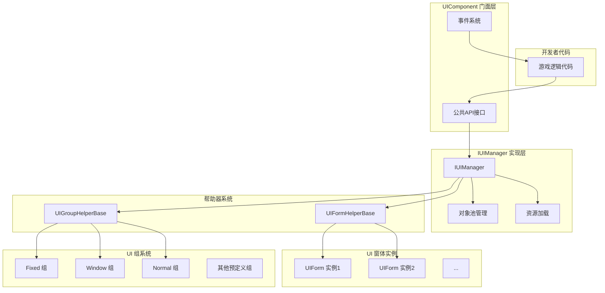
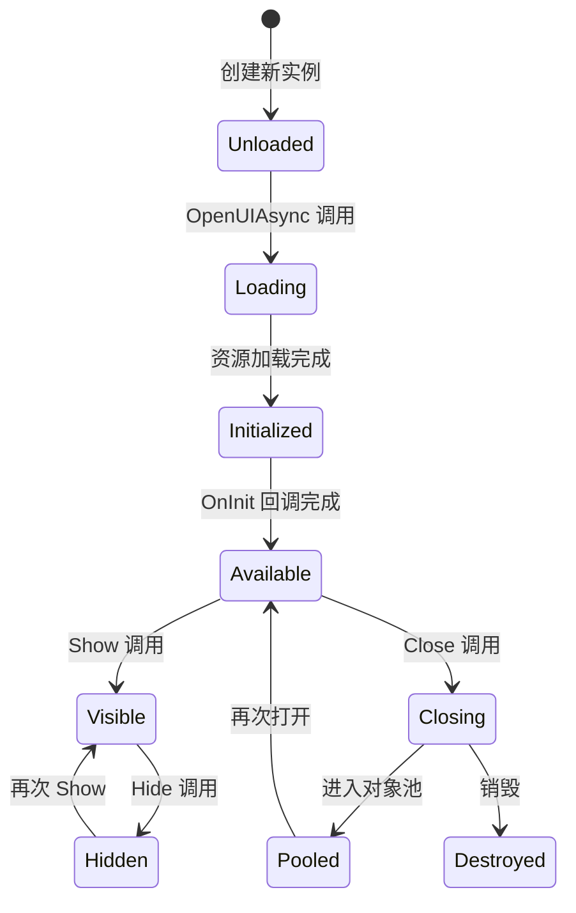
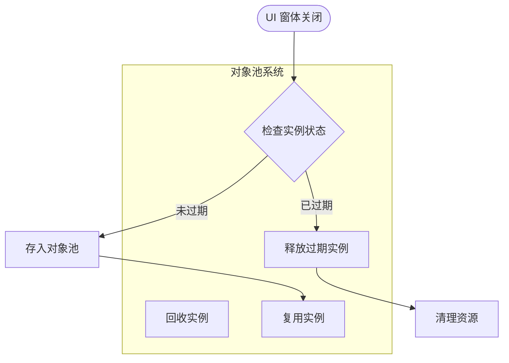
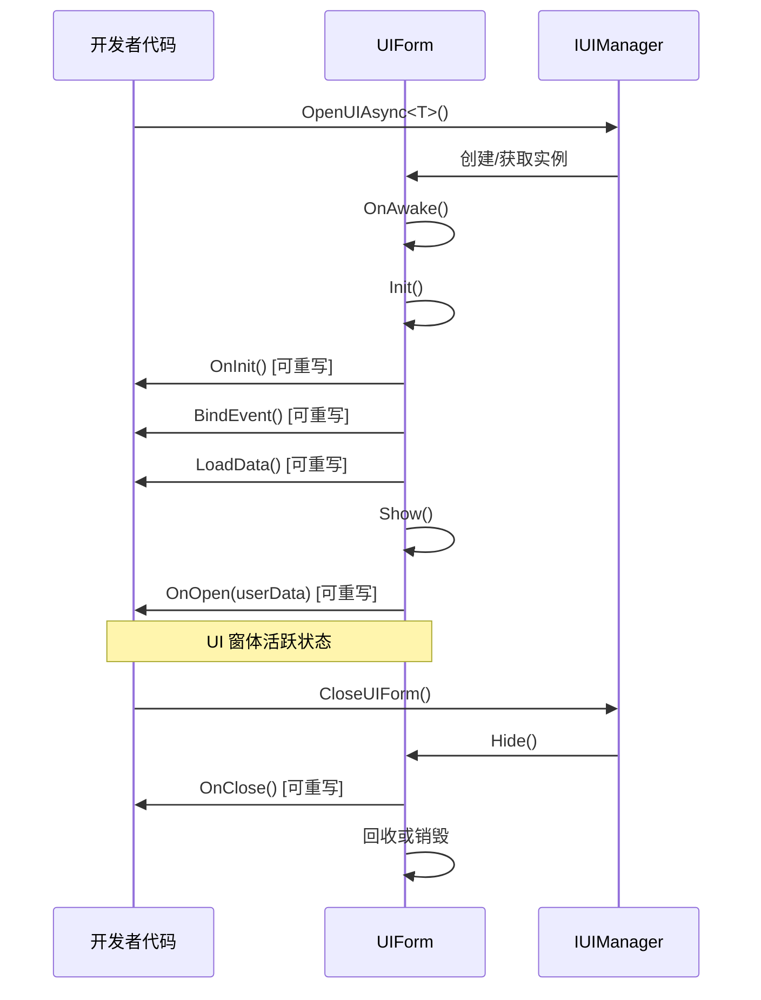

# UI 组件

UI 组件（UIComponent）是 GameFrameX 框架中负责管理和操作 UI 窗体的核心组件。它作为 UI 系统的门面（Facade），封装了底层 `IUIManager` 的复杂实现，为开发者提供简洁易用的 API 接口。

## 概述

UIComponent 是一个 Unity 组件（继承自 GameFrameworkComponent），在整个游戏生命周期中负责 UI 窗体的加载、显示、隐藏、关闭以及回收等全部管理工作。它采用对象池模式来管理 UI 窗体实例，有效减少频繁创建销毁带来的性能开销。

UIComponent 支持多种 UI 渲染方案，包括 Unity 原生的 UGUI 以及第三方 UI 框架 FairyGUI。通过预定义的 18 个 UI 组（UIGroup），可以实现精确的层级控制和遮挡关系管理。

**核心功能：**
- 异步加载和打开 UI 窗体
- 多种方式关闭 UI 窗体（直接关闭、延迟关闭、组关闭）
- UI 窗体对象池管理
- UI 组层级控制
- 显示/隐藏动画支持
- 完整的事件系统

> UIComponent 是 UI 系统的核心入口，详细的 API 方法说明请参阅 [UIComponent API 参考](./5-api-reference.ui-component)。

## 架构

UIComponent 采用门面模式（Facade Pattern）设计，将复杂的 UI 管理逻辑封装在内部，仅暴露简洁的 API 供开发者使用。



**架构说明：**

1. **门面层（UIComponent）**：提供统一的公共 API，包括打开、关闭、获取 UI 窗体，管理 UI 组等方法。同时负责事件的分发。

2. **实现层（IUIManager）**：处理具体的业务逻辑，包括 UI 窗体的加载、缓存、显示/隐藏状态管理等。

3. **对象池管理**：使用 IObjectPoolManager 管理 UI 窗体实例的复用，支持自动回收和过期释放。

4. **帮助器层**：包括 UIFormHelperBase（负责 UI 窗体实例的创建和销毁）和 UIGroupHelperBase（负责 UI 组的创建和管理）。

5. **UI 窗体层**：实际的 UI 窗体实例，继承自 UIForm 基类。

6. **UI 组层**：用于组织和管理具有相同层级属性的 UI 窗体。

## 核心概念

### UI 窗体（UIForm）

UI 窗体是 UI 系统管理的最小单位。每个 UI 窗体都继承自 `UIForm` 基类，实现了 `IUIForm` 接口。UI 窗体具有以下状态：

- **Available（可用）**：窗体已完成初始化，可以被显示
- **Visible（可见）**：窗体当前正在显示
- **FromPool（来自池）**：窗体实例是否从对象池获取



### UI 组系统

UI 组（UIGroup）用于组织具有相似显示层级特性的 UI 窗体。每个 UI 组都有一个深度值（Depth），深度值越大，层级越高（越靠前显示）。

**预定义的 18 个 UI 组：**

| UI 组名称 | 深度值 | 用途说明 |
|----------|--------|----------|
| Hidden | 40 | 隐藏层，用于临时存放 |
| Background | 35 | 背景层 |
| Scene | 30 | 场景层 |
| World | 27 | 世界层（如 3D 场景中的 UI） |
| Battle | 25 | 战斗层 |
| Hud | 22 | 头顶信息层 |
| Map | 20 | 地图层 |
| Floor | 15 | 底层 |
| Normal | 10 | 常规层 |
| Fixed | 0 | 固定层 |
| Window | -10 | 窗口层 |
| Tip | -15 | 提示层 |
| Guide | -20 | 引导层 |
| BlackBoard | -22 | 黑板层 |
| Dialogue | -23 | 对话层 |
| Loading | -25 | 加载层 |
| Notify | -30 | 通知层 |
| System | -35 | 系统层（最高优先级） |

> 更多关于 UI 组的详细信息，请参阅 [UI 组层级](./7-ui-group-hierarchy) 文档。

### 对象池管理

UIComponent 内置了强大的对象池管理系统，主要包含以下参数：

- **InstanceCapacity**：对象池容量，默认 16
- **InstanceExpireTime**：对象过期时间（秒），默认 60 秒
- **InstanceAutoReleaseInterval**：自动释放间隔（秒），默认 60 秒
- **RecycleInterval**：回收间隔（秒），默认 60 秒
- **EnableAutoReleaseUIForm**：是否启用自动释放，默认开启



## 打开 UI 窗体

### 基本用法

使用 `OpenAsync<T>()` 方法可以异步打开一个 UI 窗体：

```csharp
// 打开全屏 UI
var mainMenuForm = await UIComponent.Instance.OpenFullScreenAsync<MainMenuForm>();

// 打开非全屏 UI
var settingsForm = await UIComponent.Instance.OpenAsync<SettingsForm>(false);

// 带用户数据打开
var dialogData = new DialogData { Title = "确认", Message = "是否确认？" };
var confirmForm = await UIComponent.Instance.OpenAsync<ConfirmForm>(false, dialogData);
```

> 更多打开 UI 的 API 方法，请参阅 [UIComponent API 参考 - Open 方法](./5-api-reference.ui-component#open-方法)。

### 使用 UI 组属性

可以通过 `[OptionUIGroup]` 特性为 UI 窗体指定所属的 UI 组：

```csharp
[OptionUIGroup(UIGroupNameConstants.Window)]
public class MyWindowForm : UIForm
{
    // 窗口内容
}
```

## 关闭 UI 窗体

### 关闭单个 UI

```csharp
// 通过实例关闭
var form = UIComponent.Instance.GetLoaded<SettingsForm>();
UIComponent.Instance.CloseUIForm(form);

// 通过类型关闭（关闭第一个匹配的）
UIComponent.Instance.CloseUIForm<SettingsForm>();

// 通过序列编号关闭
UIComponent.Instance.CloseUIForm(serialId);
```

### 关闭多个 UI

```csharp
// 关闭所有已加载的 UI
UIComponent.Instance.CloseAllLoadedUIForms();

// 关闭指定 UI 组的所有 UI
UIComponent.Instance.CloseUIGroup(UIGroupNameConstants.Window);

// 关闭所有正在加载的 UI
UIComponent.Instance.CloseAllLoadingUIForms();
```

## 获取 UI 窗体

### 查询已加载的 UI

```csharp
// 获取单个 UI（按类型）
var form = UIComponent.Instance.GetLoaded<MainMenuForm>();

// 获取所有符合类型的 UI
var forms = UIComponent.Instance.GetLoadedList<DialogForm>();

// 获取已加载且正在显示的 UI
var visibleForm = UIComponent.Instance.GetLoadedAndShowing<AlertForm>();

// 判断指定 UI 是否正在显示
bool isShowing = UIComponent.Instance.HasLoadedAndShowing("AlertForm");
```

### 获取所有 UI

```csharp
// 获取所有已加载的 UI
var allForms = UIComponent.Instance.GetAllLoadedUIForms();

// 获取所有正在加载的 UI 的序列编号
var loadingIds = UIComponent.Instance.GetAllLoadingUIFormSerialIds();
```

## 管理 UI 组

### 添加自定义 UI 组

```csharp
// 添加新的 UI 组
bool success = UIComponent.Instance.AddUIGroup("CustomGroup", 5);
```

### 查询 UI 组

```csharp
// 检查 UI 组是否存在
bool exists = UIComponent.Instance.HasUIGroup("Window");

// 获取 UI 组
var group = UIComponent.Instance.GetUIGroup("Window");

// 获取所有 UI 组
var allGroups = UIComponent.Instance.GetAllUIGroups();

// 获取 UI 组数量
int count = UIComponent.Instance.UIGroupCount;
```

## 配置选项

UIComponent 提供了丰富的配置选项，可以通过 Inspector 面板或代码进行设置：

| 配置项 | 类型 | 默认值 | 说明 |
|--------|------|--------|------|
| EnableAutoReleaseUIForm | bool | true | 是否启用自动释放 UI |
| EnableCloseUIFormCompleteEvent | bool | true | 是否在关闭 UI 时触发完成事件 |
| IsEnableUIShowAnimation | bool | false | 是否启用 UI 显示动画 |
| IsEnableUIHideAnimation | bool | false | 是否启用 UI 隐藏动画 |
| InstanceAutoReleaseInterval | float | 60f | UI 实例自动释放间隔（秒） |
| InstanceCapacity | int | 16 | UI 实例对象池容量 |
| InstanceExpireTime | float | 60f | UI 实例过期时间（秒） |
| RecycleInterval | int | 60 | UI 回收间隔（秒） |
| UGUIRoot | Transform | null | UGUI 根节点 |
| FairyGUIRoot | Transform | null | FairyGUI 根节点 |

### 代码配置示例

```csharp
// 禁用自动释放
UIComponent.Instance.EnableAutoReleaseUIForm = false;

// 设置对象池容量
UIComponent.Instance.InstanceCapacity = 32;

// 设置实例过期时间
UIComponent.Instance.InstanceExpireTime = 120f;

// 设置回收间隔
UIComponent.Instance.RecycleInterval = 30;
```

## UI 窗体生命周期

UI 窗体具有完整的生命周期，开发者可以通过重写相应方法来响应状态变化：



### 可重写的方法

在自定义 UIForm 中，可以重写以下方法来处理生命周期事件：

| 方法 | 调用时机 | 用途 |
|------|----------|------|
| `OnAwake()` | 实例创建后、初始化前 | 执行 Awake 逻辑 |
| `OnInit()` | UI 窗体首次初始化时 | 初始化 UI 组件 |
| `BindEvent()` | 初始化时 | 绑定事件监听 |
| `LoadData()` | 初始化时 | 加载数据 |
| `OnOpen(object userData)` | UI 窗体打开时 | 处理打开逻辑 |
| `OnClose(bool isShutdown, object userData)` | UI 窗体关闭时 | 处理关闭逻辑 |
| `OnPause()` | UI 被遮挡时 | 处理暂停逻辑 |
| `OnResume()` | UI 恢复显示时 | 处理恢复逻辑 |
| `OnUpdate(float elapseSeconds, float realElapseSeconds)` | 每帧更新 | 执行更新逻辑 |
| `UpdateLocalization()` | 语言变更时 | 更新本地化文本 |

## 事件系统

UIComponent 提供了完善的事件系统，用于监听 UI 窗体的状态变化：

### 可订阅的事件

| 事件名称 | 说明 | 事件参数 |
|----------|------|----------|
| `OpenUIFormSuccess` | UI 窗体打开成功 | OpenUIFormSuccessEventArgs |
| `OpenUIFormFailure` | UI 窗体打开失败 | OpenUIFormFailureEventArgs |
| `CloseUIFormComplete` | UI 窗体关闭完成 | CloseUIFormCompleteEventArgs |

### 事件使用示例

```csharp
// 订阅打开成功事件
UIComponent.Instance.OpenUIFormSuccess += OnOpenSuccess;

private void OnOpenSuccess(object sender, OpenUIFormSuccessEventArgs e)
{
    Debug.Log($"UI 打开成功: {e.UIFormAssetName}");
}

// 订阅关闭完成事件
UIComponent.Instance.CloseUIFormComplete += OnCloseComplete;

private void OnCloseComplete(object sender, CloseUIFormCompleteEventArgs e)
{
    Debug.Log($"UI 关闭完成: {e.UIFormSerialId}");
}
```

> 事件系统的详细说明请参阅 [事件系统](./6-event-system) 文档。

## 相关链接

- [UIComponent API 参考](./5-api-reference.ui-component) - 完整的 API 方法说明
- [UI 窗体](./4-core-concepts.ui-form) - UIForm 基类详解
- [UI 组系统](./4-core-concepts.ui-group) - UI 组管理详解
- [对象池管理](./4-core-concepts.object-pool) - 对象池机制详解
- [UI 组层级](./7-ui-group-hierarchy) - UI 组层级详细说明
- [UI 属性](./8-configuration.attributes) - UI 相关特性说明
