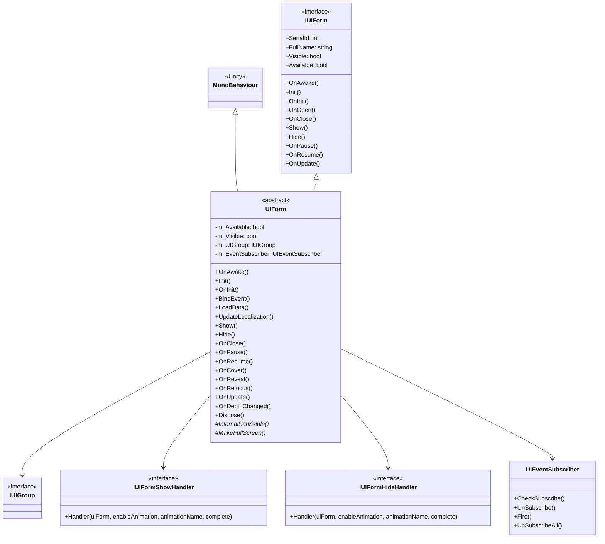
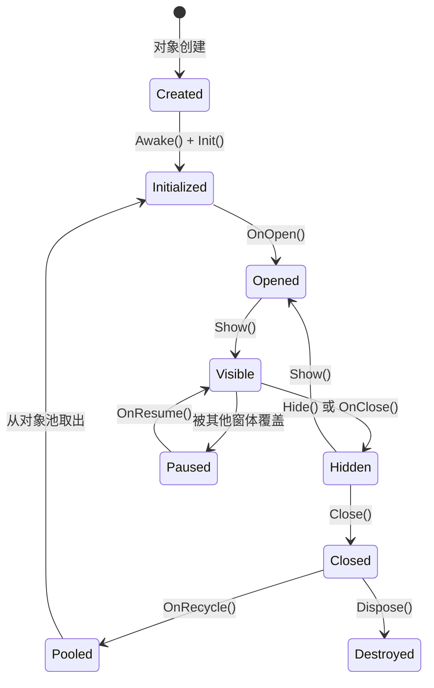

# UIForm

UIForm 是 GameFrameX 框架中所有 UI 窗体的基类，提供了窗体的生命周期管理、可见性控制、事件订阅和 UI 组集成等功能。

## 概述

UIForm 是 UI 系统的核心类，继承自 Unity 的 `MonoBehaviour` 并实现了 `IUIForm` 接口。它为 UI 窗体提供了完整的生命周期管理，包括初始化、显示、隐藏、关闭、暂停、恢复等状态转换。

**主要特性：**
- 完整的生命周期回调机制
- 内置事件订阅系统
- 显示/隐藏动画支持
- 对象池回收机制
- UI 组深度管理
- 本地化语言自动更新

## 类关系图



## 生命周期流程



## 核心属性

| 属性 | 类型 | 描述 |
|------|------|------|
| SerialId | int | 窗体的唯一序列编号 |
| FullName | string | 窗体的完整类名 |
| Name | string | 窗体名称（对应 GameObject 名称） |
| Available | bool | 窗体是否可用 |
| Visible | bool | 窗体是否可见 |
| UIGroup | IUIGroup | 所属的 UI 组 |
| DepthInUIGroup | int | 在 UI 组中的深度 |
| PauseCoveredUIForm | bool | 是否暂停被覆盖的窗体 |
| IsAwake | bool | 是否已执行过 Awake |
| IsDisableRecycling | bool | 是否禁用回收 |
| IsDisableClosing | bool | 是否禁用关闭 |
| IsCanRecycle | bool | 是否可以被回收 |
| EnableShowAnimation | bool | 是否启用显示动画 |
| EnableHideAnimation | bool | 是否启用隐藏动画 |
| UserData | object | 用户自定义数据 |

## 核心方法

### 初始化流程

#### `OnAwake()` - 唤醒回调

Unity 生命周期方法，在对象创建时调用。用于初始化事件订阅器并订阅本地化语言变更事件。

```csharp
public override void OnAwake()
{
    IsAwake = true;
}
```
> Source: [UIForm.cs](https://github.com/GameFrameX/com.gameframex.unity.ui/blob/main/Runtime/UIForm.cs#L433-L436)

#### `Init(...)` - 初始化方法

初始化 UI 窗体，由 UI 管理器调用。

**参数：**
- `serialId` (int): 窗体序列编号
- `uiFormAssetPath` (string): 窗体资源路径
- `uiFormAssetName` (string): 窗体资源名称
- `uiGroup` (IUIGroup): 所属的 UI 组
- `onInitAction` (Action~IUIForm~): 初始化前执行的委托
- `pauseCoveredUIForm` (bool): 是否暂停被覆盖的窗体
- `isNewInstance` (bool): 是否是新实例
- `userData` (object): 用户自定义数据
- `recycleInterval` (int): 回收间隔（秒）
- `isFullScreen` (bool): 是否全屏

```csharp
public void Init(int serialId, string uiFormAssetPath, string uiFormAssetName, IUIGroup uiGroup, 
    Action<IUIForm> onInitAction, bool pauseCoveredUIForm, bool isNewInstance, 
    object userData, int recycleInterval, bool isFullScreen = false)
```
> Source: [UIForm.cs](https://github.com/GameFrameX/com.gameframex.unity.ui/blob/main/Runtime/UIForm.cs#L555-L599)

#### `OnInit()` - 初始化完成回调

初始化完成后的回调，继承类可重写此方法进行初始化逻辑。

```csharp
public virtual void OnInit()
{
}
```
> Source: [UIForm.cs](https://github.com/GameFrameX/com.gameframex.unity.ui/blob/main/Runtime/UIForm.cs#L608-L610)

### 显示与隐藏

#### `OnOpen(object userData)` - 打开回调

窗体打开时调用。

```csharp
public virtual void OnOpen(object userData)
{
    m_Available = true;
    Visible = true;
    m_UserData = userData;
}
```
> Source: [UIForm.cs](https://github.com/GameFrameX/com.gameframex.unity.ui/blob/main/Runtime/UIForm.cs#L639-L644)

#### `Show(IUIFormShowHandler handler, Action complete)` - 显示方法

显示窗体，由系统调用显示动画。

**参数：**
- `handler` (IUIFormShowHandler): 显示处理接口
- `complete` (Action): 完成回调

```csharp
public abstract void Show(IUIFormShowHandler handler, Action complete);
```
> Source: [UIForm.cs](https://github.com/GameFrameX/com.gameframex.unity.ui/blob/main/Runtime/UIForm.cs#L689)

#### `Hide(IUIFormHideHandler handler, Action complete)` - 隐藏方法

隐藏窗体，由系统调用隐藏动画。

**参数：**
- `handler` (IUIFormHideHandler): 隐藏处理接口
- `complete` (Action): 完成回调

```csharp
public abstract void Hide(IUIFormHideHandler handler, Action complete);
```
> Source: [UIForm.cs](https://github.com/GameFrameX/com.gameframex.unity.ui/blob/main/Runtime/UIForm.cs#L724)

#### `OnClose(bool isShutdown, object userData)` - 关闭回调

窗体关闭时调用。

**参数：**
- `isShutdown` (bool): 是否是关闭 UI 管理器时触发
- `userData` (object): 用户自定义数据

```csharp
public virtual void OnClose(bool isShutdown, object userData)
{
    gameObject?.SetLayerRecursively(m_OriginalLayer);
    m_Available = false;
    Visible = false;
    if (m_IsDisableRecycling)
    {
        return;
    }
    ReleaseStartTime = DateTime.Now;
}
```
> Source: [UIForm.cs](https://github.com/GameFrameX/com.gameframex.unity.ui/blob/main/Runtime/UIForm.cs#L700-L712)

### 暂停与恢复

#### `OnPause()` - 暂停回调

窗体被其他窗体覆盖时调用。

```csharp
public virtual void OnPause()
{
    m_Available = false;
    Visible = false;
}
```
> Source: [UIForm.cs](https://github.com/GameFrameX/com.gameframex.unity.ui/blob/main/Runtime/UIForm.cs#L733-L737)

#### `OnResume()` - 恢复回调

窗体从暂停状态恢复时调用。

```csharp
public virtual void OnResume()
{
    m_Available = true;
    Visible = true;
}
```
> Source: [UIForm.cs](https://github.com/GameFrameX/com.gameframex.unity.ui/blob/main/Runtime/UIForm.cs#L746-L750)

### 遮挡处理

#### `OnCover()` - 被遮挡回调

窗体被其他窗体遮挡时调用。

```csharp
public virtual void OnCover()
{
}
```
> Source: [UIForm.cs](https://github.com/GameFrameX/com.gameframex.unity.ui/blob/main/Runtime/UIForm.cs#L759-L761)

#### `OnReveal()` - 取消遮挡回调

窗体从被遮挡状态恢复时调用。

```csharp
public virtual void OnReveal()
{
}
```
> Source: [UIForm.cs](https://github.com/GameFrameX/com.gameframex.unity.ui/blob/main/Runtime/UIForm.cs#L770-L772)

### 其他回调

#### `OnRefocus(object userData)` - 激活回调

窗体被激活时调用，用于将窗体重新置顶。

```csharp
public virtual void OnRefocus(object userData)
{
}
```
> Source: [UIForm.cs](https://github.com/GameFrameX/com.gameframex.unity.ui/blob/main/Runtime/UIForm.cs#L782-L784)

#### `OnUpdate(float elapseSeconds, float realElapseSeconds)` - 轮询回调

每帧调用的轮询方法。

**参数：**
- `elapseSeconds` (float): 逻辑流逝时间（秒）
- `realElapseSeconds` (float): 真实流逝时间（秒）

```csharp
public virtual void OnUpdate(float elapseSeconds, float realElapseSeconds)
{
}
```
> Source: [UIForm.cs](https://github.com/GameFrameX/com.gameframex.unity.ui/blob/main/Runtime/UIForm.cs#L795-L797)

#### `OnDepthChanged(int uiGroupDepth, int depthInUIGroup)` - 深度变更回调

窗体深度改变时调用。

**参数：**
- `uiGroupDepth` (int): UI 组深度
- `depthInUIGroup` (int): 窗体在 UI 组中的深度

```csharp
public void OnDepthChanged(int uiGroupDepth, int depthInUIGroup)
{
    m_DepthInUIGroup = depthInUIGroup;
}
```
> Source: [UIForm.cs](https://github.com/GameFrameX/com.gameframex.unity.ui/blob/main/Runtime/UIForm.cs#L808-L811)

### 事件系统

#### `OnEventSubscribe()` - 事件订阅回调

在 `OnEnable` 时调用，用于订阅事件。继承类可重写此方法注册所需事件。

```csharp
protected virtual void OnEventSubscribe()
{
}
```
> Source: [UIForm.cs](https://github.com/GameFrameX/com.gameframex.unity.ui/blob/main/Runtime/UIForm.cs#L508-L510)

#### `OnEventUnSubscribe()` - 事件取消订阅回调

在 `OnDisable` 时调用，用于取消事件订阅。

```csharp
protected virtual void OnEventUnSubscribe()
{
}
```
> Source: [UIForm.cs](https://github.com/GameFrameX/com.gameframex.unity.ui/blob/main/Runtime/UIForm.cs#L523-L525)

### 回收与销毁

#### `OnRecycle()` - 回收回调

窗体被回收时调用，重置窗体状态。

```csharp
public virtual void OnRecycle()
{
    m_DepthInUIGroup = 0;
    m_PauseCoveredUIForm = true;
}
```
> Source: [UIForm.cs](https://github.com/GameFrameX/com.gameframex.unity.ui/blob/main/Runtime/UIForm.cs#L625-L629)

#### `Dispose()` - 销毁方法

销毁窗体，释放所有资源。

```csharp
public virtual void Dispose()
{
    if (IsDisposed)
    {
        return;
    }
    if (m_EventSubscriber != null)
    {
        m_EventSubscriber.UnSubscribeAll();
        ReferencePool.Release(m_EventSubscriber);
    }
    m_EventSubscriber = null;
    IsDisposed = true;
}
```
> Source: [UIForm.cs](https://github.com/GameFrameX/com.gameframex.unity.ui/blob/main/Runtime/UIForm.cs#L820-L835)

### 子类需实现的方法

#### `InternalSetVisible(bool visible)` - 设置可见性

子类必须实现此方法以处理实际的可见性设置。

```csharp
protected abstract void InternalSetVisible(bool visible);
```
> Source: [UIForm.cs](https://github.com/GameFrameX/com.gameframex.unity.ui/blob/main/Runtime/UIForm.cs#L845)

#### `MakeFullScreen()` - 设置全屏

子类必须实现此方法以处理全屏设置。

```csharp
protected internal abstract void MakeFullScreen();
```
> Source: [UIForm.cs](https://github.com/GameFrameX/com.gameframex.unity.ui/blob/main/Runtime/UIForm.cs#L854)

## 使用示例

### 创建自定义 UIForm

```csharp
using GameFrameX.UI.Runtime;
using UnityEngine;

public class MainMenuForm : UIForm
{
    [SerializeField] private Text titleText;
    [SerializeField] private Button startButton;
    [SerializeField] private Button settingsButton;

    protected override void InternalSetVisible(bool visible)
    {
        gameObject.SetActive(visible);
    }

    protected internal override void MakeFullScreen()
    {
        // 实现全屏逻辑
    }

    public override void OnInit()
    {
        base.OnInit();
        Debug.Log("MainMenuForm 初始化完成");
    }

    public override void BindEvent()
    {
        startButton.onClick.AddListener(OnStartButtonClick);
        settingsButton.onClick.AddListener(OnSettingsButtonClick);
    }

    public override void LoadData()
    {
        // 加载数据
        titleText.text = GetLocalizedString("MainMenu_Title");
    }

    private void OnStartButtonClick()
    {
        // 处理开始按钮点击
    }

    private void OnSettingsButtonClick()
    {
        // 处理设置按钮点击
    }

    public override void UpdateLocalization()
    {
        base.UpdateLocalization();
        titleText.text = GetLocalizedString("MainMenu_Title");
    }
}
```
> Source: [UIForm.cs](https://github.com/GameFrameX/com.gameframex.unity.ui/blob/main/Runtime/UIForm.cs#L37-L855)

### 事件订阅示例

```csharp
public override void OnEventSubscribe()
{
    // 订阅游戏事件
    EventSubscriber.CheckSubscribe(PlayerHealthChangedEventArgs.EventId, OnPlayerHealthChanged);
}

private void OnPlayerHealthChanged(object sender, GameEventArgs e)
{
    var args = (PlayerHealthChangedEventArgs)e;
    UpdateHealthBar(args.CurrentHealth, args.MaxHealth);
}

protected override void OnEventUnSubscribe()
{
    // 取消订阅
    EventSubscriber.UnSubscribe(PlayerHealthChangedEventArgs.EventId, OnPlayerHealthChanged);
}
```
> Source: [UIForm.cs](https://github.com/GameFrameX/com.gameframex.unity.ui/blob/main/Runtime/UIForm.cs#L507-L525)

## 抽象方法说明

以下方法需要在子类中实现：

| 方法 | 描述 |
|------|------|
| `Show(IUIFormShowHandler, Action)` | 显示窗体并执行动画 |
| `Hide(IUIFormHideHandler, Action)` | 隐藏窗体并执行动画 |
| `InternalSetVisible(bool)` | 设置窗体实际可见性 |
| `MakeFullScreen()` | 设置窗体为全屏模式 |

## IUIForm 接口

`UIForm` 实现了 `IUIForm` 接口，该接口定义了所有 UI 窗体必须具备的属性和方法。接口定义包含：

- 属性：`SerialId`、`FullName`、`Visible`、`Available`、`UIGroup`、`DepthInUIGroup` 等
- 方法：`Init()`、`OnInit()`、`OnOpen()`、`OnClose()`、`Show()`、`Hide()`、`OnPause()`、`OnResume()`、`OnUpdate()` 等

> 详细接口定义请参考 [IUIForm.cs](https://github.com/GameFrameX/com.gameframex.unity.ui/blob/main/Runtime/UI/IUIForm.cs)

## 相关链接

- [UIComponent](./5-api-reference.ui-component) - UI 组件参考
- [IUIManager](./5-api-reference.iuimanager) - UI 管理器接口
- [IUIGroup](./5-api-reference.iuigroup) - UI 组接口
- [UI 窗体核心概念](./4-core-concepts.ui-form) - UI 窗体核心概念
- [UI 组系统](./4-core-concepts.ui-group) - UI 组系统
- [事件系统](./6-event-system) - 事件系统
