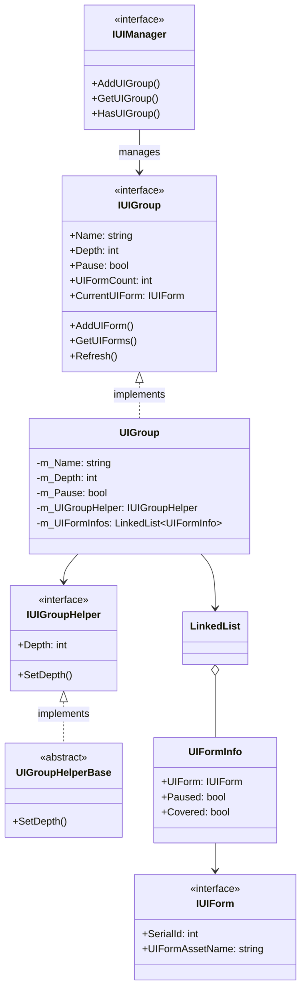
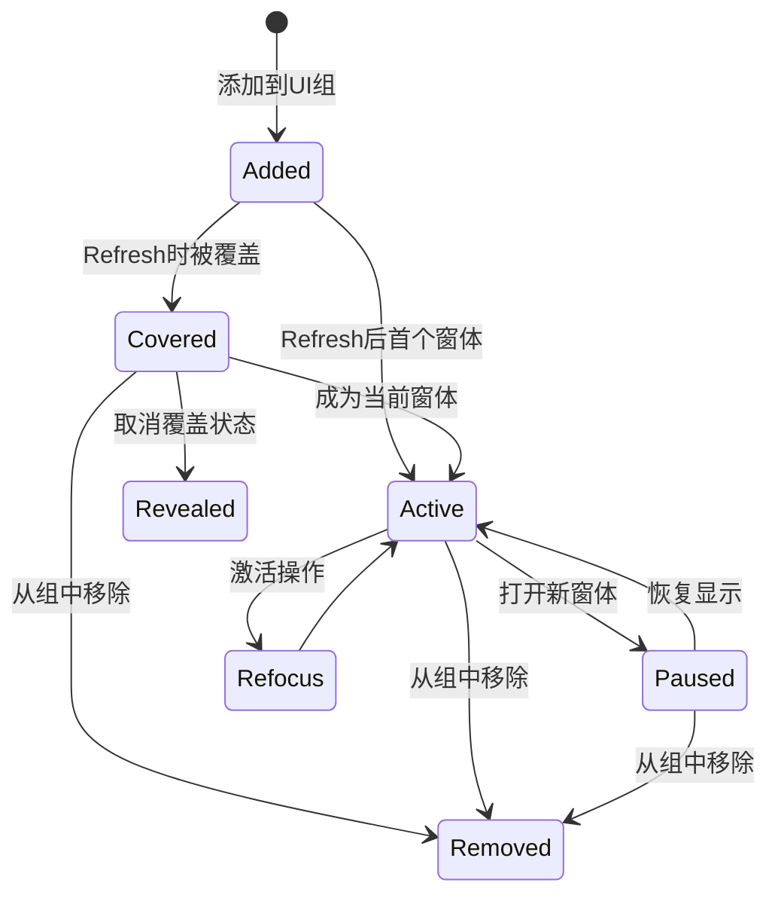
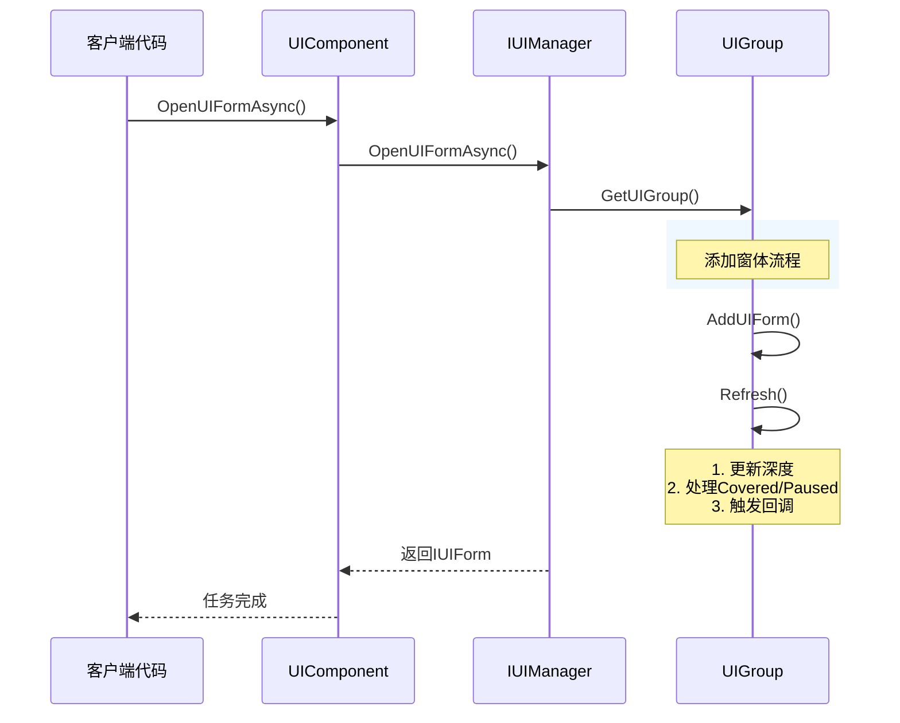
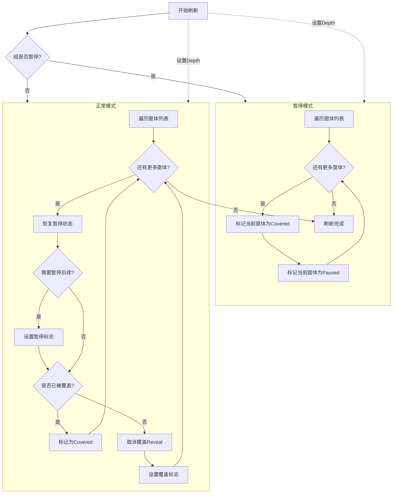

# UI 组系统

UI 组系统是 GameFrameX UI 框架的核心组成部分，用于管理和组织 UI 窗体的显示层级关系。通过 UI 组系统，开发者可以轻松实现 UI 窗体的优先级管理、覆盖控制、暂停恢复等功能。

## 概述

UI 组系统（UI Group System）用于管理具有相同显示优先级的 UI 窗体集合。每个 UI 组具有以下核心特性：

- **深度管理**：每个组有唯一的深度值（Depth），深度越大显示越靠前
- **暂停控制**：可以暂停整个组的 UI 窗体更新
- **覆盖机制**：自动处理 UI 窗体之间的覆盖关系
- **激活管理**：支持将指定窗体置顶（激活）

这种设计借鉴了游戏引擎常见的层级管理方式，通过分组管理可以清晰地组织不同类型和优先级的 UI 界面，如背景层、场景层、战斗 UI、弹出窗口、提示信息等。

> UI 组系统与 UI 窗体系统紧密集成，IUIManager 负责管理所有 UI 组，而每个 UI 组负责管理其内的 UI 窗体。

## 架构设计



UI 组系统的架构采用分层设计：

- **IUIManager 层**：管理所有 UI 组，提供组的增删改查接口
- **IUIGroup 层**：定义 UI 组的核心接口，包含组名称、深度、暂停状态等属性
- **UIGroup 实现层**：使用 LinkedList 数据结构高效管理 UI 窗体集合
- **IUIGroupHelper 层**：处理 UI 组的视觉表现，如 Transform 深度设置

## 核心概念

### 深度（Depth）

深度是 UI 组的核心属性，决定了组的显示优先级。深度值越大，UI 组显示越靠前。系统预定义了一系列标准组的深度值，开发者也可以自定义新的组和深度。

深度值的设计遵循以下原则：
- 背景类 UI 使用较高深度（40-30）
- 场景和战斗 UI 使用中等深度（30-20）
- 常规和固定 UI 使用基础深度（10-0）
- 弹出窗口和提示类使用负深度（-10 以下）

### 暂停（Pause）

当 UI 组被设置为暂停状态时，组内所有 UI 窗体的 `OnUpdate` 方法将不再被调用，但窗体仍然可见。这是一个实用的功能，例如在显示加载界面时可以暂停其他 UI 的更新，节省性能资源。

### 覆盖（Covered）

当打开新窗体时，旧窗体会自动被标记为"覆盖"状态。系统通过 `Refresh()` 方法自动管理这个状态，确保用户始终看到最新打开的窗体。覆盖状态会触发 UI 窗体的 `OnCover` 回调，开发者可以在此处理相关的视觉效果。

### 激活（Refocus）

激活操作将指定的 UI 窗体移动到组的最前端，使其成为当前窗体。这在需要将某个已打开的窗体置顶时非常有用，例如从后台恢复一个设置面板。

## 预定义 UI 组

框架提供了一系列预定义的 UI 组常量，开发者可以直接使用：

```csharp
// 预定义 UI 组常量
UIGroupConstants.Hidden       // 隐藏层 (深度: 40)
UIGroupConstants.Background   // 背景层 (深度: 35)
UIGroupConstants.Scene        // 场景层 (深度: 30)
UIGroupConstants.World        // 世界层 (深度: 27)
UIGroupConstants.Battle       // 战斗层 (深度: 25)
UIGroupConstants.Hud          // HUD层 (深度: 22)
UIGroupConstants.Map          // 地图层 (深度: 20)
UIGroupConstants.Floor        // 底板层 (深度: 15)
UIGroupConstants.Normal       // 正常层 (深度: 10)
UIGroupConstants.Fixed        // 固定层 (深度: 0)
UIGroupConstants.Window       // 窗口层 (深度: -10)
UIGroupConstants.Tip          // 提示层 (深度: -15)
UIGroupConstants.Guide        // 引导层 (深度: -20)
UIGroupConstants.BlackBoard   // 黑板层 (深度: -22)
UIGroupConstants.Dialogue     // 对话层 (深度: -23)
UIGroupConstants.Loading      // 加载层 (深度: -25)
UIGroupConstants.Notify       // 通知层 (深度: -30)
UIGroupConstants.System       // 系统层 (深度: -35)
```

> Source: [UIGroupConstants.cs](https://github.com/GameFrameX/com.gameframex.unity.ui/blob/main/Runtime/UIGroupConstants.cs#L38-L202)

```csharp
// 预定义 UI 组名称常量
UIGroupNameConstants.Hidden       // "Hidden"
UIGroupNameConstants.Background  // "Background"
UIGroupNameConstants.Scene        // "Scene"
// ... 更多常量
```

> Source: [UIGroupNameConstants.cs](https://github.com/GameFrameX/com.gameframex.unity.ui/blob/main/Runtime/UIGroupNameConstants.cs#L38-L202)

## 窗体状态流转

UI 窗体在组内会经历不同的状态转换，理解这些状态对于正确使用 UI 组系统非常重要：



### 状态说明

| 状态 | 描述 | 触发回调 |
|------|------|----------|
| **Active** | 活动状态，当前显示的窗体 | OnResume, OnRefocus |
| **Covered** | 被其他窗体覆盖 | OnCover |
| **Paused** | 暂停状态，不更新但可见 | OnPause |
| **Removed** | 已从组中移除 | OnClose |

## 核心流程

### 打开 UI 窗体并添加到组



### UI 组刷新流程

刷新是 UI 组的核心理论，它维护组内所有窗体的正确状态：



## 使用示例

### 创建自定义 UI 组

使用 UIComponent 创建自定义 UI 组：

```csharp
public class GameEntry : MonoBehaviour
{
    public UIComponent UIComp;
    
    void Start()
    {
        // 创建自定义 UI 组，深度为 5
        UIComp.AddUIGroup("CustomGroup", 5);
        
        // 或者使用预定义组
        UIComp.AddUIGroup(UIGroupNameConstants.Window, -10);
    }
}
```

> Source: [UIComponent.IUIGroup.cs](https://github.com/GameFrameX/com.gameframex.unity.ui/blob/main/Runtime/UIComponent.IUIGroup.cs#L100-L147)

### 访问 UI 组

通过 UIComponent 访问和管理 UI 组：

```csharp
public class UIManagerExample : MonoBehaviour
{
    public UIComponent UIComp;
    
    public void ManageGroups()
    {
        // 检查组是否存在
        if (UIComp.HasUIGroup("Window"))
        {
            // 获取组
            IUIGroup group = UIComp.GetUIGroup("Window");
            
            // 获取当前显示的窗体
            IUIForm currentForm = group.CurrentUIForm;
            
            // 获取组内窗体数量
            int count = group.UIFormCount;
            
            // 获取所有窗体
            IUIForm[] allForms = group.GetAllUIForms();
            
            // 设置组深度
            group.Depth = 10;
            
            // 暂停/恢复组
            group.Pause = false;
            
            // 激活指定窗体
            group.RefocusUIForm(someUIForm, null);
        }
    }
}
```

### 使用预定义组常量打开窗体

```csharp
public class UIFormOpener : MonoBehaviour
{
    public UIComponent UIComp;
    
    public async void OpenDialog()
    {
        // 打开对话框到对话层
        IUIForm dialog = await UIComp.OpenUIFormAsync<DialogForm>(
            "Assets/Prefabs/UI/Dialog.prefab",
            UIGroupNameConstants.Dialogue,
            true,  // 暂停被覆盖的窗体
            null   // 用户数据
        );
    }
    
    public async void OpenTip()
    {
        // 打开提示到提示层（不暂停其他窗体）
        IUIForm tip = await UIComp.OpenUIFormAsync<TipForm>(
            "Assets/Prefs/UI/Tip.prefab",
            UIGroupNameConstants.Tip,
            false,
            "这是一个提示"
        );
    }
}
```

### 关闭整个 UI 组

关闭指定组内的所有 UI 窗体：

```csharp
public class UIGroupCloser : MonoBehaviour
{
    public UIComponent UIComp;
    
    public void CloseAllDialogs()
    {
        // 关闭对话组的所有窗体
        UIComp.CloseUIGroup(UIGroupNameConstants.Dialogue, null);
    }
    
    public void CloseAllWindows()
    {
        // 关闭窗口组
        if (UIComp.HasUIGroup(UIGroupNameConstants.Window))
        {
            UIComp.GetUIGroup(UIGroupNameConstants.Window);
            UIComp.CloseUIGroup(UIGroupNameConstants.Window, "user_close_all");
        }
    }
}
```

> Source: [BaseUIManager.UIGroup.cs](https://github.com/GameFrameX/com.gameframex.unity.ui/blob/main/Runtime/BaseUIManager.UIGroup.cs#L150-L176)

## IUIGroup 接口参考

完整的方法签名和说明：

### 属性

| 属性 | 类型 | 描述 |
|------|------|------|
| Name | string | 获取 UI 组名称 |
| Depth | int | 获取或设置 UI 组深度 |
| Pause | bool | 获取或设置 UI 组是否暂停 |
| UIFormCount | int | 获取 UI 组中窗体数量 |
| CurrentUIForm | IUIForm | 获取当前显示的窗体 |
| Helper | IUIGroupHelper | 获取 UI 组辅助器 |

### 方法

#### `HasUIForm(int serialId): bool`

检查组中是否存在指定序列号的窗体。

**参数：**
- `serialId` (int): UI 窗体的序列编号

**返回：** 是否存在

---

#### `HasUIForm(string uiFormAssetName): bool`

检查组中是否存在指定资源名称的窗体。

**参数：**
- `uiFormAssetName` (string): UI 窗体资源名称

**返回：** 是否存在

---

#### `GetUIForm(int serialId): IUIForm`

根据序列号获取窗体。

**参数：**
- `serialId` (int): UI 窗体的序列编号

**返回：** UI 窗体实例，不存在则返回 null

---

#### `GetUIForms(string uiFormAssetName): IUIForm[]`

根据资源名称获取所有匹配的窗体。

**参数：**
- `uiFormAssetName` (string): UI 窗体资源名称

**返回：** UI 窗体数组

---

#### `GetAllUIForms(): IUIForm[]`

获取组内所有窗体。

**返回：** 所有 UI 窗体数组

---

#### `AddUIForm(IUIForm uiForm): void`

添加窗体到组。

**参数：**
- `uiForm` (IUIForm): 要添加的 UI 窗体

---

#### `Refresh(): void`

刷新 UI 组状态，更新所有窗体的覆盖和暂停状态。

---

## IUIManager 中的 UI 组方法

IUIManager 提供了完整的 UI 组管理接口：

| 方法 | 描述 |
|------|------|
| `HasUIGroup(string)` | 检查组是否存在 |
| `GetUIGroup(string)` | 获取指定组 |
| `GetAllUIGroups()` | 获取所有组 |
| `AddUIGroup(string, IUIGroupHelper)` | 添加新组 |
| `AddUIGroup(string, int, IUIGroupHelper)` | 添加指定深度的组 |
| `CloseUIGroup(string, object)` | 关闭组内所有窗体 |

> 完整的 IUIManager 接口定义请参考 [API 参考文档](./5-api-reference.iuimanager)

## 相关链接

- [UI 组件](./4-core-concepts.ui-component) - UI 组件基础
- [UI 窗体](./4-core-concepts.ui-form) - UI 窗体系统
- [API 参考 - IUIGroup](./5-api-reference.iuigroup) - IUIGroup 完整接口文档
- [API 参考 - IUIManager](./5-api-reference.iuimanager) - IUIManager 完整接口文档
- [UI 组层级](./7-ui-group-hierarchy) - UI 组层级详细说明
