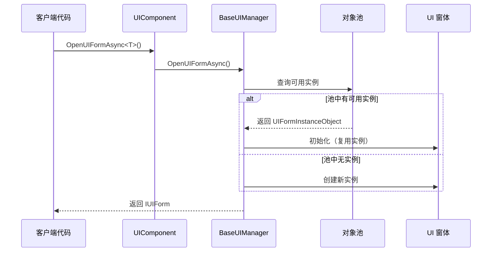
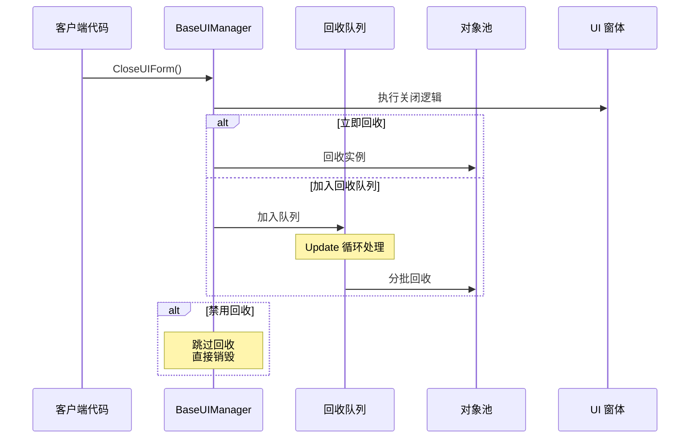
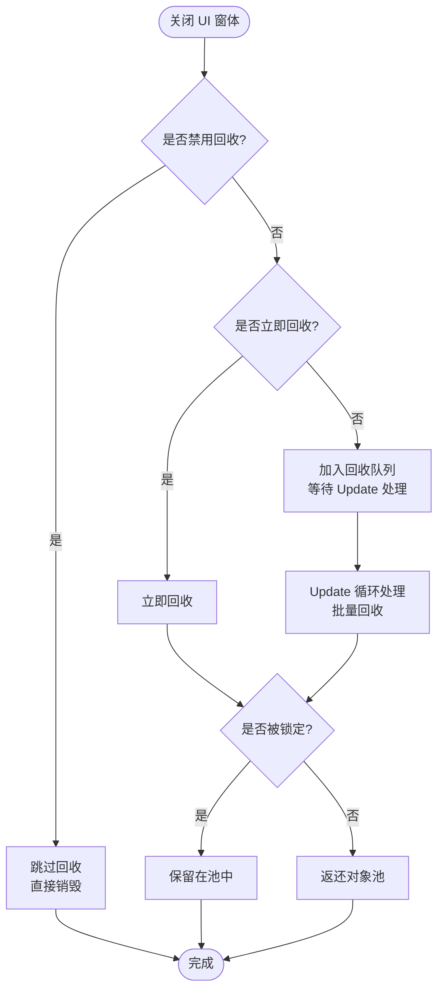

# 对象池管理

对象池管理是 GameFrameX UI 系统中用于优化 UI 窗体实例创建和销毁的核心机制。通过对象池，系统可以重复使用已关闭的 UI 窗体实例，避免频繁的实例化带来的性能开销。

## 概述

在游戏或应用中，UI 窗体的打开和关闭是非常频繁的操作。传统的做法是每次打开时创建新实例，关闭时销毁实例，这种方式会导致：

- **内存碎片化**：频繁的对象创建和销毁会导致内存碎片
- **GC 压力**：大量临时对象会增加垃圾回收的频率
- **加载延迟**：实例化 UI 预制体需要时间，影响用户体验

对象池通过以下方式解决这些问题：

- **实例复用**：关闭的 UI 窗体不会被销毁，而是回收并存入池中
- **按需分配**：从池中获取实例时，如果池中有可用实例则直接复用，没有才创建新实例
- **自动管理**：对象池支持自动释放过期实例和容量管理

### 核心概念

| 概念 | 说明 |
|------|------|
| **对象池 (Object Pool)** | 存储可复用 UI 窗体实例的容器 |
| **回收 (Recycle)** | 将关闭的 UI 窗体实例返还给对象池 |
| **释放 (Release)** | 从池中彻底移除过期或多余的实例 |
| **锁定 (Locked)** | 被锁定的实例不会被池自动释放 |
| **优先级 (Priority)** | 用于确定在容量不足时优先保留哪些实例 |

## 架构

```mermaid
flowchart TD
    subgraph UIComponent["UIComponent"]
        A1[UIComponent] --> A2[IUIManager]
    end

    subgraph BaseUIManager["BaseUIManager"]
        B1[IObjectPoolManager] --> B2[IObjectPool&lt;UIFormInstanceObject&gt;]
        B2 --> B3[UIFormInstanceObject Pool<br/>"UI Instance Pool"]
    end

    subgraph PoolObjects["池对象"]
        C1[UIFormInstanceObject 1]
        C2[UIFormInstanceObject 2]
        C3[UIFormInstanceObject N]
    end

    subgraph UIForms["UI 窗体"]
        D1[UI 窗体实例 1]
        D2[UI 窗体实例 2]
        D3[UI 窗体实例 N]
    end

    A2 --> B1
    B2 --- C1
    B2 --- C2
    B2 --- C3
    C1 --- D1
    C2 --- D2
    C3 --- D3
```

### 组件说明

| 组件 | 职责 |
|------|------|
| **UIComponent** | UI 组件入口，负责初始化对象池管理器配置 |
| **BaseUIManager** | UI 管理器核心，管理对象池的创建和操作 |
| **IObjectPoolManager** | 外部对象池管理器接口（来自 GameFrameX.ObjectPool 包） |
| **IObjectPool\<UIFormInstanceObject\>** | UI 窗体实例专用对象池 |
| **UIFormInstanceObject** | 封装 UI 窗体实例的包装类，包含资源句柄等信息 |

### 对象池类型

系统使用 `CreateMultiSpawnObjectPool` 方法创建多生成对象池，这意味着：

- 同一类型的 UI 窗体可以同时存在多个实例
- 每个实例独立管理自己的生命周期
- 支持设置实例级别的锁定和优先级

> Source: [BaseUIManager.cs#L268](https://github.com/GameFrameX/com.gameframex.unity.ui/blob/main/Runtime/BaseUIManager.cs#L268)

## 核心流程

### UI 窗体打开流程



### UI 窗体回收流程



### 回收决策流程



## 配置选项

在 UIComponent 中可以配置对象池的各项参数，这些设置会在 `Start()` 方法中应用到 UI 管理器。

| 配置项 | 类型 | 默认值 | 说明 |
|--------|------|--------|------|
| `InstanceAutoReleaseInterval` | float | 60f | 对象池自动释放可释放对象的间隔秒数 |
| `InstanceCapacity` | int | 16 | 对象池的容量，表示最多缓存多少个实例 |
| `InstanceExpireTime` | float | 60f | 对象过期时间（秒），超过此时间的未使用实例会被释放 |
| `RecycleInterval` | int | 60 | 回收间隔秒数，控制从回收队列处理的速度 |
| `EnableAutoReleaseUIForm` | bool | true | 是否启用 UI 自动释放 |

> Source: [UIComponent.cs#L113-L141](https://github.com/GameFrameX/com.gameframex.unity.ui/blob/main/Runtime/UIComponent.cs#L113-L141)

### 通过 IUIManager 接口配置

```csharp
// 获取 UI 组件
var uiComponent = GameEntry.GetComponent<UIComponent>();

// 配置对象池参数
uiComponent.InstanceAutoReleaseInterval = 30f;  // 30秒自动释放
uiComponent.InstanceCapacity = 32;               // 容量改为 32
uiComponent.InstanceExpireTime = 30f;             // 30秒过期
uiComponent.RecycleInterval = 30;                // 30秒回收间隔
```

### 运行时动态配置

```csharp
// 获取 UI 管理器
IUIForm uiForm = await uiComponent.OpenUIFormAsync<MainForm>("UI/MainForm");

// 设置实例锁定（防止被释放）
uiComponent.SetUIFormInstanceLocked(uiForm.Handle, true);

// 设置实例优先级（数值越高越优先保留）
uiComponent.SetUIFormInstancePriority(uiForm.Handle, 100);
```

> Source: [BaseUIManager.Open.cs#L164-L182](https://github.com/GameFrameX/com.gameframex.unity.ui/blob/main/Runtime/BaseUIManager.Open.cs#L164-L182)

## UI 窗体回收控制

每个 UI 窗体都可以独立控制是否允许回收。

### UIForm 属性

| 属性 | 类型 | 说明 |
|------|------|------|
| `IsDisableRecycling` | bool | 是否禁用回收。禁用的 UI 窗体关闭后会被直接销毁，不会存入对象池 |
| `IsDisableClosing` | bool | 是否禁用关闭。禁用的 UI 窗体无法被关闭 |
| `IsCanRecycle` | bool | 是否可以回收（只读），由其他属性综合计算得出 |
| `ReleaseStartTime` | DateTime | 回收开始时间，用于判断是否已达到回收条件 |
| `RecycleInterval` | int | 该 UI 窗体的回收间隔（秒） |

> Source: [IUIForm.cs#L84-L114](https://github.com/GameFrameX/com.gameframex.unity.ui/blob/main/Runtime/UI/IUIForm.cs#L84-L114)

### 使用示例

在 UI 窗体脚本中控制回收行为：

```csharp
public class MyUIForm : UIForm
{
    protected override void OnInit()
    {
        // 禁用此窗体的回收功能
        // 关闭后会被直接销毁，不会存入对象池
        IsDisableRecycling = true;
        
        // 或者禁用关闭功能
        // IsDisableClosing = true;
    }
    
    protected override void OnRecycle()
    {
        // 当窗体被回收时执行的逻辑
        // 可以在这里保存状态或清理资源
        base.OnRecycle();
    }
}
```

> Source: [UIForm.cs#L56](https://github.com/GameFrameX/com.gameframex.unity.ui/blob/main/Runtime/UIForm.cs#L56)
> Source: [UIForm.cs#L625-L629](https://github.com/GameFrameX/com.gameframex.unity.ui/blob/main/Runtime/UIForm.cs#L625-L629)

## UIFormInstanceObject

`UIFormInstanceObject` 是存储在对象池中的包装对象，封装了 UI 窗体实例及其相关资源。

```csharp
public sealed class UIFormInstanceObject : ObjectBase
{
    private object m_UIFormAsset = null;           // UI 资源对象
    private string m_UIFormAssetPath = null;        // UI 资源路径
    private string m_UIFormAssetName = null;        // UI 资源名称
    private IUIFormHelper m_UIFormHelper = null;    // UI 辅助器
    private object m_AssetHandle = null;           // 资源句柄
    
    protected override void Release(bool isShutdown)
    {
        // 释放时调用辅助器回收 UI 资源
        m_UIFormHelper.ReleaseUIForm(m_UIFormAsset, Target, m_AssetHandle, 
            m_UIFormAssetPath, m_UIFormAssetName);
    }
}
```

> Source: [BaseUIManager.UIFormInstanceObject.cs#L41-L104](https://github.com/GameFrameX/com.gameframex.unity.ui/blob/main/Runtime/BaseUIManager.UIFormInstanceObject.cs#L41-L104)

## 最佳实践

### 1. 合理设置容量

根据同时显示的 UI 窗体数量设置容量：

```csharp
// 如果同时最多显示 10 个不同类型的 UI 窗体
uiComponent.InstanceCapacity = 20; // 留一些余量
```

### 2. 调整自动释放间隔

根据 UI 使用频率调整：

```csharp
// 频繁切换的 UI：较短的间隔
uiComponent.InstanceAutoReleaseInterval = 30f;
uiComponent.InstanceExpireTime = 30f;

// 较少切换的 UI：较长的间隔
uiComponent.InstanceAutoReleaseInterval = 300f;
uiComponent.InstanceExpireTime = 300f;
```

### 3. 锁定重要实例

对于需要常驻内存的 UI 窗体，锁定它们：

```csharp
// 打开设置界面并锁定
var settingsForm = await uiComponent.OpenUIFormAsync<SettingsForm>("UI/Settings");
uiComponent.SetUIFormInstanceLocked(settingsForm.Handle, true);
```

### 4. 禁用频繁销毁的 UI 回收

对于某些频繁打开关闭但不需要复用的 UI，可以禁用回收：

```csharp
public class PopupTipForm : UIForm
{
    protected override void OnInit()
    {
        // 弹窗类 UI 每次都是新内容，禁用回收
        IsDisableRecycling = true;
    }
}
```

## 相关链接

- [UI 组件](./4-core-concepts.ui-component)
- [UI 窗体](./4-core-concepts.ui-form)
- [UI 组系统](./4-core-concepts.ui-group)
- [IUIManager API 参考](./5-api-reference.iuimanager)
- [UIForm API 参考](./5-api-reference.ui-form)
- [事件系统](./6-event-system)
