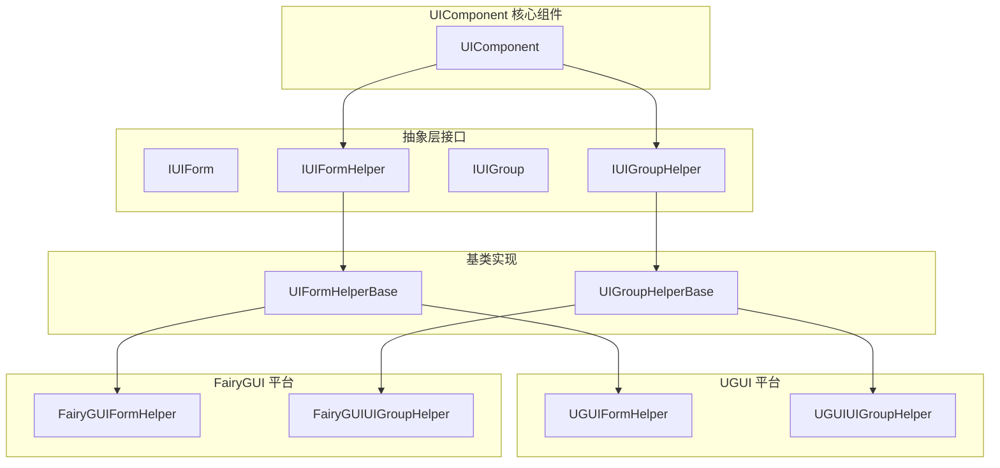
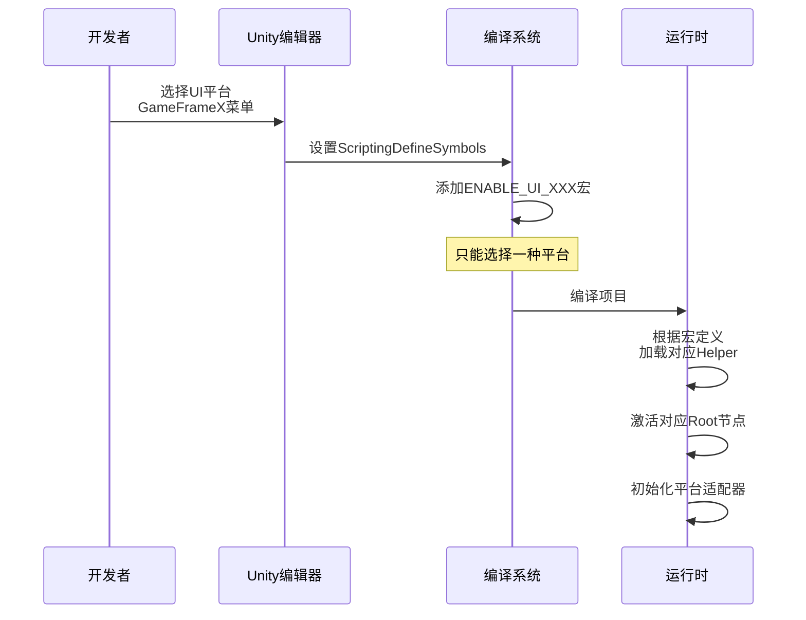

# 平台支持

GameFrameX UI 系统支持多种 UI 渲染平台，通过统一的接口抽象，使开发者能够在不同的 UI 系统之间灵活切换，同时保持业务代码的一致性。

## 概述

GameFrameX UI 框架采用平台无关的设计理念，通过抽象层（Helper 接口）隔离不同 UI 系统的实现差异。目前支持两大主流 UI 平台：

| UI 平台 | 宏定义符号 | 说明 |
|---------|------------|------|
| **UGUI** | `ENABLE_UI_UGUI` | Unity 官方内置的 UI 系统 |
| **FairyGUI** | `ENABLE_UI_FAIRYGUI` | 专业的第三方 UI 解决方案 |

这种设计使得业务逻辑代码无需修改，仅通过切换宏定义即可在不同 UI 系统之间迁移，有效降低了平台切换成本。

## 架构设计



### 核心组件说明

| 组件 | 职责 |
|------|------|
| **UIComponent** | UI 核心管理器，负责协调各 Helper 工作 |
| **IUIFormHelper** | UI 窗体辅助器接口，定义窗体的创建、实例化和释放 |
| **IUIGroupHelper** | UI 组辅助器接口，定义组的管理和深度控制 |
| **UIFormHelperBase** | 窗体辅助器抽象基类，提供平台无关的统一实现 |
| **UIGroupHelperBase** | 组辅助器抽象基类，提供平台无关的统一实现 |

## 平台切换配置

### 通过脚本宏定义切换

在 Unity 编辑器中，通过菜单配置 UI 平台：

```
GameFrameX → Scripting Define Symbols → Enable UGUI(开启UGUI适配)
GameFrameX → Scripting Define Symbols → Enable FairyGUI(开启FairyGUI适配)
```

> Source: [UISystemScriptingDefineSymbols.cs](https://github.com/GameFrameX/com.gameframex.unity.ui/blob/main/Editor/UISystemScriptingDefineSymbols.cs#L42-L63)

宏定义符号说明：

| 宏定义 | 作用 |
|--------|------|
| `ENABLE_UI_UGUI` | 启用 UGUI 平台支持 |
| `ENABLE_UI_FAIRYGUI` | 启用 FairyGUI 平台支持 |

切换原理：
```csharp
public static void EnableUGUISystem()
{
    ScriptingDefineSymbols.RemoveScriptingDefineSymbol(FairyGUIScriptingDefineSymbol);
    ScriptingDefineSymbols.AddScriptingDefineSymbol(UGUIScriptingDefineSymbol);
}

public static void EnableFairyGUISystem()
{
    ScriptingDefineSymbols.RemoveScriptingDefineSymbol(UGUIScriptingDefineSymbol);
    ScriptingDefineSymbols.AddScriptingDefineSymbol(FairyGUIScriptingDefineSymbol);
}
```
> Source: [UISystemScriptingDefineSymbols.cs](https://github.com/GameFrameX/com.gameframex.unity.ui/blob/main/Editor/UISystemScriptingDefineSymbols.cs#L49-L63)

### 运行时平台适配

UIComponent 在运行时通过条件编译自动适配对应平台：

```csharp
protected override void Awake()
{
    // ...
    var namespaceName = ImplementationComponentType.Namespace;

#if ENABLE_UI_FAIRYGUI
    if (!namespaceName.StartsWithFast("GameFrameX.UI.FairyGUI.Runtime"))
    {
        Debug.LogError("UI组件的 ComponentType 设置错误。请设置和 UI 系统一致的组件.");
        return;
    }

    if (m_InstanceFairyGUIRoot == null)
    {
        Debug.LogError("UI组件的 FAIRY GUI Root 设置错误。请设置");
        return;
    }

    m_InstanceFairyGUIRoot.gameObject.SetActive(true);
    if (m_InstanceUGUIRoot != null)
    {
        m_InstanceUGUIRoot.gameObject.SetActive(false);
    }

#elif ENABLE_UI_UGUI
    if (!namespaceName.StartsWithFast("GameFrameX.UI.UGUI.Runtime"))
    {
        Debug.LogError("UI组件的 ComponentType 设置错误。请设置和 UI 系统一致的组件.");
        return;
    }

    if (m_InstanceUGUIRoot == null)
    {
        Debug.LogError("UI组件的 UGUI Root 设置错误。请设置");
        return;
    }

    m_InstanceUGUIRoot.gameObject.SetActive(true);
#endif
}
```
> Source: [UIComponent.cs](https://github.com/GameFrameX/com.gameframex.unity.ui/blob/main/Runtime/UIComponent.cs#L370-L416)

## 根节点配置

每个 UI 平台都需要配置独立的根节点（Root Transform），用于挂载该平台创建的 UI 界面。

| 属性 | 类型 | 说明 |
|------|------|------|
| `UGUIRoot` | `Transform` | UGUI 界面的根节点 |
| `FairyGUIRoot` | `Transform` | FairyGUI 界面的根节点 |

```csharp
/// 获取 UGUI 根节点变换组件。
public Transform UGUIRoot
{
    get { return m_InstanceUGUIRoot; }
}

/// 获取 FairyGUI 根节点变换组件。
public Transform FairyGUIRoot
{
    get { return m_InstanceFairyGUIRoot; }
}
```
> Source: [UIComponent.cs](https://github.com/GameFrameX/com.gameframex.unity.ui/blob/main/Runtime/UIComponent.cs#L235-L249)

### 配置示例

在 Unity 编辑器中配置根节点：

1. 创建空 GameObject 命名为 `UGUIRoot`，设置 Layer 为 `UI`
2. 创建空 GameObject 命名为 `FairyGUIRoot`
3. 在 UIComponent 组件中分别将这两个 GameObject 赋值给对应属性

```csharp
[SerializeField] private Transform m_InstanceUGUIRoot = null;
[SerializeField] private Transform m_InstanceFairyGUIRoot = null;
```
> Source: [UIComponent.cs](https://github.com/GameFrameX/com.gameframex.unity.ui/blob/main/Runtime/UIComponent.cs#L151-L161)

## Helper 配置

UI 系统通过 Helper（辅助器）来实现平台特定的功能：

### UIFormHelper 配置

负责 UI 窗体的实例化、创建和释放：

| 平台 | 默认类型名称 |
|------|--------------|
| FairyGUI | `GameFrameX.UI.FairyGUI.Runtime.FairyGUIFormHelper` |
| UGUI | `GameFrameX.UI.UGUI.Runtime.UGUIFormHelper` |

```csharp
[SerializeField] private string m_UIFormHelperTypeName = "GameFrameX.UI.FairyGUI.Runtime.FairyGUIFormHelper";
[SerializeField] private UIFormHelperBase m_CustomUIFormHelper = null;
```
> Source: [UIComponent.cs](https://github.com/GameFrameX/com.gameframex.unity.ui/blob/main/Runtime/UIComponent.cs#L169-L179)

### UIGroupHelper 配置

负责 UI 组的管理和深度控制：

| 平台 | 默认类型名称 |
|------|--------------|
| FairyGUI | `GameFrameX.UI.FairyGUI.Runtime.FairyGUIUIGroupHelper` |
| UGUI | `GameFrameX.UI.UGUI.Runtime.UGUIUIGroupHelper` |

```csharp
[SerializeField] private string m_UIGroupHelperTypeName = "GameFrameX.UI.FairyGUI.Runtime.FairyGUIUIGroupHelper";
[SerializeField] private UIGroupHelperBase m_CustomUIGroupHelper = null;
```
> Source: [UIComponent.cs](https://github.com/GameFrameX/com.gameframex.unity.ui/blob/main/Runtime/UIComponent.cs#L187-L197)

## 抽象基类设计

### UIFormHelperBase

```csharp
public abstract class UIFormHelperBase : MonoBehaviour, IUIFormHelper
{
    /// 实例化界面
    public abstract object InstantiateUIForm(object uiFormAsset);

    /// 创建界面
    public abstract IUIForm CreateUIForm(object uiFormInstance, Type uiFormType, object userData);

    /// 释放界面
    public abstract void ReleaseUIForm(object uiFormAsset, object uiFormInstance, object assetHandle, string uiFormAssetPath, string uiFormAssetName);
}
```
> Source: [UIFormHelperBase.cs](https://github.com/GameFrameX/com.gameframex.unity.ui/blob/main/Runtime/UIFormHelperBase.cs#L42-L81)

### UIGroupHelperBase

```csharp
public abstract class UIGroupHelperBase : MonoBehaviour, IUIGroupHelper
{
    /// 获取界面组深度
    public abstract int Depth { get; protected set; }

    /// 设置界面组深度
    public abstract void SetDepth(int depth);

    /// 创建界面组
    public abstract IUIGroupHelper Handler(Transform root, string groupName, string uiGroupHelperTypeName, IUIGroupHelper customUIGroupHelper, int depth = 0);
}
```
> Source: [UIGroupHelperBase.cs](https://github.com/GameFrameX/com.gameframex.unity.ui/blob/main/Runtime/UIGroupHelperBase.cs#L41-L77)

## 平台切换流程



## 自定义 Helper 开发

如需实现自定义 UI 平台，可按以下步骤扩展：

### 1. 创建自定义 Helper 类

```csharp
namespace GameFrameX.UI.Custom.Runtime
{
    public class CustomUIFormHelper : UIFormHelperBase
    {
        public override object InstantiateUIForm(object uiFormAsset)
        {
            // 实现实例化逻辑
        }

        public override IUIForm CreateUIForm(object uiFormInstance, Type uiFormType, object userData)
        {
            // 实现创建逻辑
        }

        public override void ReleaseUIForm(object uiFormAsset, object uiFormInstance, object assetHandle, string uiFormAssetPath, string uiFormAssetName)
        {
            // 实现释放逻辑
        }
    }
}
```

### 2. 配置自定义 Helper

在 UIComponent 组件中设置自定义 Helper：

- 设置 `Custom UIForm Helper` 属性
- 确保命名空间与 ComponentType 一致

### 3. 添加宏定义

在 `Project Settings → Player → Other Settings → Scripting Define Symbols` 中添加自定义平台的宏定义（如 `ENABLE_UI_CUSTOM`），并在代码中使用条件编译。

## 常见问题

### Q1: 切换平台后报错"ComponentType 设置错误"

**原因**: ComponentType 的命名空间与当前启用的宏定义不匹配。

**解决方案**: 
- 使用 UGUI 时，确保 ComponentType 继承自 `GameFrameX.UI.UGUI.Runtime`
- 使用 FairyGUI 时，确保 ComponentType 继承自 `GameFrameX.UI.FairyGUI.Runtime`

### Q2: UI 界面显示但点击无响应

**原因**: 未正确设置对应平台的 Root 节点。

**解决方案**: 
- 检查 UGUI Root 或 FairyGUI Root 是否正确赋值
- 确保根节点的 Layer 设置正确（UGUI 通常使用 "UI" 层）

### Q3: 如何同时支持 UGUI 和 FairyGUI？

**当前设计不支持同时启用两个平台**。如需双平台支持，建议：
- 打包不同版本的客户端
- 或在运行时动态切换（需自行扩展框架）

## 相关链接

- [UI 组件](./4-core-concepts.ui-component) - UI 组件核心概念
- [UI 窗体](./4-core-concepts.ui-form) - UI 窗体开发指南
- [UI 组系统](./4-core-concepts.ui-group) - UI 组层级管理
- [API 参考 - UIComponent](./5-api-reference.ui-component) - UIComponent 完整 API
- [API 参考 - IUIManager](./5-api-reference.iuimanager) - UI 管理器接口
