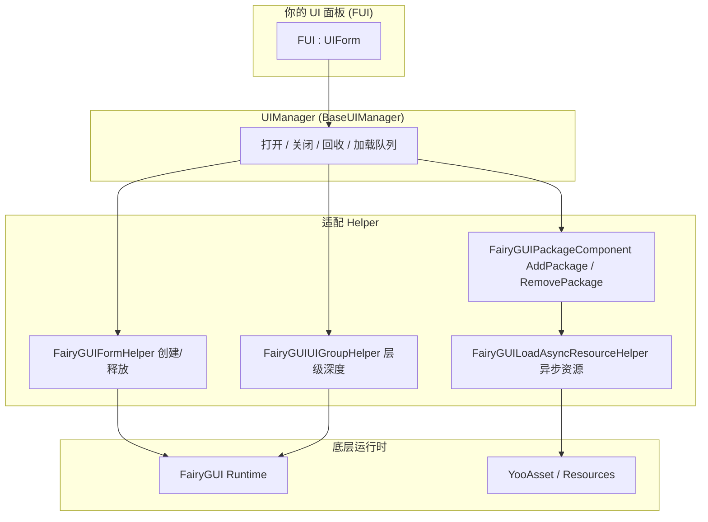

# 概述:GameFrameX UI FairyGUI 是什么

GameFrameX UI FairyGUI 是一个 Unity UI 适配层,它把 [FairyGUI](https://www.fairygui.com/) 框架封装进 GameFrameX 模块化游戏框架,为你提供统一的 UI 生命周期管理(打开、关闭、回收、动画)以及基于 YooAsset 的异步资源加载。你只需让面板类继承 `FUI` 基类,就能用同一套 API 管理 FairyGUI 界面,并获得对象池复用、单例去重、加载排队等开箱即用的能力。

## 快速开始

### 第 1 步:安装包

编辑 Unity 项目的 `Packages/manifest.json`,添加 `scopedRegistries` 与依赖(当前版本为 3.4.3):

```json
{
  "scopedRegistries": [
    {
      "name": "GameFrameX",
      "url": "https://gameframex.upm.alianblank.uk",
      "scopes": [
        "com.gameframex"
      ]
    }
  ],
  "dependencies": {
    "com.gameframex.unity.ui.fairygui": "3.4.3"
  }
}
```

`scopes` 决定哪些包从这个 registry 解析:只有名称以 `com.gameframex` 开头的包才会从它获取。

也可以改用以下任一方式安装:

- 在 `manifest.json` 的 `dependencies` 中直接写 Git 地址:`"com.gameframex.unity.ui.fairygui": "https://github.com/gameframex/com.gameframex.unity.ui.fairygui.git"`
- 在 Unity **Package Manager** 中选择 **Add package from git URL**,填入 `https://github.com/gameframex/com.gameframex.unity.ui.fairygui.git`
- 把仓库克隆到 Unity 项目的 `Packages` 目录下,自动加载

Source: [README.md](https://github.com/GameFrameX/com.gameframex.unity.ui.fairygui/blob/main/README.md#L67-L100)

### 第 2 步:编写你的 UI 面板

所有 FairyGUI 面板继承 `FUI` 基类。通过 C# 特性(Attribute)即可配置显示/隐藏动画,无需写额外代码:

```csharp
[OptionUIShowAnimation(typeof(FadeInAnimation))]
[OptionUIHideAnimation(typeof(FadeOutAnimation))]
public class AnimatedPanel : FUI { }
```

Source: [README.md](https://github.com/GameFrameX/com.gameframex.unity.ui.fairygui/blob/main/README.md#L101-L111)

`FUI` 继承自 `UIForm`,并把 FairyGUI 的 `GObject` 暴露为属性。框架在显示界面时会把 `GObject`、动画开关与动画名交给显示处理器:

```csharp
[UnityEngine.Scripting.Preserve]
public class FUI : UIForm
{
    [UnityEngine.Scripting.Preserve]
    public GObject GObject { get; private set; }

    [UnityEngine.Scripting.Preserve]
    public override void Show(IUIFormShowHandler handler, Action complete)
    {
        if (handler != null)
        {
            handler.Handler(GObject, EnableShowAnimation, ShowAnimationName, complete);
        }
        // ...
    }
}
```

Source: [Runtime/FUI.cs](https://github.com/GameFrameX/com.gameframex.unity.ui.fairygui/blob/main/Runtime/FUI.cs#L42-L80)

(注:上文属性上的 `UnityEngine.Scripture.Preserve` 为节选所示;源码中的真实写法是 `UnityEngine.Scripting.Preserve`,用于防止 IL2CPP 裁剪。)

### 第 3 步:初始化并使用 UIManager

`UIManager` 是核心管理器,内部从 `GameEntry` 获取 `FairyGUIPackageComponent` 来管理 FairyGUI 包的加载与卸载:

```csharp
[UnityEngine.Scripting.Preserve]
internal sealed partial class UIManager : BaseUIManager
{
    [UnityEngine.Scripting.Preserve]
    private FairyGUIPackageComponent FairyGuiPackage { get; set; }

    [UnityEngine.Scripting.Preserve]
    public override void SetResourceManager(IAssetManager assetManager)
    {
        base.SetResourceManager(assetManager);
        FairyGuiPackage = GameEntry.GetComponent<FairyGUIPackageComponent>();
        GameFrameworkGuard.NotNull(FairyGuiPackage, nameof(FairyGuiPackage));
    }
}
```

Source: [Runtime/UIManager.cs](https://github.com/GameFrameX/com.gameframex.unity.ui.fairygui/blob/main/Runtime/UIManager.cs#L42-L92)

初始化时若场景中缺少 `FairyGUIPackageComponent`,`GameFrameworkGuard.NotNull` 会直接抛出异常——确保先挂好该组件再调用 `SetResourceManager`。

### 第 4 步(可选):按路径查找 GObject

```csharp
// 获取某个 GObject 的层级路径
string path = gObject.GetUIPath();

// 通过路径反查 GObject
GObject obj = FairyGUIPathFinderHelper.GetUIFromPath("GRoot/Group/MyButton");
```

Source: [README.md](https://github.com/GameFrameX/com.gameframex.unity.ui.fairygui/blob/main/README.md#L113-L120)

## 工作原理速览

整个包按层次协作:`UIManager` 统一调度打开/关闭/回收与加载排队,具体工作分派给各个 Helper,底层依赖 FairyGUI 运行时与 YooAsset 资源系统:



各组件职责一览:

| 组件 | 类型 | 说明 |
|------|------|------|
| `UIManager` | `internal sealed partial class`,继承 `BaseUIManager` | 中央 UI 管理器,负责界面打开、关闭与回收生命周期,拆分在 `UIManager.cs` / `UIManager.Open.cs` / `UIManager.Close.cs` 多个分部文件中 |
| `FUI` | `public class`,继承 `UIForm` | 所有 FairyGUI 面板的基类,暴露 `GObject` 与可见性回调,面板从这里继承 |
| `FairyGUIPackageComponent` | MonoBehaviour | 管理 FairyGUI 包的加载与卸载 |
| `FairyGUIFormHelper` | Helper | 负责界面实例化、创建与释放 |
| `FairyGUIUIGroupHelper` | Helper | 管理 UI 分组深度与层级 |
| `FairyGUILoadAsyncResourceHelper` | Helper | 把 FairyGUI 的资源请求桥接到 YooAsset 异步加载 |
| `FairyGUIPathFinderHelper` | Helper | 基于路径的 GObject 查找工具 |
| `BindablePropertyExtension` | 扩展 | MVVM 绑定支持,自动清理 `BindableProperty` 事件 |

Source: [Runtime/UIManager.cs](https://github.com/GameFrameX/com.gameframex.unity.ui.fairygui/blob/main/Runtime/UIManager.cs#L34-L92) · [Runtime/FUI.cs](https://github.com/GameFrameX/com.gameframex.unity.ui.fairygui/blob/main/Runtime/FUI.cs#L34-L53) · [README.md](https://github.com/GameFrameX/com.gameframex.unity.ui.fairygui/blob/main/README.md#L40-L65)

核心能力一览:

- **完整 UI 生命周期** — 统一 API 打开、关闭、回收与动画
- **异步资源加载** — 基于 YooAsset 的 FairyGUI 包与资源异步加载
- **对象池复用** — UI 界面实例入池复用,减少 GC 分配
- **单例去重** — 自动防止重复创建同一界面
- **加载排队** — 合并对同一界面的并发打开请求
- **特性驱动配置** — 用 C# 特性控制 UI 分组、显示/隐藏动画
- **MVVM 绑定支持** — `BindablePropertyExtension` 自动清理绑定事件
- **双资源通道** — 同时支持 `Resources.Load` 与 YooAsset AssetBundle
- **IL2CPP 安全** — `Preserve` 特性防止代码被裁剪

## 接下来

- 完整安装方式与更多用法示例:[README.md](https://github.com/GameFrameX/com.gameframex.unity.ui.fairygui/blob/main/README.md)
- 官方文档(含各模块详细说明):https://gameframex.doc.alianblank.com
- 版本历史:仓库根目录的 `CHANGELOG.md`
- 交流群:QQ 467608841 / 233840761
