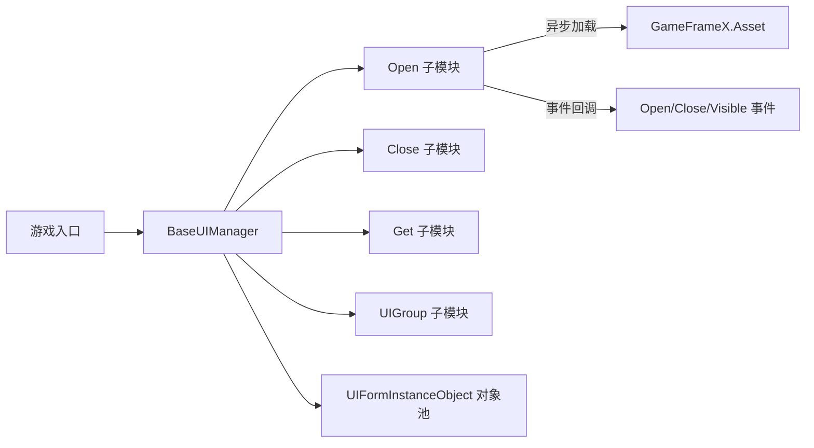

# 框架简介

GameFrameX.UI 是 GameFrameX 游戏开发框架的 UI 子模块,提供统一的界面管理接口,支持 UGUI 与 FairyGUI 两种 UI 方案,内置界面分组、对象池与生命周期事件等常用能力,适合作为 Unity 商业项目的基础 UI 层。

## 快速开始

完成以下三步即可在你的 Unity 项目里启用 UI 模块。

1. 通过 Package Manager 添加包:在 Unity 中选择 **Window → Package Manager → + → Add package from git URL**,输入:
   ```
   https://github.com/gameframex/com.gameframex.unity.ui.git
   ```
   或在项目 `Packages/manifest.json` 的 `dependencies` 中追加同一 URL。
2. 创建一个继承 `BaseUIManager` 的管理器类(或直接使用框架自带的 `UIManager`),在游戏启动入口完成模块注册,框架会自动初始化 UI 子系统。
3. 为每个界面 Prefab 编写 `IUIForm` 实现脚本,通过 `[OptionUIGroup]` 等特性标注分组、显隐动画与多实例策略,然后调用 `OpenUIForm` 即可打开界面。

## 工作原理速览

核心入口是 `BaseUIManager`,它聚合了加载、回收、分组、事件四大子能力,对应四个分文件:
[BaseUIManager.cs](https://github.com/GameFrameX/com.gameframex.unity.ui/blob/main/Runtime/BaseUIManager.cs#L39-L80) 定义管理器骨架;
[BaseUIManager.Open.cs](https://github.com/GameFrameX/com.gameframex.unity.ui/blob/main/Runtime/BaseUIManager.Open.cs#L36-L60) 提供打开界面的事件与方法;
`BaseUIManager.Close.cs` 处理关闭;
`BaseUIManager.Get.cs` 负责按序列号获取界面;
`BaseUIManager.UIGroup.cs` 管理 UI 分组根节点。



界面实例通过 [BaseUIManager.UIFormInstanceObject.cs](https://github.com/GameFrameX/com.gameframex.unity.ui/blob/main/Runtime/BaseUIManager.UIFormInstanceObject.cs) 维持对象池,空闲实例按 `m_RecycleInterval`(默认 60 秒) 自动回收;加载中的实例由 `m_UIFormsBeingLoaded` 字典追踪。

## 主要能力

| 能力 | 说明 | 关键文件 |
|------|------|----------|
| 统一 UI 接口 | 一套 `IUIManager` 同时支持 UGUI 与 FairyGUI | [BaseUIManager.cs](https://github.com/GameFrameX/com.gameframex.unity.ui/blob/main/Runtime/BaseUIManager.cs#L39-L80) |
| 分组管理 | 通过特性声明 UI 所在分组,自动创建对应根节点 | [Runtime/Attribute/OptionUIGroupAttribute.cs](https://github.com/GameFrameX/com.gameframex.unity.ui/blob/main/Runtime/Attribute/OptionUIGroupAttribute.cs) |
| 对象池 | 自动复用空闲实例,降低频繁开关界面的开销 | [BaseUIManager.UIFormInstanceObject.cs](https://github.com/GameFrameX/com.gameframex.unity.ui/blob/main/Runtime/BaseUIManager.UIFormInstanceObject.cs) |
| 显隐动画 | 通过特性配置打开/关闭动画 | [OptionUIShowAnimationAttribute.cs](https://github.com/GameFrameX/com.gameframex.unity.ui/blob/main/Runtime/Attribute/OptionUIShowAnimationAttribute.cs),[OptionUIHideAnimationAttribute.cs](https://github.com/GameFrameX/com.gameframex.unity.ui/blob/main/Runtime/Attribute/OptionUIHideAnimationAttribute.cs) |
| 多实例控制 | 通过特性声明同一界面是否允许多个实例并存 | [OptionUIAllowMultiInstanceAttribute.cs](https://github.com/GameFrameX/com.gameframex.unity.ui/blob/main/Runtime/Attribute/OptionUIAllowMultiInstanceAttribute.cs) |
| 完整事件 | 提供打开成功/失败、关闭、可见变更等事件 | [EventArgs/OpenUIFormSuccessEventArgs.cs](https://github.com/GameFrameX/com.gameframex.unity.ui/blob/main/Runtime/EventArgs/OpenUIFormSuccessEventArgs.cs) 等 |

## 编辑器扩展

模块自带 Unity 编辑器检查,自动注入脚本宏定义,避免运行时缺失组件时报错。详见 [Editor/UISystemScriptingDefineSymbols.cs](https://github.com/GameFrameX/com.gameframex.unity.ui/blob/main/Editor/UISystemScriptingDefineSymbols.cs) 与 [Editor/UISystemScriptingDefineCheckHandler.cs](https://github.com/GameFrameX/com.gameframex.unity.ui/blob/main/Editor/UISystemScriptingDefineCheckHandler.cs)。
界面 Prefab 的自定义检视器在 [Editor/UIFormInspector.cs](https://github.com/GameFrameX/com.gameframex.unity.ui/blob/main/Editor/UIFormInspector.cs);UIComponent 检视器见 [Editor/UIComponentInspector.cs](https://github.com/GameFrameX/com.gameframex.unity.ui/blob/main/Editor/UIComponentInspector.cs)。

## 版本

当前最新版本与变更记录见 [CHANGELOG.md](https://github.com/GameFrameX/com.gameframex.unity.ui/blob/main/CHANGELOG.md)。

## 相关链接

- 关于 UI 分组的配置细节,见《UI 分组》
- 关于界面打开与生命周期,见《打开/关闭界面》
- 关于事件订阅示例,见《UI 事件》
- 官方文档主站:https://gameframex.doc.alianblank.com/
