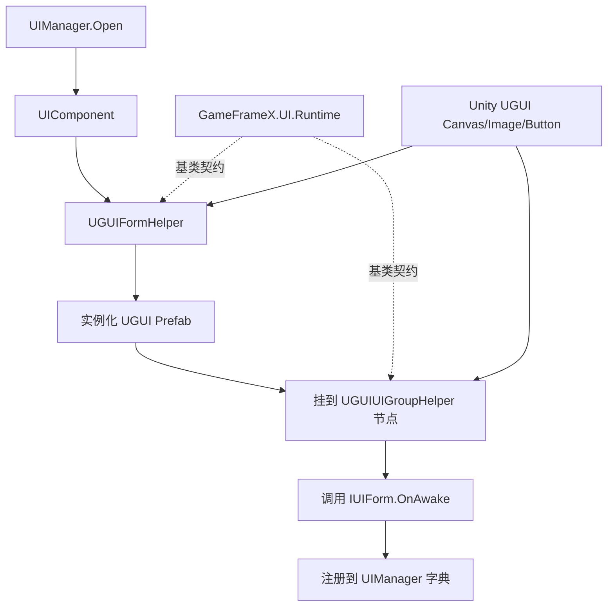

# 工作原理：UGUI 与 GameFrameX UI 系统的适配关系

本包是 GameFrameX UI Runtime 在 Unity UGUI 后端上的官方适配层：通过实现 `UIFormHelperBase`、`UIGroupHelperBase` 等抽象基类，把 UGUI 的 `GameObject` / `Canvas` / `RectTransform` 接入框架的 `UIComponent` / `UIManager` 生命周期,从而在不修改游戏业务代码的前提下替换或共存不同 UI 后端。

## 适配层一览

| 适配类 | 继承的基类 | 职责 |
|--------|------------|------|
| `UGUIFormHelper` | `UIFormHelperBase` | 实例化、创建、释放界面；处理 UI 组挂载与动画开关 |
| `UGUIUIGroupHelper` | `UIGroupHelperBase` | 管理 UI 组的深度（`z = depth * 1000`）和节点层级 |
| `UGUICodeGenerator` (Editor) | — | 一键生成与 Prefab 字段绑定的 UI 代码 |
| `UGUIComponentInspector` (Editor) | — | Inspector 中可视化绑定组件引用 |
| `UGUIButtonExtension` / `UGUIImageExtension` / `RectTransformExtension` | — | UGUI 原生组件的扩展方法 |
| `UIImage` | `Image` | 在 UGUI `Image` 基础上叠加异步加载与替换能力 |
| `UIManager` / `UGUI` | — | 框架侧运行时入口与抽象 UI 基类 |

## 工作原理速览



整条链路里,框架侧只看到 `IUIForm`、`IUIGroup` 这两个抽象,UGUI 适配层负责把 Unity 原生类型翻译成这些抽象;反过来业务脚本只需要继承 `UGUI` 抽象基类,就能拿到与后端无关的 OnAwake / OnShow / OnHide 等回调。

## 关键适配点

### 1. 界面实例化

`UGUIFormHelper.InstantiateUIForm` 直接把资源对象原样返回,真正的 GameObject 由上层资源管线异步加载后传入；`CreateUIForm` 负责把 `uiFormInstance as GameObject` 强转为 UGUI 节点,并通过 `GetOrAddComponent` 挂上业务脚本。

```csharp
// Source: Runtime/UGUIFormHelper.cs#L74-L78
[UnityEngine.Scripting.Preserve]
public override object InstantiateUIForm(object uiFormAsset)
{
    return (UnityEngine.Object)uiFormAsset;
}
```

### 2. 界面挂载与组归属

`CreateUIForm` 会读取类型上的 `OptionUIGroupAttribute`、`OptionUIShowAnimationAttribute`、`OptionUIHideAnimationAttribute`,若未标注则使用 `UIComponent` 全局开关；最终把节点的 `Transform.SetParent(helper.transform)` 到对应 UI 组,并把 `localScale` 归一。

```csharp
// Source: Runtime/UGUIFormHelper.cs#L91-L163
[UnityEngine.Scripting.Preserve]
public override IUIForm CreateUIForm(object uiFormInstance, Type uiFormType, object userData)
{
    var uiGameObject = uiFormInstance as GameObject;
    if (uiGameObject == null)
    {
        Log.Error($"UI form instance type {uiFormType} is invalid.");
        return null;
    }

    var componentType = uiGameObject.GetOrAddComponent(uiFormType);
    if (!(componentType is IUIForm uiForm))
    {
        Log.Error($"UI form instance type {uiFormType} is invalid.");
        return null;
    }

    if (uiForm.IsAwake == false)
    {
        uiForm.OnAwake();
    }
    // ... 组挂载与动画配置略 ...
    uiTransform.SetParent(helper.transform);
    uiTransform.localScale = Vector3.one;
    return uiForm;
}
```

### 3. UI 组深度控制

UGUI 通过 `Canvas` 的渲染顺序或节点 Z 值来控制前后层级,适配层选用了最直接的方案:把 `localPosition.z = depth * 1000`,每个组相隔 1000 单位,确保不同组互不遮挡。

```csharp
// Source: Runtime/UGUIUIGroupHelper.cs#L65-L70
[UnityEngine.Scripting.Preserve]
public override void SetDepth(int depth)
{
    Depth = depth;
    transform.localPosition = new Vector3(0, 0, depth * 1000);
}
```

### 4. 抽象 UI 基类

业务脚本继承 `UGUI` 后,通过 `UGUIComponent` / `UGUIElementPropertyAttribute` 与 Prefab 上的 UGUI 控件绑定,框架在 `OnAwake` 阶段完成字段注入,运行时调用 `OnShow`、`OnHide`、`OnClose` 等生命周期。

## 接下来

- 想了解如何挂载并打开第一个 UI,见《快速开始》
- 想用编辑器一键生成与 Prefab 同步的 UI 代码,见《如何：使用 UGUI 代码生成器》
- 想自定义 UI 后端(例如 FairyGUI / UI Toolkit),复用 `UIFormHelperBase` / `UIGroupHelperBase` 即可