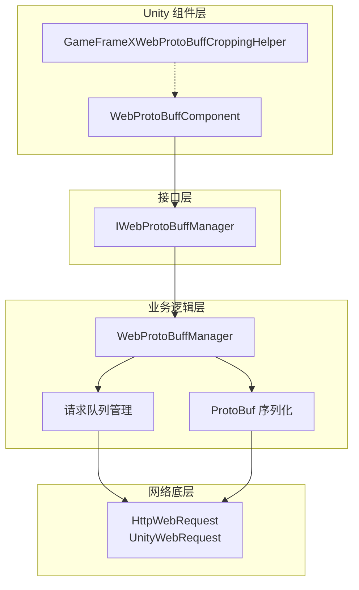
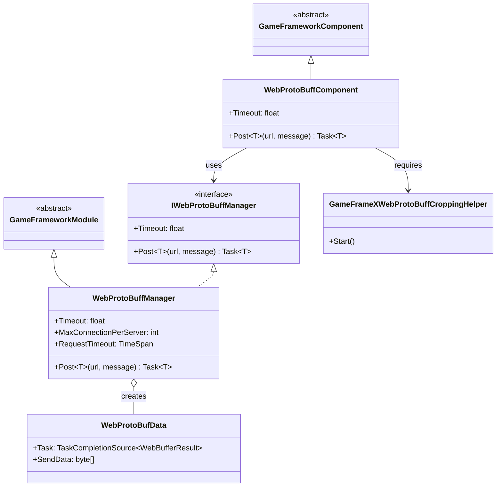
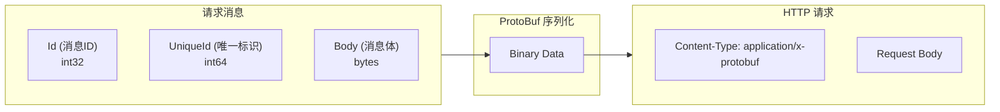
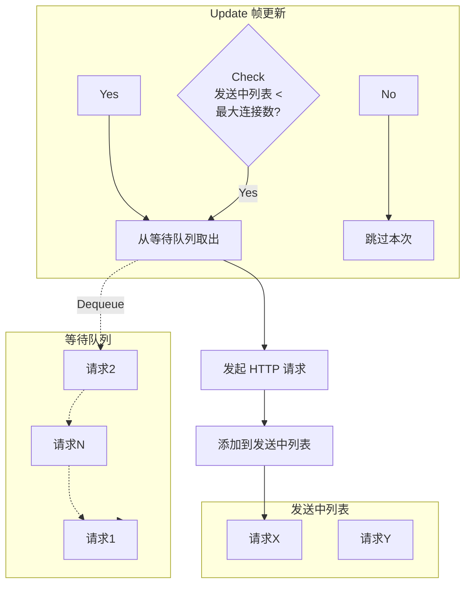

# 组件架构

Web ProtoBuff 组件是 GameFrameX 框架中专门用于处理 HTTP 请求与 Protocol Buffer 消息序列化的核心模块。该组件提供了高效、易用的网络通信功能，支持在 Unity 项目中与支持 ProtoBuf 协议的后端服务器进行数据交互。

## 概述

GameFrameX Web ProtoBuff 组件采用分层架构设计，将 Unity 组件层、业务逻辑层和网络底层实现分离，以实现更好的可维护性和扩展性。

该组件的核心功能包括：

- **Protocol Buffer 消息序列化/反序列化**：使用 ProtoBuf 库高效处理二进制数据
- **HTTP POST 请求**：支持向服务器发送 ProtoBuf 格式的请求消息
- **异步处理**：基于 Task 异步模式，避免阻塞主线程
- **队列管理**：请求队列机制，支持高并发场景
- **平台适配**：支持 WebGL 平台和其他 Unity 平台

## 架构设计

组件采用典型的三层架构设计，各层职责清晰：



### 核心组件说明

| 组件 | 类型 | 职责 |
|------|------|------|
| WebProtoBuffComponent | Unity 组件 | 作为 Unity GameObject 组件，提供对外 API 入口 |
| IWebProtoBuffManager | 接口 | 定义 Web 请求管理器的抽象接口 |
| WebProtoBuffManager | 模块类 | 实现核心业务逻辑，包括请求队列、ProtoBuf 处理 |
| WebProtoBufData | 内部类 | 封装单个请求的数据（URL、数据、Task） |
| GameFrameXWebProtoBuffCroppingHelper | 辅助类 | IL2CPP/AOT 代码裁剪支持 |

## 类图关系



## 请求处理流程

当客户端发送 ProtoBuf 请求时，组件按照以下流程处理：

```mermaid
sequenceDiagram
    participant Client as 调用方
    participant Component as WebProtoBuffComponent
    participant Manager as WebProtoBuffManager
    participant Queue as 请求队列
    participant Network as 网络层
    participant Server as 服务器

    Client->>Component: Post&lt;T&gt;(url, message)
    Component->>Manager: Post&lt;T&gt;(url, message)
    
    Note over Manager: 1. 序列化消息
    
    Manager->>Manager: SerializerHelper.Serialize(message)
    
    Note over Manager: 2. 构建 HTTP 包装对象
    
    Manager->>Manager: 创建 MessageHttpObject<br/>(Id + UniqueId + Body)
    
    Note over Manager: 3. 再次序列化
    
    Manager->>Manager: SerializerHelper.Serialize(messageHttpObject)
    
    Note over Manager: 4. 加入请求队列
    
    Manager->>Queue: Enqueue(WebProtoBufData)
    Queue-->>Manager: 已加入队列
    
    Manager->>Network: 异步发送请求
    
    Note over Network: 5. HTTP 请求处理
    
    Network->>Server: POST /url<br/>Content-Type: application/x-protobuf
    Server-->>Network: HTTP Response (ProtoBuf)
    Network-->>Manager: WebBufferResult
    
    Note over Manager: 6. 反序列化响应
    
    Manager->>Manager: Deserialize&lt;MessageHttpObject&gt;()
    Manager->>Manager: Deserialize&lt;T&gt;(Body)
    
    Manager-->>Component: Task&lt;T&gt; Result
    Component-->>Client: Response Object
```

### 消息封装格式

组件使用 `MessageHttpObject` 对 ProtoBuf 消息进行二次封装：



## 请求队列管理

组件使用双队列模式管理网络请求：



**队列管理规则：**

- **等待队列（m_WaitingProtoBufQueue）**：存储所有待发送的请求，FIFO 顺序处理
- **发送中列表（m_SendingProtoBufList）**：存储正在处理的请求
- **最大并发数（MaxConnectionPerServer）**：默认 8 个并发连接

## 平台适配

组件针对不同平台使用不同的网络实现：

| 平台 | 网络实现 | 说明 |
|------|----------|------|
| WebGL | UnityWebRequest | Unity 原生 WebGL 网络库 |
| 其他平台 | HttpWebRequest | .NET 标准网络库 |

```csharp
#if UNITY_WEBGL
        // WebGL 平台：使用 UnityWebRequest
        unityWebRequest = UnityEngine.Networking.UnityWebRequest.Post(url, string.Empty);
#else
        // 其他平台：使用 HttpWebRequest
        var request = WebRequest.CreateHttp(url);
#endif
```
> Source: [WebProtoBuffManager.ProtoBuf.cs](https://github.com/GameFrameX/com.gameframex.unity.web.protobuff/blob/main/Runtime/Web/WebProtoBuffManager.ProtoBuf.cs#L87-L120)

## 编译宏定义

组件功能受以下编译宏控制：

| 宏定义 | 功能 |
|--------|------|
| ENABLE_GAME_FRAME_X_WEB_PROTOBUF_NETWORK | 启用 ProtoBuf 网络功能 |
| ENABLE_GAMEFRAMEX_WEB_SEND_LOG | 启用发送日志 |
| ENABLE_GAMEFRAMEX_WEB_RECEIVE_LOG | 启用接收日志 |

## 使用示例

### 基本用法

在 Unity 场景中添加 WebProtoBuffComponent 组件后，可以通过以下方式发送请求：

```csharp
// 获取组件
var webComponent = UnityEngine.SceneManagement.SceneManager
    .GetActiveScene()
    .GetRootGameObjects()
    .SelectMany(go => go.GetComponentsInChildren<WebProtoBuffComponent>())
    .FirstOrDefault();

// 发送 ProtoBuf 请求
var request = new LoginRequest { Username = "test", Password = "123456" };
var response = await webComponent.Post<LoginResponse>("http://localhost:8080/api/login", request);
```
> Source: [WebProtoBuffComponent.cs](https://github.com/GameFrameX/com.gameframex.unity.web.protobuff/blob/main/Runtime/Web/WebProtoBuffComponent.cs#L105-L108)

### 组件初始化

组件在 Awake 阶段完成初始化：

```csharp
protected override void Awake()
{
    // 设置实现类类型
    ImplementationComponentType = Utility.Assembly.GetType(componentType);
    InterfaceComponentType = typeof(IWebProtoBuffManager);
    
    base.Awake();
    
    // 获取管理器实例
    m_WebProtoBuffManager = GameFrameworkEntry.GetModule<IWebProtoBuffManager>();
    
    // 设置超时时间
    m_WebProtoBuffManager.Timeout = m_Timeout;
}
```
> Source: [WebProtoBuffComponent.cs](https://github.com/GameFrameX/com.gameframex.unity.web.protobuff/blob/main/Runtime/Web/WebProtoBuffComponent.cs#L77-L90)

## 配置选项

| 配置项 | 类型 | 默认值 | 说明 |
|--------|------|--------|------|
| Timeout | float | 5.0 | 请求超时时间（秒） |
| MaxConnectionPerServer | int | 8 | 单服务器最大并发连接数 |

## 相关链接

- [插件介绍](../1-overview.introduction)
- [功能特性](../1-overview.features)
- [WebProtoBuffComponent API 参考](../5-api-reference.webprotobuffcomponent)
- [IWebProtoBuffManager API 参考](../5-api-reference.iwebprotobuffmanager)
- [消息定义](./4-core-concepts.message-definition)
- [组件配置](./6-configuration.component-config)
- [编译宏定义](./6-configuration.compile-defines)
