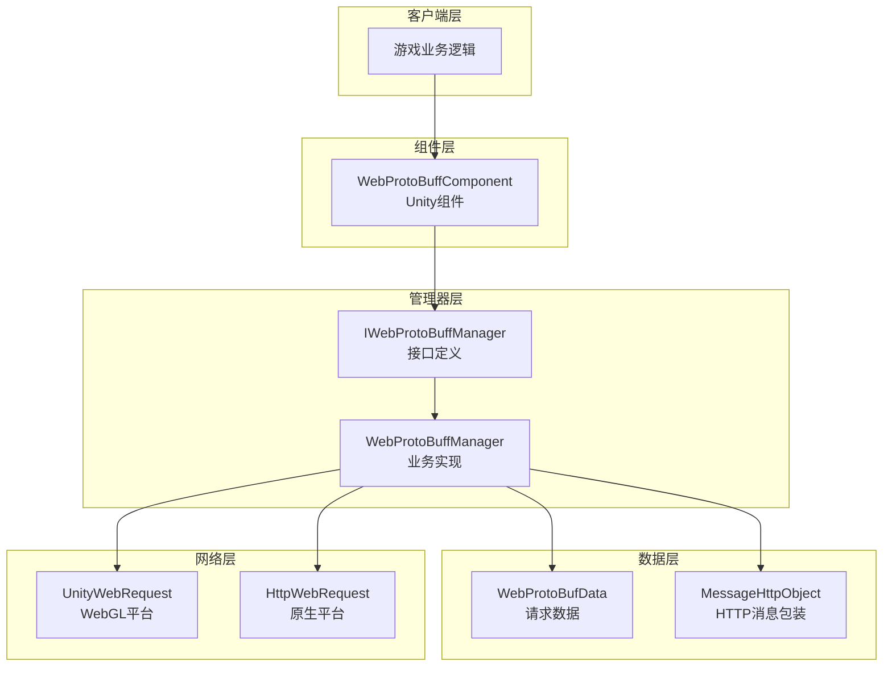
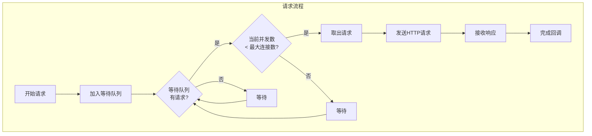
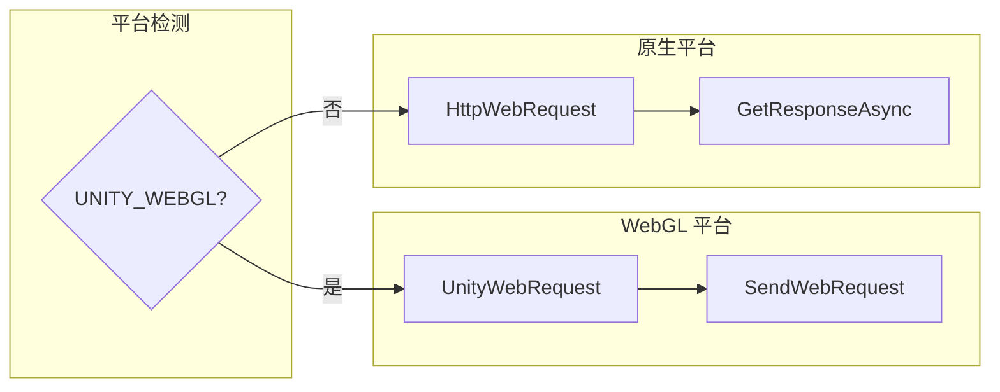

# 功能特性

GameFrameX Web ProtoBuff 组件提供基于 Protocol Buffer 的 HTTP 网络请求功能，支持异步发送和接收 ProtoBuf 消息，是 Unity 游戏与后端服务器通信的轻量级解决方案。

## 概述

Web ProtoBuff 组件是 GameFrameX 游戏框架的网络模块扩展，专门用于处理基于 **Protocol Buffer** 格式的网络通信。与传统的 JSON/XML 相比，Protocol Buffer 具有更高的序列化效率和更小的数据体积，非常适合移动游戏场景下的网络通信。

该组件提供了完整的请求管理功能，包括请求队列、超时控制、异步响应处理等特性，同时支持 Unity WebGL 平台和原生平台（PC/Android/iOS）的网络请求调用。

## 架构设计

组件采用分层架构设计，将 Unity 组件层、业务逻辑层和网络请求层分离，确保代码结构清晰且易于维护。



### 核心组件说明

| 组件 | 职责 | 文件位置 |
|------|------|----------|
| WebProtoBuffComponent | Unity 组件层，提供 Inspector 配置和对外 API | Runtime/Web/WebProtoBuffComponent.cs |
| IWebProtoBuffManager | 定义网络管理器的接口规范 | Runtime/Web/IWebProtoBuffManager.cs |
| WebProtoBuffManager | 实现具体的 ProtoBuf 请求处理逻辑 | Runtime/Web/WebProtoBuffManager.cs |
| WebProtoBufData | 封装请求数据和相关状态 | Runtime/Web/WebProtoBuffManager.WebProtoBufData.cs |

## 核心功能

### 1. Protocol Buffer 消息支持

组件原生支持 Protocol Buffer 消息格式的序列化与反序列化。请求消息和响应消息都采用 ProtoBuf 格式传输，相比 JSON 可节省 30%-70% 的带宽。

消息结构采用 `MessageObject` 基类，配合 `[ProtoContract]` 和 `[ProtoMember]` 属性标记实现自动序列化：

```csharp
[ProtoContract]
public class LoginRequest : MessageObject
{
    [ProtoMember(1)]
    public string Username { get; set; }
    
    [ProtoMember(2)]
    public string Password { get; set; }
}

[ProtoContract]
public class LoginResponse : MessageObject, IResponseMessage
{
    [ProtoMember(1)]
    public bool Success { get; set; }
    
    [ProtoMember(2)]
    public string Token { get; set; }
}
```
> Source: [WebProtoBuffManager.ProtoBuf.cs](https://github.com/GameFrameX/com.gameframex.unity.web.protobuff/blob/main/Runtime/Web/WebProtoBuffManager.ProtoBuf.cs#L178-L201)

组件使用专用的 `application/x-protobuf` Content-Type 进行请求，确保服务端能够正确识别 ProtoBuf 格式数据：

```csharp
private const string ProtoBufContentType = "application/x-protobuf";
```
> Source: [WebProtoBuffManager.ProtoBuf.cs](https://github.com/GameFrameX/com.gameframex.unity.web.protobuff/blob/main/Runtime/Web/WebProtoBuffManager.ProtoBuf.cs#L32)

### 2. 异步请求处理

组件采用基于 `Task<T>` 的异步编程模式，支持 `async/await` 语法糖，使网络请求代码简洁易读：

```csharp
public async void Login()
{
    var request = new LoginRequest 
    { 
        Username = "user", 
        Password = "password" 
    };
    
    string url = "http://api.example.com/login";
    
    try
    {
        LoginResponse response = await WebComponent.Post<LoginResponse>(url, request);
        
        if (response != null)
        {
            Debug.Log($"Login Result: {response.Success}, Token: {response.Token}");
        }
    }
    catch (System.Exception e)
    {
        Debug.LogError($"Request Failed: {e.Message}");
    }
}
```
> Source: [WebProtoBuffComponent.cs](https://github.com/GameFrameX/com.gameframex.unity.web.protobuff/blob/main/Runtime/Web/WebProtoBuffComponent.cs#L105-L108)

### 3. 请求队列管理

组件内部维护请求队列，支持并发控制和请求优先级管理，确保网络请求有序进行：



核心队列管理逻辑：

```csharp
private readonly Queue<WebProtoBufData> m_WaitingProtoBufQueue = new Queue<WebProtoBufData>(256);
private readonly List<WebProtoBufData> m_SendingProtoBufList = new List<WebProtoBufData>(16);
```
> Source: [WebProtoBuffManager.ProtoBuf.cs](https://github.com/GameFrameX/com.gameframex.unity.web.protobuff/blob/main/Runtime/Web/WebProtoBuffManager.ProtoBuf.cs#L22-L27)

默认最大并发连接数为 8 个：

```csharp
public WebProtoBuffManager()
{
    MaxConnectionPerServer = 8;
    m_MemoryStream = new MemoryStream();
    Timeout = 5f;
}
```
> Source: [WebProtoBuffManager.cs](https://github.com/GameFrameX/com.gameframex.unity.web.protobuff/blob/main/Runtime/Web/WebProtoBuffManager.cs#L31-L36)

### 4. 超时控制

组件提供灵活的超时配置机制，支持在 Inspector 面板或代码中动态设置超时时间：

```csharp
[SerializeField] [Tooltip("超时时间.单位：秒")]
private float m_Timeout = 5f;

public float Timeout
{
    get { return m_WebProtoBuffManager.Timeout; }
    set { m_WebProtoBuffManager.Timeout = m_Timeout = value; }
}
```
> Source: [WebProtoBuffComponent.cs](https://github.com/GameFrameX/com.gameframex.unity.web.protobuff/blob/main/Runtime/Web/WebProtoBuffComponent.cs#L60-L71)

Inspector 面板支持 0-120 秒的超时滑块设置：

```csharp
float timeout = EditorGUILayout.Slider("Timeout", m_Timeout.floatValue, 0f, 120f);
```
> Source: [WebComponentInspector.cs](https://github.com/GameFrameX/com.gameframex.unity.web.protobuff/blob/main/Editor/Inspector/WebComponentInspector.cs#L23)

### 5. 调试日志

组件提供可选的调试日志功能，帮助开发者追踪网络请求的发送和接收过程：

```csharp
private void DebugSendLog(MessageObject messageObject)
{
#if ENABLE_GAMEFRAMEX_WEB_SEND_LOG
    var messageId = ProtoMessageIdHandler.GetReqMessageIdByType(messageObject.GetType());
    Log.Debug($"发送消息 ID:[{messageId},{messageObject.UniqueId},{messageObject.GetType().Name}] 消息内容:{GameFrameX.Runtime.Utility.Json.ToJson(messageObject)}");
#endif
}

private void DebugReceiveLog(MessageObject messageObject)
{
#if ENABLE_GAMEFRAMEX_WEB_RECEIVE_LOG
    var messageId = ProtoMessageIdHandler.GetReqMessageIdByType(messageObject.GetType());
    Log.Debug($"接收消息 ID:[{messageId},{messageObject.UniqueId},{messageObject.GetType().Name}] 消息内容:{GameFrameX.Runtime.Utility.Json.ToJson(messageObject)}");
#endif
}
```
> Source: [WebProtoBuffManager.ProtoBuf.cs](https://github.com/GameFrameX/com.gameframex.unity.web.protobuff/blob/main/Runtime/Web/WebProtoBuffManager.ProtoBuf.cs#L227-L241)

启用日志需要在 Unity Player Settings 中添加编译宏：
- `ENABLE_GAMEFRAMEX_WEB_SEND_LOG` - 启用发送日志
- `ENABLE_GAMEFRAMEX_WEB_RECEIVE_LOG` - 启用接收日志

### 6. 跨平台支持

组件针对不同 Unity 平台提供了差异化的网络实现：



WebGL 平台使用 Unity 内置的 `UnityWebRequest`：

```csharp
#if UNITY_WEBGL
UnityEngine.Networking.UnityWebRequest unityWebRequest;
if (webData.IsGet)
{
    unityWebRequest = UnityEngine.Networking.UnityWebRequest.Get(webData.URL);
}
else
{
    unityWebRequest = UnityEngine.Networking.UnityWebRequest.Post(webData.URL, string.Empty);
}

unityWebRequest.timeout = (int)RequestTimeout.TotalSeconds;
unityWebRequest.SetRequestHeader("Content-Type", ProtoBufContentType);
byte[] postData = webData.SendData;
unityWebRequest.uploadHandler = new UnityEngine.Networking.UploadHandlerRaw(postData);
```
> Source: [WebProtoBuffManager.ProtoBuf.cs](https://github.com/GameFrameX/com.gameframex.unity.web.protobuff/blob/main/Runtime/Web/WebProtoBuffManager.ProtoBuf.cs#L87-L103)

原生平台使用 .NET 的 `HttpWebRequest`：

```csharp
#else
try
{
    HttpWebRequest request = WebRequest.CreateHttp(webData.URL);
    request.Method = webData.IsGet ? WebRequestMethods.Http.Get : WebRequestMethods.Http.Post;
    request.Timeout = (int)RequestTimeout.TotalMilliseconds;
    request.ContentType = ProtoBufContentType;
    // ... 发送和接收逻辑
}
```
> Source: [WebProtoBuffManager.ProtoBuf.cs](https://github.com/GameFrameX/com.gameframex.unity.web.protobuff/blob/main/Runtime/Web/WebProtoBuffManager.ProtoBuf.cs#L118-L130)

### 7. 消息 ID 映射

组件通过 `ProtoMessageIdHandler` 实现消息类型与 ID 的映射，确保客户端和服务端使用统一的协议标识：

```csharp
var id = ProtoMessageIdHandler.GetReqMessageIdByType(message.GetType());
MessageHttpObject messageHttpObject = new MessageHttpObject
{
    Id = id,
    UniqueId = message.UniqueId,
    Body = SerializerHelper.Serialize(message),
};
```
> Source: [WebProtoBuffManager.ProtoBuf.cs](https://github.com/GameFrameX/com.gameframex.unity.web.protobuff/blob/main/Runtime/Web/WebProtoBuffManager.ProtoBuf.cs#L214-L221)

## 消息封装格式

组件使用 `MessageHttpObject` 对 ProtoBuf 消息进行封装，包含消息 ID、唯一标识和消息体：

```csharp
MessageHttpObject messageHttpObject = new MessageHttpObject
{
    Id = id,
    UniqueId = message.UniqueId,
    Body = SerializerHelper.Serialize(message),
};
var sendData = SerializerHelper.Serialize(messageHttpObject);
```
> Source: [WebProtoBuffManager.ProtoBuf.cs](https://github.com/GameFrameX/com.gameframex.unity.web.protobuff/blob/main/Runtime/Web/WebProtoBuffManager.ProtoBuf.cs#L215-L221)

这种封装格式便于服务端路由和消息分发，同时支持请求的唯一定位（UniqueId）。

## 使用限制

组件的 ProtoBuf 功能需要通过编译宏来启用。在 Unity Player Settings 中需要添加以下宏定义：

```
ENABLE_GAME_FRAME_X_WEB_PROTOBUF_NETWORK
```

未定义此宏时，`Post<T>` 方法将被禁用，确保不会在生产环境中意外调用未配置的功能。

```csharp
#if ENABLE_GAME_FRAME_X_WEB_PROTOBUF_NETWORK
public Task<T> Post<T>(string url, GameFrameX.Network.Runtime.MessageObject message) where T : GameFrameX.Network.Runtime.MessageObject, GameFrameX.Network.Runtime.IResponseMessage
{
    return m_WebProtoBuffManager.Post<T>(url, message);
}
#endif
```
> Source: [WebProtoBuffComponent.cs](https://github.com/GameFrameX/com.gameframex.unity.web.protobuff/blob/main/Runtime/Web/WebProtoBuffComponent.cs#L92-L109)

## 资源清理

组件在关闭时会自动清理所有请求资源，防止内存泄漏：

```csharp
protected override void Shutdown()
{
    ShutdownProtoBuf();
    m_MemoryStream.Dispose();
}

private void ShutdownProtoBuf()
{
    while (m_WaitingProtoBufQueue.Count > 0)
    {
        var webData = m_WaitingProtoBufQueue.Dequeue();
        webData.Dispose();
    }
    // ... 清理发送中的请求
}
```
> Source: [WebProtoBuffManager.cs](https://github.com/GameFrameX/com.gameframex.unity.web.protobuff/blob/main/Runtime/Web/WebProtoBuffManager.cs#L75-L79) 和 [WebProtoBuffManager.ProtoBuf.cs](https://github.com/GameFrameX/com.gameframex.unity.web.protobuff/blob/main/Runtime/Web/WebProtoBuffManager.ProtoBuf.cs#L60-L79)

## 相关链接

- [插件介绍](./1-overview.introduction) - 了解插件的基本信息
- [快速入门](./3-getting-started.quick-start) - 开始使用组件
- [基础示例](./3-getting-started.basic-example) - 查看完整代码示例
- [组件架构](./4-core-concepts.architecture) - 深入了解架构设计
- [API 参考](./5-api-reference.webprotobuffcomponent) - 完整的 API 文档
- [组件配置](./6-configuration.component-config) - 配置选项详解
- [编译宏定义](./6-configuration.compile-defines) - 编译宏使用说明
- [平台说明](./7-platforms.platform-info) - 平台兼容性说明
