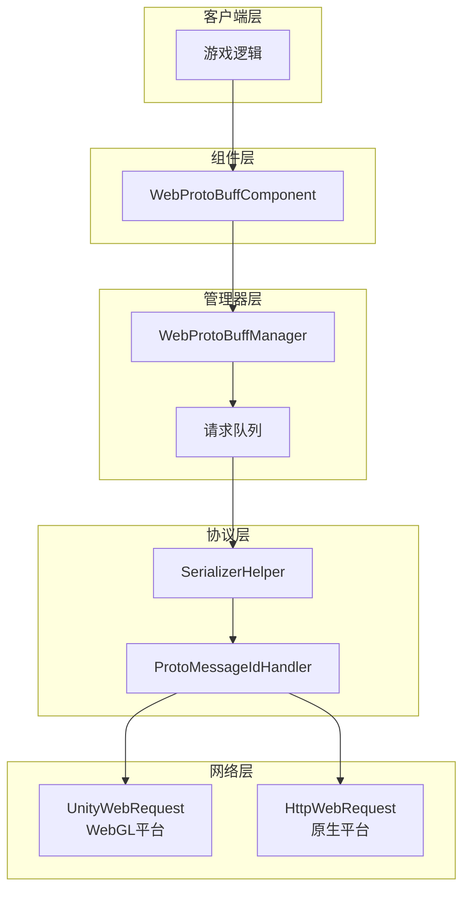
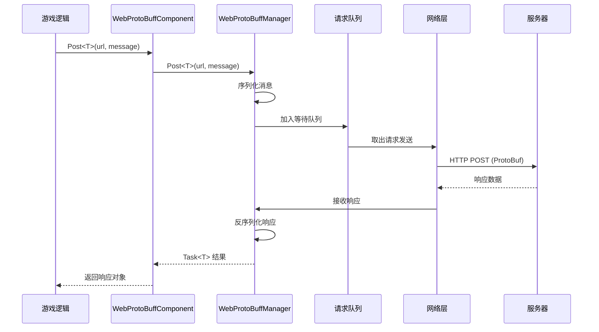

# 快速入门

Web ProtoBuff 组件是 GameFrameX 框架的网络模块，专门用于处理基于 Protocol Buffer 的 HTTP POST 请求。它提供异步消息发送和接收功能，支持 ProtoBuf 消息的序列化与反序列化。

## 概述

WebProtoBuffComponent 是 Unity 游戏框架的网络请求组件，封装了 Protocol Buffer 格式数据的网络传输能力。当你的游戏需要与服务器进行高效的数据交换时，特别是使用 ProtoBuf 作为序列化格式时，这个组件能够大大简化网络请求的实现。

### 核心功能

- **ProtoBuf 支持**：原生支持 Protocol Buffer 消息格式的序列化与反序列化
- **异步 API**：基于 Task<T> 的异步编程模型，使用 async/await 模式
- **超时控制**：可配置的请求超时时间
- **跨平台**：兼容 Unity WebGL 及原生平台（PC/iOS/Android）
- **队列管理**：内置请求队列和并发控制

### 使用场景

WebProtoBuffComponent 适用于以下场景：

1. **与 ProtoBuf 服务器通信**：服务器使用 Protocol Buffer 作为数据交换格式
2. **高性能网络请求**：ProtoBuf 比 JSON 更紧凑，传输效率更高
3. **异步数据获取**：需要等待服务器响应的游戏逻辑
4. **跨平台部署**：同一套代码同时支持 WebGL 和原生平台

## 架构

WebProtoBuffComponent 采用分层架构设计，各层职责清晰：



### 组件说明

| 组件 | 说明 |
|------|------|
| WebProtoBuffComponent | Unity 组件，挂载在 GameObject 上使用 |
| WebProtoBuffManager | 核心管理器，处理请求队列和并发控制 |
| WebProtoBufData | 请求数据封装，包含 URL、序列化数据、TaskCompletionSource |
| SerializerHelper | 序列化/反序列化工具 |
| ProtoMessageIdHandler | 消息 ID 处理器 |

## 工作流程

组件的请求处理流程如下：



### 流程说明

1. **请求发起**：游戏逻辑调用组件的 Post<T> 方法
2. **消息封装**：将 MessageObject 序列化为 ProtoBuf 字节数组，包装在 MessageHttpObject 中
3. **队列管理**：请求加入等待队列，等待发送
4. **并发控制**：同时最多发送 MaxConnectionPerServer (默认8) 个请求
5. **网络发送**：根据平台选择 UnityWebRequest (WebGL) 或 HttpWebRequest (原生)
6. **响应处理**：接收服务器响应，反序列化为对应的 MessageObject

## 前置条件

### 1. 安装依赖

确保你的 Unity 项目已安装以下依赖：

- `com.gameframex.unity` (1.1.1+)
- `com.gameframex.unity.web` (1.0.0+)
- `com.gameframex.unity.network` (1.0.0+)
- `com.gameframex.unity.google.protobuf` (1.0.0+)

### 2. 启用编译宏

在 Unity 编辑器中，打开 **Edit > Project Settings > Player**，在 **Scripting Define Symbols** 中添加：

```
ENABLE_GAME_FRAME_X_WEB_PROTOBUF_NETWORK
```

> **注意**：如果不添加此宏定义，Post<T> 方法将不可用。

### 3. 添加组件

在 Unity 场景中创建一个空的 GameObject，然后添加 **Web ProtoBuff** 组件：

```csharp
// 或者通过代码添加
var gameObject = new GameObject("WebProtoBuff");
var webComponent = gameObject.AddComponent<WebProtoBuffComponent>();
```

组件会自动依赖 GameFrameXWebProtoBuffCroppingHelper，用于防止 IL2CPP 编译时类型被裁剪。

## 消息定义

在使用组件之前，需要定义请求和响应的消息类型。消息类必须继承自 MessageObject，响应类还需要实现 IResponseMessage 接口：

```csharp
using ProtoBuf;
using GameFrameX.Network.Runtime;

[ProtoContract]
public class LoginRequest : MessageObject
{
    [ProtoMember(1)]
    public string Username { get; set; }
    
    [ProtoMember(2)]
    public string Password { get; set; }
}

[ProtoContract]
public class LoginResponse : MessageObject, IResponseMessage
{
    [ProtoMember(1)]
    public bool Success { get; set; }
    
    [ProtoMember(2)]
    public string Token { get; set; }
}
```

> Source: [README.md](https://github.com/GameFrameX/com.gameframex.unity.web.protobuff/blob/main/README.md#L60-L88)

## 发送请求

获取组件实例后，即可发送 ProtoBuf 请求：

```csharp
using UnityEngine;
using GameFrameX.Web.ProtoBuff.Runtime;

public class LoginController : MonoBehaviour
{
    public WebProtoBuffComponent WebComponent;

    private async void Start()
    {
        var request = new LoginRequest 
        { 
            Username = "user", 
            Password = "password" 
        };
        
        string url = "http://api.example.com/login";

        try
        {
            LoginResponse response = await WebComponent.Post<LoginResponse>(url, request);
            
            if (response != null)
            {
                Debug.Log($"Login Result: {response.Success}, Token: {response.Token}");
            }
        }
        catch (System.Exception e)
        {
            Debug.LogError($"Request Failed: {e.Message}");
        }
    }
}
```

> Source: [README.md](https://github.com/GameFrameX/com.gameframex.unity.web.protobuff/blob/main/README.md#L94-L128)

## 配置选项

WebProtoBuffComponent 提供以下可配置属性：

| 属性 | 类型 | 默认值 | 说明 |
|------|------|--------|------|
| Timeout | float | 5.0 | 请求超时时间（秒） |

可以通过 Inspector 面板或代码配置：

```csharp
// 通过代码配置超时时间
webComponent.Timeout = 10f;
```

## 平台差异

组件会自动根据目标平台选择合适的网络实现：

| 平台 | 网络实现 | 说明 |
|------|----------|------|
| WebGL | UnityWebRequest | Unity 原生 WebGL 支持 |
| 其他平台 | HttpWebRequest | .NET 标准 HTTP 请求 |

两种实现使用相同的 API 接口和消息格式，代码无需修改。

## 相关链接

- [基础示例](./3-getting-started.basic-example) - 完整的代码示例
- [组件架构](./4-core-concepts.architecture) - 深入了解架构设计
- [API 参考](./5-api-reference.webprotobuffcomponent) - 完整的 API 文档
- [编译宏定义](./6-configuration.compile-defines) - 宏定义配置详解
- [平台说明](./7-platforms.platform-info) - 各平台支持详情
