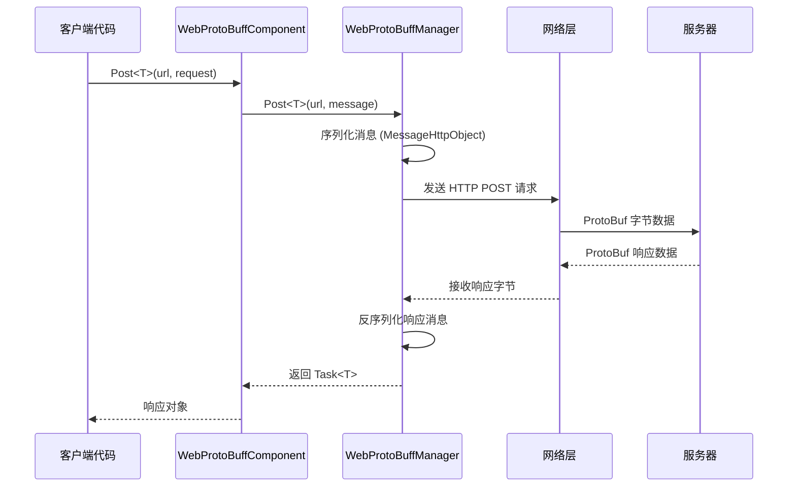

# 基础示例

本节提供 Web ProtoBuff 插件的基础使用示例，帮助开发者快速上手并理解核心用法。

## 概述

Web ProtoBuff 组件是基于 GameFrameX 框架的网络请求模块，专门用于处理基于 Protocol Buffer 格式的 HTTP POST 请求。该组件提供以下核心功能：

- **ProtoBuf 序列化**：自动将消息对象序列化为字节数据进行发送
- **异步请求**：基于 Task<T> 的异步 API，支持 async/await 模式
- **跨平台支持**：兼容 Unity WebGL 及原生平台
- **超时控制**：可配置请求超时时间

## 快速流程

以下流程图展示了使用 WebProtoBuffComponent 发送请求的基本流程：



## 消息定义示例

在使用 Web ProtoBuff 之前，需要定义请求和响应的 ProtoBuf 消息类型。

### 请求消息定义

```csharp
using ProtoBuf;
using GameFrameX.Network.Runtime;

[ProtoContract]
public class LoginRequest : MessageObject
{
    [ProtoMember(1)]
    public string Username { get; set; }
    
    [ProtoMember(2)]
    public string Password { get; set; }
}
```
> Source: [README.md](https://github.com/GameFrameX/com.gameframex.unity.web.protobuff/blob/main/README.md#L65-L77)

### 响应消息定义

```csharp
using ProtoBuf;
using GameFrameX.Network.Runtime;

[ProtoContract]
public class LoginResponse : MessageObject, IResponseMessage
{
    [ProtoMember(1)]
    public bool Success { get; set; }
    
    [ProtoMember(2)]
    public string Token { get; set; }
}
```
> Source: [README.md](https://github.com/GameFrameX/com.gameframex.unity.web.protobuff/blob/main/README.md#L79-L88)

**关键要点：**
- 使用 `[ProtoContract]` 属性标记类为 ProtoBuf 契约
- 使用 `[ProtoMember(N)]` 属性标记需要序列化的属性
- 请求消息只需继承 `MessageObject`
- 响应消息需要继承 `MessageObject` 并实现 `IResponseMessage` 接口

## 发送请求示例

### 完整使用示例

以下是在 Unity 脚本中使用 WebProtoBuffComponent 发送登录请求的完整示例：

```csharp
using UnityEngine;
using GameFrameX.Web.ProtoBuff.Runtime;

public class LoginController : MonoBehaviour
{
    public WebProtoBuffComponent WebComponent;

    private async void Start()
    {
        var request = new LoginRequest 
        { 
            Username = "user", 
            Password = "password" 
        };
        
        string url = "http://api.example.com/login";

        try
        {
            // 发送请求并等待结果
            LoginResponse response = await WebComponent.Post<LoginResponse>(url, request);
            
            if (response != null)
            {
                Debug.Log($"Login Result: {response.Success}, Token: {response.Token}");
            }
        }
        catch (System.Exception e)
        {
            Debug.LogError($"Request Failed: {e.Message}");
        }
    }
}
```
> Source: [README.md](https://github.com/GameFrameX/com.gameframex.unity.web.protobuff/blob/main/README.md#L94-L128)

### 获取组件实例

在 Unity 场景中，WebProtoBuffComponent 作为游戏框架组件使用。通常通过以下方式获取：

```csharp
// 方式1：通过场景中的组件引用（需要在 Inspector 中配置）
public WebProtoBuffComponent webProtoBuffComponent;

// 方式2：通过框架获取
var webComponent = UnityGameFramework.Runtime.GameEntry.GetComponent<WebProtoBuffComponent>();
```

### 超时设置

可以通过组件的 Timeout 属性设置请求超时时间（单位：秒）：

```csharp
// 设置超时为 10 秒
webProtoBuffComponent.Timeout = 10f;
```
> Source: [WebProtoBuffComponent.cs](https://github.com/GameFrameX/com.gameframex.unity.web.protobuff/blob/main/Runtime/Web/WebProtoBuffComponent.cs#L67-L71)

## 启用功能

### 编译宏定义

使用 ProtoBuff 网络功能需要在 Unity 中启用编译宏。打开 **Edit > Project Settings > Player**，在 **Scripting Define Symbols** 中添加：

```
ENABLE_GAME_FRAME_X_WEB_PROTOBUF_NETWORK
```

> **注意**：此宏定义是可选的。如果未添加宏定义，Post<T> 方法将被禁用，组件仅保留基础功能。

该宏定义也可以通过程序集定义文件自动定义，当项目依赖 `com.gameframex.unity.network` 包时会自动启用。

## 数据格式说明

### 请求数据格式

发送的请求数据采用 `MessageHttpObject` 包装格式：

```csharp
MessageHttpObject messageHttpObject = new MessageHttpObject
{
    Id = messageId,           // 消息类型标识
    UniqueId = uniqueId,      // 唯一请求标识
    Body = serializedBody    // 序列化后的消息体
};
```
> Source: [WebProtoBuffManager.ProtoBuf.cs](https://github.com/GameFrameX/com.gameframex.unity.web.protobuff/blob/main/Runtime/Web/WebProtoBuffManager.ProtoBuf.cs#L214-L221)

### HTTP 请求头

- **Content-Type**: `application/x-protobuf`
- **请求方法**: POST
- **超时控制**: 通过 RequestTimeout 属性设置

## 错误处理

在实际应用中，应当处理以下常见错误：

```csharp
try
{
    var response = await WebComponent.Post<LoginResponse>(url, request);
    
    if (response == null)
    {
        Debug.LogWarning("Response is null - server may be unreachable");
        return;
    }
    
    // 处理业务逻辑
}
catch (TimeoutException e)
{
    Debug.LogError($"Request timeout: {e.Message}");
}
catch (WebException e)
{
    Debug.LogError($"Network error: {e.Status} - {e.Message}");
}
catch (System.Exception e)
{
    Debug.LogError($"Unexpected error: {e.Message}");
}
```

## 调试日志

插件支持发送和接收消息的调试日志，便于开发调试：

- **发送日志**：启用 `ENABLE_GAMEFRAMEX_WEB_SEND_LOG` 宏定义
- **接收日志**：启用 `ENABLE_GAMEFRAMEX_WEB_RECEIVE_LOG` 宏定义

日志输出格式示例：
```
发送消息 ID:[1001,uuid123,LoginRequest] 消息内容:{...}
接收消息 ID:[1001,uuid123,LoginResponse] 消息内容:{...}
```
> Source: [WebProtoBuffManager.ProtoBuf.cs](https://github.com/GameFrameX/com.gameframex.unity.web.protobuff/blob/main/Runtime/Web/WebProtoBuffManager.ProtoBuf.cs#L227-L241)

## 相关链接

- [快速入门](../3-getting-started.quick-start) - 了解快速开始步骤
- [组件架构](../4-core-concepts.architecture) - 深入了解架构设计
- [消息定义](../4-core-concepts.message-definition) - ProtoBuf 消息详解
- [API 参考 - WebProtoBuffComponent](../5-api-reference.webprotobuffcomponent) - 完整 API 文档
- [编译宏定义](../6-configuration.compile-defines) - 配置编译选项
