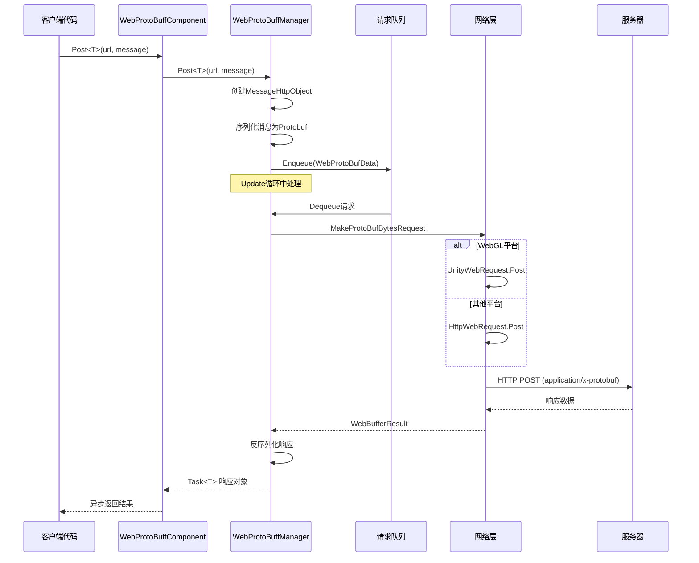

# IWebProtoBuffManager

WebProtoBuffManager 接口定义了 Web 请求的 Protobuf 网络通信功能，提供 HTTP POST 请求的发送和接收支持。

## 概述

`IWebProtoBuffManager` 是 GameFrameX Web ProtoBuff 模块的核心接口，负责处理基于 Protocol Buffer 序列化格式的 HTTP 网络请求。该接口继承自 GameFramework 的模块系统，提供了统一的网络请求抽象。

**设计意图**：该接口封装了底层网络请求的复杂性，提供了简洁的泛型方法用于发送 Protobuf 消息并接收对应类型的响应。通过队列管理机制实现了请求的批量处理，同时支持 WebGL 和其他平台的差异化实现。

## 架构

```mermaid
graph TD
    subgraph Client["客户端层"]
        WebProtoBuffComponent["WebProtoBuffComponent<br/>组件包装器"]
    end

    subgraph Manager["管理层"]
        IWebProtoBuffManager["IWebProtoBuffManager<br/>接口定义"]
        WebProtoBuffManager["WebProtoBuffManager<br///>实现类"]
    end

    subgraph Data["数据层"]
        MessageObject["MessageObject<br///>消息基类"]
        MessageHttpObject["MessageHttpObject<br/>HTTP消息封装"]
        WebProtoBufData["WebProtoBufData<br/>请求数据"]
    end

    subgraph Network["网络层"]
        Queue["请求队列<br/>m_WaitingProtoBufQueue"]
        SendingList["发送中列表<br/>m_SendingProtoBufList"]
        UnityWebRequest["UnityWebRequest<br/>WebGL平台"]
        HttpWebRequest["HttpWebRequest<br/>其他平台"]
    end

    WebProtoBuffComponent -->|调用| IWebProtoBuffManager
    IWebProtoBuffManager <|--|实现| WebProtoBuffManager
    WebProtoBuffManager -->|序列化/反序列化| MessageObject
    WebProtoBuffManager -->|管理| WebProtoBufData
    WebProtoBuffManager -->|入队| Queue
    WebProtoBuffManager -->|发送| SendingList
    WebProtoBuffManager -->|平台判断| UnityWebRequest
    WebProtoBuffManager -->|平台判断| HttpWebRequest
```

### 组件说明

| 组件 | 角色 | 说明 |
|------|------|------|
| WebProtoBuffComponent | 组件包装器 | Unity 组件，封装 IWebProtoBuffManager 的访问 |
| IWebProtoBuffManager | 接口定义 | 定义 Protobuf 网络请求的核心 API |
| WebProtoBuffManager | 实现类 | 具体实现，包含队列管理和平台适配 |
| MessageObject | 消息基类 | 所有 Protobuf 消息的基类型 |
| MessageHttpObject | HTTP 封装 | 包含消息 ID、UniqueId、Body 的封装 |

## 核心流程



### 请求处理流程

1. **请求创建**：客户端调用 `Post<T>` 方法，传入 URL 和消息对象
2. **消息封装**：将用户消息包装为 `MessageHttpObject`，包含消息 ID 和序列化的 Body
3. **队列管理**：请求进入等待队列，由 Update 循环按并发限制处理
4. **网络发送**：根据平台选择 `UnityWebRequest`（WebGL）或 `HttpWebRequest`（其他平台）
5. **响应处理**：接收服务器响应后，反序列化为对应的 Protobuf 对象并返回

## 接口定义

### `Post<T>(string url, MessageObject message): Task<T>`

发送 Protobuf 消息的 POST 请求，并接收指定类型的响应。

**注意**：此方法仅在定义 `ENABLE_GAME_FRAME_X_WEB_PROTOBUF_NETWORK` 宏时可用。

**参数：**
- `url` (string): 目标服务器的 URL 地址
- `message` (MessageObject): 要发送的 Protobuf 消息对象，必须继承自 MessageObject

**泛型参数：**
- `T`: 返回的数据类型，必须继承自 MessageObject 并且实现 IResponseMessage 接口

**返回：** `Task<T>` - 异步任务，完成时包含从服务器接收到的响应数据

**实现代码示例：**

```csharp
// 来自 Runtime/Web/WebProtoBuffManager.ProtoBuf.cs#L178-L201
public async Task<T> Post<T>(string url, MessageObject message) where T : MessageObject, IResponseMessage
{
    DebugSendLog(message);
    var webBufferResult = await PostInner(url, message);
    if (webBufferResult.IsNotNull())
    {
        var messageObjectHttp = SerializerHelper.Deserialize<MessageHttpObject>(webBufferResult.Result);
        if (messageObjectHttp.IsNotNull() && messageObjectHttp.Id != default)
        {
            var messageType = ProtoMessageIdHandler.GetRespTypeById(messageObjectHttp.Id);
            if (messageType != typeof(T))
            {
                Log.Error($"Response message type is invalid. Expected '{typeof(T).FullName}', actual '{messageType.FullName}'.");
                return default;
            }

            var messageObject = SerializerHelper.Deserialize<T>(messageObjectHttp.Body);
            DebugReceiveLog(messageObject);
            return messageObject;
        }
    }

    return default;
}
```
> Source: [WebProtoBuffManager.ProtoBuf.cs](https://github.com/GameFrameX/com.gameframex.unity.web.protobuff/blob/main/Runtime/Web/WebProtoBuffManager.ProtoBuf.cs#L178-L201)

### `Timeout: float`

获取或设置 POST 请求的超时时间（单位：秒）。

**属性类型：** `float`

**默认值：** `5f` (5秒)

**说明：** 设置请求的超时时间后，实际的 `RequestTimeout` 属性会同步更新为对应的 `TimeSpan` 值。

**实现代码示例：**

```csharp
// 来自 Runtime/Web/WebProtoBuffManager.cs#L41-L49
public float Timeout
{
    get { return m_Timeout; }
    set
    {
        m_Timeout = value;
        RequestTimeout = TimeSpan.FromSeconds(value);
    }
}
```
> Source: [WebProtoBuffManager.cs](https://github.com/GameFrameX/com.gameframex.unity.web.protobuff/blob/main/Runtime/Web/WebProtoBuffManager.cs#L41-L49)

## 属性参考

| 属性 | 类型 | 默认值 | 说明 |
|------|------|--------|------|
| Timeout | float | 5f | 请求超时时间（秒） |
| MaxConnectionPerServer | int | 8 | 每个服务器的最大并发连接数 |
| RequestTimeout | TimeSpan | 5秒 | 实际的请求超时时间对象 |

## 使用示例

### 基础用法

通过 WebProtoBuffComponent 发送 Protobuf 请求：

```csharp
// 定义请求消息
public class LoginRequest : MessageObject
{
    public string Username { get; set; }
    public string Password { get; set; }
}

// 定义响应消息
public class LoginResponse : MessageObject, IResponseMessage
{
    public int ErrorCode { get; set; }
    public string Token { get; set; }
}

// 发送请求
var webComponent = UnityEngine.GameObject.FindObjectOfType<WebProtoBuffComponent>();
var request = new LoginRequest { Username = "user", Password = "pass" };
LoginResponse response = await webComponent.Post<LoginResponse>("http://example.com/api/login", request);
```
> Source: [WebProtoBuffComponent.cs](https://github.com/GameFrameX/com.gameframex.unity.web.protobuff/blob/main/Runtime/Web/WebProtoBuffComponent.cs#L105-L108)

### 超时设置

```csharp
// 设置超时时间为 10 秒
var webComponent = UnityEngine.GameObject.FindObjectOfType<WebProtoBuffComponent>();
webComponent.Timeout = 10f;
```

### 并发控制

WebProtoBuffManager 使用队列管理请求，默认最大并发数为 8：

```csharp
// 通过管理器设置最大连接数
var manager = GameFrameworkEntry.GetModule<IWebProtoBuffManager>();
// MaxConnectionPerServer 属性在实现类中可见
if (manager is WebProtoBuffManager webManager)
{
    webManager.MaxConnectionPerServer = 16;
}
```

## 平台差异

### WebGL 平台

在 WebGL 平台上，使用 Unity 的 `UnityWebRequest` 进行网络请求：

```csharp
// 来自 Runtime/Web/WebProtoBuffManager.ProtoBuf.cs#L87-L116
UnityEngine.Networking.UnityWebRequest unityWebRequest;
if (webData.IsGet)
{
    unityWebRequest = UnityEngine.Networking.UnityWebRequest.Get(webData.URL);
}
else
{
    unityWebRequest = UnityEngine.Networking.UnityWebRequest.Post(webData.URL, string.Empty);
}

unityWebRequest.timeout = (int)RequestTimeout.TotalSeconds;
unityWebRequest.SetRequestHeader("Content-Type", ProtoBufContentType);
byte[] postData = webData.SendData;
unityWebRequest.uploadHandler = new UnityEngine.Networking.UploadHandlerRaw(postData);
```
> Source: [WebProtoBuffManager.ProtoBuf.cs](https://github.com/GameFrameX/com.gameframex.unity.web.protobuff/blob/main/Runtime/Web/WebProtoBuffManager.ProtoBuf.cs#L87-L116)

### 其他平台

在非 WebGL 平台上，使用 .NET 的 `HttpWebRequest`：

```csharp
// 来自 Runtime/Web/WebProtoBuffManager.ProtoBuf.cs#L118-L164
HttpWebRequest request = WebRequest.CreateHttp(webData.URL);
request.Method = webData.IsGet ? WebRequestMethods.Http.Get : WebRequestMethods.Http.Post;
request.Timeout = (int)RequestTimeout.TotalMilliseconds;
request.ContentType = ProtoBufContentType;
byte[] postData = webData.SendData;
request.ContentLength = postData.Length;
using (Stream requestStream = request.GetRequestStream())
{
    await requestStream.WriteAsync(postData, 0, postData.Length);
}
```
> Source: [WebProtoBuffManager.ProtoBuf.cs](https://github.com/GameFrameX/com.gameframex.unity.web.protobuff/blob/main/Runtime/Web/WebProtoBuffManager.ProtoBuf.cs#L118-L164)

## 编译宏定义

使用 `Post<T>` 方法需要定义以下编译宏：

| 宏名称 | 说明 |
|--------|------|
| ENABLE_GAME_FRAME_X_WEB_PROTOBUF_NETWORK | 启用 Protobuf 网络功能 |

在 Unity 的 **Player Settings** → **Scripting Define Symbols** 中添加该宏定义即可使用完整的 Protobuf 网络功能。

## 相关链接

- [WebProtoBuffComponent](./5-api-reference.webprotobuffcomponent) - Unity 组件封装
- [组件配置](./6-configuration.component-config) - 配置选项说明
- [编译宏定义](./6-configuration.compile-defines) - 宏定义详细说明
- [快速入门](./3-getting-started.quick-start) - 快速开始指南
