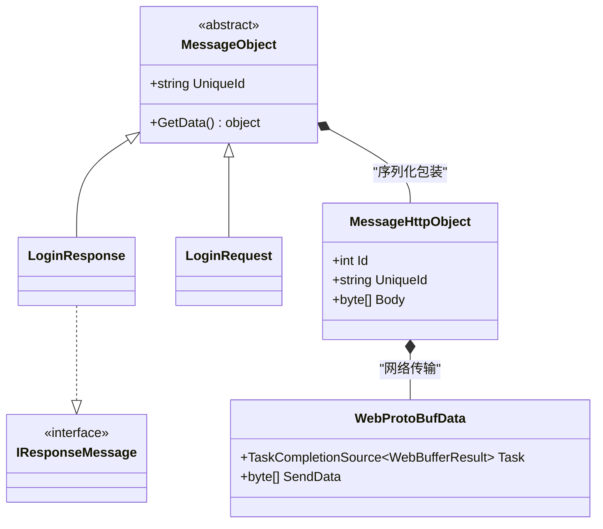
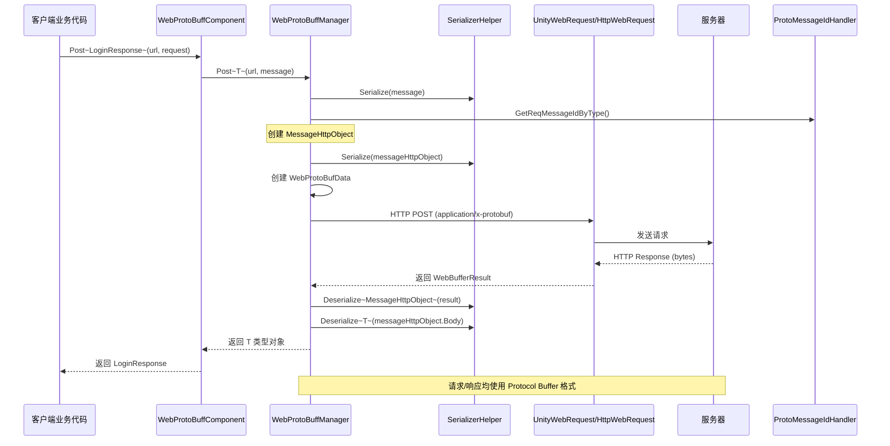

# 消息定义

本文档介绍 GameFrameX Web ProtoBuff 插件中的消息定义机制，包括消息基类、HTTP 消息包装器以及 Protocol Buffer 消息的结构定义。

## 概述

Web ProtoBuff 插件基于 **protobuf-net** 库实现 Protocol Buffer 消息的序列化和反序列化。消息系统采用分层设计：

- **基础层**：`MessageObject` - 所有消息的基类
- **传输层**：`MessageHttpObject` - HTTP 传输的消息包装器
- **应用层**：用户自定义的业务消息类

这种设计实现了业务逻辑与网络传输的解耦，使得开发者可以专注于业务消息的定义，而无需关心底层的网络通信细节。

## 消息架构



### 核心组件说明

| 组件 | 命名空间 | 说明 |
|------|----------|------|
| `MessageObject` | GameFrameX.Network.Runtime | 所有 ProtoBuf 消息的抽象基类 |
| `IResponseMessage` | GameFrameX.Network.Runtime | 响应消息接口，标识消息类型为响应 |
| `MessageHttpObject` | GameFrameX.Network.Runtime | HTTP 传输包装器，包含消息 ID 和消息体 |
| `WebProtoBufData` | GameFrameX.Web.ProtoBuff.Runtime | 内部请求数据类，管理请求队列 |

## 消息序列化流程



### 流程说明

1. **消息创建**：客户端创建继承自 `MessageObject` 的请求消息对象
2. **消息包装**：将业务消息序列化为字节数组，并包装到 `MessageHttpObject` 中
3. **消息 ID**：通过 `ProtoMessageIdHandler` 获取消息类型对应的唯一 ID
4. **网络传输**：使用 HTTP POST 方法，Content-Type 设置为 `application/x-protobuf`
5. **响应处理**：服务器返回的数据先反序列化为 `MessageHttpObject`，再从中提取业务响应消息

## 消息定义示例

### 定义请求消息

请求消息需要继承自 `MessageObject` 基类，并使用 `ProtoContract` 和 `ProtoMember` 特性标记：

```csharp
using ProtoBuf;
using GameFrameX.Network.Runtime;

[ProtoContract]
public class LoginRequest : MessageObject
{
    [ProtoMember(1)]
    public string Username { get; set; }
    
    [ProtoMember(2)]
    public string Password { get; set; }
    
    [ProtoMember(3)]
    public string DeviceId { get; set; }
}
```
> Source: [README.md](https://github.com/GameFrameX/com.gameframex.unity.web.protobuff/blob/main/README.md#L66-L77)

### 定义响应消息

响应消息除了继承 `MessageObject` 外，还需要实现 `IResponseMessage` 接口：

```csharp
using ProtoBuf;
using GameFrameX.Network.Runtime;

[ProtoMember(1)]
public bool Success { get; set; }

[ProtoMember(2)]
public string Token { get; set; }

[ProtoMember(3)]
public string Message { get; set; }
}
```
> Source: [README.md](https://github.com/GameFrameX/com.gameframex.unity.web.protobuff/blob/main/README.md#L79-L88)

### 完整使用示例

```csharp
using UnityEngine;
using GameFrameX.Web.ProtoBuff.Runtime;

public class LoginController : MonoBehaviour
{
    public WebProtoBuffComponent WebComponent;

    private async void Start()
    {
        var request = new LoginRequest 
        { 
            Username = "user", 
            Password = "password" 
        };
        
        string url = "http://api.example.com/login";

        try
        {
            // 发送请求并等待结果
            LoginResponse response = await WebComponent.Post<LoginResponse>(url, request);
            
            if (response != null)
            {
                Debug.Log($"Login Result: {response.Success}, Token: {response.Token}");
            }
        }
        catch (System.Exception e)
        {
            Debug.LogError($"Request Failed: {e.Message}");
        }
    }
}
```
> Source: [README.md](https://github.com/GameFrameX/com.gameframex.unity.web.protobuff/blob/main/README.md#L98-L127)

## ProtoBuf 特性说明

### 常用特性

| 特性 | 作用 | 注意事项 |
|------|------|----------|
| `[ProtoContract]` | 标记类为 ProtoBuf 序列化目标 | 必须添加在类声明上方 |
| `[ProtoMember(n)]` | 标记属性为序列化成员，n 为字段编号 | 编号必须唯一，建议从 1 开始连续编号 |
| `[ProtoIgnore]` | 标记属性不参与序列化 | 用于不需要网络传输的属性 |

### 消息设计原则

1. **字段编号唯一性**：每个 `[ProtoMember]` 的编号必须在类内唯一
2. **编号连续性**：建议使用从 1 开始的连续编号，便于扩展
3. **类型兼容性**：字段类型变更后需要保持向后兼容
4. **命名规范**：使用 PascalCase 命名属性，ProtoBuf 会自动转换

## HTTP 消息包装

`MessageHttpObject` 是用于 HTTP 传输的消息包装类，其结构如下：

```csharp
public class MessageHttpObject
{
    /// <summary>
    /// 消息类型 ID，用于标识消息种类
    /// </summary>
    public int Id { get; set; }
    
    /// <summary>
    /// 消息唯一标识，用于请求/响应配对
    /// </summary>
    public string UniqueId { get; set; }
    
    /// <summary>
    /// 消息体字节数组，包含实际业务数据
    /// </summary>
    public byte[] Body { get; set; }
}
```

在发送请求时，插件执行以下序列化步骤：

```csharp
// 来自 WebProtoBuffManager.ProtoBuf.cs
var id = ProtoMessageIdHandler.GetReqMessageIdByType(message.GetType());
MessageHttpObject messageHttpObject = new MessageHttpObject
{
    Id = id,
    UniqueId = message.UniqueId,
    Body = SerializerHelper.Serialize(message),
};
var sendData = SerializerHelper.Serialize(messageHttpObject);
```
> Source: [Runtime/Web/WebProtoBuffManager.ProtoBuf.cs#L214-L221](https://github.com/GameFrameX/com.gameframex.unity.web.protobuff/blob/main/Runtime/Web/WebProtoBuffManager.ProtoBuf.cs#L214-L221)

## 相关链接

- [组件架构](./4-core-concepts.architecture) - 了解 WebProtoBuffComponent 的架构设计
- [快速入门](./3-getting-started.quick-start) - 开始使用 Web ProtoBuff 组件
- [API 参考 - WebProtoBuffComponent](./5-api-reference.webprotobuffcomponent) - 组件完整 API 文档
- [API 参考 - IWebProtoBuffManager](./5-api-reference.iwebprotobuffmanager) - 管理器接口文档
- [编译宏定义](./6-configuration.compile-defines) - 如何启用 ProtoBuf 网络功能
