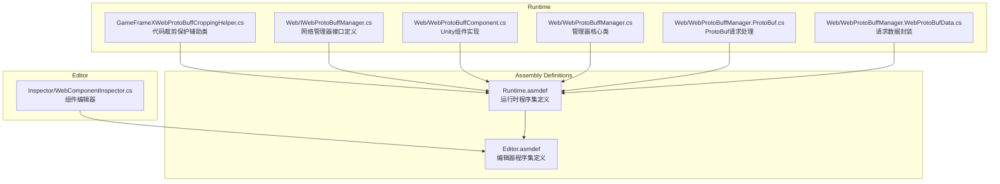
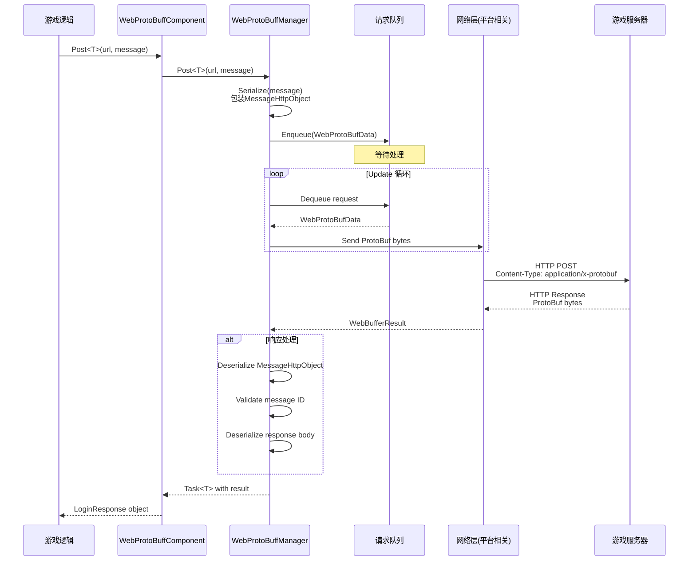
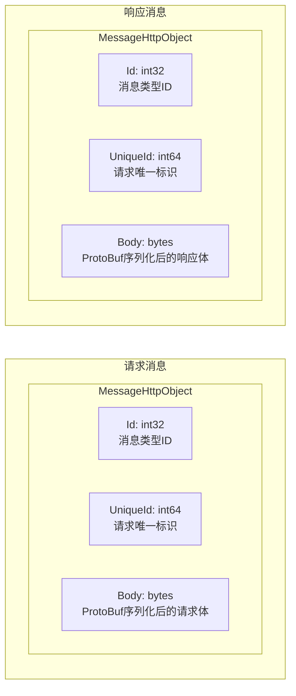

# 插件介绍

GameFrameX Web ProtoBuff 插件是一个专为 Unity 游戏设计的网络请求组件，基于 Protocol Buffer（ProtoBuf）提供高效、类型安全的 HTTP 通信功能。

## 概述

Web ProtoBuff 组件（WebProtoBuffComponent）是 GameFrameX 游戏框架的核心网络模块之一，专门用于处理基于 Protocol Buffer 格式的网络请求。在现代游戏开发中，ProtoBuf 因其高效的序列化能力和紧凑的数据传输格式，被广泛应用于客户端与服务器之间的通信。

该插件的主要职责包括：

- **ProtoBuf 消息序列化与反序列化**：自动将 C# 对象序列化为 ProtoBuf 字节流，并从响应中反序列化出对应的消息对象
- **异步网络请求**：基于 `Task<T>` 的异步 API，支持 async/await 模式，与 Unity 的协程系统无缝集成
- **请求队列管理**：内部使用队列机制管理待发送的请求，支持连接数限制和请求优先级
- **跨平台支持**：针对不同平台（WebGL、Standalone、移动端）提供相应的网络实现
- **超时控制**：可配置的超时时间，确保请求不会无限等待

### 核心价值

1. **类型安全**：通过泛型机制，在编译时确保请求和响应类型的正确性
2. **高效传输**：ProtoBuf 的二进制格式比 JSON 更紧凑，序列化/反序列化速度更快
3. **易于使用**：简洁的 API 设计，开发者只需关注业务逻辑，无需处理底层网络细节
4. **框架集成**：深度集成到 GameFrameX 框架中，遵循框架的设计规范和生命周期管理

## 架构

### 组件架构

Web ProtoBuff 组件在 GameFrameX 框架中的架构层次如下：

```mermaid
flowchart TD
    subgraph Client["客户端层"]
        GameLogic[游戏逻辑代码]
    end

    subgraph Component["组件层"]
        WebProtoBuffComponent[WebProtoBuffComponent]
    end

    subgraph Module["模块层"]
        IWebProtoBuffManager[IWebProtoBuffManager 接口]
        WebProtoBuffManager[WebProtoBuffManager 实现]
    end

    subgraph Framework["框架层"]
        GameFrameworkEntry[GameFrameworkEntry]
        GameFrameworkModule[GameFrameworkModule 基类]
    end

    subgraph Network["网络层"]
        WebGL[UnityWebRequest<br/>WebGL平台]
        HttpClient[HttpWebRequest<br/>其他平台]
    end

    subgraph Data["数据层"]
        Serializer[SerializerHelper<br/>ProtoBuf序列化]
        ProtoHandler[ProtoMessageIdHandler<br/>消息ID处理]
    end

    GameLogic --> WebProtoBuffComponent
    WebProtoBuffComponent --> IWebProtoBuffManager
    IWebProtoBuffManager <|.. WebProtoBuffManager
    WebProtoBuffManager --> GameFrameworkEntry
    WebProtoBuffManager --> GameFrameworkModule
    WebProtoBuffManager --> WebGL
    WebProtoBuffManager --> HttpClient
    WebProtoBuffManager --> Serializer
    WebProtoBuffManager --> ProtoHandler
```

**架构说明：**

1. **客户端层**：游戏业务逻辑代码调用 WebProtoBuffComponent 发起网络请求
2. **组件层**：WebProtoBuffComponent 作为 Unity 组件，提供面向业务的 API，是开发者直接交互的入口点
3. **模块层**：IWebProtoBuffManager 定义接口规范，WebProtoBuffManager 实现具体的网络请求逻辑
4. **框架层**：GameFrameworkEntry 负责模块的创建和初始化，GameFrameworkModule 提供模块的基础功能
5. **网络层**：根据运行平台选择合适的网络实现（WebGL 使用 UnityWebRequest，其他平台使用 HttpWebRequest）
6. **数据层**：负责 ProtoBuf 消息的序列化/反序列化，以及消息类型的 ID 映射

### 文件结构

插件的源代码组织结构如下：



### 核心类说明

| 类名 | 职责 | 访问级别 |
|------|------|----------|
| WebProtoBuffComponent | Unity 组件，对外提供网络请求 API | public sealed |
| WebProtoBuffManager | 网络请求的具体实现，管理请求队列和处理逻辑 | public partial |
| WebProtoBufData | 封装单个请求的数据（URL、数据、Task） | private sealed |
| IWebProtoBuffManager | 定义网络管理器的接口规范 | public interface |

## 核心流程

### 请求处理流程

当游戏代码调用 `Post<T>` 方法发送 ProtoBuf 请求时，整个处理流程如下：



### 消息封装格式

插件使用统一的消息封装格式进行通信：



1. **Id**: 消息类型标识符，用于路由到正确的解析器
2. **UniqueId**: 请求的唯一标识，用于关联请求和响应
3. **Body**: 实际的业务数据，经过 ProtoBuf 序列化

## 功能特性

### 1. Protocol Buffer 原生支持

插件原生支持 Protocol Buffer 消息格式，使用 protobuf-net 库进行序列化：

- 消息类需继承 `MessageObject` 基类
- 使用 `[ProtoContract]` 和 `[ProtoMember]` 属性标记
- 支持复杂嵌套类型和集合类型

### 2. 异步编程模型

基于 `Task<T>` 的异步 API 设计：

- 使用 async/await 语法，代码简洁易懂
- 支持取消操作（CancellationToken）
- 与 Unity 的生命周期完美集成

### 3. 超时控制

可配置的超时机制：

- 默认超时时间：5 秒
- 可通过组件属性或代码动态设置
- 支持针对不同请求设置不同超时

### 4. 请求队列管理

高效的请求队列系统：

- 等待队列（WaitingQueue）：存储待发送的请求
- 发送列表（SendingList）：正在处理的请求
- 连接数限制：默认每服务器最多 8 个并发连接

### 5. 跨平台兼容

针对不同平台提供最优实现：

| 平台 | 网络实现 | 特点 |
|------|----------|------|
| WebGL | UnityWebRequest | 浏览器兼容，需处理异步回调 |
| Standalone | HttpWebRequest | .NET 标准实现，支持同步/异步 |
| iOS | HttpWebRequest | .NET 标准实现 |
| Android | HttpWebRequest | .NET 标准实现 |

## 使用场景

Web ProtoBuff 组件适用于以下场景：

1. **登录认证**：发送用户名密码请求，获取认证令牌
2. **数据同步**：从服务器同步游戏配置、玩家数据
3. **排行榜**：获取和提交玩家排行榜数据
4. **多人对战**：请求匹配、提交游戏结果
5. **内购验证**：验证应用内购买凭证
6. **社交功能**：获取好友列表、发送消息

## 平台要求

根据 `package.json` 的配置：

- **Unity 版本**：2019.4 及以上
- **.NET 标准**：2.1
- **依赖包**：
  - com.gameframex.unity (1.1.1+)
  - com.gameframex.unity.web (1.0.0+)
  - com.gameframex.unity.network (1.0.0+)
  - com.gameframex.unity.google.protobuf (1.0.0+)

## 相关链接

- [功能特性](./1-overview.features) - 详细的功能特性说明
- [安装方式](./2-installation.install-methods) - 插件安装教程
- [环境要求](./2-installation.requirements) - 开发环境配置
- [快速入门](./3-getting-started.quick-start) - 快速开始使用
- [基础示例](./3-getting-started.basic-example) - 代码示例
- [组件架构](./4-core-concepts.architecture) - 架构设计详解
- [消息定义](./4-core-concepts.message-definition) - ProtoBuf 消息定义指南
- [API 参考](./5-api-reference.webprotobuffcomponent) - 完整的 API 文档
- [组件配置](./6-configuration.component-config) - 配置选项说明
- [编译宏定义](./6-configuration.compile-defines) - 条件编译配置
- [平台说明](./7-platforms.platform-info) - 各平台特性说明
- [常见问题](./8-troubleshooting.faq) - 常见问题解答
