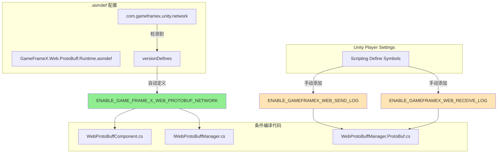

# 编译宏定义

编译宏定义（Compile Defines）是用于控制代码编译行为的重要机制，通过预处理器指令实现代码的条件编译。本文档详细介绍 Web ProtoBuff 组件中使用的所有编译宏定义及其配置方法。

## 概述

Web ProtoBuff 组件使用编译宏定义来控制功能模块的启用与禁用，这种设计具有以下优势：

- **条件编译**：根据不同的编译环境启用或禁用特定功能
- **依赖管理**：通过版本定义（versionDefines）自动管理功能依赖
- **调试支持**：提供独立的调试日志开关，不影响正式发布版本

## 编译宏定义详解

### ENABLE_GAME_FRAME_X_WEB_PROTOBUF_NETWORK

**功能说明**

这是 Web ProtoBuff 组件的核心编译宏定义，用于控制 Protocol Buffer 网络请求功能的可用性。当启用此宏时，组件将暴露 `Post<T>` 方法，允许开发者发送和接收 Protocol Buffer 格式的消息。

> 此宏定义在 `Runtime/GameFrameX.Web.ProtoBuff.Runtime.asmdef` 文件中通过版本定义（versionDefines）自动管理：
> Source: [GameFrameX.Web.ProtoBuff.Runtime.asmdef](https://github.com/GameFrameX/com.gameframex.unity.web.protobuff/blob/main/Runtime/GameFrameX.Web.ProtoBuff.Runtime.asmdef#L17-L22)

**依赖条件**

该宏的启用依赖于 `com.gameframex.unity.network` 包的存在。当项目中引用了 GameFrameX Network 运行时包时，asmdef 会自动定义此宏：

```json
"versionDefines": [
    {
      "name": "com.gameframex.unity.network",
      "expression": "",
      "define": "ENABLE_GAME_FRAME_X_WEB_PROTOBUF_NETWORK"
    }
]
```

**受影响的代码**

以下代码片段展示了条件编译的使用方式：

```csharp
// WebProtoBuffComponent.cs
#if ENABLE_GAME_FRAME_X_WEB_PROTOBUF_NETWORK
        /// <summary>
        /// 发送Post请求，用于发送和接收Protocol Buffer消息。
        /// 此方法仅在启用ENABLE_GAME_FRAME_X_WEB_PROTOBUF_NETWORK宏定义时可用。
        /// </summary>
        public Task<T> Post<T>(string url, GameFrameX.Network.Runtime.MessageObject message) 
            where T : GameFrameX.Network.Runtime.MessageObject, GameFrameX.Network.Runtime.IResponseMessage
        {
            return m_WebProtoBuffManager.Post<T>(url, message);
        }
#endif
```
> Source: [WebProtoBuffComponent.cs](https://github.com/GameFrameX/com.gameframex.unity.web.protobuff/blob/main/Runtime/Web/WebProtoBuffComponent.cs#L92-L109)

```csharp
// IWebProtoBuffManager.cs
#if ENABLE_GAME_FRAME_X_WEB_PROTOBUF_NETWORK
        /// <summary>
        /// 发送Protobuf消息的Post请求，并接收指定类型的响应
        /// </summary>
        Task<T> Post<T>(string url, GameFrameX.Network.Runtime.MessageObject message) 
            where T : GameFrameX.Network.Runtime.MessageObject, GameFrameX.Network.Runtime.IResponseMessage;
#endif
```
> Source: [IWebProtoBuffManager.cs](https://github.com/GameFrameX/com.gameframex.unity.web.protobuff/blob/main/Runtime/Web/IWebProtoBuffManager.cs#L11-L24)

### ENABLE_GAMEFRAMEX_WEB_RECEIVE_LOG

**功能说明**

调试日志宏，用于在运行时输出接收到的 Protocol Buffer 消息日志。启用后，当组件接收到服务器响应时，会自动记录消息的 ID、唯一标识符、类型名称以及消息内容。

**使用方法**

在 Unity 的 **Player Settings** → **Scripting Define Symbols** 中添加此宏定义即可启用接收日志功能：

```
ENABLE_GAMEFRAMEX_WEB_RECEIVE_LOG
```

**代码实现**

```csharp
private void DebugReceiveLog(MessageObject messageObject)
{
#if ENABLE_GAMEFRAMEX_WEB_RECEIVE_LOG
            var messageId = ProtoMessageIdHandler.GetReqMessageIdByType(messageObject.GetType());
            Log.Debug($"接收消息 ID:[{messageId},{messageObject.UniqueId},{messageObject.GetType().Name}] 消息内容:{GameFrameX.Runtime.Utility.Json.ToJson(messageObject)}");
#endif
}
```
> Source: [WebProtoBuffManager.ProtoBuf.cs](https://github.com/GameFrameX/com.gameframex.unity.web.protobuff/blob/main/Runtime/Web/WebProtoBuffManager.ProtoBuf.cs#L227-L233)

### ENABLE_GAMEFRAMEX_WEB_SEND_LOG

**功能说明**

调试日志宏，用于在运行时输出发送的 Protocol Buffer 消息日志。启用后，当组件发送请求时，会自动记录消息的 ID、唯一标识符、类型名称以及消息内容。

**使用方法**

在 Unity 的 **Player Settings** → **Scripting Define Symbols** 中添加此宏定义即可启用发送日志功能：

```
ENABLE_GAMEFRAMEX_WEB_SEND_LOG
```

**代码实现**

```csharp
private void DebugSendLog(MessageObject messageObject)
{
#if ENABLE_GAMEFRAMEX_WEB_SEND_LOG
            var messageId = ProtoMessageIdHandler.GetReqMessageIdByType(messageObject.GetType());
            Log.Debug($"发送消息 ID:[{messageId},{messageObject.UniqueId},{messageObject.GetType().Name}] 消息内容:{GameFrameX.Runtime.Utility.Json.ToJson(messageObject)}");
#endif
}
```
> Source: [WebProtoBuffManager.ProtoBuf.cs](https://github.com/GameFrameX/com.gameframex.unity.web.protobuff/blob/main/Runtime/Web/WebProtoBuffManager.ProtoBuf.cs#L235-L241)

## 编译宏定义架构

以下 Mermaid 图表展示了编译宏定义与代码模块之间的关系：



## 配置指南

### 自动管理宏定义

核心功能宏 `ENABLE_GAME_FRAME_X_WEB_PROTOBUF_NETWORK` 由 asmdef 自动管理，只需确保项目中已正确安装 `com.gameframex.unity.network` 包即可。

安装步骤：
1. 在 `manifest.json` 的 `dependencies` 中添加：
   ```json
   "com.gameframex.unity.network": "https://github.com/GameFrameX/com.gameframex.unity.network.git"
   ```
2. 等待 Unity Package Manager 完成安装
3. 编译项目，宏定义将自动生效

### 手动添加宏定义

对于调试日志宏，需要手动在 Unity 中配置：

1. 打开 Unity 编辑器
2. 菜单栏选择 **Edit** → **Project Settings** → **Player**
3. 在 **Player Settings** 窗口中，选择 **Other Settings** 选项卡
4. 找到 **Scripting Define Symbols** 字段
5. 添加所需的宏定义（多个宏用分号分隔）

```text
ENABLE_GAMEFRAMEX_WEB_SEND_LOG;ENABLE_GAMEFRAMEX_WEB_RECEIVE_LOG
```

### 推荐的宏定义配置

| 构建类型 | 推荐的宏定义 |
|----------|-------------|
| 开发调试 | `ENABLE_GAMEFRAMEX_WEB_SEND_LOG;ENABLE_GAMEFRAMEX_WEB_RECEIVE_LOG` |
| 测试发布 | （仅核心宏，由 asmdef 自动管理） |
| 正式发布 | （无额外宏定义） |

## 编译宏定义汇总表

| 宏定义名称 | 作用范围 | 管理方式 | 用途 |
|------------|----------|----------|------|
| `ENABLE_GAME_FRAME_X_WEB_PROTOBUF_NETWORK` | 核心功能 | asmdef 自动管理 | 启用 Protocol Buffer 网络请求功能 |
| `ENABLE_GAMEFRAMEX_WEB_SEND_LOG` | 调试功能 | 手动配置 | 启用发送消息日志 |
| `ENABLE_GAMEFRAMEX_WEB_RECEIVE_LOG` | 调试功能 | 手动配置 | 启用接收消息日志 |
| `UNITY_WEBGL` | 平台特定 | Unity 自动定义 | WebGL 平台专用代码 |

## 常见问题

### Q: 添加宏定义后代码没有生效？

**解决方案**：
1. 确保在正确的平台（Platform）下添加宏定义
2. 添加后需要重新编译项目（菜单：**Build Settings** → **Build** 或 **Compile**）
3. 检查是否有多层嵌套的 `#if` 条件，可能被外层条件阻止

### Q: 调试日志没有输出？

**解决方案**：
1. 确认已在 Player Settings 中正确添加 `ENABLE_GAMEFRAMEX_WEB_SEND_LOG` 或 `ENABLE_GAMEFRAMEX_WEB_RECEIVE_LOG`
2. 检查 Unity 的 Log 级别设置，确保 Debug 日志可见
3. 确认网络请求确实在发送/接收中

### Q: `Post<T>` 方法不可用？

**解决方案**：
1. 确认 `com.gameframex.unity.network` 包已正确安装
2. 检查是否启用了 `ENABLE_GAME_FRAME_X_WEB_PROTOBUF_NETWORK` 宏
3. 确保 WebProtoBuffComponent 组件已正确添加到场景中

## 相关链接

- [组件配置](./6-configuration.component-config)
- [平台说明](./7-platforms.platform-info)
- [插件介绍](./1-overview.introduction)
- [快速入门](./3-getting-started.quick-start)
