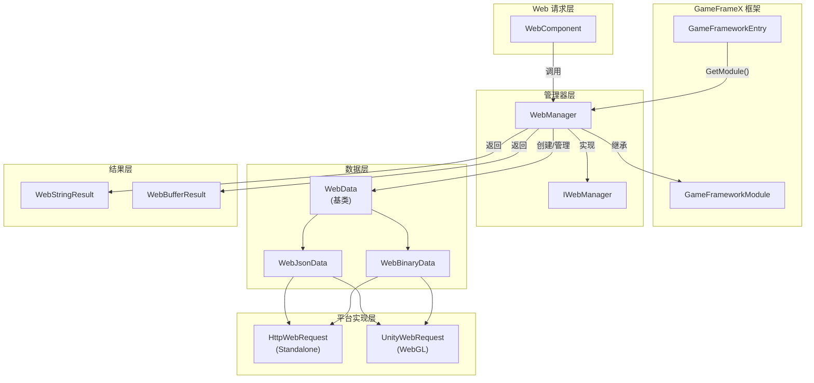
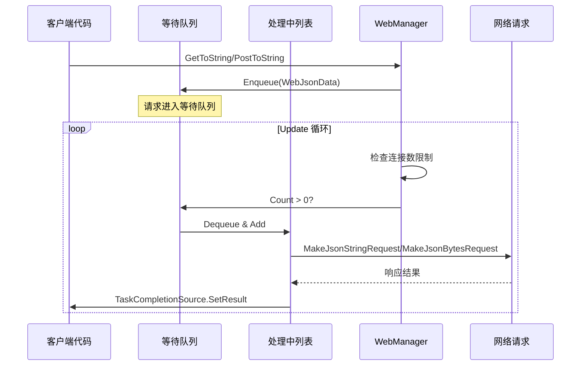
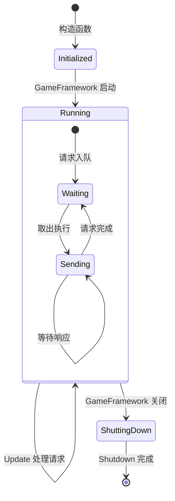
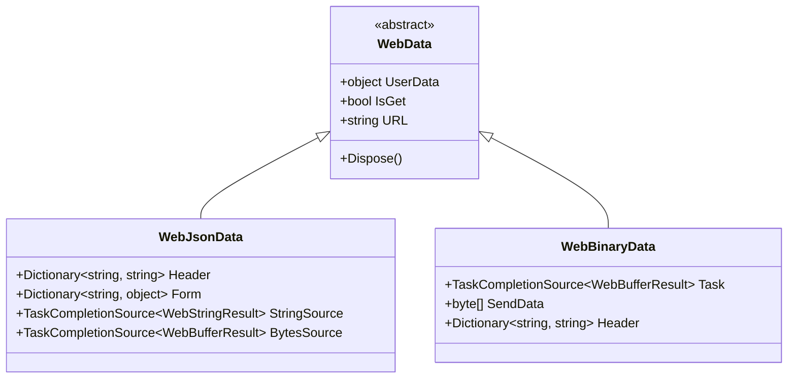

# WebManager 架构

WebManager 是 GameFrameX 框架中的 Web 请求管理模块，负责处理所有 HTTP GET 和 POST 请求。它采用队列式的请求处理机制，支持连接数限制，并提供了跨平台支持（Standalone 和 WebGL）。

## 概述

WebManager 作为 GameFrameX 框架的核心模块之一，封装了底层的 HTTP 请求实现，为游戏应用提供了统一的网络请求入口。其设计目标包括：

- **统一接口**：提供一致的 GET/POST 请求方法
- **异步处理**：基于 Task 的异步编程模型
- **连接管理**：支持每个服务器最大连接数限制
- **跨平台**：兼容 Standalone 和 WebGL 平台
- **基础数据**：支持全局请求头、查询参数和表单数据

WebManager 继承自 `GameFrameworkModule`，是 GameFrameX 框架生命周期管理的一部分，能够在游戏初始化时自动创建，在游戏关闭时自动清理资源。

## 架构设计

### 整体架构图



### 核心组件

#### IWebManager 接口

`IWebManager` 接口定义了 Web 请求管理器的所有公共方法，是 WebManager 的抽象契约。接口提供了多种重载方法，支持不同的请求场景：

> 详细接口定义请参见 [IWebManager 接口](./5-api-reference.1-iwebmanager)

#### WebManager 实现类

`WebManager` 是 `IWebManager` 接口的具体实现，继承自 `GameFrameworkModule`。它采用部分类（partial class）的方式组织代码，将不同功能模块拆分到多个文件中：

| 文件 | 职责 |
|------|------|
| WebManager.cs | 主实现：队列管理、请求处理、基础数据合并 |
| WebManager.WebData.cs | WebData 基类定义 |
| WebManager.WebJsonData.cs | JSON 请求数据类 |
| WebManager.WebBinary.cs | Binary/ProtoBuf 请求处理 |

```csharp
public partial class WebManager : GameFrameworkModule, IWebManager
{
    // 等待处理的普通请求队列
    private readonly Queue<WebJsonData> m_WaitingNormalQueue = new Queue<WebJsonData>(256);

    // 正在处理的普通请求列表
    private readonly List<WebJsonData> m_SendingNormalList = new List<WebJsonData>(16);

    // 每个服务器的最大连接数
    public int MaxConnectionPerServer { get; set; }
}
```
> Source: [WebManager.cs](https://github.com/GameFrameX/com.gameframex.unity.web/blob/main/Runtime/Web/WebManager.cs#L20-L29)

#### WebComponent 组件

`WebComponent` 是 Unity 组件封装，提供与 `IWebManager` 相同的方法签名，但通过 Unity 组件的方式暴露给游戏逻辑层。它在 `Awake` 阶段获取 `WebManager` 实例：

```csharp
protected override void Awake()
{
    ImplementationComponentType = Utility.Assembly.GetType(componentType);
    InterfaceComponentType = typeof(IWebManager);
    base.Awake();
    m_WebManager = GameFrameworkEntry.GetModule<IWebManager>();
}
```
> Source: [WebComponent.cs](https://github.com/GameFrameX/com.gameframex.unity.web/blob/main/Runtime/Web/WebComponent.cs#L76-L89)

## 请求处理流程

### 请求队列机制

WebManager 采用生产者-消费者模式处理请求：



### 请求处理 Update 循环

WebManager 在每一帧的 `Update` 方法中检查并处理等待中的请求：

```csharp
protected override void Update(float elapseSeconds, float realElapseSeconds)
{
    lock (m_StringBuilder)
    {
        // 检查是否达到最大连接数
        if (m_SendingNormalList.Count < MaxConnectionPerServer)
        {
            // 从等待队列中取出请求
            if (m_WaitingNormalQueue.Count > 0)
            {
                var webJsonData = m_WaitingNormalQueue.Dequeue();

                // 根据返回类型选择处理方法
                if (webJsonData.UniTaskCompletionStringSource != null)
                {
                    MakeJsonStringRequest(webJsonData);
                }
                else
                {
                    MakeJsonBytesRequest(webJsonData);
                }

                // 移动到处理中列表
                m_SendingNormalList.Add(webJsonData);
            }
        }

        // 同时处理 Binary 请求
        UpdateBinary(elapseSeconds, realElapseSeconds);
    }
}
```
> Source: [WebManager.cs](https://github.com/GameFrameX/com.gameframex.unity.web/blob/main/Runtime/Web/WebManager.cs#L81-L107)

### 连接数限制机制

通过 `MaxConnectionPerServer` 属性控制同时向同一服务器发送的请求数量：

- **默认值**：8 个连接
- **设计目的**：防止请求过多导致服务器压力过大或客户端资源耗尽
- **工作方式**：只有当 `m_SendingNormalList.Count < MaxConnectionPerServer` 时，才会从等待队列取出新请求

### 数据合并机制

WebManager 提供了基础数据（Base Data）功能，允许设置全局请求参数：

```csharp
// 基础表单数据 - 所有请求都会携带
private readonly Dictionary<string, object> m_BaseForm = new Dictionary<string, object>(64);

// 基础请求头 - 所有请求都会携带
private readonly Dictionary<string, string> m_BaseHeader = new Dictionary<string, string>(64);

// 基础查询参数 - 所有请求都会携带
private readonly Dictionary<string, string> m_BaseQueryString = new Dictionary<string, string>(64);
```

在发起请求时，会自动合并基础数据和请求特定的数据：

```csharp
private Dictionary<string, object> MergeForm(Dictionary<string, object> form)
{
    if (m_BaseForm.Count == 0)
    {
        return form;
    }

    // 复制基础数据
    var result = new Dictionary<string, object>(m_BaseForm);

    // 覆盖/添加外部数据
    if (form != null)
    {
        foreach (var kv in form)
        {
            result[kv.Key] = kv.Value;
        }
    }

    return result;
}
```
> Source: [WebManager.cs](https://github.com/GameFrameX/com.gameframex.unity.web/blob/main/Runtime/Web/WebManager.cs#L685-L705)

## 平台差异处理

### WebGL 平台

在 WebGL 平台上，WebManager 使用 Unity 的 `UnityWebRequest` API：

```csharp
#if UNITY_WEBGL
using UnityEngine.Networking;

UnityWebRequest unityWebRequest;
if (webJsonData.IsGet)
{
    unityWebRequest = UnityWebRequest.Get(webJsonData.URL);
}
else
{
    unityWebRequest = UnityWebRequest.Post(webJsonData.URL, string.Empty);
}

unityWebRequest.certificateHandler = new DefaultBypassCertificate();
unityWebRequest.timeout = (int)RequestTimeout.TotalSeconds;
```

### Standalone 平台

在 Standalone 平台上，使用 .NET 的 `HttpWebRequest` API：

```csharp
HttpWebRequest request = WebRequest.CreateHttp(webJsonData.URL);
request.Method = webJsonData.IsGet ? WebRequestMethods.Http.Get : WebRequestMethods.Http.Post;
request.Timeout = (int)RequestTimeout.TotalMilliseconds;
```

### SSL 证书处理

WebGL 平台使用 `DefaultBypassCertificate` 类绕过 SSL 证书验证：

```csharp
public sealed class DefaultBypassCertificate : CertificateHandler
{
    protected override bool ValidateCertificate(byte[] certificateData)
    {
        return true;
    }
}
```
> Source: [DefaultBypassCertificate.cs](https://github.com/GameFrameX/com.gameframex.unity.web/blob/main/Runtime/Web/DefaultBypassCertificate.cs#L39-L45)

> ⚠️ **注意**：在生产环境中使用自签名证书时，请谨慎处理 SSL 验证。

## 资源管理

### 生命周期

WebManager 的资源管理分为三个阶段：



### 资源清理

在 `Shutdown` 方法中，系统会清理所有等待和处理中的请求：

```csharp
protected override void Shutdown()
{
    // 清理等待队列
    while (m_WaitingNormalQueue.Count > 0)
    {
        var webData = m_WaitingNormalQueue.Dequeue();
        webData.Dispose();
    }

    // 清理处理中列表
    while (m_SendingNormalList.Count > 0)
    {
        var webData = m_SendingNormalList[0];
        m_SendingNormalList.RemoveAt(0);
        webData.Dispose();
    }

    // 清理内存流
    m_MemoryStream.Dispose();
}
```
> Source: [WebManager.cs](https://github.com/GameFrameX/com.gameframex.unity.web/blob/main/Runtime/Web/WebManager.cs#L112-L131)

## 请求数据类型

WebManager 使用分层的数据类结构来封装请求信息：



- **WebData**：基类，包含通用属性（UserData、IsGet、URL）
- **WebJsonData**：JSON 格式请求，包含表单数据和请求头
- **WebBinaryData**：二进制/ProtoBuf 格式请求

## 相关链接

- [IWebManager 接口](./5-api-reference.1-iwebmanager)
- [WebComponent 组件](./5-api-reference.2-webcomponent)
- [请求结果类型](./4-core-concepts.2-result-types)
- [超时配置](./6-configuration.1-timeout)
- [基础数据配置](./6-configuration.2-base-data)
- [平台差异说明](./7-platforms.1-platform-differences)
