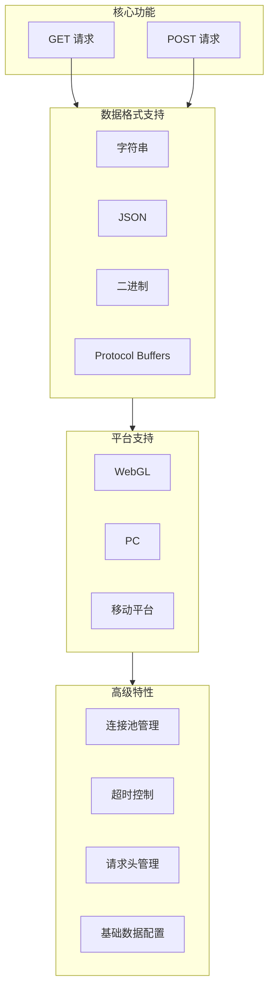
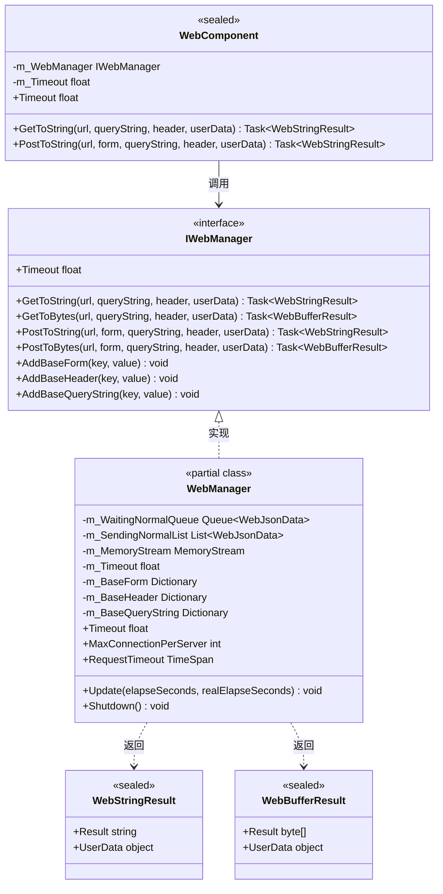
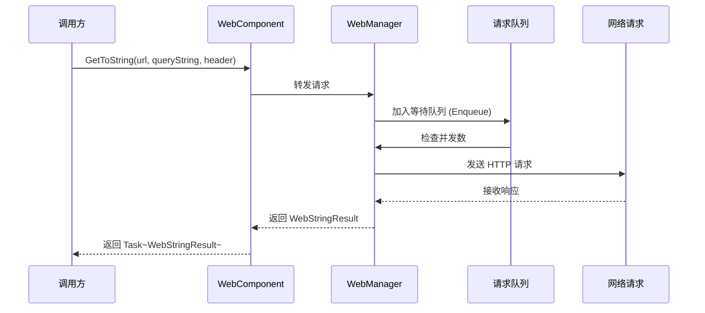

# 插件介绍

GameFrameX Web 组件是一个高性能的 Unity HTTP 网络请求库，提供简洁易用的 API 来处理各种网络请求场景。支持 GET、POST 请求，可处理字符串、JSON、二进制数据等多种格式。

## 概述

GameFrameX Web 是 GameFrameX 游戏框架体系中的网络功能模块，专为 Unity 游戏开发者设计。该插件提供了一套完整的 HTTP 客户端解决方案，帮助开发者快速实现客户端与服务器之间的通信需求。

作为 GameFrameX 框架的核心组件之一，Web 组件与其他模块（如 Network、Data、Procedure 等）紧密配合，共同构建完整的游戏后端通信体系。无论是简单的数据获取还是复杂的二进制文件上传，Web 组件都能提供稳定、高效的网络请求服务。

### 设计目标

GameFrameX Web 组件的设计遵循以下核心理念：

1. **简洁易用**：提供清晰的 API 接口，开发者无需关心底层实现细节
2. **高性能**：基于 C# Task 异步模式，充分利用多线程优势
3. **跨平台**：统一接口适配不同运行平台（WebGL、PC、移动端）
4. **可扩展**：模块化设计，支持自定义数据序列化和请求处理

## 核心特性

GameFrameX Web 组件提供了丰富的功能特性，满足各种网络请求场景的需求：



### 异步处理

基于现代 C# 异步编程模式（async/await），开发者可以编写清晰、简洁的异步代码，避免传统回调地狱问题：

```csharp
// 异步获取字符串数据
string result = await webManager.GetToString("https://api.example.com/data");
Debug.Log("Response: " + result);
```

> Source: [README.md](https://github.com/GameFrameX/com.gameframex.unity.web/blob/main/README.md#L66-L68)

### 多数据格式支持

支持多种数据格式的请求和响应处理：

- **字符串格式**：适用于简单的文本数据交换
- **JSON 格式**：广泛用于前后端数据交互，自动序列化/反序列化
- **二进制格式**：适用于文件下载、图片加载等场景
- **Protocol Buffers**：高效二进制序列化，适合高性能场景

### 连接池管理

内置智能连接复用机制，通过 `MaxConnectionPerServer` 属性控制单个服务器的最大并发连接数，避免过多连接导致服务器压力或性能问题。默认值为 8 个并发连接。

## 架构设计

GameFrameX Web 组件采用分层架构设计，确保代码的模块化和可维护性：



### 核心组件说明

| 组件 | 类型 | 职责 |
|------|------|------|
| **IWebManager** | 接口 | 定义 Web 请求的抽象接口，统一管理所有 HTTP 请求操作 |
| **WebManager** | 类 | 核心实现类，继承 `GameFrameworkModule`，实现完整的请求逻辑 |
| **WebComponent** | Unity 组件 | `IWebManager` 的 Unity 组件封装，方便在场景对象上使用 |
| **WebStringResult** | 结果类 | 封装字符串类型的请求结果 |
| **WebBufferResult** | 结果类 | 封装字节数组类型的请求结果 |

### 请求处理流程



## 平台支持

GameFrameX Web 组件针对不同 Unity 平台提供了差异化的实现，确保在各种运行环境下都能正常工作：

| 平台 | 实现方式 | 特殊说明 |
|------|----------|----------|
| **WebGL** | UnityWebRequest | 不支持多线程，所有请求在主线程处理 |
| **PC** | HttpWebRequest | 使用 .NET 原生网络库 |
| **Android** | HttpWebRequest | 使用 .NET 原生网络库 |
| **iOS** | HttpWebRequest | 使用 .NET 原生网络库 |

### 平台差异处理

组件内部通过条件编译指令 `#if UNITY_WEBGL` 自动选择合适的网络实现：

```csharp
#if UNITY_WEBGL
using UnityEngine.Networking;
// WebGL 平台使用 UnityWebRequest
UnityWebRequest unityWebRequest = UnityWebRequest.Get(webJsonData.URL);
#else
// 其他平台使用 HttpWebRequest
HttpWebRequest request = WebRequest.CreateHttp(webJsonData.URL);
#endif
```

> Source: [WebManager.cs](https://github.com/GameFrameX/com.gameframex.unity.web/blob/main/Runtime/Web/WebManager.cs#L213-L260)

## 快速开始

### 安装

通过 Git URL 安装（推荐）：

1. 在 Unity 编辑器中打开 Package Manager
2. 点击 "+" 按钮选择 "Add package from git URL"
3. 输入以下 URL：
   ```
   https://github.com/gameframex/com.gameframex.unity.web.git
   ```

### 基本用法

```csharp
using GameFrameX.Web.Runtime;
using System.Threading.Tasks;
using System.Collections.Generic;

public class WebExample : MonoBehaviour
{
    private IWebManager webManager;
    
    private async void Start()
    {
        // 获取 Web 管理器实例
        webManager = GameFrameworkEntry.GetModule<IWebManager>();
        
        // 发送 GET 请求获取字符串
        string result = await webManager.GetToString("https://api.example.com/data");
        Debug.Log("GET Response: " + result);
        
        // 发送 POST 请求带表单数据
        var formData = new Dictionary<string, string>
        {
            { "username", "testuser" },
            { "password", "testpass" }
        };
        
        string postResult = await webManager.PostToString("https://api.example.com/login", formData);
        Debug.Log("POST Response: " + postResult);
    }
}
```

> Source: [README.md](https://github.com/GameFrameX/com.gameframex.unity.web/blob/main/README.md#L52-L81)

### 使用 WebComponent

推荐使用 `WebComponent` 方式，它是一个 Unity 组件，可以直接添加到游戏对象上：

```csharp
using GameFrameX.Web.Runtime;
using System.Threading.Tasks;
using System.Collections.Generic;

public class MyWebService : MonoBehaviour
{
    private WebComponent webComponent;
    
    private void Awake()
    {
        webComponent = gameObject.GetOrOrAddComponent<WebComponent>();
    }
    
    public async Task<string> GetUserDataAsync(string userId)
    {
        var queryParams = new Dictionary<string, string>
        {
            { "userId", userId }
        };
        
        var headers = new Dictionary<string, string>
        {
            { "Authorization", "Bearer your-token-here" }
        };
        
        return await webComponent.GetToString(
            "https://api.example.com/users", 
            queryParams, 
            headers
        );
    }
}
```

> Source: [README.md](https://github.com/GameFrameX/com.gameframex.unity.web/blob/main/README.md#L90-L123)

## 配置选项

GameFrameX Web 组件提供多种配置选项：

| 配置项 | 类型 | 默认值 | 说明 |
|--------|------|--------|------|
| `Timeout` | float | 5.0 秒 | 请求超时时间 |
| `MaxConnectionPerServer` | int | 8 | 每个服务器的最大并发连接数 |
| `RequestTimeout` | TimeSpan | 5 秒 | 请求超时时间（TimeSpan 类型） |

### 代码配置示例

```csharp
private void ConfigureWebManager()
{
    var webManager = GameFrameworkEntry.GetModule<IWebManager>();
    
    // 设置请求超时为 60 秒
    webManager.Timeout = 60f;
    
    // 设置最大并发连接数为 16
    webManager.MaxConnectionPerServer = 16;
}
```

> Source: [README.md](https://github.com/GameFrameX/com.gameframex.unity.web/blob/main/README.md#L292-L306)

## 版本信息

- **当前版本**: 1.3.3
- **Unity 版本要求**: 2019.4+
- **许可证**: MIT / Apache License 2.0 双许可证

## 相关链接

- [安装方式](./02.installation)
- [基础用法](./03.getting-started)
- [使用 WebComponent](./08.web-component)
- [WebManager 架构](./05.web-manager)
- [请求结果类型](./06.result-types)
- [IWebManager 接口](./04.iwebmanager-interface)
- [WebComponent 组件](./08.web-component)
- [超时配置](./10.timeout-settings)
- [基础数据配置](./07.base-data)
- [平台差异说明](./09.platform-differences)
- [常见问题](./11.troubleshooting)
