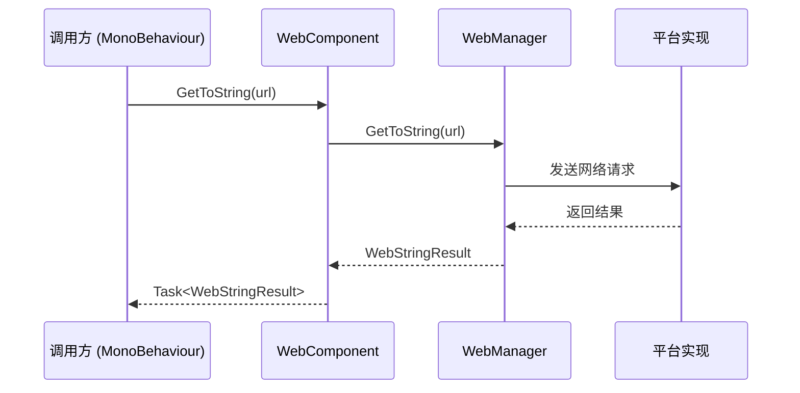

# 使用 WebComponent

WebComponent 是 GameFrameX Web 插件的核心组件之一，它以 Unity 组件的形式封装了 Web 请求功能，使开发者能够方便地在 Unity 场景中使用 HTTP 请求。

## 概述

WebComponent 是一个 Unity 组件（继承自 `GameFrameworkComponent`），它作为 `IWebManager` 接口的便捷访问入口。通过将 WebComponent 添加到场景中的 GameObject 上，开发者可以直接调用其提供的 GET 和 POST 请求方法，无需关心底层的网络实现细节。

WebComponent 的主要特点包括：

- **简单易用**：作为 Unity 组件，可以直接在 Inspector 面板中配置
- **异步支持**：基于 Task 异步模式，不会阻塞主线程
- **多种返回类型**：支持字符串（`WebStringResult`）和字节数组（`WebBufferResult`）两种返回类型
- **基础数据管理**：支持设置全局的表单数据、请求头和查询参数
- **超时控制**：支持配置请求超时时间

## 工作原理

WebComponent 内部委托 `IWebManager` 接口来完成实际的网络请求操作。在 Unity 运行时，它通过 `GameFrameworkEntry` 获取 `WebManager` 实例，并根据不同的平台选择合适的网络实现：

- **WebGL 平台**：使用 Unity 的 `UnityWebRequest`
- **其他平台**：使用 .NET 的 `HttpWebRequest`



## 添加到场景

### 通过菜单添加

1. 在 Unity 菜单中选择 **GameFrameX → Web**
2. 即可在当前场景中添加一个带有 WebComponent 的 GameObject

### 手动添加

1. 在场景中创建一个空的 GameObject
2. 点击 **Add Component** 按钮
3. 搜索并添加 **GameFrameX/Web** 组件
4. 确保场景中只有一个 WebComponent（由于 `[DisallowMultipleComponent]` 特性）

### Inspector 配置

在 Inspector 面板中，可以配置以下属性：

| 属性 | 类型 | 默认值 | 说明 |
|------|------|--------|------|
| Timeout | float | 5.0 | 请求超时时间，单位为秒 |

> Source: [WebComponentInspector.cs](https://github.com/GameFrameX/com.gameframex.unity.web/blob/main/Editor/Inspector/WebComponentInspector.cs#L23)

## 基础用法

### 获取 WebComponent 实例

在需要使用 Web 请求的脚本中，首先需要获取 WebComponent 实例：

```csharp
using GameFrameX.Web.Runtime;
using UnityEngine;

public class Example : MonoBehaviour
{
    private WebComponent _webComponent;

    private void Start()
    {
        _webComponent = GetComponent<WebComponent>();
    }
}
```

> Source: [WebComponent.cs](https://github.com/GameFrameX/com.gameframex.unity.web/blob/main/Runtime/Web/WebComponent.cs#L46-L89)

### 发送 GET 请求

#### 简单的 GET 请求（返回字符串）

```csharp
// 发送简单的 GET 请求
var result = await _webComponent.GetToString("https://api.example.com/data");
if (result != null)
{
    Debug.Log($"结果: {result.Result}");
}
```

> Source: [WebComponent.cs](https://github.com/GameFrameX/com.gameframex.unity.web/blob/main/Runtime/Web/WebComponent.cs#L98-L101)

#### 带查询参数的 GET 请求

```csharp
var queryParams = new Dictionary<string, string>
{
    { "page", "1" },
    { "size", "10" }
};

var result = await _webComponent.GetToString("https://api.example.com/list", queryParams);
```

> Source: [WebComponent.cs](https://github.com/GameFrameX/com.gameframex.unity.web/blob/main/Runtime/Web/WebComponent.cs#L110-L113)

#### 带查询参数和请求头的 GET 请求

```csharp
var queryParams = new Dictionary<string, string>
{
    { "id", "123" }
};

var headers = new Dictionary<string, string>
{
    { "Authorization", "Bearer token123" },
    { "Accept", "application/json" }
};

var result = await _webComponent.GetToString("https://api.example.com/user", queryParams, headers);
```

> Source: [WebComponent.cs](https://github.com/GameFrameX/com.gameframex.unity.web/blob/main/Runtime/Web/WebComponent.cs#L123-L126)

#### GET 请求返回字节数组

适用于下载二进制数据，如图片、音频等：

```csharp
var result = await _webComponent.GetToBytes("https://api.example.com/image.png");
if (result != null)
{
    byte[] imageData = result.Result;
    // 处理二进制数据
}
```

> Source: [WebComponent.cs](https://github.com/GameFrameX/com.gameframex.unity.web/blob/main/Runtime/Web/WebComponent.cs#L136-L139)

### 发送 POST 请求

#### 简单的 POST 请求

```csharp
var formData = new Dictionary<string, object>
{
    { "username", "testuser" },
    { "password", "password123" }
};

var result = await _webComponent.PostToString("https://api.example.com/login", formData);
```

> Source: [WebComponent.cs](https://github.com/GameFrameX/com.gameframex.unity.web/blob/main/Runtime/Web/WebComponent.cs#L175-L178)

#### POST 上传二进制数据

```csharp
// 上传字节数组数据
byte[] fileData = File.ReadAllBytes("path/to/file.png");
var result = await _webComponent.PostToBytes("https://api.example.com/upload", 
    null,  // form data (can be null)
    null,  // query string
    new Dictionary<string, string> { { "Content-Type", "image/png" } });
```

> Source: [WebComponent.cs](https://github.com/GameFrameX/com.gameframex.unity.web/blob/main/Runtime/Web/WebComponent.cs#L257-L260)

### 处理请求结果

WebComponent 的请求方法返回 `Task<WebStringResult>` 或 `Task<WebBufferResult>`：

```csharp
private async void FetchData()
{
    try
    {
        var result = await _webComponent.GetToString("https://api.example.com/data");
        
        // 访问返回的字符串
        string responseText = result.Result;
        
        // 访问请求时传入的自定义数据
        object userData = result.UserData;
        
        Debug.Log($"响应内容: {responseText}");
    }
    catch (Exception ex)
    {
        Debug.LogError($"请求失败: {ex.Message}");
    }
}
```

> Source: [WebStringResult.cs](https://github.com/GameFrameX/com.gameframex.unity.web/blob/main/Runtime/Web/WebStringResult.cs#L1-L40)

## 高级用法

### 使用 userData 传递上下文

在发起请求时，可以通过 `userData` 参数携带上下文信息，响应时会原样返回：

```csharp
public class RequestContext
{
    public string RequestId;
    public DateTime RequestTime;
}

private async void SendRequestWithContext()
{
    var context = new RequestContext 
    { 
        RequestId = Guid.NewGuid().ToString(),
        RequestTime = DateTime.Now
    };
    
    // 将上下文对象作为 userData 传入
    var result = await _webComponent.GetToString(
        "https://api.example.com/data", 
        context);
    
    // 响应时获取上下文
    var receivedContext = result.UserData as RequestContext;
    Debug.Log($"请求 {receivedContext.RequestId} 耗时: {(DateTime.Now - receivedContext.RequestTime).TotalSeconds}s");
}
```

### 设置基础数据

可以通过 WebComponent 设置全局的表单数据、请求头和查询参数，这些数据会自动附加到所有请求中：

```csharp
private void SetupBaseData()
{
    // 设置全局表单数据（适用于 POST 请求）
    _webComponent.AddBaseForm("app_version", "1.0.0");
    _webComponent.AddBaseForm("platform", "iOS");
    
    // 设置全局请求头
    _webComponent.AddBaseHeader("Authorization", "Bearer global_token");
    _webComponent.AddBaseHeader("X-App-ID", "com.example.app");
    
    // 设置全局查询参数
    _webComponent.AddBaseQueryString("lang", "zh-CN");
    _webComponent.AddBaseQueryString("debug", "true");
}

// 清理基础数据
private void CleanupBaseData()
{
    // 移除单个基础数据
    _webComponent.RemoveBaseForm("app_version");
    
    // 清空特定类型的基础数据
    _webComponent.ClearBaseHeader();
    
    // 清空所有基础数据
    _webComponent.ClearBaseForm();
    _webComponent.ClearBaseQueryString();
}
```

> Source: [WebComponent.cs](https://github.com/GameFrameX/com.gameframex.unity.web/blob/main/Runtime/Web/WebComponent.cs#L262-L341)

### 设置超时时间

可以在 Inspector 面板中设置超时时间，也可以在运行时动态修改：

```csharp
// 设置超时时间为 10 秒
_webComponent.Timeout = 10f;
```

> Source: [WebComponent.cs](https://github.com/GameFrameX/com.gameframex.unity.web/blob/main/Runtime/Web/WebComponent.cs#L66-L70)

### 完整的请求示例

以下是一个完整的使用示例，展示了如何获取用户信息：

```csharp
using System;
using System.Collections.Generic;
using System.Threading.Tasks;
using GameFrameX.Web.Runtime;
using UnityEngine;

public class UserService : MonoBehaviour
{
    private WebComponent _webComponent;
    private const string BaseUrl = "https://api.example.com";

    private void Start()
    {
        _webComponent = GetComponent<WebComponent>();
        
        // 设置公共请求头
        _webComponent.AddBaseHeader("Accept", "application/json");
        
        // 获取用户信息
        _ = GetUserInfoAsync(123);
    }

    public async Task GetUserInfoAsync(int userId)
    {
        try
        {
            // 准备查询参数
            var queryParams = new Dictionary<string, string>
            {
                { "user_id", userId.ToString() }
            };
            
            // 发送 GET 请求
            var result = await _webComponent.GetToString(
                $"{BaseUrl}/users/{userId}",
                queryParams);
            
            if (result != null)
            {
                Debug.Log($"用户信息: {result.Result}");
                // 可以使用 JSON 库解析 result.Result
                // var userInfo = Utility.Json.ParseJson<UserInfo>(result.Result);
            }
        }
        catch (TimeoutException)
        {
            Debug.LogWarning("请求超时");
        }
        catch (Exception ex)
        {
            Debug.LogError($"获取用户信息失败: {ex.Message}");
        }
    }

    public async Task<bool> LoginAsync(string username, string password)
    {
        try
        {
            var formData = new Dictionary<string, object>
            {
                { "username", username },
                { "password", password }
            };
            
            var result = await _webComponent.PostToString(
                $"{BaseUrl}/auth/login",
                formData);
            
            if (result != null && !string.IsNullOrEmpty(result.Result))
            {
                Debug.Log($"登录成功: {result.Result}");
                return true;
            }
            
            return false;
        }
        catch (Exception ex)
        {
            Debug.LogError($"登录失败: {ex.Message}");
            return false;
        }
    }
}
```

## API 参考

WebComponent 提供以下主要方法：

### GET 请求方法

| 方法 | 返回类型 | 说明 |
|------|----------|------|
| `GetToString(string url, object userData = null)` | `Task<WebStringResult>` | 简单的 GET 请求，返回字符串 |
| `GetToString(string url, Dictionary<string, string> queryString, object userData = null)` | `Task<WebStringResult>` | 带查询参数的 GET 请求 |
| `GetToString(string url, Dictionary<string, string> queryString, Dictionary<string, string> header, object userData = null)` | `Task<WebStringResult>` | 带查询参数和请求头的 GET 请求 |
| `GetToBytes(string url, object userData = null)` | `Task<WebBufferResult>` | 简单的 GET 请求，返回字节数组 |
| `GetToBytes(string url, Dictionary<string, string> queryString, object userData = null)` | `Task<WebBufferResult>` | 带查询参数的 GET 请求，返回字节数组 |
| `GetToBytes(string url, Dictionary<string, string> queryString, Dictionary<string, string> header, object userData = null)` | `Task<WebBufferResult>` | 带完整参数的 GET 请求，返回字节数组 |

### POST 请求方法

| 方法 | 返回类型 | 说明 |
|------|----------|------|
| `PostToString(string url, Dictionary<string, object> from = null, object userData = null)` | `Task<WebStringResult>` | 简单的 POST 请求 |
| `PostToString(string url, Dictionary<string, object> from, Dictionary<string, string> queryString, object userData = null)` | `Task<WebStringResult>` | 带查询参数的 POST 请求 |
| `PostToString(string url, Dictionary<string, object> from, Dictionary<string, string> queryString, Dictionary<string, string> header, object userData = null)` | `Task<WebStringResult>` | 带完整参数的 POST 请求 |
| `PostToBytes(string url, Dictionary<string, object> from, object userData = null)` | `Task<WebBufferResult>` | POST 请求，返回字节数组 |
| `PostToBytes(string url, byte[] fromData, Dictionary<string, string> queryString, Dictionary<string, string> header, object userData = null)` | `Task<WebBufferResult>` | 上传原始字节数据的 POST 请求 |

### 基础数据管理方法

| 方法 | 说明 |
|------|------|
| `AddBaseForm(string key, object value)` | 添加基础表单数据 |
| `RemoveBaseForm(string key)` | 移除基础表单数据 |
| `ClearBaseForm()` | 清空基础表单数据 |
| `AddBaseHeader(string key, string value)` | 添加基础请求头 |
| `RemoveBaseHeader(string key)` | 移除基础请求头 |
| `ClearBaseHeader()` | 清空基础请求头 |
| `AddBaseQueryString(string key, string value)` | 添加基础查询参数 |
| `RemoveBaseQueryString(string key)` | 移除基础查询参数 |
| `ClearBaseQueryString()` | 清空基础查询参数 |

### 属性

| 属性 | 类型 | 说明 |
|------|------|------|
| `Timeout` | float | 获取或设置请求超时时间（秒） |

## 相关链接

- [基础用法](./3-getting-started.1-basic-usage) - 了解基础用法
- [WebManager 架构](./4-core-concepts.1-web-manager) - 深入了解 WebManager 内部架构
- [请求结果类型](./4-core-concepts.2-result-types) - 了解 WebStringResult 和 WebBufferResult
- [IWebManager 接口](./5-api-reference.1-iwebmanager) - 查看完整的接口定义
- [超时配置](./6-configuration.1-timeout) - 了解更多超时配置
- [平台差异说明](./7-platforms.1-platform-differences) - 了解不同平台的差异
